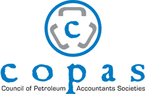

## Table of Contents

## What is the Council of Petroleum Accountants Societies (COPAS)?

The Council of Petroleum Accountants Societies, or COPAS, is a group that helps people who work with oil and gas money. It started a long time ago, in 1961, and it brings together accountants from different places to share ideas and solve problems. COPAS works to make sure that the rules and ways of doing things in the oil and gas business are fair and clear.

COPAS has many smaller groups, called societies, in different parts of the United States and Canada. These societies meet regularly to talk about new rules, share best practices, and learn from each other. By working together, they help make the oil and gas industry run smoothly and keep everyone on the same page.

## When was COPAS founded?

COPAS, which stands for the Council of Petroleum Accountants Societies, was founded in 1961. It was created to help people who work with money in the oil and gas industry. 

The main goal of COPAS is to bring these workers together so they can share ideas and solve problems. By doing this, they make sure that everyone in the industry follows fair and clear rules.

## What is the primary purpose of COPAS?

The main goal of COPAS, or the Council of Petroleum Accountants Societies, is to help people who work with money in the oil and gas business. It does this by bringing these workers together so they can share ideas and solve problems. COPAS was started in 1961 to make sure that everyone in the industry follows fair and clear rules.

COPAS has smaller groups, called societies, in different parts of the United States and Canada. These societies meet often to talk about new rules, share the best ways to do things, and learn from each other. By working together, they help make the oil and gas industry run smoothly and keep everyone on the same page.

## Who can become a member of COPAS?

Anyone who works with money in the oil and gas business can join COPAS. This includes accountants, financial analysts, and other professionals who handle the finances of oil and gas companies. To become a member, you usually need to be part of one of the local societies that make up COPAS. These societies are spread across the United States and Canada.

Membership in COPAS can help you learn more about the industry and meet other people who do similar work. By joining, you can go to meetings and events where you can share ideas and learn about new rules and best practices. This can make your job easier and help you do it better.

## How is COPAS structured organizationally?

COPAS is made up of many smaller groups called societies. These societies are spread out in different parts of the United States and Canada. Each society has its own members who work in the oil and gas business. The societies help bring these members together to share ideas and solve problems. By working together, the societies make sure that everyone in the industry follows the same fair and clear rules.

At the top of COPAS, there is a main group that helps guide all the societies. This group is made up of leaders from the different societies. They meet to talk about big issues that affect everyone in the oil and gas business. They also work to make sure that all the societies are working well together. This helps keep the whole organization strong and helpful for its members.

Overall, COPAS is organized to help people who work with money in the oil and gas industry. The societies and the main group work together to share knowledge, solve problems, and make sure the industry runs smoothly. This structure helps everyone in COPAS learn and grow in their jobs.

## What are the main activities and events organized by COPAS?

COPAS organizes many activities and events to help people who work with money in the oil and gas business. One of the main activities is holding meetings where members can share ideas and learn about new rules. These meetings happen often and are a great way for members to stay up-to-date on what's happening in the industry. The meetings can be in person or online, so everyone can join no matter where they are.

Another important event that COPAS organizes is its annual meeting. This is a big event where members from all over come together. They talk about big issues, share the best ways to do things, and learn from each other. The annual meeting is a great chance for members to meet new people and make connections that can help them in their jobs. It's also a fun time where members can enjoy being part of the COPAS community.

COPAS also offers training and education programs. These programs help members learn more about their jobs and stay current with the latest industry practices. The training can be in the form of classes, workshops, or webinars. By offering these programs, COPAS helps its members grow in their careers and do their jobs better.

## How does COPAS influence petroleum accounting standards and practices?

COPAS influences petroleum accounting standards and practices by bringing together people who work with money in the oil and gas business. They share ideas and talk about new rules at meetings. This helps make sure that everyone in the industry follows the same fair and clear rules. When members of COPAS agree on the best ways to do things, they can suggest these practices to the whole industry. This helps keep the oil and gas business running smoothly and makes it easier for everyone to understand and follow the rules.

COPAS also works on creating guidelines and recommendations for petroleum accounting. These guidelines help companies know how to handle their money in the right way. By setting these standards, COPAS makes sure that the accounting practices are consistent across the industry. This is important because it helps prevent confusion and mistakes. When everyone follows the same rules, it's easier to compare and understand financial information from different companies in the oil and gas business.

## What are some of the key publications and resources provided by COPAS?

COPAS provides many helpful publications and resources for people who work with money in the oil and gas business. One of the most important is the COPAS Accounting Guidelines. These guidelines help companies know the best ways to handle their money. They cover topics like how to keep track of costs, how to report financial information, and how to make sure everything is done fairly and clearly. By using these guidelines, companies can make sure they are following the rules and doing things the right way.

Another key resource is the COPAS MFI-1 Model Form Interpretation. This document helps explain how to use a specific contract form that is common in the oil and gas industry. It gives clear instructions on how to handle different situations that can come up when using this form. This makes it easier for everyone to understand and follow the contract. COPAS also offers newsletters and bulletins that keep members up-to-date on new rules, industry news, and best practices. These resources help members stay informed and do their jobs better.

## How does COPAS collaborate with other industry organizations?

COPAS works with other groups in the oil and gas business to make sure everyone follows the same rules and does things the best way. They talk to other organizations to share ideas and learn from each other. By working together, they can help make the industry run smoothly and keep everyone on the same page. For example, COPAS might work with groups like the American Petroleum Institute (API) or the Society of Petroleum Engineers (SPE) to create guidelines that everyone can use.

These collaborations help make sure that the rules and practices in the oil and gas business are fair and clear. When COPAS and other groups agree on the best ways to do things, they can suggest these practices to the whole industry. This helps prevent confusion and makes it easier for everyone to understand and follow the rules. By working together, COPAS and other organizations can help the oil and gas business run better and keep everyone informed about new developments and best practices.

## What role does COPAS play in professional development and certification for petroleum accountants?

COPAS helps people who work with money in the oil and gas business learn and grow in their jobs. They offer training and education programs that teach members about the latest rules and best practices. These programs can be classes, workshops, or webinars, and they help members stay up-to-date and do their jobs better. By taking part in these programs, members can learn new skills and become more knowledgeable about their work.

COPAS also helps members get certifications that show they are good at their jobs. They work with other groups to create special certifications for petroleum accountants. These certifications are important because they show that someone knows a lot about the oil and gas business and follows the rules. By helping members get these certifications, COPAS makes sure that the people working in the industry are well-trained and trusted.

## Can you describe a significant project or initiative that COPAS has undertaken in recent years?

In recent years, COPAS has been working on a big project called the Joint Interest Accounting (JIA) Audit Protocols. This project is important because it helps make sure that companies in the oil and gas business are following the rules when they share costs. The JIA Audit Protocols give clear steps for auditors to follow when they check how companies are handling their money. By using these protocols, auditors can make sure everything is done fairly and correctly. This helps keep the industry running smoothly and builds trust between companies.

COPAS worked hard to create these protocols by bringing together experts from different parts of the oil and gas business. They talked about the best ways to do audits and made sure the protocols would work for everyone. The project took a lot of time and effort, but it was worth it because it helps make the industry better. Now, companies can use these protocols to make sure they are following the rules and doing things the right way. This project shows how COPAS helps the oil and gas business by making sure everyone follows the same fair and clear rules.

## What are the current challenges and future directions for COPAS in the evolving energy sector?

COPAS faces challenges as the energy sector changes. One big challenge is keeping up with new rules and technologies. As the oil and gas business uses more new technology, COPAS needs to make sure its guidelines and training stay up-to-date. Another challenge is dealing with the move towards cleaner energy. More people want to use renewable energy like wind and solar power, so COPAS needs to think about how this affects the oil and gas business and its members.

Looking ahead, COPAS plans to keep helping its members by offering more training and education about new technologies and rules. They also want to work more with other groups in the energy sector to make sure everyone is on the same page. As the industry changes, COPAS will need to be flexible and ready to adapt. By staying involved and working together, COPAS can help its members and the oil and gas business handle the challenges of the future.

## References & Further Reading

[1]: The Council of Petroleum Accountants Societies (COPAS) - [COPAS Official Website](https://copas.org/home-new/)

[2]: Lopez de Prado, M. (2018). ["Advances in Financial Machine Learning."](https://www.amazon.com/Advances-Financial-Machine-Learning-Marcos/dp/1119482089) John Wiley & Sons.

[3]: Jansen, S. (2020). ["Machine Learning for Algorithmic Trading."](https://github.com/stefan-jansen/machine-learning-for-trading) Packt Publishing.

[4]: Aronson, D. R. (2006). ["Evidence-Based Technical Analysis: Applying the Scientific Method and Statistical Inference to Trading Signals."](https://www.amazon.com/Evidence-Based-Technical-Analysis-Scientific-Statistical/dp/0470008741) Wiley.

[5]: Chan, E. P. (2008). ["Quantitative Trading: How to Build Your Own Algorithmic Trading Business."](https://github.com/ftvision/quant_trading_echan_book) John Wiley & Sons.

[6]: Bergstra, J., Bardenet, R., Bengio, Y., & Kégl, B. (2011). ["Algorithms for Hyper-Parameter Optimization."](https://dl.acm.org/doi/10.5555/2986459.2986743) Advances in Neural Information Processing Systems 24.