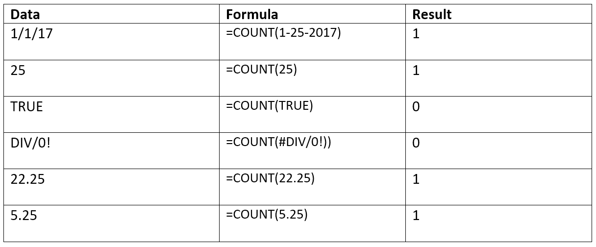

## Table of Contents

## What is the basic definition of a count in mathematics?

In mathematics, a count is simply the act of finding out how many things are in a group. Imagine you have a bunch of apples. Counting them means you start from one and keep going until you've said a number for each apple. The last number you say is the total count, or how many apples you have.

Counting is one of the first things we learn in math. It's important because it helps us understand numbers and how they work. We use counting every day, like when we check how many cookies are left in the jar or how many people are in a room. It's a basic skill that helps us do more complicated math later on.

## How is counting used in everyday life?

Counting is something we do every day without even thinking about it. It helps us keep track of things around us. For example, when you're making a shopping list, you count how many items you need to buy. Or when you're waiting for a bus, you might count the minutes until it arrives. It's a simple way to organize our day and make sure we don't forget anything important.

We also use counting to manage money. When you're saving up for something, you count your coins and bills to see how much you have. If you're paying for something, you count out the right amount to give to the cashier. Counting helps us understand if we can afford what we want or if we need to save more.

Counting is also important in games and sports. Think about a game of hide and seek where you count to ten before you start looking for your friends. Or in sports, like when a referee counts to three for a wrestling pin. It's a fun way to use numbers and make sure everyone plays fairly.

## What are the different methods of counting?

One way to count is by using our fingers. This is called counting on our fingers. We start with one finger and keep adding more until we reach the total number we need. It's a simple way to count, and many kids learn to count this way. Another way is by using numbers out loud or in our heads. We say or think "one, two, three," and so on until we get to the right number. This is called oral counting or mental counting.

We can also use objects to help us count. For example, we might use blocks or beads. We put one block down for each thing we want to count. This is called one-to-one correspondence. It helps us make sure we don't miss anything. Another way is by grouping things. We might count things in groups of ten or five. This makes it easier to count big numbers. We call this skip counting or counting by groups.

Sometimes, we use tools to help us count. A tool like an abacus has beads that we move to count. Or we might use a number line, which is a line with numbers on it. We move along the line to count. These tools help us see the numbers and make counting easier. They're especially helpful when we're learning or when we need to count a lot of things.

## Can you explain the concept of one-to-one correspondence in counting?

One-to-one correspondence is a way of counting where each thing you want to count gets its own number. Imagine you have a bunch of apples and you want to count them. You start by saying "one" and pointing to the first apple, then "two" for the next apple, and so on. Each apple gets one number, and you don't skip any apples or count any apple twice. This makes sure you count everything correctly.

This method is really helpful, especially when you're learning to count or when you're counting a lot of things. It's like making sure every person in a line gets one ticket. If you give out tickets without using one-to-one correspondence, you might give someone two tickets or miss someone. By using one-to-one correspondence, you can be sure that you've counted everything and nothing is left out. It's a simple but important part of counting that helps us be accurate.

## What is the difference between cardinal and ordinal numbers in counting?

Cardinal numbers tell us how many things there are. When you count apples and say there are five apples, you're using a cardinal number. It's like answering the question "How many?" with a number. For example, if you have three cookies, the number three is a cardinal number because it tells you the total amount of cookies.

Ordinal numbers, on the other hand, tell us the position or order of things. They answer the question "Which one?" For example, if you're in a race and you come in second place, the word "second" is an ordinal number. It tells you your position in the race, not how many people are in the race. So, while cardinal numbers focus on quantity, ordinal numbers focus on the order or rank of items in a sequence.

## How does the concept of zero affect counting?

Zero is a special number that changes how we count. Before zero was used, people had a hard time showing that they had nothing. They might leave a space or use a special symbol, but it was confusing. When zero came along, it made things much easier. Zero means there's nothing there. So if you count your apples and you have zero apples, it means you don't have any apples at all.

Using zero also helps us understand bigger numbers better. For example, the number 105 means one hundred, zero tens, and five ones. The zero in the middle shows that there are no tens. Without zero, it would be hard to tell the difference between numbers like 15 and 105. Zero helps us organize numbers and makes counting and understanding them a lot simpler.

## What are some advanced counting techniques used in combinatorics?

In combinatorics, one advanced counting technique is called permutations. Permutations help us figure out how many ways we can arrange things in a specific order. Imagine you have three [books](/wiki/algo-trading-books) and you want to know how many different ways you can put them on a shelf. With permutations, you can find out that there are six different ways to arrange those three books. This technique is useful when the order of things matters, like in passwords or seating arrangements.

Another technique is combinations. Combinations help us count how many ways we can choose things without caring about the order. For example, if you have five friends and you want to pick three of them to go to a movie, combinations can tell you how many different groups of three friends you can make. It's like [picking](/wiki/asset-class-picking) a team where it doesn't matter who is picked first, second, or third. Combinations are great for things like choosing lottery numbers or forming committees.

Both permutations and combinations use special formulas to make counting easier. The formula for permutations is n! / (n-k)!, where n is the total number of items and k is the number of items you're arranging. For combinations, the formula is n! / (k!(n-k)!). These formulas help us solve complex counting problems quickly and accurately, which is really important in fields like computer science, statistics, and even game design.

## How do counting principles apply to probability theory?

Counting principles are really important in probability theory because they help us figure out how likely something is to happen. In probability, we often need to know the total number of possible outcomes and how many of those outcomes meet certain conditions. For example, if you roll a die, there are six possible outcomes (1, 2, 3, 4, 5, 6). If you want to know the probability of rolling a 4, you need to know that there's only one way to roll a 4 out of those six outcomes. Counting helps us understand these numbers, which is the key to calculating probabilities.

Advanced counting techniques like permutations and combinations are also used in probability. For instance, if you're drawing cards from a deck, you might want to know the probability of getting a specific hand, like a flush in poker. To figure this out, you need to count all the different ways to get a flush and compare that to the total number of possible hands. Combinations help you count the number of ways to pick five cards out of 52, while permutations can help if the order of the cards matters. By using these counting methods, you can solve complex probability problems and make better predictions.

## What role does counting play in computer algorithms and data structures?

Counting is a big part of computer algorithms and data structures. When a computer needs to sort numbers or find something in a list, it often uses counting to do it. For example, if you want to find out how many times a certain word appears in a document, the computer counts each time it sees that word. This helps the computer do its job faster and more accurately. Counting also helps in sorting things, like when you use a method called "counting sort" to put numbers in order from smallest to largest.

In data structures, counting helps keep track of how many items are in a list or how much space is used. Imagine you have a collection of items, like a list of your favorite songs. The computer needs to know how many songs are in the list to manage it properly. If you add or remove a song, the computer updates the count. This counting is important for making sure the computer uses memory efficiently and can find things quickly. So, whether it's sorting, searching, or managing data, counting is a key part of how computers work.

## How can counting be applied to solve real-world problems in fields like economics or logistics?

In economics, counting helps us understand and solve many problems. For example, when economists want to know how many people are unemployed, they count the number of people who don't have jobs but are looking for one. This helps them figure out how the economy is doing and what policies might help. Counting is also important for tracking things like how much money people are spending or how many goods are being produced. By counting these numbers, economists can see trends and make predictions about the future, which helps them make better decisions for things like setting interest rates or planning budgets.

In logistics, counting is used to make sure everything runs smoothly. For instance, when a company needs to ship products, they count how many items they have in their warehouse and how many they need to send out. This helps them plan the best way to pack and ship the goods, making sure they don't run out of stock or send too much. Counting also helps with scheduling, like figuring out how many trucks are needed to deliver everything on time. By keeping track of these numbers, logistics experts can save time and money, making the whole process more efficient.

## What are some common misconceptions or errors in counting that beginners should avoid?

One common mistake beginners make when counting is skipping numbers or counting the same thing twice. Imagine you're counting apples and you accidentally say "one, two, four" instead of "one, two, three." Or maybe you count one apple twice because you forgot you already counted it. These errors can happen easily, especially if you're not paying close attention. To avoid this, take your time and make sure each thing gets counted once and in the right order.

Another error is not understanding the difference between cardinal and ordinal numbers. Cardinal numbers tell you how many things there are, like "I have three apples." Ordinal numbers tell you the position of something, like "I ate the third apple." If you mix these up, you might get confused about what you're trying to count. For example, saying "I'm in three" when you mean "I'm third" can lead to misunderstandings. To avoid this, remember that cardinal numbers answer "how many?" and ordinal numbers answer "which one?"

## How have historical developments in counting systems influenced modern mathematics?

A long time ago, people started counting using simple things like stones or marks on a stick. These early ways of counting helped them keep track of how many animals they had or how many days had passed. Over time, different cultures came up with their own ways to count. For example, the ancient Egyptians used a system based on hieroglyphs, while the Romans used letters like I, V, and X. These early counting systems were the building blocks for more advanced math. They helped people understand numbers better and laid the groundwork for things like algebra and geometry.

One big change in counting came when the concept of zero was introduced. Before zero, it was hard to show that you had nothing or to understand bigger numbers clearly. The idea of zero came from ancient India and spread to other parts of the world. This changed everything because it made it easier to write and work with numbers. With zero, people could create the number system we use today, which is called the Hindu-Arabic numeral system. This system made math much simpler and helped lead to modern mathematics, including areas like calculus and statistics. So, the way we count now is thanks to these historical developments, which have made math easier and more powerful.

## What is the Mathematics of Counting?

Counting forms the foundation of mathematics, crucial for understanding the structures, patterns, and processes that govern various phenomena. Central to the mathematics of counting are the concepts of permutations, combinations, and factorials, each of which offers a distinct method for quantifying arrangements and outcomes.

Permutations refer to the arrangements of a set of elements in a specific order. The order is significant in permutations, meaning that different sequences of the same elements count as distinct permutations. The number of permutations of a set of $n$ elements is calculated by the factorial of $n$, denoted as $n!$. The formula for the factorial of $n$ is:

$$
n! = n \times (n-1) \times (n-2) \times \cdots \times 1
$$

For instance, the number of permutations of three elements, say $A, B,$ and $C$, is $3! = 6$, as the possible arrangements are ABC, ACB, BAC, BCA, CAB, and CBA.

Combinations, on the other hand, focus on the selection of elements where the order does not matter. The number of combinations is given by the binomial coefficient, represented as $\binom{n}{r}$, and calculated using the formula:

$$
\binom{n}{r} = \frac{n!}{r! \times (n-r)!}
$$

This formula counts the number of ways to choose $r$ elements from a total of $n$ elements, disregarding the order of selection. For example, given the same three elements $A, B,$ and $C$, and choosing two at a time, the combinations are AB, AC, and BC, yielding $\binom{3}{2} = 3$.

Factorials serve as the building blocks for both permutations and combinations. Factorials allow for efficient computation of how many ways elements can be rearranged or selected. Their use extends beyond these basic counting techniques and into more complex applications.

Understanding these counting principles is indispensable for accurately assessing sequences and outcomes. They are applied across numerous fields, such as [statistics](/wiki/bayesian-statistics), computer science, and finance. In these domains, permutations and combinations enable professionals to forecast different scenarios, optimize processes, and make informed decisions based on probabilistic assessments. As these concepts underpin a wide range of mathematical applications, their mastery is essential for developing analytical skills and engaging with more advanced mathematical topics.

## What are the types of counting and their applications?

Counting plays a crucial role in mathematics, especially through methods such as permutations, combinations, and factorials. Each of these principles provides distinct means of quantifying arrangements and outcomes, which are particularly relevant in [algorithmic trading](/wiki/algorithmic-trading).

**Permutations** are arrangements where order is important. For a given set of elements, permutations count how many different ways you can arrange those elements. If you have a set of $n$ elements, the number of permutations of these elements taken $r$ at a time is given by:

$$

P(n, r) = \frac{n!}{(n - r)!} 
$$

In algorithmic trading, permutations are used to determine the sequence in which trades can be executed, which is vital when order directly impacts the profitability of trading strategies. 

**Combinations**, on the other hand, consider arrangements where order does not matter. The formula for finding combinations of $n$ elements taken $r$ at a time is:

$$

C(n, r) = \frac{n!}{r!(n-r)!} 
$$

Combinations are essential in trading when selecting a subset of trades or assets where the order of execution is irrelevant, allowing traders to evaluate different portfolio configurations or hedging strategies.

**Factorials** are a basic counting measure that counts all possible arrangements of a set number of elements. The factorial of a non-negative integer $n$, denoted $n!$, is the product of all positive integers less than or equal to $n$. Factorials are useful for calculating probabilities in financial models by providing the total number of possible outcomes.

In financial markets, counting methods like permutations, combinations, and factorials are indispensable for calculating probabilities and potential outcomes. These methods underpin the strategies of algorithmic trading, where decisions are often based on the statistical likelihood of market movements.

By applying these counting techniques, traders can formulate strategies that predict future price movements with greater accuracy. For example, combinatorial analysis might be used in optimizing portfolio selection, while permutation algorithms could be integral in developing high-frequency trading algorithms that capitalize on momentary [arbitrage](/wiki/arbitrage) opportunities.

The practical application of counting principles in algorithmic trading goes beyond static calculations. Financial algorithms might be designed to evaluate thousands of permutations of trading sequences within seconds, thus informing real-time decision-making. By employing these counting principles, trading systems can dynamically react to market changes, evaluate risks, and optimize trade execution, all within the framework of probability and statistical analysis.

 to Algorithmic Trading

Algorithmic trading, often synonymous with [quantitative trading](/wiki/quantitative-trading), is a method of executing orders utilizing automated and pre-programmed trading instructions to account for variables such as timing, price, and [volume](/wiki/volume-trading-strategy). This sophisticated approach seeks to leverage mathematical models and quantitative analysis to develop precise trading strategies that can operate at speeds and frequencies beyond the capabilities of human traders.

At the core of algorithmic trading is the use of complex algorithms, which are essentially a set of rules or instructions designed to perform specific tasks. These algorithms can process large volumes of data, analyze it, and execute trades at unprecedented speeds, capitalizing on even the slightest market inefficiencies.

The automation of trading processes is a significant element of algorithmic trading. Automation ensures that trading strategies are executed efficiently and without emotional interference, which is a common challenge faced by human traders. Through automation, trades can be executed instantly upon meeting predefined criteria, helping traders to avoid delays and capitalize on fleeting opportunities.

A successful algorithmic trading system hinges on several critical components:

1. **Data Acquisition and Management**: Reliable and real-time data is a cornerstone of effective algorithmic trading. Systems must be capable of processing vast amounts of data efficiently, integrating both historical data for backtesting strategies and real-time data for live trading execution.

2. **Algorithm Development**: The design of robust algorithms requires a detailed understanding of mathematical models and financial theory. Traders employ quantitative techniques to predict market trends and assess risk, often using statistical methods such as regression analysis and time-series analysis.

3. **Backtesting**: Before deploying an algorithm in live markets, it is crucial to evaluate its performance using historical data. Backtesting enables traders to understand how a strategy would have performed in the past, providing insights into its viability and potential profitability.

4. **Risk Management**: Effective risk management is vital in protecting against significant losses. This involves setting parameters for stop-loss orders, position sizing, and risk thresholds based on quantitative measures.

5. **Execution Strategy**: This involves optimizing the execution of trades to minimize market impact and transaction costs. Execution algorithms, such as VWAP (Volume Weighted Average Price) and TWAP (Time Weighted Average Price), are often utilized to achieve this goal.

Algorithmic trading is prevalent across various markets, including equities, [forex](/wiki/forex-system), commodities, and cryptocurrencies. Its application allows traders to handle large volumes of trades while maintaining the precision and speed necessary in today's fast-paced markets. As technology advances, the capabilities of algorithmic trading systems continue to evolve, offering even more sophisticated tools for traders seeking a competitive edge.

## References & Further Reading

[1]: Bergstra, J., Bardenet, R., Bengio, Y., & Kégl, B. (2011). ["Algorithms for Hyper-Parameter Optimization."](https://dl.acm.org/doi/10.5555/2986459.2986743) Advances in Neural Information Processing Systems 24.

[2]: ["Advances in Financial Machine Learning"](https://www.amazon.com/Advances-Financial-Machine-Learning-Marcos/dp/1119482089) by Marcos Lopez de Prado

[3]: ["Evidence-Based Technical Analysis: Applying the Scientific Method and Statistical Inference to Trading Signals"](https://www.amazon.com/Evidence-Based-Technical-Analysis-Scientific-Statistical/dp/0470008741) by David Aronson

[4]: ["Machine Learning for Algorithmic Trading"](https://github.com/stefan-jansen/machine-learning-for-trading) by Stefan Jansen

[5]: ["Quantitative Trading: How to Build Your Own Algorithmic Trading Business"](https://github.com/LucindaYa/quant-resources/blob/master/Quantitative%20Trading%20How%20to%20Build%20Your%20Own%20Algorithmic%20Trading%20Business.pdf) by Ernest P. Chan