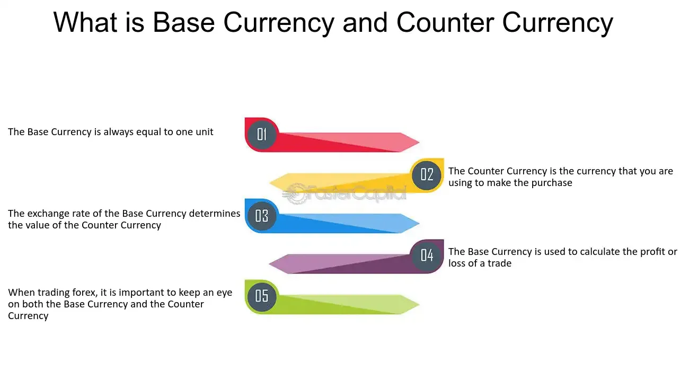

## Table of Contents

## What is a counter currency?

A counter currency is the second currency in a currency pair in the foreign exchange market. When you trade currencies, you are always trading one currency for another. The first currency in the pair is called the base currency, and the second one is the counter currency. For example, in the currency pair USD/EUR, the USD is the base currency and the EUR is the counter currency.

In simple terms, the counter currency is what you get in exchange for the base currency. If you are buying the USD/EUR pair, you are buying US dollars and selling Euros. The value of the counter currency tells you how much of it you get for one unit of the base currency. Understanding the role of the counter currency is important for anyone involved in forex trading, as it helps in making informed trading decisions.

## How does a counter currency differ from a base currency?

In the world of forex trading, a currency pair always has two currencies. The first one is called the base currency, and the second one is the counter currency. The base currency is the one you are buying or selling. For example, if you see the pair USD/EUR, the USD is the base currency. This means you are trading US dollars.

The counter currency, on the other hand, is what you get in exchange for the base currency. In the USD/EUR pair, the EUR is the counter currency. This tells you how many Euros you get for one US dollar. So, if the exchange rate is 0.85, you get 0.85 Euros for every US dollar you trade. Understanding the difference between these two helps traders know what they are buying and selling.

## Can you provide examples of common counter currencies?

In the foreign exchange market, common counter currencies are often the US Dollar (USD), the Euro (EUR), and the Japanese Yen (JPY). For example, if you see the currency pair GBP/USD, the USD is the counter currency. This means if you are trading British Pounds, you will get US Dollars in return. The exchange rate tells you how many US Dollars you get for one British Pound.

Another common counter currency is the Euro. In the currency pair AUD/EUR, the Euro is the counter currency. If you are trading Australian Dollars, you will receive Euros. The exchange rate shows how many Euros you get for one Australian Dollar. This is useful for people who need to convert their money into Euros for travel or business in Europe.

The Japanese Yen is also frequently used as a counter currency. For instance, in the pair USD/JPY, the Yen is the counter currency. If you are trading US Dollars, you will get Japanese Yen in return. The exchange rate indicates how many Yen you get for one US Dollar. This is important for traders and businesses dealing with Japan or other countries using the Yen.

## Why is the choice of counter currency important in forex trading?

The choice of counter currency is important in forex trading because it affects how much money you can make or lose. When you trade, you are buying one currency and selling another. The counter currency is what you get in exchange for the base currency you are trading. If the counter currency is strong, you will get more of it for your base currency, which can mean more profit. But if it is weak, you will get less, which can mean less profit or even a loss.

Understanding the strength and stability of the counter currency helps traders make better decisions. Some currencies, like the US Dollar or the Euro, are used a lot because they are stable and widely accepted. This makes them good choices for counter currencies. If you choose a counter currency that is less stable, like a currency from a smaller country, your trades can be riskier because the value can change a lot. So, picking the right counter currency can help you manage your risks and plan your trades better.

## How does the value of a counter currency impact trading decisions?

The value of a counter currency directly affects how much money you make or lose in forex trading. When you trade, you exchange one currency for another. If the counter currency is strong, you get more of it for your base currency, which can mean more profit. But if it's weak, you get less, which can mean less profit or even a loss. So, knowing how strong or weak the counter currency is helps you decide if a trade is a good idea.

Choosing a counter currency also depends on how stable it is. Some currencies, like the US Dollar or the Euro, are used a lot because they are stable and people trust them. This makes them good choices for counter currencies. But if you pick a counter currency that is less stable, like a currency from a smaller country, your trades can be riskier because the value can change a lot. So, the value and stability of the counter currency are important things to think about when making trading decisions.

## What are the factors that influence the strength of a counter currency?

The strength of a counter currency can be influenced by many things. One big factor is the economy of the country that uses the currency. If the economy is doing well, with lots of jobs and people spending money, the currency usually gets stronger. Another factor is the interest rates set by the country's central bank. If interest rates go up, people might want to keep their money in that currency to earn more interest, making it stronger. Also, things like inflation, which is when prices go up, can make a currency weaker if it gets too high.

Another thing that can affect the strength of a counter currency is what's happening in the world. If there's a lot of uncertainty, like during a war or a big crisis, people might want to move their money to safer currencies, making those stronger. Political stability also plays a part. If a country has a stable government, its currency is usually seen as safer and stronger. On the other hand, if there's a lot of political trouble, the currency can get weaker. So, the strength of a counter currency depends on a mix of things happening both in the country and around the world.

## How do economic indicators affect the value of a counter currency?

Economic indicators are like signs that tell us how well a country's economy is doing. These signs can affect the value of a counter currency a lot. For example, if a country's unemployment rate goes down, it means more people have jobs and are spending money. This can make the currency stronger because it shows the economy is doing well. Another important indicator is the Gross Domestic Product (GDP), which shows how much stuff a country is making. If GDP is growing, it's a good sign for the currency's value.

Interest rates set by a country's central bank also play a big role. When interest rates go up, people might want to keep their money in that currency to earn more interest, making it stronger. On the other hand, if inflation, which is when prices go up, gets too high, it can make the currency weaker. People might not want to hold onto a currency if they think prices will keep going up. So, these economic indicators give traders and investors clues about whether a counter currency will get stronger or weaker.

## What role does the counter currency play in currency pairs?

In forex trading, a currency pair always has two parts: the base currency and the counter currency. The base currency is the first one in the pair, and it's the one you are buying or selling. The counter currency is the second one, and it's what you get in exchange for the base currency. For example, in the pair USD/EUR, the USD is the base currency and the EUR is the counter currency. If you are trading this pair, you are trading US dollars and getting Euros in return.

The counter currency is important because it tells you how much of it you get for one unit of the base currency. If the counter currency is strong, you will get more of it for your base currency, which can mean more profit. But if it's weak, you will get less, which can mean less profit or even a loss. So, understanding the strength and stability of the counter currency helps traders make better decisions about when to buy or sell.

## How can traders hedge against fluctuations in the counter currency?

Traders can hedge against fluctuations in the counter currency by using different strategies. One common way is to use currency options. These are like insurance policies for currency trades. If the counter currency starts to move in a way that could hurt the trader's position, they can use the option to limit their losses. Another way is to use forward contracts, which let traders lock in an exchange rate for a future date. This can protect them from sudden changes in the counter currency's value.

Another strategy is to diversify their trades. Instead of focusing on one currency pair, traders can spread their money across different pairs. This way, if the counter currency in one pair weakens, the impact on their overall portfolio might be less because other pairs could be doing better. Using these methods, traders can better manage the risks that come with changes in the counter currency's value.

## What are the historical trends in the use of different counter currencies?

Over the years, the US Dollar (USD) has been the most used counter currency in forex trading. This is because the US has a big and strong economy, and the USD is seen as a safe and stable currency. In the past, other currencies like the British Pound (GBP) and the Japanese Yen (JPY) were also often used as counter currencies. But as the world's economy changed, the Euro (EUR) became more popular, especially after it was introduced in 1999. The Euro is now used a lot because it's the currency for many countries in Europe, making it strong and widely accepted.

In more recent times, we've seen some new trends. Some traders are starting to use currencies from emerging markets, like the Chinese Yuan (CNY) or the Brazilian Real (BRL), as counter currencies. This is because these countries are growing fast and their currencies can offer good trading opportunities. However, these currencies can also be more risky because their values can change a lot. So, while the USD and EUR are still the most common counter currencies, the use of other currencies is slowly growing as the world's economy keeps changing.

## How do international trade agreements influence the selection of counter currencies?

International trade agreements can influence which currencies are used as counter currencies in forex trading. When countries make trade deals, they often decide to use certain currencies for their transactions. For example, if two countries agree to use the US Dollar for their trade, it can make the USD more popular as a counter currency. This is because more people will need to buy and sell USD to do their business, which can make it more stable and trusted in the forex market.

These agreements can also affect how strong or weak a counter currency becomes. If a country's currency is used a lot in trade agreements, it might become stronger because more people want to hold onto it. On the other hand, if a country is left out of important trade deals, its currency might get weaker because fewer people want to use it. So, trade agreements play a big role in deciding which currencies are used and how strong they are in the forex market.

## What advanced strategies can traders use to capitalize on counter currency movements?

Traders can use advanced strategies like carry trading to make money from counter currency movements. Carry trading means borrowing money in a currency with a low interest rate and then using that money to buy a currency with a higher interest rate. If the counter currency with the higher interest rate stays strong or gets stronger, the trader can make a profit from both the interest rate difference and any gains in the currency's value. This strategy works well when the counter currency is stable and the interest rate difference is big enough to cover any potential losses from currency movements.

Another strategy is called currency hedging. This involves using financial tools like options and futures to protect against big changes in the counter currency's value. For example, if a trader thinks the counter currency might get weaker, they can buy an option that lets them sell it at a set price in the future. This can help limit their losses if the currency does drop. By using these advanced strategies, traders can take advantage of counter currency movements and manage their risks better.

## What is the Role of Counter Currencies?

In the forex market, counter currencies play a crucial role as the quote currency in a currency pair. They are essential for determining conversion rates, as they help establish how much of the counter currency is required to purchase one unit of the base currency. Understanding counter currencies is fundamental for anyone engaged in forex trading because their value relative to the base currency dictates trading strategies and potential profit margins.

In a typical currency pair like EUR/USD, the euro (EUR) is the base currency, while the US dollar (USD) serves as the counter currency. The quoted price represents the amount of the counter currency needed to buy one unit of the base currency. For instance, if the EUR/USD pair is quoted at 1.20, it means that 1 euro is equivalent to 1.20 USD. Therefore, the formula for calculating the conversion would be:

$$
\text{Base Currency Amount} \times \text{Quoted Exchange Rate} = \text{Equivalent Counter Currency Amount}
$$

Understanding this relationship enables traders to make informed decisions on buying or selling currencies based on anticipated market movements. Proficiency in analyzing counter currencies provides insights into international trade dynamics, [interest rate](/wiki/interest-rate-trading-strategies) differentials, and geopolitical factors that affect exchange rates.

When trading forex, factors such as economic indicators, central bank policies, and broader financial market trends can influence the valuation of counter currencies dramatically. This fluctuation affects the buying power of traders, impacting strategies like hedging and speculative bets.

In conclusion, counter currencies are fundamental components of forex trading, allowing traders to engage in transactions across diverse currency pairs. Mastery of their operation ensures a comprehensive understanding of market exchanges and improves strategic trading capabilities.

## References & Further Reading

[1]: Lo, A. W. (2005). ["Reconciling Efficient Markets with Behavioral Finance: The Adaptive Markets Hypothesis."](https://papers.ssrn.com/sol3/papers.cfm?abstract_id=1702447) Journal of Investment Consulting.

[2]: Narang, R. K. (2013). ["Inside the Black Box: A Simple Guide to Quantitative and High-Frequency Trading."](https://onlinelibrary.wiley.com/doi/book/10.1002/9781118662717) Wiley.

[3]: Aldridge, I. (2013). ["High-Frequency Trading: A Practical Guide to Algorithmic Strategies and Trading Systems."](https://www.amazon.com/High-Frequency-Trading-Practical-Algorithmic-Strategies/dp/1118343506) Wiley.

[4]: Cartea, Á., Jaimungal, S., & Penalva, J. (2015). ["Algorithmic and High-Frequency Trading."](https://assets.cambridge.org/97811070/91146/frontmatter/9781107091146_frontmatter.pdf) Cambridge University Press.

[5]: Engle, R. F., & Ferstenberg, R. (2007). ["Execution Risk."](https://papers.ssrn.com/sol3/papers.cfm?abstract_id=1293666) University of California, San Diego and New York University.