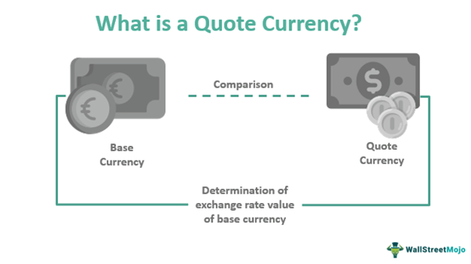

The foreign exchange market, commonly referred to as forex, represents a dynamic and complex ecosystem where the trading of currencies occurs across the globe. Recognized for its unparalleled liquidity, this market operates at an international scale, allowing for the seamless exchange of different currencies, which is fundamental to global economic activity. Participants in the forex market range from large financial institutions and corporations to individual traders, each engaging in transactions that cumulatively amount to trillions of dollars daily.

As forex evolves, its structure and operations are being reshaped by several key factors, notably the significance of counter currencies and the rise of algorithmic trading. Counter currencies, which serve as the quote currency in a currency pair, are essential for calculating exchange rates and understanding market dynamics. For example, in the EUR/USD pair, the USD is the counter currency against which the value of the euro (EUR) is measured.



The advent of algorithmic trading is further revolutionizing forex trading by using computer algorithms to automate transactions. This technology enables traders to execute a high volume of trades at speeds and efficiencies unattainable through manual trading. Algorithms process vast amounts of data to identify optimal trading opportunities, making decisions based on pre-set criteria without human intervention. The integration of machine learning and artificial intelligence within these algorithms has heightened their sophistication, allowing for more precise trading strategies and improved market analysis.

This article examines the crucial role played by counter currencies and explores the transformative impact of algorithmic trading. The interplay of these elements is not only changing how transactions are conducted but also offering new opportunities and challenges for forex traders seeking to navigate this vibrant market.

## Table of Contents

## Understanding the Forex Market

The forex market is a global marketplace for trading currencies, operating 24 hours a day, five days a week. This continuous operation allows traders worldwide to engage in trading at any time, reflecting the interconnectedness of global economies. The primary function of the forex market is to facilitate the exchange of one currency for another, enabling international trade and investment.

At the core of forex trading are currency pairs, which represent the value of one currency relative to another. Each pair consists of two components: the base currency and the counter currency (also known as the quote currency). The base currency appears first in the currency pair notation, while the counter currency follows. For example, in the EUR/USD pair, the euro (EUR) is the base currency, and the US dollar (USD) is the counter currency.

Forex trading involves buying one currency while simultaneously selling another. The price at which one currency can be exchanged for another is known as the exchange rate, typically expressed as a ratio. For instance, if the EUR/USD exchange rate is 1.2000, it means that 1 euro can be exchanged for 1.20 US dollars.

Several major currency pairs, often referred to as "majors," dominate the [forex](/wiki/forex-system) trading landscape. These include:

- EUR/USD (euro/US dollar)
- USD/JPY (US dollar/Japanese yen)
- GBP/USD (British pound/US dollar)
- USD/CHF (US dollar/Swiss franc)
- AUD/USD (Australian dollar/US dollar)

These pairs are typified by high [liquidity](/wiki/liquidity-risk-premium), substantial daily trading volumes, and widespread recognition among traders.

In forex trading, the concepts of bid and ask prices are crucial. The bid price is the highest price at which a trader is willing to buy a currency pair, while the ask price is the lowest price at which they are willing to sell. The difference between these two prices is known as the spread, which represents a transaction cost that traders must consider.

Additionally, forex trading can be conducted through various types of orders. A market order, for instance, executes a trade immediately at the current market price, while a limit order sets a specific price at which a trade will be executed. These tools allow traders to manage their strategies and risk exposure effectively.

Forex traders often employ technical and [fundamental analysis](/wiki/fundamental-analysis) to inform their decision-making. Technical analysis involves studying historical price charts and using indicators to identify patterns and trends. In contrast, fundamental analysis examines economic indicators, interest rates, and geopolitical events to predict currency movements.

Understanding these foundational aspects of the forex market is essential for participants aiming to navigate its complexities efficiently and capitalize on trading opportunities.

## The Role of Counter Currencies

In the forex market, counter currencies play a crucial role as the quote currency in a currency pair. They are essential for determining conversion rates, as they help establish how much of the counter currency is required to purchase one unit of the base currency. Understanding counter currencies is fundamental for anyone engaged in forex trading because their value relative to the base currency dictates trading strategies and potential profit margins.

In a typical currency pair like EUR/USD, the euro (EUR) is the base currency, while the US dollar (USD) serves as the counter currency. The quoted price represents the amount of the counter currency needed to buy one unit of the base currency. For instance, if the EUR/USD pair is quoted at 1.20, it means that 1 euro is equivalent to 1.20 USD. Therefore, the formula for calculating the conversion would be:

$$
\text{Base Currency Amount} \times \text{Quoted Exchange Rate} = \text{Equivalent Counter Currency Amount}
$$

Understanding this relationship enables traders to make informed decisions on buying or selling currencies based on anticipated market movements. Proficiency in analyzing counter currencies provides insights into international trade dynamics, [interest rate](/wiki/interest-rate-trading-strategies) differentials, and geopolitical factors that affect exchange rates.

When trading forex, factors such as economic indicators, central bank policies, and broader financial market trends can influence the valuation of counter currencies dramatically. This fluctuation affects the buying power of traders, impacting strategies like hedging and speculative bets.

In conclusion, counter currencies are fundamental components of forex trading, allowing traders to engage in transactions across diverse currency pairs. Mastery of their operation ensures a comprehensive understanding of market exchanges and improves strategic trading capabilities.

## How Algorithms Are Shaping Forex Trading

Algorithmic trading, also known as algo trading, leverages pre-programmed instructions to execute trades at speeds surpassing human capabilities. The primary objective of [algorithmic trading](/wiki/algorithmic-trading) is to increase market efficiency by executing orders rapidly and accurately based on a specific set of rules. These rules can include timing, price, and [volume](/wiki/volume-trading-strategy) considerations, thus minimizing manual input and often reducing the emotional biases associated with human trading.

### The Mechanics of Algorithmic Trading

The fundamental mechanics of algorithmic trading involve using algorithms to monitor market conditions and execute trades automatically when certain criteria are met. These algorithms can incorporate a range of strategies, from simple moving averages to complex [machine learning](/wiki/machine-learning) models. A typical algorithmic trading system consists of three main components:

1. **Data Input**: Real-time market data is fed into the system, providing current prices, volumes, and other relevant metrics.

2. **Decision-Making Logic**: Based on the input data, the trading system evaluates whether specific criteria or trading conditions have been met. This logic can be as simple as a crossover strategy involving two moving averages or as complex as a neural network trained on historical market data.

3. **Execution**: If the pre-set conditions are satisfied, the system generates buy or sell orders, which are then sent to the market in milliseconds. This rapid execution allows traders to capitalize on fleeting market opportunities that would be impossible to leverage manually.

An example of a simple algorithmic trading strategy can be illustrated using Python code to execute a basic moving average crossover strategy:

```python
import pandas as pd

# Load historical market data
data = pd.read_csv('market_data.csv')
data['Short_MA'] = data['Close'].rolling(window=50).mean() # Short-term moving average
data['Long_MA'] = data['Close'].rolling(window=200).mean() # Long-term moving average

# Flag buy/sell signals
data['Signal'] = 0
data.loc[data['Short_MA'] > data['Long_MA'], 'Signal'] = 1
data.loc[data['Short_MA'] < data['Long_MA'], 'Signal'] = -1

# Generate trading orders
orders = data[data['Signal'].diff() != 0]
print(orders[['Date', 'Signal']])
```

### Impact of Algorithmic Trading on the Forex Market

Algorithmic trading has transformed the forex market in several ways:

- **Increased Market Liquidity**: By automating trade execution, algorithmic trading enhances liquidity, narrowing bid-ask spreads, and facilitating smoother transactions.

- **Reduced Transaction Costs**: With high-frequency trading capabilities, algorithms can execute numerous small trades quickly and at lower costs compared to manual trading.

- **Enhanced Accuracy and Reduced Errors**: Algorithms can analyze vast datasets without fatigue, ensuring more accurate trading decisions and minimizing human error.

- **24/5 Market Engagement**: Algorithms operate continuously throughout forex market hours, allowing trades to be executed at any time of day or night, providing significant advantages in a global market.

The incorporation of machine learning and AI further bolsters algorithmic trading, enabling systems to learn from historical data and adapt strategies dynamically to changing market conditions. By analyzing patterns and trends, AI-driven algorithms can predict price movements with higher accuracy, offering enhanced outcomes for traders. This adaptability helps in managing risk and improving the profitability of algorithmic trading strategies.

In conclusion, algorithmic trading has emerged as a pivotal tool in the forex market, offering increased efficiency, precision, and the potential for higher profitability. As technology advances, the contribution of algorithms to forex trading is expected to grow, presenting both challenges and opportunities for market participants.

## Advantages and Risks of Algorithmic Trading in Forex

Algorithmic trading in the foreign exchange (forex) market offers numerous advantages that enhance trading efficiency and accuracy while reducing human intervention. One of the primary benefits is the automation of trading processes, allowing the execution of trades at speeds and frequencies that surpass manual trading. This is achieved because algorithms can analyze vast datasets in milliseconds to identify trading opportunities, thereby maximizing potential profits.

Another significant advantage of algorithmic trading is the ability to backtest trading strategies using historical market data. This allows traders to refine and optimize their strategies before deploying them in real-time trading. Algorithms can operate without the influence of human emotions, which often lead to irrational decision-making. Additionally, the consistent application of pre-defined rules and criteria helps ensure a disciplined trading approach.

Despite these benefits, algorithmic trading also poses several risks. One major challenge is the potential for sudden liquidity gaps. As algorithms execute trades at a high volume and speed, they may inadvertently exacerbate market [volatility](/wiki/volatility-trading-strategies), especially during times of low liquidity or unexpected market events. This can lead to significant price swings, increasing the risk exposure for traders.

Volatility is another critical concern associated with algorithmic trading. Algorithms can amplify market movements when they respond similarly to market stimuli, leading to a feedback loop that causes sharp price shifts. This is especially problematic in the forex market, which can be sensitive to macroeconomic news and geopolitical events.

Furthermore, the reliance on technology makes algorithmic trading susceptible to technical failures. Network outages, software bugs, or data feed errors can disrupt trading operations and lead to unintended losses. Traders must implement robust risk management strategies and maintain technological safeguards to mitigate these risks.

In conclusion, while algorithmic trading offers the promise of increased efficiency and improved decision-making in forex trading, it is not without its challenges. Traders must balance the advantages of automation and speed with the potential risks of volatility and technological failures to make informed trading decisions.

## Real-World Applications and Examples

Algorithmic trading has revolutionized the forex market by enhancing strategies like currency hedging and [arbitrage](/wiki/arbitrage). These algorithms use a set of pre-programmed instructions based on factors such as timing, price, quantity, or any mathematical model. The efficacy and challenges of this approach are best understood through examples and real-world applications.

### Currency Hedging

Algorithmic trading is particularly beneficial in currency hedging, where companies and investors employ strategies to protect against adverse currency movements. For instance, multinational corporations operating across different countries might face significant exchange rate risks. By utilizing algorithmic trading, these companies can automatically trigger hedging orders when certain market conditions are met. This precision reduces the time and human intervention required in managing risk. An algorithm might be programmed to start a hedge when the exchange rate between the USD and EUR reaches a specific threshold, thus locking in favorable rates and minimizing potential losses due to currency fluctuations.

### Arbitrage Opportunities

Arbitrage, the practice of profiting from price discrepancies between markets, is another area where algorithmic trading shines. In forex trading, firms exploit these inconsistencies across various currency pairs. Algorithmic systems are adept at identifying and executing arbitrage opportunities across different trading platforms. Given the massive liquidity and rapid movement in forex markets, these opportunities are often short-lived. Algorithms can quickly assess multiple data points and execute trades within milliseconds, far beyond human capabilities.

Consider a situation where the EUR/USD exchange rate differs on two trading platforms. An algorithm could be designed as follows:

```python
def detect_arbitrage_opportunity(price_a, price_b, threshold):
    if abs(price_a - price_b) > threshold:
        return True
    return False

# Example prices from two sources
price_platform_1 = 1.1850
price_platform_2 = 1.1865
arbitrage_threshold = 0.0010

if detect_arbitrage_opportunity(price_platform_1, price_platform_2, arbitrage_threshold):
    # Execute buy on the lower price and sell on the higher price
    print("Arbitrage opportunity detected. Execute trade.")
else:
    print("No arbitrage opportunity detected.")
```

### Challenges of Algorithmic Trading

Despite its advantages, algorithmic trading is not without challenges. One significant issue is the potential for sudden liquidity gaps, where the market's ability to accept large trades without price changes can swiftly diminish. This occurrence can lead to unexpected execution prices, thereby affecting profitability. Additionally, the high-speed nature of algorithmic strategies can sometimes contribute to market volatility, particularly during market disruptions or flash crashes.

Another challenge is the over-reliance on historical data for creating trading models. Algorithms typically rely on past data to predict future movements, which might not always account for unprecedented market events. Ensuring that these algorithms are adaptive and robust in various market conditions is crucial for maintaining their effectiveness.

In conclusion, while algorithmic trading offers significant benefits and efficiency in forex markets, it also presents unique challenges. As technology continues to advance, the role of sophisticated algorithms in shaping forex trading strategies is set to grow, necessitating a keen understanding of both its potential and its pitfalls.

## Conclusion

The intricate dynamics of counter currencies and the advent of algorithmic trading have become crucial components in modern forex markets. Counter currencies, serving as the quote currency in pairs, are essential for understanding currency values and are indispensable for precise trading strategies. On the other hand, algorithmic trading, leveraging high-speed algorithms, is reshaping how transactions occur, enhancing the efficiency and effectiveness of trading activities.

The integration of advanced technology with traditional market strategies provides significant opportunities for traders willing to adapt. As algorithmic trading continues to evolve, driven by advancements in machine learning and [artificial intelligence](/wiki/ai-artificial-intelligence), traders are enabled to execute swift and informed trades, potentially increasing profitability. This seamless fusion of cutting-edge technology and forex trading strategies allows for navigating complex market environments more adeptly.

However, with the ongoing evolution comes the necessity for traders to stay informed about these trends to make the most of their potential. As the forex market becomes increasingly sophisticated, keeping abreast of technological advances and understanding the subtleties of counter currencies will be pivotal. Adapting to these changes is crucial for capitalizing on opportunities within the forex market, turning potential challenges into avenues for growth and success.

## References & Further Reading

[1]: Lo, A. W. (2005). ["Reconciling Efficient Markets with Behavioral Finance: The Adaptive Markets Hypothesis."](https://papers.ssrn.com/sol3/papers.cfm?abstract_id=1702447) Journal of Investment Consulting.

[2]: Narang, R. K. (2013). ["Inside the Black Box: A Simple Guide to Quantitative and High-Frequency Trading."](https://onlinelibrary.wiley.com/doi/book/10.1002/9781118662717) Wiley.

[3]: Aldridge, I. (2013). ["High-Frequency Trading: A Practical Guide to Algorithmic Strategies and Trading Systems."](https://www.amazon.com/High-Frequency-Trading-Practical-Algorithmic-Strategies/dp/1118343506) Wiley.

[4]: Cartea, Á., Jaimungal, S., & Penalva, J. (2015). ["Algorithmic and High-Frequency Trading."](https://assets.cambridge.org/97811070/91146/frontmatter/9781107091146_frontmatter.pdf) Cambridge University Press.

[5]: Engle, R. F., & Ferstenberg, R. (2007). ["Execution Risk."](https://papers.ssrn.com/sol3/papers.cfm?abstract_id=1293666) University of California, San Diego and New York University.