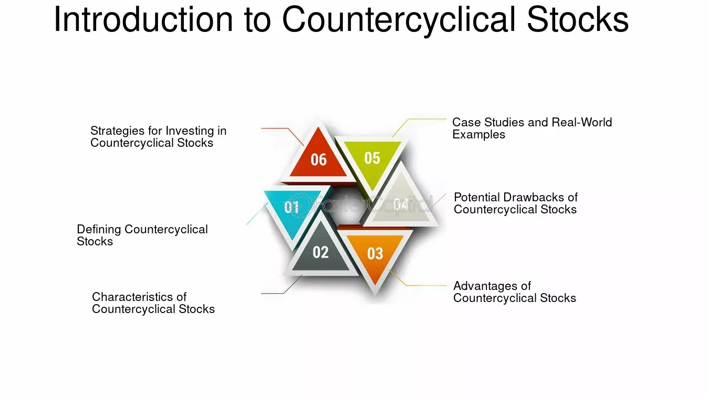

## Table of Contents

## What are counter-cyclical stocks?

Counter-cyclical stocks are stocks that tend to perform well when the economy is doing poorly. When most businesses struggle during a recession, these companies often see an increase in demand for their products or services. This is because they offer goods or services that people need no matter how the economy is doing, like utilities, healthcare, and basic food items.

For example, during tough economic times, people might cut back on luxury items but still need to pay for electricity and medical care. This makes companies in these sectors more stable and less affected by economic downturns. Investors often turn to counter-cyclical stocks to protect their portfolios from the ups and downs of the economy.

## How do counter-cyclical stocks differ from cyclical stocks?

Counter-cyclical stocks and cyclical stocks move in opposite ways when the economy changes. Counter-cyclical stocks do well when the economy is not doing great. People still need things like electricity, medicine, and basic food, so companies that provide these things can keep making money even when times are tough. On the other hand, cyclical stocks go up and down with the economy. When the economy is good, people have more money to spend on things like cars, vacations, and fancy clothes, so companies that sell these things do well.

Cyclical stocks can be riskier because they depend a lot on how the economy is doing. If the economy goes into a recession, people cut back on spending, and these companies can see their profits drop a lot. That's why investors might buy cyclical stocks when they think the economy will get better, hoping to make a lot of money. But if they're worried about a downturn, they might choose counter-cyclical stocks to keep their investments safer.

## What are some common examples of counter-cyclical stocks?

Some common examples of counter-cyclical stocks include companies that provide utilities like electricity and water. These are services that people need every day, no matter if the economy is good or bad. Companies like Duke Energy or Consolidated Edison are in this group. They might not grow a lot when the economy is booming, but they stay pretty stable when things get tough.

Another type of counter-cyclical stock is in the healthcare industry. People always need medical care, so companies like Johnson & Johnson or Pfizer can do well even during a recession. People still buy medicine and go to the doctor, which keeps these companies going strong.

Lastly, basic consumer goods companies are also counter-cyclical. Think about companies like Procter & Gamble, which makes things like soap and toilet paper. Even when money is tight, people still need these items, so these companies tend to be more stable during economic downturns.

## Why might investors be interested in counter-cyclical stocks?

Investors might be interested in counter-cyclical stocks because they can help protect their money during bad economic times. When the economy goes into a recession, many businesses struggle, but counter-cyclical stocks, like those in utilities or healthcare, keep doing well. This is because people still need electricity, medicine, and basic things like soap no matter what's happening with the economy. So, if an investor is worried about a downturn, they might put some of their money into these stocks to keep their investments safer.

Another reason investors like counter-cyclical stocks is for balance in their portfolio. Not all of an investor's money should be in the same kind of investment. By having some counter-cyclical stocks, they can balance out the riskier stocks that go up and down with the economy. This way, if the economy does poorly, the counter-cyclical stocks can help make up for losses in other parts of their investments. It's like having a safety net for their money.

## How do economic cycles affect counter-cyclical stocks?

Economic cycles affect counter-cyclical stocks in a way that's opposite to how they affect most other stocks. When the economy is doing badly, like during a recession, most businesses struggle because people don't have as much money to spend. But counter-cyclical stocks, like those in utilities or healthcare, actually do better during these times. That's because people still need electricity, medicine, and basic things like soap, no matter how the economy is doing. So, when the economy is down, these stocks can go up.

When the economy is doing well, counter-cyclical stocks might not grow as fast as other stocks. During good economic times, people have more money to spend on things like cars and vacations, so companies that sell these things do really well. But the companies that provide things people need every day, like utilities and healthcare, don't see as much growth because their business stays pretty steady. So, while they might not make big gains when the economy is booming, they also don't lose as much when things get tough.

## What are the potential benefits of investing in counter-cyclical stocks?

Investing in counter-cyclical stocks can help keep your money safe during bad economic times. When the economy goes into a recession, many businesses struggle because people don't have as much money to spend. But counter-cyclical stocks, like those in utilities or healthcare, keep doing well because people still need electricity, medicine, and basic things like soap. So, if you're worried about a downturn, putting some of your money into these stocks can help protect your investments.

Another benefit of counter-cyclical stocks is that they can balance out your investment portfolio. Not all of your money should be in the same kind of investment. By having some counter-cyclical stocks, you can balance out the riskier stocks that go up and down with the economy. This way, if the economy does poorly, the counter-cyclical stocks can help make up for losses in other parts of your investments. It's like having a safety net for your money.

## What are the main risks associated with counter-cyclical stocks?

One risk of investing in counter-cyclical stocks is that they might not grow much when the economy is doing well. When times are good, people have more money to spend on things like cars and vacations, so companies that sell these things can see big profits. But counter-cyclical companies, like those in utilities or healthcare, don't see as much growth because people need their services all the time, so their business stays pretty steady. This means you might miss out on big gains during economic booms.

Another risk is that even though counter-cyclical stocks are generally more stable, they can still be affected by other things. For example, changes in government regulations or big shifts in the industry can hurt these companies. If a new law makes it harder for a utility company to operate, or if there's a major change in healthcare policy, these stocks might not do as well as expected. So, while they can help protect your money during bad times, they're not completely safe from all risks.

## How can investors identify counter-cyclical stocks?

Investors can identify counter-cyclical stocks by looking at the kinds of products or services a company provides. These stocks are usually found in industries where people need the products or services no matter how the economy is doing. For example, companies that provide utilities like electricity and water, or healthcare services and products, are often counter-cyclical. People need to pay their utility bills and buy medicine even during tough economic times, so these companies tend to do well when the economy is struggling.

Another way to find counter-cyclical stocks is to look at how a company's stock price has moved in the past during different economic cycles. If a stock tends to go up or stay steady when the economy is doing badly, it might be counter-cyclical. Investors can look at historical data to see how a company performed during past recessions. This can give them a good idea of whether the stock is likely to protect their investment during future downturns.

## What strategies can be used to invest in counter-cyclical stocks effectively?

One good way to invest in counter-cyclical stocks is to include them in a balanced portfolio. This means you spread your money across different kinds of investments. By having some counter-cyclical stocks, you can protect your money during bad economic times. For example, if you think a recession might be coming, you can put more of your money into utilities or healthcare companies. These stocks are less likely to go down a lot because people still need their services even when times are tough.

Another strategy is to keep an eye on the economic cycle. When the economy is doing well, counter-cyclical stocks might not grow as fast as other stocks. But if you think the economy is about to get worse, it could be a good time to buy more counter-cyclical stocks. By timing your investments based on what's happening with the economy, you can make the most of these stocks. Just remember that even though they're more stable, they can still be affected by things like new laws or big changes in their industry.

It's also smart to do your homework and look at how a company has done in the past during different economic times. If a stock went up or stayed steady during past recessions, it might be a good counter-cyclical stock. By studying historical data, you can pick the right stocks to help protect your money. This way, you're not just guessing—you're making choices based on what's happened before.

## How do counter-cyclical stocks perform during recessions compared to bull markets?

Counter-cyclical stocks do well during recessions. When the economy is struggling, most businesses see their profits go down because people have less money to spend. But counter-cyclical stocks, like those in utilities or healthcare, keep doing okay. That's because people still need electricity, medicine, and basic things like soap no matter how bad the economy gets. So, when other stocks are going down, these stocks can actually go up or stay steady.

In bull markets, when the economy is doing great, counter-cyclical stocks might not grow as fast as other stocks. During good times, people have more money to spend on things like cars and vacations, so companies that sell these things can see big profits. But the companies that provide things people need every day, like utilities and healthcare, don't see as much growth because their business stays pretty steady. So, while counter-cyclical stocks might not make you a lot of money when the economy is booming, they can help protect your money when things get tough.

## What are the long-term performance trends of counter-cyclical stocks?

Over the long term, counter-cyclical stocks tend to be more stable than other types of stocks. They might not grow as fast when the economy is doing really well, but they don't lose as much money when things get tough. This is because they provide things people need every day, like electricity, medicine, and basic food items. So, even if the economy goes through ups and downs, these companies keep making money and their stocks stay pretty steady.

In the long run, this stability can be good for investors who want to protect their money. While you might not see huge gains from counter-cyclical stocks during good economic times, they can help balance out riskier investments in your portfolio. By including some counter-cyclical stocks, you can have a safety net that helps keep your money safe during bad times, making your overall investment strategy more secure.

## How can counter-cyclical stocks be integrated into a diversified investment portfolio?

Counter-cyclical stocks can be a good addition to a diversified investment portfolio because they help balance out riskier investments. When you spread your money across different kinds of stocks, you make your portfolio safer. Counter-cyclical stocks, like those in utilities or healthcare, don't go up and down as much as other stocks. They stay pretty steady even when the economy is doing badly. So, if you have some of these stocks, they can help protect your money during tough times.

To integrate counter-cyclical stocks into your portfolio, you can start by figuring out how much risk you're okay with. If you're worried about a recession, you might want to put more of your money into these stocks. They won't grow as fast when the economy is doing great, but they'll help keep your investments safer when things get tough. By looking at how a company has done during past economic cycles, you can pick the right counter-cyclical stocks to add to your mix. This way, you're not putting all your eggs in one basket, and you're ready for whatever the economy throws at you.

## References & Further Reading

[1]: Bergstra, J., Bardenet, R., Bengio, Y., & Kégl, B. (2011). ["Algorithms for Hyper-Parameter Optimization."](https://dl.acm.org/doi/10.5555/2986459.2986743) Advances in Neural Information Processing Systems 24.

[2]: ["Advances in Financial Machine Learning"](https://www.amazon.com/Advances-Financial-Machine-Learning-Marcos/dp/1119482089) by Marcos Lopez de Prado

[3]: ["Evidence-Based Technical Analysis: Applying the Scientific Method and Statistical Inference to Trading Signals"](https://www.amazon.com/Evidence-Based-Technical-Analysis-Scientific-Statistical/dp/0470008741) by David Aronson

[4]: ["Machine Learning for Algorithmic Trading"](https://github.com/stefan-jansen/machine-learning-for-trading) by Stefan Jansen

[5]: ["Quantitative Trading: How to Build Your Own Algorithmic Trading Business"](https://github.com/LucindaYa/quant-resources/blob/master/Quantitative%20Trading%20How%20to%20Build%20Your%20Own%20Algorithmic%20Trading%20Business.pdf) by Ernest P. Chan