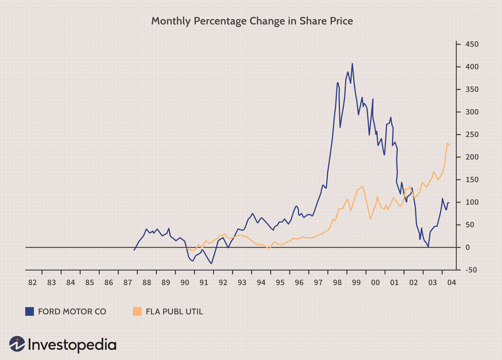

Understanding the various types of stocks is crucial for developing effective investment strategies in the dynamic stock market. Among these, counter-cyclical stocks stand out due to their unique behavior of performing optimally during economic downturns. Recognizing how these stocks differ from standard cyclical equities can significantly improve an investor's approach to risk management and portfolio diversification.

In addition to examining the advantages of counter-cyclical stocks, it is vital to understand the inherent risks associated with stock market investments. These risks include market volatility, potential regulatory changes, and the influence of global economic conditions. Investors must perform thorough due diligence to navigate these challenges effectively.



Algorithmic trading has emerged as a potent tool for handling investment risks by utilizing advanced algorithms to automate trades. This technology enhances decision-making by minimizing emotional biases and enabling rapid responses to market fluctuations. By analyzing data and predicting stock movements, algorithmic trading helps investors effectively manage counter-cyclical stock investments and improve overall portfolio performance.

## Table of Contents

## Understanding Counter-Cyclical Stocks

Counter-cyclical stocks stand out in the financial landscape due to their tendency to perform favorably during economic downturns. Unlike regular stocks, which typically fluctuate in harmony with the broader economic cycle, counter-cyclical stocks exhibit a unique resilience and often thrive when the economy is contracting. These stocks may, however, underperform during periods of economic expansion.

The categories of companies that frequently exhibit counter-cyclical characteristics include those within the utility, consumer staples, and healthcare sectors. These sectors provide essential goods and services that remain in consistent demand regardless of the economic climate. For instance, consumer staples encompass everyday products such as food and household goods, which individuals will continue to purchase even during economic slumps. Utilities, providing essential services like electricity and water, also see sustained demand as they are critical to daily life. Similarly, the healthcare sector is largely insulated from economic cycles because healthcare needs, including medications and treatments, are indispensable irrespective of economic conditions.

Counter-cyclical stocks prove beneficial during downturns primarily due to their inherent stability. During economic contractions, these stocks generally experience less volatility compared to their cyclical counterparts. This stability is attributable to the predictable and steady demand for the underlying products and services. Investors often view these stocks as safe havens during turbulent economic periods, as they can provide a buffer against a volatile market and preserve capital when other stocks may be losing value.

The predictable cash flow generated by companies in these sectors allows them to maintain consistent dividend payouts, which can attract income-focused investors. This feature is particularly appealing during economic downturns when other investment avenues may not offer reliable income streams. Therefore, counter-cyclical stocks are often integral components of a defensive investment strategy aimed at mitigating risk during periods of economic uncertainty.

In summary, counter-cyclical stocks perform well when the economy falters because they represent sectors essential to daily human life. Their stability amidst economic turmoil renders them a valuable asset in diversified portfolios, providing not just potential safety but also a steady income source through dividends, even when other market sectors are experiencing [volatility](/wiki/volatility-trading-strategies).

## Risks Involved in Investing in Counter-Cyclical Stocks

Counter-cyclical stocks, while offering potential stability during economic downturns, are not without their own set of unique risks that investors must carefully consider. One of the primary risks associated with these stocks is market volatility. Even during recessions, when counter-cyclical stocks generally outperform, sudden market fluctuations can still impact their value. For example, unexpected events or shifts in consumer spending can lead to rapid changes in stock prices, which may not be uniformly beneficial for all counter-cyclical assets.

Another significant risk is dependency on government policies. Many counter-cyclical industries, such as utilities and healthcare, are heavily influenced by regulatory frameworks. Changes in government policies—whether related to subsidies, environmental regulations, or healthcare reforms—can drastically affect the profitability and stability of these stocks. As governments respond to economic pressures, regulatory shifts can occur, leaving these companies, and consequently their investors, exposed to unforeseen risks.

Investors should also be wary of market timing. Although counter-cyclical stocks tend to prosper during economic contractions, correctly predicting when a downturn will occur is challenging. Poor timing can lead to suboptimal entry points, potentially diminishing returns. This necessity for precise timing requires vigilant market analysis and forecasting to ensure strategic allocation of funds.

Moreover, the broader economic climate plays a crucial role. Even industries that thrive during declines can face challenges in extreme conditions. For instance, a prolonged recession can strain even the most resilient sectors, posing a risk to those heavily invested in counter-cyclical stocks. Thus, it is essential to have a comprehensive understanding of the macroeconomic environment and how it might affect specific industries tied to counter-cyclical stocks.

In conclusion, while investing in counter-cyclical stocks can offer a buffer against economic downturns, it demands rigorous due diligence. Investors must stay informed about potential governmental regulatory shifts and the economic climate, and remain vigilant about market conditions to effectively navigate these risks.

## Algorithmic Trading: A Tool to Manage Investment Risks

Algorithmic trading utilizes advanced technology and quantitative techniques to enhance investment decision-making by executing trades with automation and precision. This method primarily employs complex algorithms and pre-defined criteria, which include parameters like timing, price, and [volume](/wiki/volume-trading-strategy), to identify potentially profitable trading opportunities. By relying on such automated systems, [algorithmic trading](/wiki/algorithmic-trading) reduces the role of human emotion in the trading process, which can often lead to irrational investment decisions during turbulent market conditions.

One of the key advantages of algorithmic trading lies in its ability to rapidly analyze vast amounts of market data and execute trades at optimal speeds, which might be impossible for human traders to achieve. In the context of counter-cyclical stocks, which tend to perform favorably during economic downturns, algorithmic systems can be tailored to identify patterns in stock movement that may indicate an impending buy or sell opportunity. These systems utilize statistical models and historical data to forecast performance, thus allowing investors to capitalize on trends that might not be immediately apparent to human analysts.

Algorithmic trading systems often incorporate methodologies like mean reversion, statistical [arbitrage](/wiki/arbitrage), and [momentum](/wiki/momentum) strategies. For instance, a simple algorithm might calculate the moving average of a stock's price over a set period and initiate a trade when the stock's current price diverges from this average by a given threshold. This approach could be especially beneficial when trading counter-cyclical stocks, where traditional market sentiments are inverted, and economic news might indirectly signal potential stability or growth in these stocks.

Moreover, algorithmic trading can help manage risks associated with counter-cyclical stocks by implementing stop-loss orders and other risk management strategies. These automated mechanisms ensure that positions are liquidated when prices reach a certain level, thus safeguarding against significant losses and maintaining portfolio stability. 

Python, a preferred language for developing algorithmic trading solutions due to its powerful libraries such as NumPy, pandas, and scikit-learn, facilitates the ease of constructing and [backtesting](/wiki/backtesting) trading algorithms. The following Python snippet demonstrates a basic setup for executing a moving average crossover strategy, a common algorithmic trading method:

```python
import pandas as pd

def moving_average_crossover_strategy(prices, short_window=40, long_window=100):
    signals = pd.DataFrame(index=prices.index)
    signals['price'] = prices
    signals['short_mavg'] = prices.rolling(window=short_window, min_periods=1).mean()
    signals['long_mavg'] = prices.rolling(window=long_window, min_periods=1).mean()
    signals['signal'] = 0.0
    signals['signal'][short_window:] = np.where(signals['short_mavg'][short_window:] 
                                                > signals['long_mavg'][short_window:], 1.0, 0.0)   
    signals['positions'] = signals['signal'].diff()
    return signals

# Example usage
prices = pd.Series([100, 101, 102, 103, 104, 105, 99, 98])  # Example price data
signals = moving_average_crossover_strategy(prices)
print(signals)
```

The systematic nature of algorithmic trading offers an invaluable edge in managing the risks associated with counter-cyclical stocks. By leveraging technology, investors can navigate market complexities with more agility and responsiveness. It is important, however, for traders to complement algorithmic strategies with ongoing vigilance and adaptability to ever-evolving market conditions, ensuring that the benefits of this advanced approach are effectively harnessed.

## Integrating Counter-Cyclical Stocks in Investment Portfolios

Diversifying investment portfolios with counter-cyclical stocks can be a strategic move that provides stability and potential gains during economic downturns. Counter-cyclical stocks, such as those in the utility, consumer staples, and healthcare sectors, tend to maintain or increase in value when the broader market experiences a decline. These stocks often provide essential goods and services that remain in demand regardless of the economic climate, attracting investors looking for defensive investments.

One fundamental strategy for integrating counter-cyclical stocks into a portfolio involves balancing these with cyclical stocks, which perform well during economic expansions. This creates a more resilient portfolio capable of weathering various economic scenarios. A mixed portfolio reduces overall risk through diversification, spreading investments across sectors with differing economic sensitivities.

A prudent approach is to allocate a certain percentage of the portfolio to counter-cyclical stocks based on the current economic outlook and the investor's risk tolerance. During uncertain economic periods, increasing the proportion of counter-cyclical stocks can hedge against potential losses from cyclical stocks. Conversely, in a strong economic environment, a shift towards cyclical stocks might enhance returns.

For investors, particularly those who are risk-averse or expect an economic downturn, setting specific weightings for counter-cyclical stocks can be beneficial. For instance, an allocation of 30% to 40% of the total investment in counter-cyclical stocks could provide sufficient protection during downturns, while still leaving room for growth investments. This allocation can be dynamically adjusted based on economic indicators and forecasts.

An algorithmic approach can be employed to optimize the balance between counter-cyclical and other stock types. Here is a simple Python code snippet illustrating a basic allocation strategy based on economic predictions:

```python
def allocate_portfolio(economic_outlook, risk_tolerance):
    base_allocation = {'counter_cyclical': 0.3, 'cyclical': 0.7}
    if economic_outlook == 'recession_imminent':
        base_allocation['counter_cyclical'] += risk_tolerance * 0.2
        base_allocation['cyclical'] -= risk_tolerance * 0.2
    elif economic_outlook == 'growth_projected':
        base_allocation['counter_cyclical'] -= risk_tolerance * 0.2
        base_allocation['cyclical'] += risk_tolerance * 0.2

    return base_allocation

# Example usage
portfolio_allocation = allocate_portfolio('recession_imminent', 0.5)
print(portfolio_allocation)
```

In the example above, the function `allocate_portfolio` adjusts the allocation of investments based on the predicted economic outlook and investor's risk tolerance, with higher weightings for counter-cyclical stocks when a recession is expected.

In conclusion, integrating counter-cyclical stocks into investment portfolios is a compelling strategy for minimizing risks during economic uncertainty. By understanding the economic cycle and dynamically adjusting the allocation, investors can enhance their portfolio's resilience, securing more stable returns across different market conditions. This strategic diversification underscores the value of a well-considered mix of stocks tailored to varying economic landscapes.

## Conclusion

Investing in the stock market comes with inherent risks. However, a strategic focus on counter-cyclical stocks, coupled with the application of algorithmic trading, can considerably mitigate these challenges. Counter-cyclical stocks exhibit resilience during economic turbulence by generally maintaining or increasing in value when typical stocks might decline. This characteristic makes them an attractive asset for risk-averse investors looking to safeguard their portfolios against market volatility.

Algorithmic trading enhances investment strategies by providing precise, data-driven decisions that are less influenced by investor emotions. Algorithms can be programmed to identify patterns and execute trades at optimal times, potentially capitalizing on the performance characteristics of counter-cyclical stocks. For instance, algorithms could be designed to monitor economic indicators that signal downturn conditions and subsequently rebalance a portfolio to include more counter-cyclical assets.

For investors, integrating counter-cyclical stocks into a diversified portfolio involves balancing these defensive stocks with others to optimize returns during varied economic phases. Nonetheless, vigilance is key. Markets are dynamic, and continuous reevaluation of investment strategies is essential to adapting to changing economic conditions. The combination of counter-cyclical stocks and algorithmic trading provides a robust framework for managing portfolio risk, albeit investors should remain proactive in adjusting their strategies in response to new market data and trends.

## References & Further Reading

[1]: Bergstra, J., Bardenet, R., Bengio, Y., & Kégl, B. (2011). ["Algorithms for Hyper-Parameter Optimization."](https://dl.acm.org/doi/10.5555/2986459.2986743) Advances in Neural Information Processing Systems 24.

[2]: ["Advances in Financial Machine Learning"](https://www.amazon.com/Advances-Financial-Machine-Learning-Marcos/dp/1119482089) by Marcos Lopez de Prado

[3]: ["Evidence-Based Technical Analysis: Applying the Scientific Method and Statistical Inference to Trading Signals"](https://www.amazon.com/Evidence-Based-Technical-Analysis-Scientific-Statistical/dp/0470008741) by David Aronson

[4]: ["Machine Learning for Algorithmic Trading"](https://github.com/stefan-jansen/machine-learning-for-trading) by Stefan Jansen

[5]: ["Quantitative Trading: How to Build Your Own Algorithmic Trading Business"](https://github.com/LucindaYa/quant-resources/blob/master/Quantitative%20Trading%20How%20to%20Build%20Your%20Own%20Algorithmic%20Trading%20Business.pdf) by Ernest P. Chan