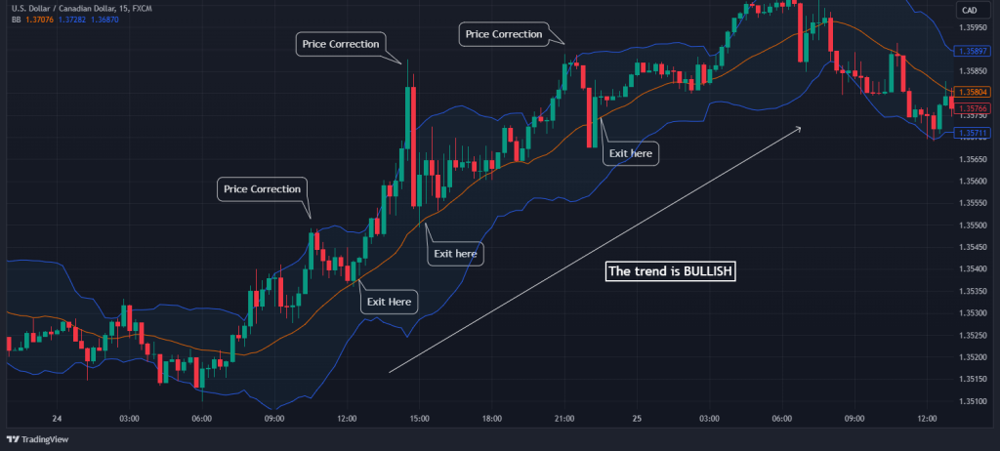

## Table of Contents

## What is a counter trend strategy in trading?

A counter trend strategy in trading is when a trader goes against the main direction of the market. Instead of following the trend, they try to make money by betting that the market will move in the opposite direction, at least for a short time. This can be risky because the main trend is usually strong and can keep going longer than expected. But, if a trader can spot when the market is taking a break or reversing, they might make a profit.

Traders using a counter trend strategy often look for signs that the market might be getting tired or overstretched. They might use tools like support and resistance levels, or indicators like the Relative Strength Index (RSI) to find these signs. When they see these signals, they enter trades hoping to catch small moves against the trend. It's important for them to have a clear plan and to be ready to get out of the trade quickly if it doesn't go their way, because the main trend can start up again at any time.

## How does a counter trend strategy differ from a trend-following strategy?

A counter trend strategy and a trend-following strategy are two opposite ways of trading. In a counter trend strategy, traders try to make money by betting that the market will go against its main direction, even if it's just for a short time. They look for signs that the market might be tired or overstretched, and then they enter trades hoping to catch small moves in the opposite direction of the trend. This can be risky because the main trend can be strong and might keep going longer than expected.

On the other hand, a trend-following strategy involves going with the flow of the market. Traders using this strategy believe that the market will keep moving in the same direction for a while, so they try to make money by riding along with the trend. They look for clear signs that the market is moving in a certain direction and then enter trades to take advantage of that movement. This approach can be less risky than counter trend trading because it goes with the market's momentum, but it still needs careful management to be successful.

Both strategies have their own challenges and require different skills. Counter trend traders need to be good at spotting when the market might reverse, even if it's just temporarily, and they need to be quick to get out of trades if they're wrong. Trend-following traders need to be patient and good at managing their trades over longer periods, making sure they stay in the trade as long as the trend continues but also knowing when to exit if the trend changes.

## What are the basic principles behind a counter trend strategy?

The basic idea behind a counter trend strategy is to make money by betting that the market will move against its main direction, even if it's just for a short time. Traders who use this strategy look for signs that the market might be getting tired or overstretched. They use tools like support and resistance levels or indicators like the Relative Strength Index (RSI) to find these signs. When they see these signals, they enter trades hoping to catch small moves in the opposite direction of the trend. This approach can be risky because the main trend is usually strong and can keep going longer than expected.

Because of the risks, it's important for traders to have a clear plan when using a counter trend strategy. They need to be ready to get out of the trade quickly if it doesn't go their way. This means setting tight stop-losses to limit potential losses. Traders also need to be good at spotting when the market might reverse, even if it's just temporarily. They have to be quick to act and patient enough to wait for the right moments to enter and exit trades. By doing this, they can try to make profits from short-term moves against the trend.

## What are the potential benefits of using a counter trend strategy?

One big benefit of using a counter trend strategy is that it can help you make money when others might be losing it. When the market is going up or down a lot, many traders follow the trend and might buy or sell too much. This can make the market overstretched and ready for a short break or a small move in the opposite direction. If you spot these moments, you can make quick profits by betting against the trend.

Another benefit is that counter trend trading can help you manage risk better. Because the main trend is strong, you know it might not last long when it moves against the trend. So, you can set tight stop-losses to limit your losses if the trade goes wrong. This way, you can keep your risk small while still trying to catch those quick profits from short-term market moves.

## Can you explain the concept of mean reversion in relation to counter trend strategies?

Mean reversion is a big idea in trading that says prices will eventually go back to their average or normal level after they move too far away. It's like a rubber band that stretches but always snaps back. In counter trend strategies, traders use this idea to make money. They look for times when the market has moved a lot in one direction and think it might be ready to snap back the other way. So, if the market has been going up a lot, they might bet on it going down a little to get back to normal.

Counter trend traders use tools like the Relative Strength Index (RSI) to find when the market might be ready to revert to the mean. The RSI helps them see if the market is overbought or oversold, which means it's moved too far from its average. When they see these signs, they enter trades hoping to catch the market as it moves back to its normal level. This can be a good way to make quick profits, but it's also risky because the market might keep going in the same direction longer than expected.

## What are some common indicators used in counter trend trading?

In counter trend trading, traders use certain tools called indicators to help them spot when the market might be ready to move against the main trend. One common indicator is the Relative Strength Index (RSI). The RSI tells traders if the market is overbought or oversold. If the RSI is above 70, it means the market might be overbought and could be ready to go down a bit. If it's below 30, it might be oversold and could be ready to go up. Traders look for these signals to enter trades hoping to catch small moves against the trend.

Another useful indicator is the Stochastic Oscillator. Like the RSI, it helps traders see if the market is overbought or oversold. It gives readings between 0 and 100, and traders watch for levels above 80 or below 20. When the Stochastic Oscillator shows the market is overbought or oversold, it might be a good time to bet on a move in the opposite direction. Both the RSI and Stochastic Oscillator are popular because they can help traders find moments when the market might revert to its average level, which is key in counter trend trading.

Bollinger Bands are also commonly used in counter trend trading. They show the market's volatility and help traders see when the price is too far from its average. When the price touches the upper Bollinger Band, it might be overbought and ready to fall. When it touches the lower band, it might be oversold and ready to rise. Traders using Bollinger Bands look for these touches as signals to enter trades against the trend, hoping to catch the market as it moves back towards the middle of the bands.

## How can a beginner start implementing a counter trend strategy?

If you're a beginner wanting to try a counter trend strategy, start by learning about some key tools like the Relative Strength Index (RSI), Stochastic Oscillator, and Bollinger Bands. These tools help you see when the market might be ready to move against the main trend. The RSI and Stochastic Oscillator show if the market is overbought or oversold, which means it might be ready to go the other way. Bollinger Bands show you when the price is too far from its average, which can also signal a good time to bet against the trend. Practice using these tools on a demo account first, so you can get used to how they work without risking real money.

Once you're comfortable with the tools, start small with real trades. Pick a market you understand and watch it closely. Look for signs that the market is overbought or oversold, and when you see these signs, enter a trade hoping to catch a small move against the trend. Always use tight stop-losses to limit your losses if the trade goes wrong. This means setting a point where you'll get out of the trade if it doesn't go your way. Remember, counter trend trading can be risky because the main trend is usually strong, so be patient and keep learning as you go.

## What are the risks associated with counter trend trading?

Counter trend trading can be risky because it goes against the main direction of the market. The biggest risk is that the main trend might keep going longer than you expect. If you bet that the market will move the other way and it doesn't, you could lose money. This is why it's important to have a plan to get out of trades quickly if they don't work out. You need to set tight stop-losses to limit your losses, but even with these, you might still lose more than you planned if the market moves fast against you.

Another risk is that counter trend trading can be stressful. You need to watch the market closely and be ready to act fast. If you're wrong about the market reversing, you could feel the pressure to make quick decisions. This can lead to mistakes, like holding onto a losing trade for too long hoping it will turn around. It's important to stay calm and stick to your plan, but it's not always easy. That's why many traders find counter trend trading challenging and sometimes overwhelming.

## How can one manage risk effectively when using a counter trend strategy?

When using a counter trend strategy, one of the best ways to manage risk is by setting tight stop-losses. A stop-loss is like a safety net that tells you when to get out of a trade if it goes against you. By setting it close to your entry point, you limit how much money you can lose on each trade. This is important because the main trend can be strong and might keep going longer than you think. So, having a tight stop-loss helps you keep your losses small and protects your trading account.

Another way to manage risk is by only risking a small part of your trading money on each trade. Don't bet too much on one trade because if it goes wrong, you could lose a lot. Instead, use a small amount, like 1% or 2% of your total money. This way, even if you lose a few trades in a row, you won't lose too much overall. It's also good to keep learning and practicing. The more you understand the market and your trading tools, the better you'll be at spotting good times to trade against the trend and managing your risk.

## What are some advanced techniques for optimizing a counter trend strategy?

To optimize a counter trend strategy, traders can use advanced techniques like combining multiple indicators to get better signals. For example, you might use the Relative Strength Index (RSI) along with Bollinger Bands. If the RSI shows the market is overbought and the price touches the upper Bollinger Band, it could be a strong sign that the market is ready to move down a bit. By using more than one indicator, you can feel more confident about your trades. Another technique is to look at different time frames. You might see a good counter trend signal on a short-term chart, but if the longer-term trend is still strong, it might be safer to wait for a better moment. This helps you avoid getting caught in a strong trend that could keep going against you.

Another way to optimize your counter trend strategy is by using advanced order types like trailing stop-losses. A trailing stop-loss moves with the market, so if the price moves in your favor, your stop-loss moves up too. This way, you can lock in some profits while still giving the trade room to move. It's also helpful to keep a trading journal where you write down what worked and what didn't. Over time, you can see patterns in your trading and make better decisions. By combining these advanced techniques, you can improve your chances of making money with a counter trend strategy while managing your risks better.

## Can you discuss any historical examples where counter trend strategies were particularly effective?

One famous time when counter trend trading worked well was during the Dot-com Bubble in the late 1990s. Many tech stocks were going up and up, and everyone wanted to buy them. But some smart traders saw that the prices were too high and not based on real value. They started betting that the prices would go down, even though the main trend was still up. When the bubble finally burst in 2000, these traders made a lot of money because the market moved back to normal levels. This shows how counter trend trading can be very profitable if you can spot when the market is overstretched.

Another example is during the 2008 Financial Crisis. As the market was crashing, many traders were selling everything. But some traders saw that the market was falling too fast and too far. They started buying stocks, betting that the market would bounce back a little even though the main trend was down. These traders made money when the market had short rallies during the crisis. It's a good example of how counter trend trading can work even in tough times if you can find the right moments to go against the trend.

## How do market conditions influence the effectiveness of counter trend strategies?

Market conditions play a big role in how well counter trend strategies work. When the market is moving a lot in one direction, it can be a good time for counter trend trading. If the market has gone up or down too much, it might be ready to take a break or move a little the other way. Traders who see these moments can make money by betting against the trend. But if the market is calm and not moving much, it can be harder to find good times to use a counter trend strategy. In these conditions, the market might not move enough to make it worth betting against the trend.

On the other hand, during times of big market changes or uncertainty, like during a financial crisis, counter trend strategies can be very risky. The main trend can be very strong and hard to go against. But if you can spot the right moments, like when the market is overbought or oversold, you might still make money. It's all about understanding the market and being ready to act fast. The key is to always keep an eye on market conditions and adjust your strategy to match what's happening in the market.

## What are the best indicators for counter trend trading?

Using technical indicators is essential for successful counter trend trading. These tools assist traders in identifying potential reversal points in the market, allowing them to capitalize on price corrections. Three popular indicators for counter trend trading are the Relative Strength Index (RSI), Stochastic RSI, and Bollinger Bands. Each of these indicators plays a crucial role in signaling overbought or oversold conditions.

### Relative Strength Index (RSI)

The Relative Strength Index (RSI) is a momentum oscillator that measures the speed and change of price movements. Developed by J. Welles Wilder Jr., RSI ranges from 0 to 100 and is traditionally used to identify overbought or oversold conditions of a stock or market. An RSI above 70 typically indicates that a security is overbought, while an RSI below 30 suggests it is oversold. Traders look for these extreme levels to anticipate potential reversals.

Mathematically, the RSI is calculated as follows:

$$
\text{RSI} = 100 - \left( \frac{100}{1 + \text{RS}}} \right)
$$

where RS (Relative Strength) is the average of 'n' days' up closes divided by the average of 'n' days' down closes.

### Stochastic RSI

The Stochastic RSI, a variation of the RSI, combines the stochastic oscillator formula with the RSI values. It provides a more sensitive indicator that can react more quickly to market movements than the traditional RSI. The Stochastic RSI oscillates between 0 and 1, with levels above 0.8 indicating overbought conditions and below 0.2 suggesting oversold conditions. This nuanced approach helps traders identify short-term reversal opportunities more accurately.

The Stochastic RSI is calculated using the following formula:

$$
\text{StochRSI} = \frac{\text{RSI} - \text{RSI}_\text{min}}{\text{RSI}_\text{max} - \text{RSI}_\text{min}}
$$

where $\text{RSI}_\text{min}$ and $\text{RSI}_\text{max}$ are the minimum and maximum RSI values over a specified period.

### Bollinger Bands

Bollinger Bands, developed by John Bollinger, consist of a middle band (a simple moving average) and two outer bands (standard deviations from the moving average). These bands expand and contract based on market [volatility](/wiki/volatility-trading-strategies). Prices are considered overbought when they touch the upper band and oversold when they touch the lower band. Traders use Bollinger Bands to spot price corrections and potential reversal points by observing price movements in relation to these bands.

In practice, Bollinger Bands are calculated as follows:

1. Calculate the simple moving average (SMA) of the closing price:
$$
   \text{SMA} = \frac{\sum \text{Closing Prices}}{n}

$$

2. Determine the standard deviation of the closing price:
$$
   \sigma = \sqrt{\frac{\sum (\text{Closing Prices} - \text{SMA})^2}{n}}

$$

3. Establish the upper and lower bands:
$$
   \text{Upper Band} = \text{SMA} + (k \times \sigma)

$$
$$
   \text{Lower Band} = \text{SMA} - (k \times \sigma)

$$

Here, $k$ is a chosen [factor](/wiki/factor-investing), typically set to 2.

Utilizing these indicators effectively requires understanding how they interact within different market conditions. Comprehension of these tools enables traders to make informed decisions, enhancing their ability to execute counter trend strategies more proficiently.

## What are examples of counter trend trades?

Traders adopting a counter trend strategy often utilize specific technical indicators to identify price corrections and potential reversal points. Two such indicators, Bollinger Bands and the Stochastic RSI, are widely employed for this purpose.

Bollinger Bands are a popular technical analysis tool consisting of a middle band, usually a simple moving average, and two outer bands placed a specific number of standard deviations away from the middle band. The formula for Bollinger Bands is as follows:

- Middle Band: $SMA_n$
- Upper Band: $SMA_n + (k \times \sigma)$
- Lower Band: $SMA_n - (k \times \sigma)$

where $SMA_n$ is the simple moving average over $n$ periods, $\sigma$ is the standard deviation of the price over the same $n$-periods, and $k$ is the number of standard deviations. Traders observe price movements relative to these bands. When prices exceed the upper or lower bands, it signals that the market might be overbought or oversold, respectively. In a counter trend strategy, a break above the upper band could indicate potential price correction downward, whereas a break below the lower band might signal an upward correction, offering potential entry points for contrarian traders.

Stochastic Relative Strength Index (Stochastic RSI) is another tool used to identify overbought or oversold conditions. It combines the Stochastic Oscillator and the Relative Strength Index to provide a momentum indicator that ranges between 0 and 1, indicating the RSI level relative to its range over a specific period. The Stochastic RSI is calculated as:

$$
\text{Stochastic RSI} = \frac{\text{RSI} - \text{RSI}_{\min}}{\text{RSI}_{\max} - \text{RSI}_{\min}}
$$

where $\text{RSI}$ is the current RSI value, and $\text{RSI}_{\min}$ and $\text{RSI}_{\max}$ are the lowest and highest RSI values over the chosen period, respectively. This indicator is particularly useful for identifying reversal points. Values closer to 0 suggest a potential buying opportunity (oversold condition), while values closer to 1 suggest a potential selling opportunity (overbought condition), allowing traders to anticipate market corrections.

By observing these indicators, traders can identify potential entry and exit points for counter trend trades. However, it is essential to combine these tools with sound risk management practices and other analysis methodologies to enhance trade efficacy and mitigate potential risks.

## References & Further Reading

[1]: Bergstra, J., Bardenet, R., Bengio, Y., & Kégl, B. (2011). ["Algorithms for Hyper-Parameter Optimization."](https://proceedings.neurips.cc/paper/2011/file/86e8f7ab32cfd12577bc2619bc635690-Paper.pdf) Advances in Neural Information Processing Systems 24.

[2]: ["Advances in Financial Machine Learning"](https://www.amazon.com/Advances-Financial-Machine-Learning-Marcos/dp/1119482089) by Marcos Lopez de Prado

[3]: ["Evidence-Based Technical Analysis: Applying the Scientific Method and Statistical Inference to Trading Signals"](https://www.amazon.com/Evidence-Based-Technical-Analysis-Scientific-Statistical/dp/0470008741) by David Aronson

[4]: ["Machine Learning for Algorithmic Trading"](https://github.com/stefan-jansen/machine-learning-for-trading) by Stefan Jansen

[5]: ["Quantitative Trading: How to Build Your Own Algorithmic Trading Business"](https://www.amazon.com/Quantitative-Trading-Build-Algorithmic-Business/dp/1119800064) by Ernest P. Chan