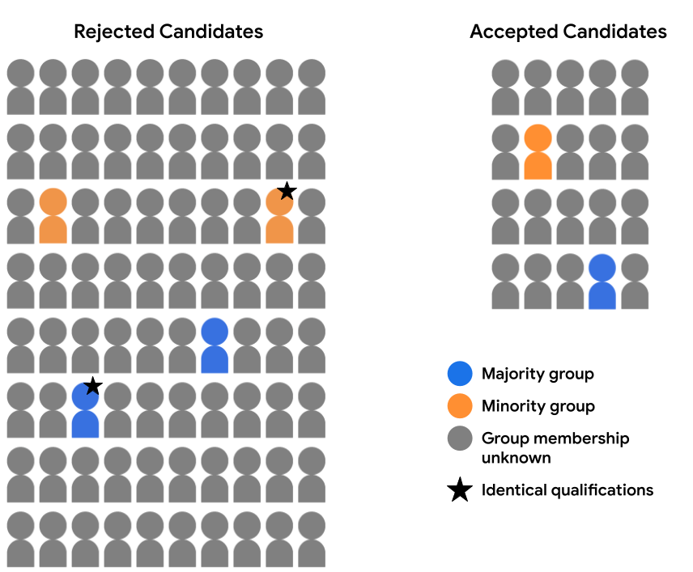

## Table of Contents

## What is counterfactual fairness in the context of machine learning?

Counterfactual fairness in machine learning is about making sure that a model's predictions don't change if we change something about a person that shouldn't matter, like their race or gender. Imagine you have a model that decides if someone should get a loan. If the model says "no" to a woman but would say "yes" if she were a man, that's not fair. Counterfactual fairness tries to fix this by making the model's decision the same no matter what the person's race or gender is.

To achieve counterfactual fairness, we need to think about what the world would be like if certain facts were different. For example, if we change a person's race in the data, the model's prediction should stay the same. This can be tricky because it means we have to understand how different factors are connected. But if we can do it, our models will be fairer and treat everyone the same way, no matter their background.

## Why is counterfactual fairness important in machine learning models?

Counterfactual fairness is important in machine learning because it helps make sure that decisions made by models are fair and unbiased. Imagine if a computer program decides who gets a job or a loan. If this program treats people differently just because of their race or gender, that's not fair. Counterfactual fairness tries to fix this by making sure the program's decision would be the same even if we changed something about the person that shouldn't matter, like their race or gender. This way, everyone gets a fair chance, no matter who they are.

Without counterfactual fairness, machine learning models might keep old biases alive. For example, if past data shows that men were more likely to get loans, a model might learn to favor men over women, even if the women are just as qualified. By using counterfactual fairness, we can stop these old biases from affecting new decisions. This makes the world a bit more equal and helps everyone trust that the decisions made by computers are fair.

## How does counterfactual fairness differ from other fairness definitions?

Counterfactual fairness is different from other fairness definitions because it focuses on what would happen if we changed something about a person that shouldn't matter, like their race or gender. Imagine a model that decides if someone gets a loan. If the model says "no" to a woman but would say "yes" if she were a man, that's not fair. Counterfactual fairness tries to fix this by making sure the model's decision stays the same even if we change the person's race or gender. This means the model should treat everyone the same way, no matter what their background is.

Other fairness definitions might look at different things. For example, group fairness tries to make sure that different groups of people, like men and women, get the same overall results from the model. This means if 50% of men get a loan, then 50% of women should get a loan too. Individual fairness, on the other hand, tries to make sure that similar people get similar results from the model. This means if two people are very alike in all important ways, the model should treat them the same. Counterfactual fairness is unique because it asks, "What if we changed this one thing about the person? Would the model's decision change?" If the answer is yes, then the model isn't fair.

## What are the basic steps to implement counterfactual fairness in a machine learning model?

To implement counterfactual fairness in a [machine learning](/wiki/machine-learning) model, you first need to understand how the model makes decisions and what factors it considers. Imagine you have a model that decides if someone should get a loan. You need to find out if the model's decision changes when you change something about the person that shouldn't matter, like their race or gender. For example, if the model says "no" to a woman but would say "yes" if she were a man, that's not fair. To fix this, you need to figure out how to make the model's decision stay the same even if you change the person's race or gender. This involves looking at the data and the model's inner workings to see where biases might be hiding.

Once you've identified where the biases are, you can start making changes to the model. One way to do this is by using a technique called "causal inference." This means you think about how different factors are connected and how changing one thing might affect others. For example, if you change a person's race in the data, you need to think about how that might change other things like their income or education. Then, you can adjust the model so that it doesn't use these biased connections to make decisions. You might need to use special algorithms or tools that help you see how changing one thing affects the whole model. By doing this, you can make the model fairer and ensure that everyone gets a fair chance, no matter their background.

## Can you explain the concept of a counterfactual example in machine learning?

A counterfactual example in machine learning is like a "what if" scenario. Imagine you have a model that decides if someone should get a loan. If the model says "no" to a woman, a counterfactual example would be asking, "What if she were a man? Would the model still say no?" This helps us see if the model's decision changes just because of something like the person's gender, which shouldn't matter.

To use counterfactual examples, you need to change something about the person in the data and see how the model's decision changes. For example, if you change a person's race and the model's prediction changes, that shows the model might be biased. By looking at these "what if" scenarios, we can find and fix unfairness in the model, making sure everyone gets a fair chance no matter who they are.

## What are some common challenges faced when trying to achieve counterfactual fairness?

Achieving counterfactual fairness in machine learning is tricky because it involves understanding how different factors are connected. Imagine you have a model that decides if someone should get a loan. If you change the person's race in the data and the model's decision changes, that means the model might be using biased connections. To fix this, you need to figure out how changing one thing, like race, affects other things, like income or education. This is hard because the connections between these factors can be complicated and hidden deep inside the model.

Another challenge is that counterfactual fairness requires a lot of data and computational power. You need to create many "what if" scenarios to see how the model's decision changes. This means running the model over and over again with different versions of the data, which can be slow and expensive. Also, you might not have enough data to create all the scenarios you need, especially for groups that are smaller or less represented in the data. This makes it harder to make sure the model is fair for everyone.

## How can counterfactual fairness be measured or evaluated in a model?

To measure counterfactual fairness in a model, you need to see if changing something about a person that shouldn't matter, like their race or gender, changes the model's decision. Imagine you have a model that decides if someone should get a loan. You would change the person's race in the data and see if the model's prediction changes. If it does, then the model isn't fair. You can do this many times with different people and different changes to get a good idea of how fair the model is overall.

One way to evaluate counterfactual fairness more formally is by using a metric called the counterfactual fairness deviation. This measures how much the model's predictions change when you change something that shouldn't matter. If the deviation is small, then the model is fairer. You can calculate it like this: For each person in your data, you create a counterfactual version by changing the sensitive attribute (like race or gender). Then, you compare the model's prediction for the original person to the prediction for the counterfactual version. If the predictions are very different, the model isn't fair. You can average these differences over all the people in your data to get an overall measure of fairness.

## What are some real-world applications where counterfactual fairness has been applied?

Counterfactual fairness has been used in the world of hiring to make sure job decisions are fair. Imagine a company using a computer program to decide who to hire. If the program says "no" to a woman but would say "yes" if she were a man, that's not fair. To fix this, the company can use counterfactual fairness to check if the program's decision changes when they change the person's gender in the data. If the decision stays the same, then the program is fairer. This helps make sure everyone gets a fair chance at a job, no matter who they are.

Another real-world use of counterfactual fairness is in deciding who gets a loan. Banks use computer models to decide if someone should get a loan. If the model says "no" to someone because of their race, that's not fair. By using counterfactual fairness, the bank can change the person's race in the data and see if the model's decision changes. If it doesn't change, then the model is fairer. This helps make sure everyone has an equal chance to get a loan, no matter their background.

## How does the concept of causality relate to counterfactual fairness?

Causality is all about understanding how one thing affects another. Imagine you have a model that decides if someone should get a loan. If you change the person's race in the data and the model's decision changes, that means the model might be using a biased connection between race and the decision. Counterfactual fairness tries to fix this by making sure the model's decision stays the same even if you change something that shouldn't matter, like race or gender. To do this, you need to understand the causal relationships in the data, which means figuring out how changing one thing affects others.

For example, if you change a person's race, it might also change their income or education in the data. These changes can affect the model's decision, so you need to understand these causal links to make the model fair. By using causal inference, you can see how different factors are connected and adjust the model to ignore these biased connections. This helps make sure the model treats everyone the same way, no matter their background.

## What are the limitations of counterfactual fairness in practical scenarios?

Counterfactual fairness sounds great in theory, but it can be hard to use in real life. One big problem is that it needs a lot of data and computer power. You have to change things about people in the data, like their race or gender, and see how the model's decision changes. This means running the model many times with different versions of the data, which can be slow and expensive. Also, you might not have enough data to do this for everyone, especially for groups that are smaller or less represented. This makes it tough to make sure the model is fair for everyone.

Another challenge is understanding how different things are connected. For example, if you change a person's race, it might also change their income or education in the data. These changes can affect the model's decision, so you need to understand these links to make the model fair. But figuring out these connections can be complicated and hidden deep inside the model. If you don't get it right, you might not fix the unfairness, and the model could still treat people differently because of things that shouldn't matter.

## How can counterfactual fairness be integrated with other fairness-enhancing techniques?

Counterfactual fairness can be combined with other fairness-enhancing techniques to make machine learning models even fairer. One way to do this is by using group fairness, which tries to make sure different groups of people, like men and women, get the same overall results from the model. Imagine a model that decides if someone should get a loan. If 50% of men get a loan, then 50% of women should get a loan too. By checking both counterfactual fairness and group fairness, you can see if the model treats people fairly in different ways. If the model's decision stays the same when you change someone's race or gender (counterfactual fairness) and also gives the same overall results to different groups (group fairness), then the model is fairer.

Another technique that can work well with counterfactual fairness is individual fairness. Individual fairness tries to make sure that similar people get similar results from the model. If two people are very alike in all important ways, the model should treat them the same. By combining individual fairness with counterfactual fairness, you can check if the model is fair for each person and also fair if you change something about them that shouldn't matter. This means the model will treat everyone the same way, no matter who they are or what their background is. Together, these techniques can help make sure that machine learning models are as fair as possible.

## What advanced techniques exist for optimizing machine learning models for counterfactual fairness?

One advanced technique for optimizing machine learning models for counterfactual fairness is using causal inference methods. Imagine you have a model that decides if someone should get a loan. If you change the person's race in the data and the model's decision changes, that means the model might be using biased connections. Causal inference helps you understand how changing one thing, like race, affects other things, like income or education. By figuring out these connections, you can adjust the model to ignore these biased links and make sure the model's decision stays the same even if you change something that shouldn't matter. This helps make the model fairer for everyone.

Another technique is using adversarial training. This means you train the model to be fair by making it harder for another model, called an adversary, to guess sensitive information like race or gender from the model's decisions. If the adversary can't figure out the sensitive information, then the model is doing a good job of ignoring it. This helps make sure the model's decisions are based on things that matter, like a person's credit score, not things that shouldn't matter, like their race. By using adversarial training, you can make the model more fair and treat everyone the same way, no matter who they are.