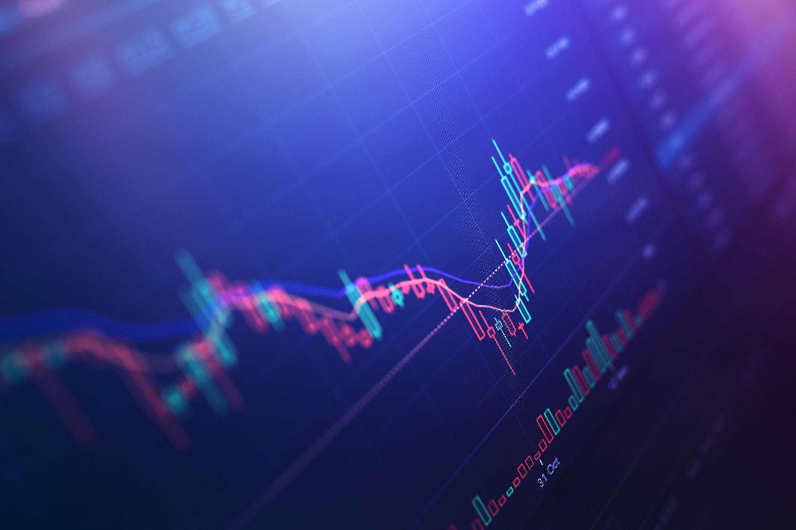

Algorithmic trading, often referred to as algo trading, has significantly transformed financial markets by automating and optimizing trade execution processes. By employing sophisticated algorithms, these systems conduct trades at speeds and frequencies that human traders cannot match. Algorithms analyze a plethora of data points and respond to market conditions in milliseconds, thus allowing for enhanced precision and efficiency. This transformation has shifted how traders approach investment strategies, emphasizing a combination of tactics, countermoves, and strategies to effectively harness market dynamics.

One pivotal aspect of algorithmic trading is the application of countermove strategies. Countermove strategies focus on short-term price reversals, commonly known as retracements, which enable traders to secure optimal entry and exit points. These strategies are critical as they utilize statistical and mathematical models to predict potential market retracements, allowing traders to capitalize on fleeting opportunities.



In addition to countermove strategies, algorithmic trading encompasses several popular strategies, each designed to leverage different market conditions. Prominent among these are trend-following strategies, which attempt to profit by trading in the direction of current market trends, and arbitrage strategies, which seek to exploit the pricing inefficiencies for similar assets across different markets. Mean reversion strategies, another widely used method, assume that the price of a security will revert to its average over time. Each of these strategies carries unique implications for traders, influencing how they approach the development and implementation of their trading algorithms.

The integration of various tactics and strategies within algo trading platforms not only enhances trading effectiveness but also reflects the growing complexity of financial markets. Understanding the interplay between these elements is crucial for traders who aim to optimize their trades and adapt to the rapidly changing market environments. As this article explores, the successful implementation of algorithmic trading strategies, including countermove tactics, is key to maximizing potential returns while managing associated risks. This process highlights the importance of continuous innovation and learning in maintaining a competitive edge in financial trading.

## Table of Contents

## Understanding Countermove Strategy in Trading

A countermove, in trading terminology, is a short-term reversal in the price trend of a security, often seen as a temporary retracement within the larger trend. Traders use countermove strategies to capitalize on these slight price reversals, aiming to secure more favorable entry points into the market.

Countermoves, also known as retracements, are an essential aspect of technical analysis in trading. Identifying potential countermoves allows traders to enhance their trading strategies by taking advantage of short-term corrections that occur during an overarching trend. Recognizing these patterns involves using a variety of key indicators and tools.

**Key Indicators and Tools for Identifying Countermoves**

1. **Fibonacci Retracements**: This tool is based on the idea that markets tend to retrace a predictable portion of a move, after which they continue in the original direction. Fibonacci levels, such as 38.2%, 50%, and 61.8%, are commonly used by traders to predict potential reversal levels. These levels are calculated using Fibonacci sequences and applied to charts to find opportunities for entering trades consistent with the underlying trend.

2. **Moving Averages**: Simple Moving Averages (SMA) and Exponential Moving Averages (EMA) are frequently used to identify potential retracements. When the price moves temporarily against the prevailing trend, it might intersect with the moving average, indicating a possible countermove.

3. **Relative Strength Index (RSI)**: This momentum oscillator measures the speed and change of price movements and can indicate overbought or oversold conditions. An RSI below 30 suggests an oversold condition, which could imply a potential countermove upwards, while an RSI above 70 suggests an overbought condition, possibly leading to a countermove downwards.

4. **Support and Resistance Levels**: These horizontal lines on the price chart indicate areas where the price previously struggled to move beyond (resistance) or hold above (support). Countermoves often occur near these levels, as they can act as psychological barriers where traders might anticipate reversals.

5. **Technical Patterns**: Patterns such as head and shoulders, double tops, and bottoms can signal potential countermoves. These patterns are formed by price movements and can hint at trend reversals, providing strategic entry points during retracements.

Python, a popular language in [algorithmic trading](/wiki/algorithmic-trading), can be used to implement these indicators. Here is a basic example using Python's pandas and numpy libraries to compute a simple moving average and RSI:

```python
import pandas as pd
import numpy as np

def compute_sma(data, window):
    return data.rolling(window=window).mean()

def compute_rsi(data, window=14):
    delta = data.diff()
    gain = (delta.where(delta > 0, 0)).rolling(window).mean()
    loss = (-delta.where(delta < 0, 0)).rolling(window).mean()

    rs = gain / loss
    rsi = 100 - (100 / (1 + rs))
    return rsi

# Example usage with closing prices in a DataFrame 'df'
df['SMA_50'] = compute_sma(df['Close'], window=50)
df['RSI'] = compute_rsi(df['Close'])
```

Using these indicators, traders can effectively identify potential countermoves, allowing them to adapt their strategies to the current market dynamics and seek profitable trading opportunities.

## Algorithmic Trading: An Overview

Algorithmic trading, often abbreviated as algo trading, is the use of computer algorithms to automate trading decisions and execute orders at a speed and frequency that is beyond the capability of human traders. The primary goal of algorithmic trading is to leverage automation to ensure precision, speed, and efficiency in trade execution.

### How Algo Trading Works

At its core, algorithmic trading involves coding a set of rules in a computer program that dictates when and how trades should be made. These rules are typically based on factors such as timing, price, quantity, or any mathematical model, thus ensuring that trades are executed in a systematic manner. A simple example of an algorithmic trading strategy is a moving average crossover strategy, where the algorithm generates buy signals when a short-term moving average crosses above a long-term moving average.

#### Components of Algorithmic Trading

1. **Trading Signals**: Algorithms use data inputs such as price, volume, and patterns in historical data to generate trading signals. These signals dictate the conditions under which a trade is executed.

2. **Trading Strategy**: The strategy outlines the technical indicators and criteria under which trades are executed. Common strategies include trend following, mean reversion, and statistical arbitrage, each with defined entry and exit points.

3. **Execution**: Once a trading signal is generated, the execution component of the algorithm places orders based on the pre-defined criteria. This can include splitting large orders to minimize market impact or managing partial fills.

4. **Risk Management**: Algorithms incorporate risk management measures to manage potential losses by setting stop-loss levels or adjusting position sizes dynamically.

### Role of Algorithms in Modern Financial Markets

Algorithms have transformed the financial markets by providing [liquidity](/wiki/liquidity-risk-premium) and enhancing the efficiency of trade executions. They act by scanning multiple markets and executing orders based on specific criteria, which reduces the time lag and errors associated with manual trading. In addition to high-frequency trading firms, institutional investors also rely on algorithmic trading to manage large volumes of trades that would be challenging and costly to execute manually.

### Benefits and Risks of Algorithmic Trading

#### Benefits:

- **Speed and Accuracy**: Algorithms process and respond to market changes in real-time, executing trades with precision that is unachievable by human traders.
- **Reduced Transaction Costs**: By pinpointing the optimal times for trade execution, algorithmic trading can lower the transaction costs significantly.
- **Elimination of Human Emotion**: Removing human emotions from trading decisions can lead to more consistent and objective trading outcomes.

#### Risks:

- **Technological Failures**: Dependence on technology makes algorithmic trading susceptible to failures due to software bugs, network issues, or power outages.
- **Market Impact**: High-frequency trading, a subset of algorithmic trading, can contribute to market volatility and, at times, exacerbate a flash crash.
- **Over-Optimization**: Also known as "curve-fitting," over-optimization can result in an algorithm that performs well on historical data but poorly in live markets due to its lack of adaptability to changes.

Algorithmic trading continues to play a significant role in the financial markets, offering the prospect of improved performance for traders who can navigate its complexities and inherent risks. As technology advances, the scope and sophistication of algorithmic trading strategies are likely to continue evolving, emphasizing the importance of continuous learning and adaptation.

## Popular Algorithmic Trading Strategies

Algorithmic trading has gained widespread popularity by utilizing diverse strategies tailored to specific market conditions. Each strategy serves distinct objectives based on price movements, [arbitrage](/wiki/arbitrage) opportunities, and statistical advantages. Understanding these strategies is crucial for traders to maximize profitability.

**Trend Following**

Trend following strategies capitalize on the [momentum](/wiki/momentum) of asset prices by buying securities in an uptrend or selling short in a downtrend. This approach is rooted in the belief that prices tend to move in long-lasting trends. Trend followers often use technical indicators, such as moving averages and the Relative Strength Index (RSI), to identify and confirm trends. For example, a simple moving average crossover strategy might involve buying a security when a short-term moving average crosses above a long-term average, indicating a bullish trend.

```python
# Python example of a simple moving average crossover strategy
def moving_average_crossover(prices, short_window=40, long_window=100):
    short_ma = prices.rolling(window=short_window).mean()
    long_ma = prices.rolling(window=long_window).mean()
    signals = pd.DataFrame(index=prices.index)
    signals['signal'] = 0.0
    signals['signal'][short_window:] = np.where(short_ma[short_window:] > long_ma[short_window:], 1.0, 0.0)
    signals['positions'] = signals['signal'].diff()
    return signals
```

**Arbitrage**

Arbitrage strategies exploit price discrepancies across different markets or instruments to achieve risk-free profit. A common form is the [statistical arbitrage](/wiki/statistical-arbitrage), where traders use complex mathematical models and algorithms to identify and capitalize on short-term inefficiencies. Another variant is merger arbitrage, which involves buying and selling the stocks of two merging companies to benefit from differences in their current and expected future valuations.

**Mean Reversion**

Mean reversion strategies are based on the principle that asset prices and historical returns eventually revert to their long-term mean or average. Traders using this strategy look to identify securities whose prices have deviated significantly from their average historical levels, expecting a reversal. To implement such a strategy, Bollinger Bands or Z-score indicators might be employed, which track price deviations from a simple moving average.

**Index Fund Rebalancing**

Index fund rebalancing involves trading the components of an index fund to maintain or adjust their proportional weights within the index. Since these adjustments can affect the prices of the component stocks, traders seek to predict or track these changes to execute advantageous trades. Rebalancing strategies require an in-depth understanding of the index constitution and predetermined rules for inclusion and exclusion.

**Market Timing**

Market timing strategies aim to make investment decisions based on predictions of future market price movements. This strategy can include a vast array of signals, from macroeconomic indicators to technical analysis. The challenge is accurately predicting movements, as incorrect timing can result in missed opportunities or increased losses. Advanced [machine learning](/wiki/machine-learning) algorithms are increasingly used to improve the accuracy of market timing strategies.

In conclusion, selecting the appropriate algorithmic trading strategy involves assessing current market conditions and aligning them with trading goals. A profound understanding of each strategy’s mechanics, along with proper execution, is essential for optimizing market opportunities and enhancing overall trading performance.

## Combining Countermove and Algorithmic Strategies

Integrating countermove strategies into algorithmic trading can significantly enhance trade execution by capitalizing on short-term price movements, enabling traders to refine entry and [exit](/wiki/exit-strategy) points. A countermove, often referred to as a retracement, is a temporary reversal in the prevailing trend of a security’s price. By combining these strategies with algorithmic methods, traders can improve accuracy and responsiveness to market changes.

### Incorporating Countermove Strategies into Algorithmic Trading

Countermove strategies can be implemented within algorithmic trading systems through the use of specific indicators and algorithms designed to identify potential retracements. Common tools include moving averages, Fibonacci retracement levels, and oscillators like the Relative Strength Index (RSI). These indicators help in forecasting price retracements by identifying overbought or oversold conditions, allowing algorithms to trigger trades when these conditions are met.

For instance, an algorithm might use moving averages to detect a trend and subsequently apply a Fibonacci retracement model to identify potential levels of price correction. A typical Python implementation could use the `pandas` and `numpy` libraries for data analysis, combined with `ta-lib` for technical indicators:

```python
import pandas as pd
import numpy as np
import talib

# Load price data
data = pd.read_csv('price_data.csv')
close_prices = data['Close'].values

# Calculate moving averages and RSI
short_window = 40
long_window = 100
data['MA_40'] = talib.SMA(close_prices, timeperiod=short_window)
data['MA_100'] = talib.SMA(close_prices, timeperiod=long_window)
data['RSI'] = talib.RSI(close_prices, timeperiod=14)

# Identify potential countermoves
data['Signal'] = np.where(data['RSI'] < 30, 1, 0)  # Buy signal if RSI < 30
data['Signal'] = np.where(data['RSI'] > 70, -1, data['Signal'])  # Sell signal if RSI > 70
```

In this example, RSI helps identify potential countermoves by signaling overbought or oversold conditions, triggering buy or sell actions, respectively. The combination of moving averages provides additional trend direction context, enhancing decision-making and execution precision.

### Effectiveness in Volatile Markets

The integration of countermove strategies within algorithmic models is particularly effective in volatile markets, where rapid price fluctuations create frequent opportunities for profit from small price corrections. By automating the detection of these opportunities, traders can execute numerous trades at high speed and accuracy, maintaining a systematic approach that minimizes emotional trading errors.

Algorithmic models leveraging countermove indicators are also less prone to human biases, ensuring consistent application of the strategy. These models can be further refined to account for various market conditions, adapting dynamically to maintain performance. Automation allows for [backtesting](/wiki/backtesting) strategies on historical data, enabling fine-tuning and validation of their effectiveness before live deployment.

### Conclusion

Incorporating countermove strategies into algorithmic trading systems improves the precision of trade execution. By using advanced indicators and computational tools to detect retracements, traders can capitalize on short-term market movements effectively, even in volatile environments. As algorithmic trading continues to evolve, integrating diverse strategies such as countermove tactics will remain integral to optimizing performance and achieving robust trading success.

## Challenges and Risks in Algo Trading

Algorithmic trading, a method that utilizes complex algorithms for decision-making and trade execution, offers significant advantages in terms of speed, precision, and efficiency. However, it is not devoid of challenges and risks that can impact the effectiveness and profitability of trading activities.

One of the primary risks associated with algorithmic trading is technological failure. Trading systems depend heavily on the robustness and reliability of the underlying technology. Glitches, hardware failures, network issues, or software bugs can lead to trading disruptions, incorrect trade executions, or even financial losses. For instance, the Flash Crash of 2010, where the US stock market experienced a rapid decline within minutes, highlighted the potential systemic risks posed by algorithmic trading systems. To mitigate these risks, traders need to ensure redundant systems, robust IT infrastructure, and continuous monitoring to promptly address any technological problems.

Another significant risk is over-optimization, commonly referred to as “curve fitting.” This occurs when a trading algorithm is excessively tuned to historical data, capturing noise rather than underlying patterns. Such algorithms may perform exceptionally well on past data but fail to adapt to new market conditions, leading to poor real-world performance. To avoid over-optimization, it is crucial to validate algorithmic strategies using out-of-sample testing and walk-forward analysis, ensuring that the model can generalize to unseen data.

Market dynamics are continuously evolving, necessitating ongoing strategy evaluation and adjustment. Algorithms must be regularly updated to incorporate new information and adapt to changing market conditions. This involves re-calibrating parameters and recalibrating models to reflect market trends, as well as incorporating risk management techniques to safeguard against adverse movements. A commonly used technique is backtesting, which involves simulating an algorithm’s performance against historical data to evaluate its effectiveness and potential risks.

In addition to these risks, latency issues also present a challenge in algorithmic trading. Latency refers to the delay between the initiation of a process and its execution. In high-frequency trading, even microseconds can significantly impact profitability. Traders must therefore invest in high-speed connections and colocate trading servers close to the exchange to minimize latency.

Algorithmic trading also faces regulatory challenges. As financial markets become more automated, regulators have increased scrutiny on algorithmic trading practices to ensure market fairness and stability. Traders must ensure compliance with regulatory requirements, such as maintaining transparent audit trails and implementing circuit breakers to pause trading during unusual market activity.

In conclusion, while algorithmic trading provides numerous advantages, it comes with its share of challenges and risks. Traders must be vigilant in managing technological risks, avoid over-optimization, regularly evaluate and adjust strategies, and stay compliant with regulatory standards. By addressing these challenges, traders can harness the power of algorithmic trading while minimizing potential downsides.

## Conclusion

Countermove strategies are integral to algorithmic trading, offering traders the potential to optimize trade execution by effectively identifying and leveraging short-term market reversals. These strategies become essential tools, particularly in volatile markets where quick adjustments to trading positions can significantly influence the outcome. By recognizing slight price retracements, traders can enter the market at more favorable points, thereby enhancing their potential for profitability.

While the synergy between countermove tactics and algorithmic trading presents numerous advantages, it's crucial to acknowledge that no strategy guarantees success. Markets are inherently unpredictable, and the effectiveness of any trading strategy can vary based on numerous factors, including market conditions and the individual trader's execution capabilities. Therefore, the integration of countermove strategies within algorithmic frameworks should be approached with a balanced understanding of their potential limitations and risks.

The continuously evolving nature of financial markets underscores the necessity for traders to remain adaptable and informed. Continuous learning and strategic adjustment are vital in ensuring that trading approaches remain relevant and effective. Traders must be willing to iterate on their strategies, incorporating new insights and technologies to respond to shifting market dynamics efficiently.

Overall, the thoughtful combination of countermove strategies within the broader scope of algorithmic trading can empower traders to navigate the complexities of modern financial markets more effectively. By committing to ongoing education and adaptive strategy development, traders position themselves to leverage the full potential of algorithmic trading, capitalizing on opportunities that arise from even the most subtle market movements.

## References & Further Reading

[1]: Bergstra, J., Bardenet, R., Bengio, Y., & Kégl, B. (2011). ["Algorithms for Hyper-Parameter Optimization."](https://dl.acm.org/doi/10.5555/2986459.2986743) Advances in Neural Information Processing Systems 24.

[2]: ["Advances in Financial Machine Learning"](https://www.amazon.com/Advances-Financial-Machine-Learning-Marcos/dp/1119482089) by Marcos Lopez de Prado

[3]: ["Evidence-Based Technical Analysis: Applying the Scientific Method and Statistical Inference to Trading Signals"](https://www.amazon.com/Evidence-Based-Technical-Analysis-Scientific-Statistical/dp/0470008741) by David Aronson

[4]: ["Machine Learning for Algorithmic Trading"](https://github.com/stefan-jansen/machine-learning-for-trading) by Stefan Jansen

[5]: ["Quantitative Trading: How to Build Your Own Algorithmic Trading Business"](https://www.amazon.com/Quantitative-Trading-Build-Algorithmic-Business/dp/1119800064) by Ernest P. Chan