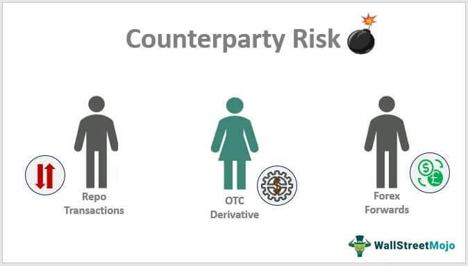

## Table of Contents

## What is counterparty risk?

Counterparty risk is the chance that the other person or company you're doing a deal with won't keep their promise. Imagine you lend money to a friend, and they say they'll pay you back next week. If they don't pay you back, that's counterparty risk. In business, this can happen with banks, companies, or anyone you make a financial agreement with.

This kind of risk is a big deal in financial markets, like when banks lend money to each other or when companies buy and sell things. If one side can't or won't fulfill their part of the deal, it can cause big problems. That's why people try to check how reliable the other side is before making a deal. They might ask for guarantees or use special agreements to lower the risk.

## How does counterparty risk affect financial transactions?

Counterparty risk can make financial transactions more complicated and risky. When you're doing business with someone, you always have to think about whether they'll actually do what they promised. If there's a big chance they won't, you might decide not to do the deal at all, or you might ask for more guarantees to make sure you're protected. This can slow things down and make everything more expensive because you have to spend time and money checking if the other person is reliable.

This risk also affects how much you might have to pay or get paid. If the other person is seen as risky, they might have to offer you a better deal to convince you to go through with it. For example, if you're lending money, you might charge a higher interest rate to someone who's more likely to not pay you back. This can change the prices of things in the market and make some deals harder to do. Overall, counterparty risk makes people more careful and can change how and when financial transactions happen.

## What are some common examples of counterparty risk in everyday financial activities?

Counterparty risk is something you might run into when you're doing everyday things with money. Imagine you're buying a car from someone you met online. You agree to pay them after they deliver the car. But what if they don't show up with the car after you've sent the money? That's counterparty risk. It's the worry that the other person won't do what they promised.

Another example is when you use a credit card. You use it to buy things, expecting the credit card company to pay the store right away. But if the credit card company has problems and can't pay, the store might not get their money, and you might be in a tricky situation. This kind of risk happens a lot in everyday life, whether you're making deals with friends, buying things, or using financial services.

## How can an individual or business assess counterparty risk?

To assess counterparty risk, individuals and businesses need to check how reliable the other person or company is. This means looking at their past behavior, like if they've always paid their bills on time or if they've had any financial troubles. You can do this by checking their credit history or financial statements. It's also a good idea to talk to other people who have done business with them before to see if they had any problems. If the other person is a business, you might want to look at their reputation and how long they've been around.

Another way to assess counterparty risk is to use contracts and agreements that protect you. For example, you can ask for a deposit or a guarantee that the other person will do what they promised. If you're lending money, you might want to ask for something valuable as security, like a car or a house, that you can take if they don't pay you back. By doing these things, you can get a better idea of whether it's safe to do business with the other person and make plans to protect yourself if things go wrong.

## What are the key factors that increase counterparty risk?

Several things can make counterparty risk higher. One big factor is if the other person or company has money problems. If they're struggling to pay their bills or have a lot of debt, they might not be able to keep their promises. Another factor is if they have a bad reputation or a history of not doing what they said they would do. If they've let people down before, it's more likely they'll do it again. Also, if the economy is doing badly, like during a recession, everyone's risk goes up because it's harder for businesses and people to make money and pay their bills.

Another thing that increases counterparty risk is if the deal is complicated or lasts a long time. The longer you have to wait for the other person to do their part, the more things can go wrong. For example, if you're waiting a year for someone to pay you back, a lot can change in that time. Also, if the deal involves a lot of money or important things, the risk goes up because there's more at stake. If something goes wrong, it could cause big problems for you. So, it's important to think about these factors when you're deciding if a deal is worth it.

## What are the main strategies to mitigate counterparty risk?

One way to lower counterparty risk is by checking how reliable the other person or company is before you do business with them. You can look at their credit history or financial statements to see if they've been good about paying their bills. It's also smart to talk to others who have worked with them to see if they've had any problems. By doing your homework, you can get a better idea of whether it's safe to do a deal with them.

Another strategy is to use contracts and agreements that protect you. For example, you can ask for a deposit or a guarantee that the other person will do what they promised. If you're lending money, you might want to ask for something valuable as security, like a car or a house, that you can take if they don't pay you back. This way, even if things go wrong, you have something to fall back on.

Lastly, you can spread out your risk by not putting all your eggs in one basket. Instead of doing one big deal with one person, you can do smaller deals with different people. This way, if one deal goes bad, it won't hurt you as much because you still have other deals going well. By using these strategies, you can make it safer to do business and lower the chances of getting hurt by counterparty risk.

## How do financial institutions manage counterparty risk?

Financial institutions manage counterparty risk by doing a lot of research on the people and companies they work with. They check credit reports and financial statements to see if the other side has been good at paying bills on time. They also look at the other company's reputation and how long they've been around. If a company has a history of not keeping its promises, the financial institution might decide not to do business with them or might ask for more guarantees to make sure they're protected.

Another way financial institutions manage this risk is by using contracts and agreements that protect them. They often ask for collateral, like money or property, that they can take if the other side doesn't do what they promised. They also use things like credit default swaps, which are like insurance policies that pay out if the other side can't pay. By using these tools, financial institutions can lower the chances of losing money if something goes wrong.

Lastly, financial institutions spread out their risk by not putting all their money into one deal. They work with many different people and companies so that if one deal goes bad, it won't hurt them too much. This way, they can keep doing business safely and make sure they don't lose everything if one thing goes wrong.

## What role do credit ratings play in evaluating counterparty risk?

Credit ratings are really important when it comes to figuring out counterparty risk. They are like a report card that tells you how likely someone is to pay back money they borrow. Credit rating agencies look at a person's or a company's financial history, how much debt they have, and if they've paid their bills on time. If a company has a high credit rating, it means they are seen as reliable and less likely to let you down. On the other hand, a low credit rating means they might have trouble keeping their promises, so they are riskier to work with.

Financial institutions and businesses use these credit ratings to decide if they want to do a deal with someone. If the other side has a good credit rating, the financial institution might feel safer about lending them money or doing business with them. But if the credit rating is low, they might ask for more guarantees or decide not to do the deal at all. By looking at credit ratings, people can get a quick idea of how risky it might be to work with someone, which helps them make better decisions and protect themselves from losing money.

## How has counterparty risk management evolved with financial technology?

Financial technology, or fintech, has changed the way people manage counterparty risk a lot. Now, with new tools and software, it's easier to check how reliable someone is before you do business with them. For example, there are online platforms that can quickly give you a credit report or financial data about a person or a company. This means you can make better decisions faster, without having to wait for paper reports or call a bunch of people. Also, fintech has made it easier to use things like smart contracts, which are digital agreements that automatically do what they're supposed to do if certain conditions are met. This can help make sure everyone sticks to the deal and lowers the chance that someone won't do what they promised.

Another big change is that fintech has brought new ways to spread out risk. Instead of putting all your money into one deal, you can use online platforms to do smaller deals with lots of different people. This way, if one deal goes bad, it won't hurt you as much because you have other deals that are still going well. Plus, there are now apps and services that help you keep track of all your deals and how risky they are. These tools can send you alerts if something looks off, so you can take action right away. Overall, fintech has made managing counterparty risk easier, faster, and more accurate, helping people and businesses stay safe in their financial dealings.

## What are the regulatory requirements concerning counterparty risk?

Regulators make rules to help control counterparty risk. These rules say that banks and other financial companies need to keep an eye on how risky their deals are. They have to check the credit ratings of the people or companies they work with and make sure they don't take on too much risk. For example, banks might need to have enough money set aside, called capital reserves, to cover any losses if a deal goes bad. This is to make sure that if someone can't pay back a loan, the bank can still keep going without causing big problems for the whole financial system.

Different countries have their own rules, but many follow guidelines from big international groups like the Basel Committee on Banking Supervision. These guidelines tell banks how much money they should keep in reserve based on how risky their deals are. Also, there are rules about what information banks need to share with regulators so they can keep an eye on things. By following these rules, banks and other financial companies can lower the chances of big problems happening because of counterparty risk, and help keep the financial system stable.

## How does counterparty risk impact derivatives and other complex financial instruments?

Counterparty risk is a big deal when it comes to derivatives and other complex financial instruments. These are deals where the value depends on something else, like the price of a stock or interest rates. If one side of the deal can't or won't do what they promised, it can cause big problems. For example, if you have a contract that says you'll get paid if a stock goes up, but the other person can't pay you when the stock does go up, you lose out. This risk is even bigger with derivatives because they can be very complicated and involve a lot of money.

To manage this risk, people who use derivatives often ask for guarantees or use special agreements. They might ask for collateral, like money or property, that they can take if the other side doesn't pay up. They also use things like credit default swaps, which are like insurance policies that pay out if the other side can't pay. By doing these things, they can lower the chances of losing money if something goes wrong. But even with these protections, counterparty risk is still something to watch out for because it can affect how much you might have to pay or get paid, and it can make some deals harder to do.

## What are the advanced quantitative models used for measuring and managing counterparty risk?

Advanced quantitative models help people measure and manage counterparty risk by using math and data to figure out how likely it is that the other person in a deal won't do what they promised. One common model is the Credit Value Adjustment (CVA), which calculates how much money you might lose because of counterparty risk. It looks at things like the other person's credit rating, how long the deal will last, and how much money is at stake. Another model is the Potential Future Exposure (PFE), which tries to guess how much risk there might be in the future based on how the market could change. These models use a lot of numbers and computer power to help people make smart decisions and protect themselves.

Another important model is the Expected Positive Exposure (EPE), which looks at the average amount of risk you might face over time. This helps people plan for different situations and make sure they have enough money set aside to cover any losses. These models are really useful for dealing with complex financial instruments like derivatives, where the risk can change a lot. By using these advanced models, financial institutions can keep a close eye on their deals and adjust their strategies to lower the chances of big problems happening because of counterparty risk.

## What is Understanding Financial Risk?

Financial risk refers to the potential for financial loss due to various unpredictable factors in the market. These risks can have significant implications for investments and the overall stability of financial systems. Understanding financial risk involves assessing various types of risk, including market risk, credit risk, and operational risk, each of which impacts financial decisions in different ways.

Market risk, also known as systematic risk, pertains to the possibility of an investor experiencing losses due to factors that affect the overall performance of the financial markets. This type of risk can include changes in interest rates, currency exchange rates, and stock market fluctuations. For example, a sharp decline in the stock market can lead to substantial losses for investors holding stocks or stock-based investment products.

Credit risk, on the other hand, is the risk of loss stemming from a borrower's inability to repay a loan or meet contractual obligations. It is a critical concern for financial institutions because it directly impacts their profitability and stability. Credit risk can be evaluated using various credit scoring systems and models that assess a borrower's creditworthiness based on their credit history and other financial indicators.

Operational risk is associated with failures in internal processes, people, and systems, or external events that can disrupt business operations and lead to losses. This type of risk can arise from inadequate or failed internal procedures, human errors, or technological failures. For instance, a significant data breach in a bank's IT systems could result in operational losses and reputational damage.

Assessing and quantifying financial risk is essential for investors and financial institutions to make informed decisions and develop strategies to mitigate potential losses. Various methods are used to evaluate financial risk, including quantitative models like Value at Risk (VaR), Conditional Value at Risk (CVaR), and scenario analysis. 

Value at Risk (VaR) is a widely used risk measure that estimates the potential loss in value of a portfolio over a specified time period, given a certain confidence level. It is expressed as a probability:

$$
\text{VaR}_{\alpha} = \inf \{ x \mid P(L > x) \leq 1 - \alpha \}
$$

where $\alpha$ represents the confidence level, and $L$ is the loss variable.

Conditional Value at Risk (CVaR), also known as Expected Shortfall, provides an estimate of the average loss exceeding the VaR threshold and is calculated as:

$$
\text{CVaR}_{\alpha} = E[L \mid L > \text{VaR}_{\alpha}]
$$

Scenario analysis involves evaluating the potential impact of various hypothetical or historical scenarios on a portfolio to understand the range of possible outcomes and prepare for adverse conditions.

In conclusion, gaining a comprehensive understanding of financial risk is crucial for navigating the complexities of today’s financial markets. Through effective evaluation and management strategies, investors and financial institutions can better safeguard their assets and ensure market stability.

## References & Further Reading

[1]: Hull, J. (2018). ["Risk Management and Financial Institutions"](https://books.google.com/books/about/Risk_Management_and_Financial_Institutio.html?id=1J1QDwAAQBAJ). Wiley.

[2]: Lopez de Prado, M. (2018). ["Advances in Financial Machine Learning"](https://books.google.com/books/about/Advances_in_Financial_Machine_Learning.html?id=oU9KDwAAQBAJ). Wiley.

[3]: Aronson, D. R. (2006). ["Evidence-Based Technical Analysis: Applying the Scientific Method and Statistical Inference to Trading Signals"](https://www.amazon.com/Evidence-Based-Technical-Analysis-Scientific-Statistical/dp/0470008741). Wiley.

[4]: Jorion, P. (2007). ["Value at Risk: The New Benchmark for Managing Financial Risk"](https://link.springer.com/article/10.1007/s11408-007-0057-3). McGraw-Hill.

[5]: Chan, E. P. (2009). ["Quantitative Trading: How to Build Your Own Algorithmic Trading Business"](https://github.com/ftvision/quant_trading_echan_book). Wiley.

[6]: Stoll, H. R. (2006). ["Electronic Trading in Stock Markets"](https://www.jstor.org/stable/pdf/30033638.pdf). The Review of Financial Studies, 20(6), 1473-1536.

[7]: Derman, E. (2004). ["My Life as a Quant: Reflections on Physics and Finance"](https://archive.org/details/mylifeasquantref0000derm). Wiley.

[8]: Black, F., & Scholes, M. (1973). ["The Pricing of Options and Corporate Liabilities"](https://www.cs.princeton.edu/courses/archive/fall09/cos323/papers/black_scholes73.pdf). Journal of Political Economy, 81(3), 637-654.

[9]: Glasserman, P. (2003). ["Monte Carlo Methods in Financial Engineering"](https://link.springer.com/book/10.1007/978-0-387-21617-1). Springer.