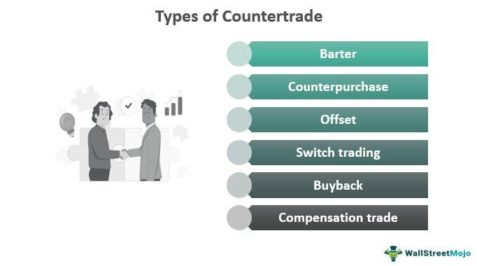

## Table of Contents

## What is countertrade?

Countertrade is a way of trading where countries or companies exchange goods or services instead of using money. This happens a lot when countries have limited access to hard currencies like the US dollar or when they want to boost their own industries. Instead of paying with money, one country might send machines or technology, and in return, they get products like oil or food from the other country.

This type of trade can be good because it helps countries that don't have a lot of money to still trade with others. It can also help build stronger relationships between countries. However, countertrade can be complicated. It takes more time to set up these deals, and sometimes the goods exchanged are not exactly what the countries need. This can make the whole process less efficient than just using money.

## What are the main types of countertrade?

The main types of countertrade include barter, counterpurchase, and offset. Barter is the simplest form where two parties directly swap goods or services without any money involved. For example, one country might exchange wheat for another country's oil. It's like trading apples for oranges at a school lunch table, but on a bigger scale.

Counterpurchase is a bit more complicated. In this type, one party agrees to buy goods from another, but the payment is made by selling other goods back to the first party. It's like buying a toy and paying for it by selling your old books to the toy store. This type of countertrade often involves a third party to help manage the transactions.

Offset is another type where a company selling a product to a country agrees to buy goods or services from that country as part of the deal. This is common in big industries like aerospace or defense. For example, if a country buys airplanes from a company, the company might agree to buy parts or services from companies in that country. This helps the buying country's economy grow.

## Can you explain barter as a form of countertrade?

Barter is a type of countertrade where two countries or companies swap goods or services directly without using money. It's like trading something you have for something you want. For example, if one country has a lot of wheat but needs oil, they can trade their wheat directly for another country's oil. This way, both countries get what they need without spending any money.

Barter can be helpful for countries that don't have a lot of money or can't easily get the currencies they need, like the US dollar. It's a simple way to trade, but it can also have some problems. Sometimes, it's hard to find a good match for what both countries want to trade. Also, figuring out how much wheat is worth the same as a certain amount of oil can be tricky. Despite these challenges, barter is still used because it allows countries to keep trading even when money is tight.

## How does counterpurchase differ from barter?

Counterpurchase is different from barter because it involves more steps. In a counterpurchase, one country buys goods from another country, but instead of paying with money, they agree to buy other goods from that country later. It's like buying a toy and then paying for it by selling your old books to the toy store. This type of trade often needs a third party to help manage the deals and make sure everything goes smoothly.

Barter, on the other hand, is simpler. It's a direct swap of goods or services between two countries without any money involved. For example, one country might trade wheat for another country's oil. Barter doesn't need any extra steps or third parties. It's just a straightforward exchange, but it can be hard to find the right match for what both countries want to trade.

## What is an offset agreement in countertrade?

An offset agreement is a type of countertrade where a company selling something to a country agrees to buy goods or services from that country as part of the deal. This is common in big industries like airplanes or defense equipment. For example, if a country buys airplanes from a company, the company might agree to buy parts or services from companies in that country. This helps the buying country's economy grow because it creates more business opportunities for local companies.

Offset agreements can be really helpful for countries. They not only get the products they need, like airplanes or military equipment, but they also get a boost in their own industries. It's like getting two benefits from one deal. However, these agreements can be complicated to set up and manage. They need a lot of planning and sometimes need help from third parties to make sure everything goes smoothly.

## What role does buyback play in countertrade?

Buyback is a type of countertrade where a country buys something, like a factory or equipment, and then pays for it by giving back the products made with that equipment. For example, if a country buys a factory that makes cars, they might pay for the factory by sending the cars they make back to the company that sold them the factory. This helps the country get new technology or factories without spending a lot of money upfront.

Buyback can be good for both sides. The country gets new technology or factories and can start making their own products. The company that sold the factory gets paid over time with the products made, which can be sold in other markets. But, like other types of countertrade, buyback can be tricky to set up and manage. It needs good planning and sometimes help from other companies to make sure everything works out well.

## What are some common reasons companies engage in countertrade?

Companies engage in countertrade for several reasons. One big reason is that it helps them trade with countries that don't have a lot of money or can't easily get hard currencies like the US dollar. By trading goods or services instead of money, companies can still do business with these countries. This is important for companies that want to sell their products in new markets around the world.

Another reason is that countertrade can help companies build stronger relationships with other countries. When a company agrees to buy goods or services from a country as part of a deal, it helps that country's economy grow. This can make the country happier to do more business with the company in the future. Even though countertrade can be more complicated and take more time to set up, the benefits of reaching new markets and building good relationships can make it worth it for companies.

## How does countertrade impact international trade laws and regulations?

Countertrade can make international trade laws and regulations more complicated. When companies trade goods or services instead of money, they have to follow rules from different countries. Sometimes, these rules can be hard to understand and follow. For example, a country might have special rules about what can be traded or how much can be traded. Companies have to make sure they follow all these rules, which can take a lot of time and effort.

Also, countertrade deals often need special agreements between countries. These agreements can change how normal trade laws work. For example, a country might agree to let in certain goods without the usual taxes or checks. This can make things easier for the companies involved, but it can also cause problems if other countries think the deals are not fair. So, countertrade can affect how trade laws are made and followed, making international trade more complex.

## Can you provide examples of countertrade in different industries?

In the aerospace industry, countertrade is common. For example, when a country buys airplanes from a big company like Boeing or Airbus, the company might agree to buy parts or services from companies in that country. This is called an offset agreement. It helps the country's economy because local companies get more business. For instance, if Malaysia buys airplanes from Boeing, Boeing might agree to buy parts from Malaysian companies. This way, Malaysia gets the airplanes and also helps its own businesses grow.

In the energy sector, countertrade can also be seen. A good example is when a country rich in oil, like Saudi Arabia, trades oil for other goods or services. They might trade oil to get technology or equipment they need. For example, Saudi Arabia might trade oil to a company in exchange for building a power plant. This helps Saudi Arabia get what it needs without spending a lot of money, and the company gets oil to sell or use.

In agriculture, countertrade happens too. A country with a lot of wheat, like Russia, might trade wheat for other products it needs. For instance, Russia could trade wheat to Cuba in exchange for sugar or tobacco. This way, both countries get what they need without using money. It helps them keep trading even if they don't have a lot of cash or can't easily get hard currencies.

## What are the advantages and disadvantages of countertrade for businesses?

Countertrade can be really helpful for businesses. It lets them trade with countries that don't have a lot of money or can't easily get hard currencies like the US dollar. By trading goods or services instead of money, businesses can still sell their products in new markets around the world. This can help them grow and make more money. Also, countertrade can build stronger relationships with other countries. When a business agrees to buy goods or services from a country as part of a deal, it helps that country's economy grow. This can make the country want to do more business with the company in the future.

But countertrade can also be hard for businesses. It takes more time and effort to set up these deals because they are more complicated than normal trades. Businesses have to follow rules from different countries, which can be hard to understand and follow. Sometimes, the goods or services they get in return are not exactly what they need. This can make the whole process less efficient than just using money. Even though countertrade has its benefits, the extra work and possible problems can make it a tough choice for businesses.

## How do companies evaluate the risks associated with countertrade?

Companies look at many things to figure out the risks of countertrade. They think about the country they want to trade with. They check if the country's laws and rules are easy to follow or if they might cause problems. Companies also think about the value of the goods or services they will get. They want to make sure what they get is worth what they give. Another big thing they look at is how stable the country is. If the country has a lot of changes in its government or economy, it can make countertrade risky.

Companies also use special plans to lower the risks of countertrade. They might work with other companies or use third parties to help manage the deals. This can make things easier and safer. They also try to make very clear agreements so everyone knows what they are getting and giving. This helps avoid surprises and problems later. Even with these plans, countertrade can still be tricky, but companies do their best to make it work well.

## What advanced strategies can be used to optimize countertrade deals?

To optimize countertrade deals, companies can use a strategy called multi-party countertrade. This means involving more than two countries or companies in the deal. For example, a company might trade goods to one country, and that country might then trade something else to a third country. This can help find better matches for what everyone needs and wants. It also spreads the risk because if one part of the deal doesn't work out, the other parts might still go well. By working with more partners, companies can make sure they get the most out of their countertrade deals.

Another strategy is to use technology to manage and track countertrade deals. Special software can help keep everything organized and make sure all the rules and agreements are followed. This can save time and reduce mistakes. Companies can also use data to predict what might happen in the future and plan their deals better. By using technology, companies can make their countertrade deals more efficient and successful. This helps them get the most value from their trades and build stronger relationships with their partners.

## References & Further Reading

[1]: Brink, L. (2017). ["Countertrade: An Overview."](https://angolatransparency.blog/en/what-are-the-different-types-of-countertrade/) International Trade Administration.

[2]: Marinov, E. (2015). ["The Role of Countertrade in International Business."](https://www.scirp.org/reference/referencespapers?referenceid=3449609) Economic Alternatives.

[3]: Kostecki, M. M. (1987). ["The Economics and Politics of International Countertrade."](https://www.semanticscholar.org/author/M.-Kostecki/51457806) San Francisco: Praeger.

[4]: Marjolein B. C., & Basu, K. (1996). ["Countertrade: Contracts Excellence and Compliance."](https://italyheritage.com/regions/abruzzo/laquila/lucodeimarsi.htm) Journal of International Economics.

[5]: World Trade Organization. (1993). ["Understanding the WTO: Sustaining Fair Trade Practices."](https://www.wto-ilibrary.org/content/books/9789287044662c001) WTO.

[6]: Greschner, O. (1989). ["Countertrade: Practice, Substance, and Background."](https://www.credlix.com/blogs/everything-you-need-to-know-about-countertrade-and-its-mechanisms) World Trade Center Miami. 

[7]: Rios, A. A. (1996). ["Countertrade: A Systematic Risk."](https://onlinelibrary.wiley.com/doi/pdf/10.1111/j.1539-6924.2011.01713.x) International Lawyer.

[8]: Hasbrouck, J. (2007). ["Empirical Market Microstructure: The Institutions, Economics, and Econometrics of Securities Trading."](https://academic.oup.com/book/52241) Oxford University Press.

[9]: Narayanan, V. K., & Faizul, M. (2004). ["Countertrade: Counterproductive?"](https://www.researchgate.net/profile/Vk-Narayanan/publication/274756465_Determinants_of_Internship_Effectiveness_An_Exploratory_Model/links/566aca0208aea0892c4b9dec/Determinants-of-Internship-Effectiveness-An-Exploratory-Model.pdf) Journal of Technology Transfer.