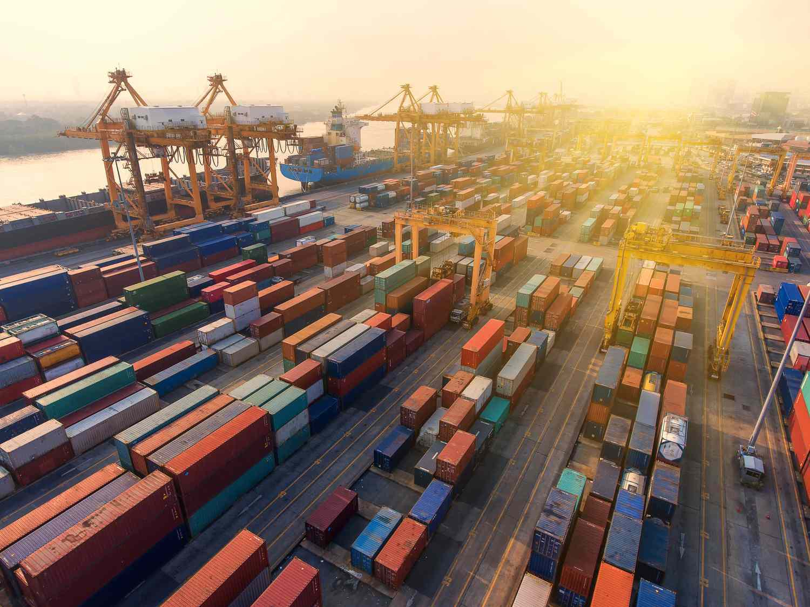

In the sphere of global trade, ensuring equitable conditions for all participants is an ongoing endeavor. A primary method that governments employ to shield domestic industries from unfair external competition is the implementation of countervailing duties (CVDs). These specific tariffs are designed to neutralize the benefits that foreign producers receive from subsidies granted by their governments. By doing so, CVDs aim to restore a level competitive field, allowing domestic industries to compete on equal footing without being undercut by artificially low-priced imports.

Countervailing duties are a pivotal mechanism within international trade, functioning to address the imbalances that arise due to foreign subsidies. These duties help maintain the integrity of domestic markets by mitigating potential financial disadvantages that native producers may face. As such, they are essential in preserving jobs and preventing the shutdown of domestic operations that might otherwise be unable to compete.



In parallel, the rapid advancement in algorithmic trading technologies adds another layer of complexity to the trade landscape. The integration of CVDs with algorithmic trading strategies highlights a modern intersection of trade policy and technology, where stakeholders must adapt to real-time data and economic indicators. This article will comprehensively examine the multifaceted nature of CVDs, exploring their significance within international trade, the guiding legal frameworks, and the technological dimensions influenced by algorithmic trading.

## Table of Contents

## Understanding Countervailing Duties (CVDs)

Countervailing duties (CVDs) are a specific type of tariff imposed on imported goods which have benefited from subsidies provided by a foreign government. These duties serve as a corrective measure to counterbalance the price distortion caused by these subsidies, thereby ensuring fair competition within the domestic market. The imposition of CVDs is integral to maintaining equilibrium in international trade by protecting domestic producers from the unfair advantage that foreign subsidies might create.

In practice, when a country identifies that imported goods are being sold at a lower price due to foreign government subsidies, it can impose a countervailing duty equivalent to the subsidy margin. This margin is calculated based on the difference between the fair market value of the goods in the exporting country and their subsidized export price. For instance, if a foreign government provides a subsidy that reduces the cost of production by 10%, the importing country might impose a 10% duty on the value of the goods to offset this advantage.

The application of CVDs is governed by international trade laws, predominantly under the rules and guidelines stipulated by the World Trade Organization (WTO). WTO agreements provide a framework to ensure that the process of determining and imposing CVDs is fair, transparent, and conducted with due diligence. The investigation to impose CVDs typically involves assessing the extent of subsidization and its impact on the domestic industry. Such investigations are essential to ensure that CVDs are not used as a protectionist tool but rather as a legitimate means to promote equitable competition.

CVDs play a crucial role in maintaining a balanced trade environment. By offsetting the impact of foreign subsidies, they help foster a competitive market landscape where domestic industries are not unduly disadvantaged. This, in turn, supports job retention and economic stability within the domestic market, making CVDs a vital tool in the broader schema of international trade regulation.

## The Role of CVDs in Global Trade

Countervailing duties (CVDs) are pivotal in safeguarding domestic industries against the negative impacts associated with subsidized imports. By imposing tariffs on these imports, CVDs ensure that local businesses are not unfairly disadvantaged by foreign producers who benefit from government subsidies. This mechanism is central to maintaining a competitive market environment within domestic economies.

The presence of subsidized imports can lead to distorted market conditions where domestic producers struggle to compete on price, which might trigger a cascade of unfavorable outcomes, including job losses and business closures. CVDs help mitigate these risks by neutralizing the price advantage that foreign subsidies provide. This not only enhances the viability of domestic industries but also preserves employment and economic stability.

Moreover, by addressing cost disparities caused by subsidies, CVDs promote fairness in international trade. They act as a regulatory measure to ensure that competition is based on quality and efficiency, rather than financial aid from governmental bodies. This aspect of CVDs encourages countries to focus on cultivating competitive advantages through innovation and productivity rather than relying on subsidies.

Healthy economic relations between countries are often bolstered by the implementation of CVDs, as they lessen the likelihood of trade conflicts over perceived unfair advantages. Establishing a level playing field aids in forming mutually beneficial trade agreements and collaborations, leading to a stable global trade environment. In essence, CVDs are instrumental in promoting equitable trade practices while protecting the economic interests of domestic markets.

## Legal Framework and WTO Guidelines

Countervailing duties (CVDs) are an integral part of international trade regulation, with their implementation deeply rooted in the framework provided by the World Trade Organization (WTO). As an international body, the WTO sets comprehensive guidelines to ensure that CVDs are deployed fairly and transparently across its member nations.

The WTO's Agreement on Subsidies and Countervailing Measures (SCM Agreement) is the cornerstone document that outlines the legal framework for CVDs. This agreement provides detailed criteria for determining when CVDs are appropriate. According to the SCM Agreement, a country may impose CVDs only after conducting a thorough investigation to ascertain the presence and impact of foreign subsidies on domestic industries.

To ensure fairness, the investigation process under WTO rules must follow specific procedural steps. These steps typically involve:

1. **Notification and Consultation**: The importing country must notify the exporting country and give it an opportunity for consultation. This initial step aims to understand the nature and scope of the subsidies in question.

2. **Investigation**: A detailed investigation is conducted, usually by government bodies or designated authorities, to assess whether the subsidies provide an unfair competitive advantage to foreign producers.

3. **Evidence of Injury**: It must be demonstrated that the subsidized imports cause material injury, or threat thereof, to the domestic industry. This often involves evaluating data on production, sales, market share, and profits.

4. **Causal Link**: There must be a clear causal relationship between the subsidized imports and the injury to the domestic industry.

Once these criteria are met, the affected country can impose countervailing duties to neutralize the advantage conferred by the subsidies. However, the application of these duties must be proportionate and limited to the extent necessary to counteract the identified harm.

The WTO's detailed provisions aim to prevent arbitrary or protectionist uses of CVDs that could disrupt global trade relations. Should disputes arise regarding the implementation of CVDs, they can be addressed through the WTO's dispute settlement mechanism, which offers a structured forum for resolving such issues.

Overall, the WTO framework ensures that CVDs are used as tools for fair competition rather than as barriers to trade, maintaining the delicate balance between protecting domestic industries and encouraging international trade cooperation.

## Challenges and Controversies

Determining the presence and impact of subsidies poses a significant challenge in the application of countervailing duties (CVDs). This complexity primarily arises from the diverse nature of subsidies and their various forms, which can include direct payments, tax concessions, and preferential loans, among others. Identifying these subsidies and quantifying their effects require comprehensive investigations that can be resource-intensive and time-consuming.

Additionally, the global supply chains' intricate web further complicates the assessment of subsidy impacts. Products often incorporate components sourced from multiple countries, each with potentially different subsidy regimes. This complexity can obscure the extent to which a subsidy has influenced the final product's pricing and competitiveness, making it difficult to accurately apply CVDs.

Moreover, CVD measures can result in significant international trade disputes. Countries targeted by CVDs may perceive them as protectionist measures that unfairly hinder their trade competitiveness. This perception can lead to retaliatory actions, escalating tensions between trading partners. As such, careful negotiation and adherence to international guidelines, such as those provided by the World Trade Organization (WTO), are essential to avoid conflicts and ensure that CVDs are applied fairly and transparently.

These challenges underscore the need for detailed investigations and international cooperation to effectively implement CVDs while minimizing potential trade disputes. The goal is to maintain a fair trading system that respects the rights of domestic industries to compete on an equal footing while adhering to established global trade rules.

## CVDs and Algorithmic Trading

In the age of rapid technological advancement, the intersection of countervailing duties (CVDs) and [algorithmic trading](/wiki/algorithmic-trading) has introduced both opportunities and challenges for market participants. Algorithmic trading, which utilizes computer algorithms to execute trades at high speeds and volumes, requires real-time data assessment to remain effective and competitive. CVDs, by influencing market dynamics, become a crucial component in the data portfolio that algorithmic traders analyze.

Algorithmic traders leverage CVD reports, which detail the imposition or adjustment of these duties, to anticipate market movements and refine trading strategies. The announcement of a CVD can alter the pricing and availability of certain imported goods, affecting supply chains and, consequently, stock prices of companies both domestically and internationally. Traders use these reports to predict potential market impacts and adjust their algorithms to either capitalize on anticipated market shifts or hedge against risks.

To integrate CVD data into algorithmic trading strategies, traders employ sophisticated data analytics techniques. These techniques involve the use of [machine learning](/wiki/machine-learning) models and statistical analysis to identify patterns and correlations between CVD implementations and market reactions. For example, a trader could develop a predictive model using time series analysis, where:

- $y(t)$ represents the market impact at time $t$.
- $x(t)$ represents the CVD announcement effect at time $t$.

In Python, a simplified approach using libraries such as `pandas` and `statsmodels` might include:

```python
import pandas as pd
from statsmodels.tsa.arima_model import ARIMA

# Sample time series data for market impact and CVD effect
data = pd.DataFrame({
    'market_impact': [...],  # Historical market data
    'cvd_effect': [...]      # CVD effect data
})

# Building a time series model
model = ARIMA(data['market_impact'], order=(1, 1, 1), exog=data['cvd_effect'])
results = model.fit()

# Using the model to forecast future market impacts
forecast = results.forecast(steps=5, exog=[...])[0]
```

The implementation of such models enables traders to assess the potential repercussions of CVDs in real-time, ensuring that their trading portfolios remain optimized. Additionally, as CVDs can lead to increased market [volatility](/wiki/volatility-trading-strategies), algorithmic strategies often incorporate risk management protocols to mitigate possible negative outcomes from sudden price changes.

The integration of trade policy data like CVDs into algorithmic trading highlights a critical juncture where trade policies and technology converge. It underscores the need for traders to constantly innovate and adapt to maintain a competitive edge, leveraging the latest advancements in data analytics and computational power. Understanding and anticipating the impacts of trade measures such as CVDs will continue to be a defining [factor](/wiki/factor-investing) in the success of algorithmic trading strategies.

## Case Studies and Real-World Applications

## Case Studies and Real-World Applications

Countervailing duties (CVDs) have played an essential role in addressing trade imbalances and protecting domestic industries from unfair competitive practices. This section examines notable cases where CVDs have been effectively implemented, analyzing their outcomes and economic impacts on both domestic and global markets.

### United States vs. China: Solar Panels

One of the most significant applications of CVDs occurred in 2012 when the United States imposed tariffs on Chinese solar panels. Chinese manufacturers were receiving substantial subsidies from their government, allowing them to sell solar panels at prices that undercut U.S. producers. The U.S. Department of Commerce determined that these subsidies were unfair, leading to the imposition of countervailing duties ranging from 14%-18%.

**Outcomes and Economic Impacts:**

- **Domestic Effects:** The CVDs allowed U.S. solar manufacturers to compete more effectively, preventing potential job losses and fostering domestic industry growth. Companies like SolarWorld reported increased market stability as a result.

- **Global Market Effects:** While the duties provided relief to U.S. manufacturers, they also increased the overall cost of solar panels for U.S. consumers. Internationally, the case heightened trade tensions between the U.S. and China, resulting in retaliatory measures and affecting global supply chains.

### European Union vs. India: Stainless Steel Products

In another instance, the European Union (EU) imposed countervailing duties on stainless steel products imported from India in 2015. The European Commission found that Indian exporters benefited from undue government subsidies, distorting the European market.

**Outcomes and Economic Impacts:**

- **Domestic Market:** The introduction of CVDs leveled the playing field for European producers, safeguarding jobs and securing industry revenues.

- **International Dynamics:** The duties led to a rebalancing of competitive conditions but also created friction between the EU and Indian government. Ultimately, it prompted India to review its subsidy programs, illustrating the broader regulatory impact of such trade measures.

### Canada vs. United States: Softwood Lumber

The long-standing trade disagreement between Canada and the United States over softwood lumber underscores the complexities involved in CVD application. The U.S. claimed that Canadian timber companies benefitted from local government subsidies, leading to multiple iterations of CVDs over the years.

**Outcomes and Economic Impacts:**

- **Domestic and Cross-Border Effects:** The imposition of CVDs helped U.S. lumber producers maintain competitive pricing but increased costs for U.S. homebuilders. Job preservation in the domestic lumber industry contrasted with inflationary pressures in the housing sector.

- **Global Repercussions:** The case led to significant trade negotiations under the North American Free Trade Agreement (NAFTA) and its successor, the United States-Mexico-Canada Agreement (USMCA), reflecting how CVDs can influence broader trade agreements.

### Conclusion

The examination of these case studies highlights the dual nature of countervailing duties as both a protective measure for domestic industries and a potential source of international tension. While effective in leveling the commercial playing field, the application of CVDs requires meticulous assessment to balance domestic economic protection with international trade relations. Understanding these outcomes is crucial for policymakers and businesses in navigating the complexities of global trade dynamics.

## Conclusion

Countervailing duties (CVDs) remain a crucial element in maintaining an equitable global trading environment. By counteracting the distortions caused by foreign subsidies, CVDs ensure that domestic industries can compete fairly against imports that benefit from financial advantages provided by their home governments. This corrective mechanism is vital for preventing market imbalances that could otherwise threaten the stability of domestic economies.

However, the implementation of CVDs is not without its challenges. International relations can become strained as countries navigate the complexities of subsidy identification and measurement. A significant challenge lies in the need for thorough investigations to ascertain the existence and impact of such subsidies, which can lead to prolonged trade disputes. These complexities are further compounded by the intricacies of modern global supply chains and the diverse forms of government assistance.

Despite these challenges, the strategic application of CVDs is indispensable for safeguarding domestic economic interests. By restoring competitive parity, CVDs help avert job losses and business closures within local markets, thereby contributing to economic stability and growth.

Additionally, the intersection of CVDs with algorithmic trading introduces a modern dimension to international trade. As trading algorithms increasingly influence financial markets, understanding and integrating CVD dynamics into trading strategies is becoming essential. Algorithmic traders utilize CVD announcements and trade data to optimize their investment decisions, requiring real-time data processing and analysis.

In conclusion, CVDs play an indispensable role in the global trading system. Their effective application supports fair competition and minimizes the risk of trade imbalances induced by foreign subsidies. As international trade continues to evolve, particularly with the rise of algorithmic trading, stakeholders who grasp the complexities of CVDs and their implications will be better equipped to navigate this intricate landscape successfully.

## References & Further Reading

[1]: Staiger, R. W., & Sykes, A. O. (2011). ["The WTO Agreement on Subsidies and Countervailing Measures."](https://iilj.org/wp-content/uploads/2016/08/Staiger-Sykes-Non-Violations-IILJ-WP-2013_5.pdf) Journal of International Economic Law, 13(4), 907-928.

[2]: Hoekman, B. M., & Mavroidis, P. C. (2007). ["The World Trade Organization: Law, Economics, and Politics."](https://www.taylorfrancis.com/books/mono/10.4324/9780203946534/world-trade-organization-wto-bernard-hoekman-petros-mavroidis-petros-mavroidis) Routledge.

[3]: Prusa, T. J., & Vermulst, E. A. (1999). ["A Decade of Anti-Dumping in the EU: Economic and Political Considerations."](https://www.cambridge.org/core/journals/world-trade-review/article/abs/united-states-certain-methodologies-and-their-application-to-antidumping-proceedings-involving-china-nails-in-the-coffin-of-unfair-dumping-margin-calculation-methodologies/BB078B9655DDC082E341778F5838B794) Oxford Economic Papers, 51(1), 13-41.

[4]: Zhang, W., & Clark, D. P. (2009). ["Countervailing Duties and the WTO: What are the rules, and how do they apply?"](https://www.researchgate.net/publication/358571576_Time_to_Reform_the_Non-Actionable_Subsidy_Rules_in_the_WTO_The_COVID-19_Subsidies_and_Beyond) World Scientific.

[5]: Koh, W. S. (2007). ["China and the Regulation of Subsidies and State Aids."](https://law-store.wolterskluwer.com/s/product/the-regulation-of-subsidies-and-state-aids-in-wto-and-ec-law/01t0f00000J3aYbAAJ) World Trade Review, 6(4), 473-507.

[6]: Lopez de Prado, M. (2018). ["Advances in Financial Machine Learning."](https://www.amazon.com/Advances-Financial-Machine-Learning-Marcos/dp/1119482089) Wiley.

[7]: Wooton, I., & Zanardi, M. (2021). ["Trade Rules for the Digital Age: Rethinking Trade Policy for Cross-Border Data Flows and the Internet."](https://en.wikipedia.org/wiki/List_of_comics_creators) Routledge.