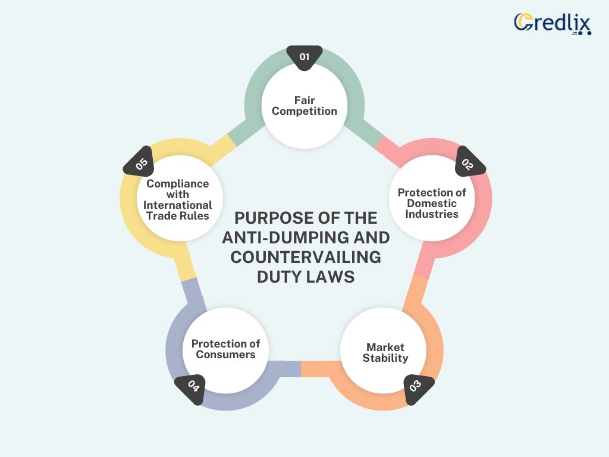

## Table of Contents

## What are countervailing duties?

Countervailing duties are special tariffs that a country puts on imported goods to make them more expensive. They are used when a foreign government gives subsidies to their companies, making their products cheaper and giving them an unfair advantage in the market. By adding these duties, the importing country tries to level the playing field for its own businesses.

These duties help protect local industries from being harmed by cheaper imports. For example, if a foreign country subsidizes its steel industry, their steel might be sold at a lower price than local steel. By imposing countervailing duties, the importing country can raise the price of the foreign steel to match the local price, helping local steel producers stay competitive. This process involves a lot of investigation and evidence to prove that subsidies are indeed happening and causing harm.

## Why are countervailing duties imposed?

Countervailing duties are put in place to protect local businesses from unfair competition. When a foreign country gives money or other help to its companies, their products can become cheaper. This can make it hard for businesses in the importing country to compete because their products might be more expensive. By adding countervailing duties, the importing country makes the foreign products more expensive, which helps level the playing field.

These duties are used after a lot of checking and proof that the foreign help is unfair and hurting local businesses. For example, if another country helps its farmers grow wheat cheaper, their wheat might be sold at a lower price than local wheat. By adding countervailing duties, the price of the foreign wheat goes up, making it fair for local farmers to compete. This way, local jobs and industries are protected from being harmed by cheaper imports.

## How do countervailing duties differ from anti-dumping duties?

Countervailing duties and anti-dumping duties are both used to protect local businesses, but they target different problems. Countervailing duties are used when a foreign government gives money or other help to its companies, making their products cheaper. This help is called a subsidy. When these subsidized products are sold in another country at a lower price, it can hurt local businesses. So, the importing country adds countervailing duties to make the foreign products more expensive and fair for local businesses to compete.

Anti-dumping duties, on the other hand, are used when a company sells its products in another country at a much lower price than it sells them at home. This is called dumping. Dumping can hurt businesses in the country where the products are being sold because they can't compete with the low prices. To stop this, the importing country adds anti-dumping duties to raise the price of the dumped products, making it fair for local businesses. Both types of duties help protect local jobs and industries, but they address different unfair practices.

## What is the process for imposing countervailing duties?

The process for imposing countervailing duties starts when a local business or industry believes it is being hurt by cheaper imports from a foreign country that is giving money or help to its companies. This help is called a subsidy. The local business can file a complaint with their government, usually with the trade or commerce department. The government then starts an investigation to check if the foreign subsidies are real and if they are causing harm to local businesses. This investigation involves collecting a lot of information and evidence from both the local businesses and the foreign companies.

If the government finds that the subsidies are unfair and are hurting local businesses, it can decide to put countervailing duties on the imported products. These duties make the foreign products more expensive, which helps level the playing field for local businesses. The amount of the duty is usually set to match the amount of the subsidy given by the foreign government. The whole process can take many months and involves a lot of back-and-forth between the government, local businesses, and foreign companies to make sure the decision is fair and based on solid evidence.

## Which international trade agreements govern the use of countervailing duties?

The use of countervailing duties is mainly governed by the World Trade Organization (WTO) through the Agreement on Subsidies and Countervailing Measures (ASCM). This agreement sets out rules for when and how countries can use countervailing duties. It says that countries can put these duties on imports if they can prove that the foreign government is giving money or help to its companies, and this is hurting local businesses. The agreement makes sure that the process for using countervailing duties is fair and clear, and it helps stop countries from using these duties in a way that is not fair.

Another important agreement is the General Agreement on Tariffs and Trade (GATT), which is also part of the WTO. GATT has rules that countries should follow when they use tariffs like countervailing duties. It says that countries should not use these duties to stop fair trade, and they should only use them when they really need to protect their local businesses. Both the ASCM and GATT work together to make sure that the use of countervailing duties is fair and does not harm global trade too much.

## How are subsidies identified and measured for the purpose of countervailing duties?

To identify and measure subsidies for countervailing duties, the government first needs to know if a foreign country is giving money or help to its companies. This help can be in many forms, like cash payments, low-cost loans, or even giving away land for free. The government starts by looking at the information from the local businesses that say they are being hurt by these cheaper imports. They also ask the foreign companies and their government for details about any help they are giving. If the foreign government is not clear about what help they are giving, the government might use other information to guess how much help is being given.

Once the government thinks a subsidy exists, they need to figure out how much it is worth. This is called measuring the subsidy. They look at how much money or help the foreign companies are getting and how it makes their products cheaper. For example, if a foreign government gives a company a loan with a very low [interest rate](/wiki/interest-rate-trading-strategies), the government will work out how much cheaper that loan makes the company's products compared to if they had to pay a normal interest rate. The amount of the countervailing duty is then set to match the value of the subsidy, making the foreign products more expensive and fair for local businesses to compete.

## What are the criteria for a product to be considered as having received a countervailable subsidy?

For a product to be considered as having received a countervailable subsidy, the government needs to find out if a foreign country is giving money or help to its companies. This help can be in many forms, like cash, low-cost loans, or even free land. The government looks at information from local businesses that say they are being hurt by cheaper imports. They also ask the foreign companies and their government for details about any help they are giving. If the foreign government does not give clear information, the government might use other information to guess how much help is being given.

Once the government thinks a subsidy exists, they need to figure out how much it is worth. This is called measuring the subsidy. They look at how much money or help the foreign companies are getting and how it makes their products cheaper. For example, if a foreign government gives a company a loan with a very low interest rate, the government will work out how much cheaper that loan makes the company's products compared to if they had to pay a normal interest rate. If the subsidy makes the foreign products unfairly cheaper and hurts local businesses, the government can put a countervailing duty on those products to make them more expensive and fair for local businesses to compete.

## How do countries determine the level of countervailing duties to be applied?

Countries decide how much countervailing duty to put on foreign products by looking at how much help the foreign government gives to its companies. This help is called a subsidy. They start by figuring out how much money or other help the foreign companies are getting. For example, if a foreign government gives a company a loan with a very low interest rate, the country will work out how much cheaper that loan makes the company's products compared to if they had to pay a normal interest rate. The countervailing duty is then set to match the value of the subsidy, making the foreign products more expensive.

This process involves a lot of checking and math. The country gathers information from both local businesses and the foreign companies to find out the exact amount of the subsidy. If the foreign government does not give clear information, the country might use other information to guess how much help is being given. The goal is to make sure the countervailing duty is fair and only enough to level the playing field for local businesses, not more.

## What are the economic impacts of countervailing duties on domestic and international markets?

Countervailing duties can help local businesses by making foreign products more expensive. When foreign companies get help from their government, their products can be cheaper. This can hurt local businesses because they have to compete with these cheaper prices. By putting countervailing duties on these foreign products, the local businesses can sell their products at a fairer price. This helps protect local jobs and industries. It also means that local companies might make more money and can keep growing.

On the other hand, countervailing duties can make things more expensive for people who buy things. When the price of foreign products goes up because of these duties, it can mean that people have to pay more for what they need. This can be hard on people who don't have a lot of money. It can also lead to less trade between countries. If one country puts countervailing duties on another country's products, the other country might do the same thing back. This can make it harder for companies to sell their products in other countries and can slow down global trade.

## Can countervailing duties be challenged and how?

Yes, countervailing duties can be challenged. If a foreign company or its government thinks the duties are not fair, they can ask for a review. They can go to the country that put the duties in place and say why they think the duties are wrong. They might say that the subsidy was not as big as the country thought, or that it did not hurt local businesses. The country will then look at the new information and decide if they need to change the duties or take them away.

If the country does not change the duties after the review, the foreign company or government can go to the World Trade Organization (WTO). The WTO has rules about when and how countries can use countervailing duties. They will look at the case and see if the duties follow these rules. If the WTO decides the duties are not fair, they can tell the country to change or remove them. This process can take a long time and needs a lot of proof, but it helps make sure that the use of countervailing duties is fair.

## What are some notable cases where countervailing duties have been applied?

One big case where countervailing duties were used is with solar panels from China. The United States found out that the Chinese government was giving a lot of help to its solar panel companies. This help made the solar panels cheaper and hurt American solar panel businesses. So, the U.S. put countervailing duties on these solar panels to make them more expensive and fair for American companies to compete. This case was important because it showed how countries can use these duties to protect their own industries from unfair competition.

Another case is with steel from South Korea. The European Union found that the South Korean government was helping its steel companies, making their steel cheaper. This was hurting steel businesses in the EU. So, the EU put countervailing duties on the steel from South Korea to make it more expensive and help local steel companies. This case is a good example of how countervailing duties can be used to protect jobs and industries in the country that puts the duties in place.

## How do countervailing duties affect global trade relations and diplomacy?

Countervailing duties can make things tricky between countries. When one country puts these duties on another country's products, it can make the other country mad. They might think the duties are not fair and can start to trust the other country less. This can lead to fights and less talking between the countries. Sometimes, the country that gets the duties might put their own duties on the first country's products. This can start a big fight over trade, making it hard for companies to sell their things in other countries and slowing down global trade.

But, countervailing duties can also make countries talk more. When there is a problem with these duties, countries might go to the World Trade Organization (WTO) to sort it out. The WTO helps countries talk and find a way to fix the problem. This can lead to better rules and more trust between countries. Even though countervailing duties can cause fights, they can also push countries to work together and make trade fairer for everyone.

## References & Further Reading

[1]: Staiger, R. W., & Sykes, A. O. (2011). ["The WTO Agreement on Subsidies and Countervailing Measures."](https://iilj.org/wp-content/uploads/2016/08/Staiger-Sykes-Non-Violations-IILJ-WP-2013_5.pdf) Journal of International Economic Law, 13(4), 907-928.

[2]: Hoekman, B. M., & Mavroidis, P. C. (2007). ["The World Trade Organization: Law, Economics, and Politics."](https://www.taylorfrancis.com/books/mono/10.4324/9780203946534/world-trade-organization-wto-bernard-hoekman-petros-mavroidis-petros-mavroidis) Routledge.

[3]: Prusa, T. J., & Vermulst, E. A. (1999). ["A Decade of Anti-Dumping in the EU: Economic and Political Considerations."](https://www.cambridge.org/core/journals/world-trade-review/article/abs/united-states-certain-methodologies-and-their-application-to-antidumping-proceedings-involving-china-nails-in-the-coffin-of-unfair-dumping-margin-calculation-methodologies/BB078B9655DDC082E341778F5838B794) Oxford Economic Papers, 51(1), 13-41.

[4]: Zhang, W., & Clark, D. P. (2009). ["Countervailing Duties and the WTO: What are the rules, and how do they apply?"](https://www.researchgate.net/publication/358571576_Time_to_Reform_the_Non-Actionable_Subsidy_Rules_in_the_WTO_The_COVID-19_Subsidies_and_Beyond) World Scientific.

[5]: Koh, W. S. (2007). ["China and the Regulation of Subsidies and State Aids."](https://law-store.wolterskluwer.com/s/product/the-regulation-of-subsidies-and-state-aids-in-wto-and-ec-law/01t0f00000J3aYbAAJ) World Trade Review, 6(4), 473-507.

[6]: Lopez de Prado, M. (2018). ["Advances in Financial Machine Learning."](https://www.amazon.com/Advances-Financial-Machine-Learning-Marcos/dp/1119482089) Wiley.

[7]: Wooton, I., & Zanardi, M. (2021). ["Trade Rules for the Digital Age: Rethinking Trade Policy for Cross-Border Data Flows and the Internet."](https://en.wikipedia.org/wiki/List_of_comics_creators) Routledge.