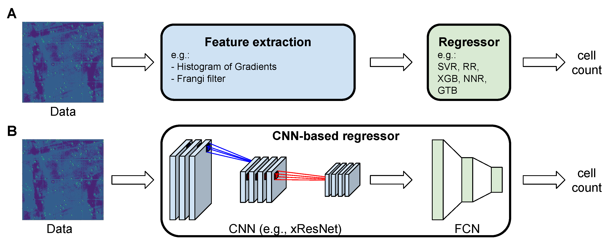

## Table of Contents

## What are counting methods in the context of machine learning?

Counting methods in machine learning are techniques used to estimate the frequency or probability of certain events or outcomes in data. These methods help in understanding patterns and making predictions based on how often things happen. For example, if you want to predict whether it will rain tomorrow, you might look at how many times it has rained on similar days in the past. Counting methods can be simple, like just adding up occurrences, or more complex, involving calculations of probabilities.

One common counting method is the use of histograms, which are graphical representations of the distribution of data. A histogram divides data into bins and counts how many data points fall into each bin. This helps in visualizing the frequency of different values in a dataset. For instance, if you are analyzing the ages of people in a group, a histogram can show you how many people are in their 20s, 30s, and so on. This visual tool is very helpful in understanding the spread and concentration of data.

Another important counting method is the use of contingency tables, which are used to analyze the relationship between two or more categorical variables. For example, if you want to see if there is a relationship between gender and preference for a certain type of movie, you can use a contingency table to count how many men and women prefer each type of movie. This helps in understanding patterns and associations in the data, which can be crucial for making informed decisions in machine learning models.

## How does the EBC (Example-Based Counting) method work?

The EBC (Example-Based Counting) method is a way to count things in [machine learning](/wiki/machine-learning) by looking at examples from the past. Imagine you want to know how often people buy ice cream when it's hot outside. With EBC, you would look at past days when it was hot and count how many times people bought ice cream on those days. This helps you predict what might happen next time it's hot. EBC is useful because it uses real examples to make guesses about the future, which can be more accurate than just guessing.

To use EBC, you need a set of examples, or data, from the past. For each new situation you want to predict, you find similar examples in your data and count how often the thing you're interested in happened in those examples. For instance, if you're trying to predict if a student will pass a test, you would look at past students with similar study habits and count how many of them passed. This method helps you make predictions based on what has actually happened before, making your guesses more reliable.

## What is the KNN (K-Nearest Neighbors) method and how is it used for counting?

The KNN (K-Nearest Neighbors) method is a way to make predictions by looking at the examples closest to the thing you're trying to predict. Imagine you want to guess someone's favorite color based on their age and where they live. With KNN, you would find the K people who are most similar in age and location to the person you're asking about, and then see what their favorite colors are. If most of those K people like blue, you might guess that the person you're asking about also likes blue.

For counting, KNN can be used to estimate how often something happens by looking at the K nearest examples. For example, if you want to know how often people go to the beach when it's sunny, you would find the K days in your data that are most similar to today's weather and count how many of those days people went to the beach. This way, you're using real examples from the past to make a guess about what might happen today. It's like looking at your neighbors to see what they're doing and then deciding to do the same.

## Can you explain the IOU (Intersection over Union) based verification in counting methods?

IOU (Intersection over Union) based verification is a way to check how good a counting method is by comparing what it counts to what actually exists. Imagine you're counting cars in a parking lot using a computer program. The program might draw boxes around what it thinks are cars. IOU helps you see how well these boxes match up with the real cars. It does this by looking at the overlap between the program's boxes and the actual car locations. If the overlap is big, the counting method is doing a good job.

To use IOU, you calculate the area where the program's box and the real car's area overlap, and then you divide that by the total area covered by both the box and the real car. This gives you a number between 0 and 1. If the number is close to 1, it means the program's box fits the real car very well. If it's close to 0, the program's box doesn't match the real car at all. This helps you know if your counting method is accurate or if it needs to be improved.

## What are the primary applications of counting methods in machine learning?

Counting methods in machine learning are used in many ways to help understand and predict things. One common use is in classification tasks, where you want to sort things into different groups. For example, if you're trying to tell if an email is spam or not, you might count how many times certain words appear in spam emails compared to non-spam emails. By looking at these counts, you can make better guesses about whether a new email is spam. Counting methods are also used in clustering, where you group similar things together. By counting how often certain features appear together, you can find patterns and group things that are alike.

Another important application of counting methods is in anomaly detection, where you want to find things that are unusual or different from the norm. For instance, in a factory, you might count how often machines produce items that meet certain standards. If a machine starts making a lot of items that don't meet the standards, you know something might be wrong. Counting methods help you spot these unusual events by comparing how often they happen to what is normal. This can help you fix problems before they get worse.

## How do counting methods help in object detection and tracking?

Counting methods help in object detection by figuring out how many objects are in a picture or video. Imagine you're trying to count the number of cars in a parking lot using a computer program. The program looks at the picture and counts how many times it sees something that looks like a car. By keeping track of these counts, the program can tell you how many cars are there. This is helpful for things like traffic management or security, where knowing the number of objects is important.

In object tracking, counting methods are used to follow objects as they move. For example, if you're watching a soccer game and want to track the players, the program would count how many times it sees each player in different parts of the field. By counting these occurrences over time, the program can figure out where each player is moving and how fast. This helps in understanding the game better or even in automating things like player [statistics](/wiki/bayesian-statistics) or game analysis.

## What are the advantages of using EBC over other counting methods?

EBC, or Example-Based Counting, has a big advantage because it looks at real examples from the past to make guesses about the future. This makes it more accurate than methods that just use math formulas or guesses. For example, if you want to know if it will rain tomorrow, EBC will look at days that were similar to today and count how many times it rained on those days. This way, you're using real data to make your prediction, which can be more reliable than just guessing.

Another advantage of EBC is that it can be easy to understand and use. You don't need to know a lot of math to use it. All you need is a set of examples from the past, and you can count how often something happened in those examples. This makes it a good choice for people who want a simple way to make predictions without getting into complicated calculations.

## In what scenarios would KNN be more effective than other counting methods?

KNN, or K-Nearest Neighbors, works best when you want to make predictions based on things that are very similar to what you're looking at now. Imagine you want to guess how much a house will sell for. With KNN, you would look at the prices of the K houses that are most similar to the one you're trying to predict. This method is great when you have a lot of examples that are close to what you're trying to guess, because it uses real examples from the past to make your prediction more accurate.

KNN can be more effective than other counting methods when the data changes a lot over time. For example, if you're trying to predict what people will buy next month, and what they bought last month was different from what they bought this month, KNN can help. It looks at the most recent examples that are similar to now, so it can keep up with changes better than methods that use older data or just simple counts. This makes KNN a good choice when you need to stay up-to-date with the latest trends or patterns.

## How does IOU-based verification improve the accuracy of counting methods?

IOU-based verification helps make counting methods more accurate by checking how well the counted objects match up with what's actually there. Imagine you're using a computer program to count cars in a parking lot. The program draws boxes around what it thinks are cars, and IOU looks at how much these boxes overlap with the real cars. If the overlap is big, it means the program is doing a good job counting the cars. This helps you know if the counting method is working well or if it needs to be fixed.

By using IOU, you can see if the counting method is missing cars or counting things that aren't cars. For example, if the program's box doesn't overlap much with a real car, you know it's not counting that car correctly. By looking at the IOU score, which is calculated as the area of overlap divided by the total area of both the box and the real object, you can tell how accurate the counting is. If the IOU score is high, you can trust the counting method more. This way, IOU helps make sure the counting method is as accurate as possible.

## What are the common challenges faced when implementing counting methods in machine learning?

One common challenge when implementing counting methods in machine learning is dealing with noisy or incomplete data. Imagine you're trying to count how many times people buy ice cream when it's hot, but some days the temperature data is missing or wrong. This can make your counts less accurate because you're not working with complete information. Another challenge is choosing the right number of examples to look at. If you use too few examples, your counts might not be reliable. But if you use too many, you might include examples that aren't really similar to what you're trying to predict, which can also lead to mistakes.

Another challenge is making sure the counting method works well for different kinds of data. For example, if you're using KNN to count how often people go to the beach when it's sunny, it might work well for one beach but not for another. This is because the patterns of people going to different beaches can be different. So, you need to adjust your counting method to fit the specific data you're working with. This can be tricky and requires a lot of testing and tweaking to get right.

## How can one optimize the performance of counting methods in large datasets?

When dealing with large datasets, one way to optimize the performance of counting methods is by using efficient data structures and algorithms. For example, if you're using KNN for counting, you can use data structures like KD-trees or ball trees to quickly find the nearest neighbors. These structures help speed up the search process by organizing the data in a way that makes it easier to find similar examples. Another way to optimize is by using parallel processing. This means you can split the large dataset into smaller parts and count them at the same time on different computers or processors, which can make the counting much faster.

Another important way to improve counting methods in large datasets is by reducing the amount of data you need to look at. You can do this by using techniques like data sampling, where you only look at a smaller, but still representative, part of the data. This can make the counting process faster without losing too much accuracy. Also, using more efficient counting algorithms, like approximate counting methods, can help. These methods give you a close-enough count without having to look at every single data point, which can save a lot of time when working with big datasets.

## What are the latest advancements in counting methods and their impact on machine learning?

The latest advancements in counting methods have significantly impacted machine learning by improving the accuracy and efficiency of these techniques. One notable advancement is the development of [deep learning](/wiki/deep-learning)-based counting methods. These methods use neural networks to automatically learn and count objects in images or videos. For example, convolutional neural networks (CNNs) have been used to count objects like cars in traffic or cells in medical images. These deep learning approaches can handle complex scenes and varying object sizes better than traditional counting methods, leading to more accurate counts and better predictions in applications like traffic management and medical diagnostics.

Another advancement is the use of transfer learning in counting methods. Transfer learning allows models to be trained on one task and then fine-tuned for another, which can save time and computational resources. For instance, a model trained to count objects in general images can be fine-tuned to count specific types of objects in a new dataset. This has made it easier to apply counting methods to new domains without starting from scratch. These advancements have broadened the scope of machine learning applications, making counting methods more versatile and effective in real-world scenarios.

## References & Further Reading

[1]: Bishop, C. M. (2006). ["Pattern Recognition and Machine Learning."](https://www.cs.uoi.gr/~arly/courses/ml/tmp/Bishop_book.pdf) Springer.

[2]: Duda, R. O., Hart, P. E., & Stork, D. G. (2000). ["Pattern Classification."](https://www.scirp.org/reference/referencespapers?referenceid=3173943) John Wiley & Sons.

[3]: Hastie, T., Tibshirani, R., & Friedman, J. (2009). ["The Elements of Statistical Learning: Data Mining, Inference, and Prediction."](https://link.springer.com/book/10.1007/978-0-387-84858-7) Springer.

[4]: Cover, T. M., & Hart, P. E. (1967). ["Nearest neighbor pattern classification."](https://ieeexplore.ieee.org/document/1053964) IEEE Transactions on Information Theory, 13(1), 21-27.

[5]: Everingham, M., Gool, L. V., Williams, C. K. I., Winn, J., & Zisserman, A. (2010). ["The Pascal Visual Object Classes (VOC) Challenge."](https://link.springer.com/article/10.1007/s11263-009-0275-4) International Journal of Computer Vision, 88, 303-338.

[6]: Tsung-Yi Lin, Maire, M., Belongie, S., Hays, J., Perona, P., Ramanan, D., Dollar, P., & Zitnick, C. L. (2014). ["Microsoft COCO: Common Objects in Context."](https://arxiv.org/abs/1405.0312) arXiv preprint arXiv:1405.0312.