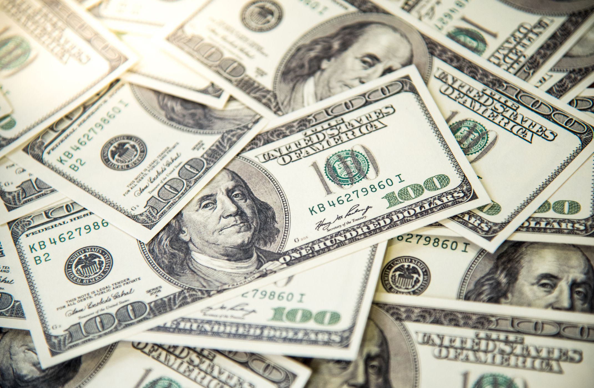

The growing phenomenon of dollarization presents significant implications for global economies, influencing currency stability and international financial interactions. Dollarization occurs when a country adopts the U.S. dollar in place of or alongside its national currency. This shift often arises from economic instability, hyperinflation, or a loss of confidence in a domestic currency, offering immediate economic stability at the cost of monetary policy independence.

This article aims to explore the fundamental aspects of dollarization, its impact on currency adoption, and its interconnection with algorithmic trading. With the U.S. dollar maintaining its status as a dominant world currency, understanding its role in international markets becomes crucial. The U.S. dollar's extensive use in global transactions and its status as the primary reserve currency underscore its significant economic footprint.



As we examine the reasons for dollarization and its worldwide effects, we also consider the technological dimension introduced by algorithmic trading. Algorithmic trading, which utilizes mathematical models and automated systems, frequently deals with assets denominated in U.S. dollars due to the currency's liquidity and global acceptance. Understanding how algorithmic trading interacts with these monetary changes is vital for investors and policymakers in navigating the evolving financial landscape.

Comprehending these dynamics is crucial not only for investors and policymakers but also for those engaged in international trade. By unraveling the intricacies of dollarization and its intersection with advanced trading technologies, stakeholders can better prepare for potential economic shifts and optimize trade efficiency.

## Table of Contents

## Understanding Dollarization

Dollarization refers to the phenomenon where a country adopts the U.S. dollar as its official currency, either fully replacing or existing alongside the local currency. This move is often prompted by factors such as economic instability, hyperinflation, or a loss of confidence in the domestic currency. In such scenarios, the adoption of the U.S. dollar can serve as a stabilizing force, providing a semblance of monetary reliability and predictability.

When a country undergoes dollarization, it benefits from the relative economic stability associated with the dollar's use. The currency is less susceptible to the extreme fluctuations that can occur with a failing domestic currency, thereby curbing hyperinflation and often restoring consumer and investor confidence. This can be particularly beneficial in economies where hyperinflation erodes the value of local currency savings and wages at an alarming rate, leading to economic hardships.

However, dollarization is not without its drawbacks. One significant consequence is the surrendering of monetary policy independence. Once a country adopts the U.S. dollar, it no longer has the ability to conduct independent monetary policy, such as adjusting interest rates or implementing currency devaluation. Instead, the country's monetary policy becomes tied directly to the existing policies of the U.S. Federal Reserve. This dependency means that any shifts in U.S. monetary policy or dollar valuation can have direct and sometimes adverse effects on the dollarized nation.

In practice, dollarization can manifest in several ways: official dollarization, unofficial dollarization, or semiofficial dollarization. In cases of official dollarization, the U.S. dollar fully replaces the local currency as the primary medium for transactions and reserves, as seen in countries like Ecuador and El Salvador. Unofficial dollarization occurs when citizens prefer using the U.S. dollar over the local currency for savings and sometimes even in larger transactions, but the local currency still circulates. Semiofficial dollarization means the U.S. dollar is a legal currency alongside the local one, providing an option but not a full replacement.

The motivations behind dollarization and its implications are complex and multifaceted, deeply intertwined with a country's economic strategies and its historical economic performance. Understanding the underlying causes and potential consequences is crucial for policymakers and economists tasked with navigating these challenging economic landscapes.

## Global Adoption of the U.S. Dollar

The U.S. dollar, a consequential player in the global financial arena, serves as the official currency in several territories and countries, while many others utilize it alongside their local currencies. The adoption of the U.S. dollar, also known as dollarization, is often driven by complex economic interdependencies and strategic considerations. 

One of the primary motivations for adopting the U.S. dollar is the economic and political relationship some regions have with the United States. Territories such as Puerto Rico and Guam, which are under U.S. jurisdiction, naturally use the dollar as their standard currency. Furthermore, countries with strong economic ties to the U.S. often favor the dollar to facilitate trade and tourism, as well as to attract direct foreign investment. The ability to transact in a stable and globally recognized currency reduces exchange rate risk, thus promoting economic stability and investor confidence.

The U.S. dollar’s role as the preeminent reserve currency is another [factor](/wiki/factor-investing) driving its widespread adoption. Its prevalence in international transactions is supported by the dollar’s extensive [liquidity](/wiki/liquidity-risk-premium) and acceptance across financial markets. This liquidity, coupled with the perception of stability, reinforces the dollar’s global dominance. According to the International Monetary Fund, the U.S. dollar constitutes approximately 59% of global foreign exchange reserves, a testament to its central role in international finance.

Full dollarization has been adopted by countries seeking to stabilize their economies amidst significant economic distress. Ecuador and El Salvador are notable examples. Following a debilitating financial crisis and hyperinflation, Ecuador adopted the U.S. dollar in 2000. By replacing the sucre with the dollar, Ecuador sought to restore economic stability and curb runaway inflation. Similarly, El Salvador dollarized in 2001 with the aim of fostering economic integration with the United States, enhancing its financial system’s credibility, and attracting foreign investment.

While the adoption of the U.S. dollar offers certain economic advantages, such as mitigating currency risk and ensuring monetary stability, it also involves trade-offs. Countries relinquishing their monetary sovereignty lose the capacity to employ independent monetary policies tailored to their specific economic conditions. Consequently, they may face challenges in responding to domestic economic crises or external shocks that impact the dollar. Nevertheless, the overarching reliance on the U.S. dollar continues to underscore its integral function in shaping global economic interactions.

## Impact of Dollarization on Economies

Dollarization, the process where a country adopts the U.S. dollar as its official currency, has profound effects on the economies that choose this monetary strategy. One of the most immediate consequences of dollarization is the relinquishing of monetary sovereignty. Countries that dollarize effectively surrender their ability to print their own currency. This loss of control impacts their fiscal and monetary policies significantly, as they can no longer use tools such as adjusting interest rates or printing more currency to manage economic fluctuations.

A primary advantage of dollarization is the potential for controlling inflation. By adopting the U.S. dollar, a country can stabilize its price levels, especially if it previously suffered from hyperinflation due to mismanagement of its native currency. This stabilization often boosts investor confidence, as the risks associated with currency fluctuations reduce. Consequently, foreign investments may increase, as stakeholders trust in the stability of an economy tethered to a robust international currency.

However, the benefits of inflation control and enhanced investor confidence come at the cost of economic resilience. Dollarized nations become susceptible to U.S. economic policies and global dollar market dynamics. When the U.S. Federal Reserve changes its monetary policy, dollarized countries must adapt despite their different economic conditions. These adjustments can lead to misalignments between local economic needs and the broader implications of the dollar's value, impacting economic growth and development strategies.

Interest rate policy is another critical area affected by dollarization. Since dollarized countries do not control their currency, they must accept interest rates determined by the U.S. Federal Reserve. This situation effectively outsources an essential economic lever to a foreign entity, which can be detrimental during periods when local economic objectives diverge from U.S. policies. For example, if a dollarized economy needs lower interest rates to stimulate growth, but the Federal Reserve raises rates to curb inflation in the U.S., the dollarized nation may experience economic stagnation.

Overall, while dollarization can bring immediate economic stability, such as controlling inflation and attracting foreign investment, it also presents significant challenges. The surrender of monetary policy independence and reliance on U.S. economic decisions can compromise an economy's ability to navigate its fiscal path effectively. As a result, these countries must weigh the trade-offs carefully, considering both the short-term benefits and potential long-term economic vulnerabilities.

## Algorithmic Trading and the U.S. Dollar

Algorithmic trading leverages mathematical models and automated systems to execute trades in financial markets with speed and precision. The U.S. dollar, due to its position as the dominant global currency, frequently plays a central role in these trading activities. Its liquidity and widespread acceptance render it a preferred currency for high-frequency trading operations. The primary advantage for algorithmic traders utilizing the U.S. dollar is the substantial liquidity it offers; the dollar is involved in a significant portion of the world's foreign exchange transactions, accounting for roughly 88% of all trades as highlighted by the Bank for International Settlements.

The high liquidity associated with the U.S. dollar minimizes the impact of large trades on market prices, which is essential for [algorithmic trading](/wiki/algorithmic-trading) strategies that often rely on the rapid execution of substantial numbers of trades to exploit small price discrepancies. The following Python snippet illustrates a simplified example of a trading algorithm that could capitalize on such market attributes:

```python
import numpy as np

# Simulated market data
market_prices = np.random.normal(loc=1.0, scale=0.01, size=1000)

# Trading strategy: Moving Average Crossover
def moving_average_cross_strategy(prices):
    short_window = 40
    long_window = 100

    signal = np.zeros(len(prices))
    short_mavg = np.convolve(prices, np.ones(short_window)/short_window, mode='valid')
    long_mavg = np.convolve(prices, np.ones(long_window)/long_window, mode='valid')

    # Generate signals
    for i in range(len(short_mavg)):
        if i >= (long_window - short_window) and short_mavg[i] > long_mavg[i - (long_window - short_window)]:
            signal[i + long_window - 1] = 1  # Buy
        elif short_mavg[i] < long_mavg[i - (long_window - short_window)]:
            signal[i + long_window - 1] = -1  # Sell

    return signal

trade_signals = moving_average_cross_strategy(market_prices)
```

However, algorithmic traders must remain vigilant to geopolitical and economic factors that can influence the U.S. dollar's value. Events such as changes in U.S. monetary policy, geopolitical tensions, or macroeconomic data releases can lead to [volatility](/wiki/volatility-trading-strategies) in dollar-denominated markets. This necessitates sophisticated risk management strategies and robust algorithms capable of adapting to sudden market shifts. To mitigate these risks, algo traders might employ hedging strategies or [machine learning](/wiki/machine-learning) algorithms capable of predicting market movements based on historical data and real-time information. 

In conclusion, while the dominance of the U.S. dollar presents attractive opportunities for algorithmic traders through its liquidity and global reach, it also requires constant analysis and strategic planning to navigate the complex and dynamic nature of global currency markets.

## The Future of Dollarization and Algo Trading

As more countries explore the option of adopting the U.S. dollar to stabilize their economies, the future of dollarization and its intertwining with algorithmic trading becomes a subject of extensive debate. The discussion encompasses multiple facets, including technological developments, the rise of digital currencies, and evolving financial strategies.

Technological advancements in algorithmic trading have the potential to significantly impact the globalization of markets and strategies for currency adoption. By utilizing sophisticated algorithms and computational power, traders can process vast amounts of financial data in real-time, optimizing decisions and enhancing trade efficiency. This technological proficiency is crucial as the U.S. dollar maintains its role as a key currency in global trading platforms, where high liquidity and acceptance are desirable traits.

With the increasing prominence of digital currencies and innovative payment systems, the traditional monetary landscape faces disruption. Cryptocurrencies like Bitcoin, and blockchain-based financial services, introduce alternatives to conventional currency usage, potentially decreasing reliance on the U.S. dollar over time. These digital innovations could influence global perspectives on dollarization, presenting options that offer greater monetary autonomy and reduced exposure to the economic policies of the United States.

Investors and policymakers must adeptly navigate these evolving elements to achieve optimal economic outcomes and trade efficiency. Strategies must consider both the benefits of dollarization, such as inflation control and investor confidence, and the challenges posed by diminished monetary sovereignty. Additionally, the integration of emerging technologies in trading demands up-to-date regulatory frameworks and risk management techniques.

The trajectory of dollarization and algorithmic trading will be shaped by these complex, interrelated factors. Policymakers' decisions and technological innovations will play pivotal roles in the economic strategies of nations considering or implementing dollarization. As the financial landscape continues to evolve, the balance between embracing technological advancements and maintaining economic stability remains a critical consideration for stakeholders worldwide.

## Conclusion

Dollarization and the prominence of the U.S. dollar are fundamentally interconnected within global economics and trading practices. The adoption of the U.S. dollar as an official or parallel currency offers certain advantages, such as enhanced economic stability and increased investor confidence due to the currency's perceived reliability. However, this process necessitates a thorough evaluation of its long-term economic repercussions. Nations that adopt dollarization often sacrifice monetary policy autonomy, making them susceptible to external economic influences, particularly from the United States. This dependency can lead to economic vulnerabilities when U.S. monetary policies do not align with the economic needs of dollarized countries.

The evolution of algorithmic trading is a pivotal component in this context. As technological advancements continue at a rapid pace, opportunities for efficiency and precision in trading have expanded significantly within a dollar-dominated economic landscape. Algorithmic trading capitalizes on the U.S. dollar's liquidity and global acceptance, facilitating complex financial transactions at increased speeds and with reduced costs. However, this dominance also presents challenges, as changes in U.S. economic policy, geopolitical factors, and market volatility must be carefully managed by traders utilizing algorithmic systems.

Looking toward the future, several key factors will influence this financial narrative. Efforts towards de-dollarization, where countries seek to reduce their reliance on the U.S. dollar, may alter current dynamics, particularly as nations explore alternative monetary systems and currencies. Furthermore, advancements in trading technologies and the rise of digital currencies, such as cryptocurrencies, present transformative potential for financial markets. These developments offer both opportunities for diversification and challenges in terms of regulatory adaptation and market stability. As these elements continue to evolve, investors, policymakers, and traders must navigate complex landscapes to achieve optimal economic outcomes and enhance trade effectiveness.

## References & Further Reading

[1]: Berg, A., Borensztein, E., & Mauro, P. (2003). ["Monetary Policy in Dollarized Economies."](https://www.imf.org/external/pubs/nft/op/171/) International Monetary Fund Working Paper.

[2]: ["The Dollarization Debate"](https://www.imf.org/external/pubs/ft/fandd/2000/03/berg.htm) by Dominick Salvatore, James W. Dean, & Thomas D. Willett

[3]: ["Algorithmic Trading and DMA"](https://www.amazon.com/Algorithmic-Trading-DMA-introduction-strategies/dp/0956399207) by Barry Johnson

[4]: Reinhart, C. M., Rogoff, K. S., & Savastano, M. A. (2003). ["Addicted to Dollars."](https://www.nber.org/system/files/working_papers/w9908/w9908.pdf) National Bureau of Economic Research Working Paper No. 10015.

[5]: ["International Finance: Theory and Policy"](https://open.umn.edu/opentextbooks/textbooks/18) by Paul Krugman & Maurice Obstfeld