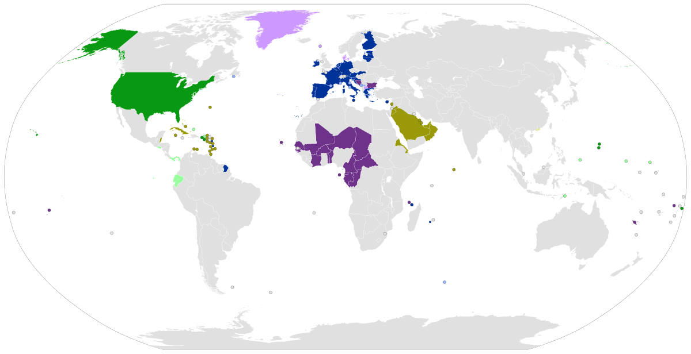

## Table of Contents

## What is the U.S. Dollar and why is it significant globally?

The U.S. Dollar, often called the dollar, is the official currency of the United States. It is used every day by people in the U.S. to buy things like food, clothes, and other stuff. The dollar is also used in other countries like Ecuador and El Salvador, where it is their official money too. You can recognize the dollar by its symbol, $, and it comes in both paper bills and coins.

The dollar is very important around the world because it is used in international trade and as a reserve currency by many countries. This means that when countries buy and sell things from each other, they often use dollars to make the deals. Also, many countries keep dollars in their banks as a safe way to store money. Because so many people and countries use the dollar, it has a big impact on the world's economy. When the dollar changes in value, it can affect prices and trade everywhere.

## Which countries currently use the U.S. Dollar as their official currency?

The U.S. Dollar is the official currency of the United States. It is also used as the official money in a few other countries. These countries are Ecuador, El Salvador, and some small places like the British Virgin Islands, the Turks and Caicos Islands, and Timor-Leste.

Ecuador decided to use the U.S. Dollar instead of its own money in the year 2000. This was done to help make their economy more stable. El Salvador started using the dollar in 2001 for the same reason. In these countries, people use dollars to buy things every day, just like in the United States.

Some other small places also use the U.S. Dollar. For example, the British Virgin Islands and the Turks and Caicos Islands, which are in the Caribbean, use the dollar. Timor-Leste, a country in Southeast Asia, also uses the U.S. Dollar as its official currency. This shows how the dollar is important not just in the U.S., but in many parts of the world.

## What are the economic benefits for a country adopting the U.S. Dollar?

When a country decides to use the U.S. Dollar instead of its own money, it can help make their economy more stable. This is because the dollar is a strong and trusted currency around the world. When a country uses the dollar, it doesn't have to worry about its own money losing value quickly. This can make people feel more confident about saving and spending money. It can also attract more foreign businesses and investors because they know the dollar is stable and reliable.

Another benefit is that it can make trade easier. When a country uses the U.S. Dollar, it's simpler to buy and sell things with other countries that also use the dollar. This can help businesses grow and create more jobs. Using the dollar can also help a country avoid the costs of making and managing its own money. Instead, they can focus on other important things like improving their economy and helping their people.

## What are the potential drawbacks for a country using the U.S. Dollar?

When a country uses the U.S. Dollar instead of its own money, it loses the ability to control its own money supply. This means they can't print more money if they need to, or change interest rates to help their economy. If the U.S. economy has problems, it can affect the country using the dollar too. For example, if the dollar becomes weaker, things might become more expensive in that country, which can be hard for people.

Another problem is that the country might not be able to use money policies to help its own economy. If the country is going through tough times, like a recession, it can't make its own money cheaper to help businesses and people. Also, using the dollar can make the country depend too much on the U.S. If the U.S. changes its money policies, it can affect the country using the dollar in ways they can't control.

## How does a country decide to adopt the U.S. Dollar?

When a country wants to use the U.S. Dollar instead of its own money, it usually happens after a lot of thinking and talking. Leaders in the country look at their economy and see if their own money is causing problems. If their money is losing value quickly or if they have big debts, they might think about using the dollar. They talk to experts, look at other countries that have done this, and decide if it will help their economy be more stable. It's a big decision, so they take their time to make sure it's the right choice.

Once they decide to go ahead, the country's leaders need to make a plan. They have to tell everyone in the country about the change and explain why it's happening. They might set a date when the switch will happen, and they need to make sure banks and businesses are ready. The government might also need to change some laws and rules to make the switch smooth. It's a big step, but if done right, it can help the country's economy in the long run.

## What is the process of dollarization and how long does it typically take?

Dollarization is when a country decides to use the U.S. Dollar instead of its own money. This usually happens because the country's own money is not working well, maybe because it's losing value quickly or because there are big debts. The leaders of the country talk to experts and look at other countries that have used the dollar. They think about if it will help their economy be more stable. Once they decide to go ahead, they make a plan. They tell everyone in the country about the change and set a date when it will happen. They make sure banks and businesses are ready and change any laws or rules that need to be changed.

The time it takes for dollarization to happen can be different for each country. It depends on how ready the country is and how well they can explain the change to everyone. Some countries might take a few months to switch to the dollar, while others might take a year or more. It's important for the switch to be smooth so that people don't get confused and businesses can keep running well. Once the country starts using the dollar, it can take some time for people to get used to it, but if everything goes well, it can help the economy in the long run.

## Can you provide examples of countries that have recently adopted the U.S. Dollar?

One recent example of a country adopting the U.S. Dollar is Zimbabwe. In 2009, Zimbabwe was having big problems with its own money. The Zimbabwean dollar was losing value very quickly, and people were struggling. So, the government decided to start using the U.S. Dollar to help make the economy more stable. People in Zimbabwe began using dollars to buy things, and it helped calm down the money problems they were having.

Another example is Ecuador, which adopted the U.S. Dollar in 2000. Ecuador was also facing issues with its own currency, the sucre, which was losing value fast. The government thought that using the dollar would help make the economy more stable and attract more foreign investment. Since then, Ecuadorians have been using dollars for everyday purchases, and it has helped their economy in some ways, though it also brought new challenges.

## How does dollarization affect a country's monetary policy?

When a country uses the U.S. Dollar instead of its own money, it can't control its own money supply anymore. This means the country can't print more money if it needs to, or change interest rates to help its economy. If the U.S. decides to change its money policies, like raising or lowering interest rates, the country using the dollar has to follow along. This can be hard because the country might need different money policies to help its own people and businesses.

For example, if the U.S. raises interest rates to slow down its economy, the country using the dollar might also see its economy slow down, even if it needs to grow. This can make it harder for the country to deal with its own economic problems. On the other hand, if the U.S. has a strong economy, the country using the dollar can benefit from that stability. But overall, dollarization means the country loses control over its own money, which can be a big challenge.

## What impact does adopting the U.S. Dollar have on a country's trade relations?

When a country starts using the U.S. Dollar, it can make trading with other countries easier. Many countries already use the dollar for buying and selling things, so using the dollar means less confusion and fewer costs when trading. For example, if a country uses its own money, it might need to change it into dollars or another currency to trade with other countries. By using the dollar, the country can skip this step and trade more easily with countries that also use the dollar.

However, using the U.S. Dollar can also make a country depend more on the U.S. economy. If the U.S. has problems with its economy, like a recession, it can affect the country using the dollar too. This can make trade harder because the value of the dollar might change, making things more expensive or cheaper in the country. So, while using the dollar can help with trade in some ways, it also means the country's trade can be affected by what happens in the U.S. economy.

## How does the use of the U.S. Dollar influence inflation and economic stability in adopting countries?

When a country starts using the U.S. Dollar, it can help keep inflation under control. Inflation is when prices go up over time. If a country's own money is losing value quickly, using the dollar can stop this from happening. The U.S. Dollar is a strong and stable currency, so when a country uses it, prices don't go up as fast. This can make life easier for people because they know what things will cost and can plan better.

But using the U.S. Dollar can also make a country's economy less stable in some ways. The country can't print its own money or change interest rates to help its economy if it's having problems. If the U.S. economy has issues, like a recession, it can affect the country using the dollar too. This means the country's economy can be influenced by what happens in the U.S., which can be hard to control. So, while the dollar can help with inflation, it can also make the country's economy depend more on the U.S. economy.

## What are the geopolitical implications of a country adopting the U.S. Dollar?

When a country decides to use the U.S. Dollar instead of its own money, it can change how it gets along with other countries. Using the dollar can make the country closer to the United States. This is because the country might need help from the U.S. to make the switch smooth. They might also need to follow U.S. rules about money. This can make other countries think that the country using the dollar is a friend of the U.S., which can change how they treat that country.

On the other hand, using the U.S. Dollar can also cause some problems with other countries. Some countries might not like that the country is using the dollar because it makes them depend more on the U.S. economy. This can make other countries worried that the U.S. has too much power over money around the world. If the U.S. and another country don't get along well, the country using the dollar might get stuck in the middle of their problems. So, using the dollar can change a country's friendships and fights with other countries in big ways.

## How do international organizations view the trend of dollarization?

International organizations like the International Monetary Fund (IMF) and the World Bank have mixed feelings about countries using the U.S. Dollar instead of their own money. They see that using the dollar can help a country's economy become more stable, especially if their own money is causing problems. The dollar is a strong currency, so using it can make people feel more confident about saving and spending money. It can also make it easier for the country to trade with other countries that use the dollar. This can help the country's businesses grow and create more jobs.

But these organizations also worry about some problems that can come with using the U.S. Dollar. When a country uses the dollar, it loses control over its own money. This means they can't print more money or change interest rates to help their economy if it's having problems. The country's economy can be affected by what happens in the U.S., even if that's not good for them. So, while using the dollar can help in some ways, it can also make the country depend too much on the U.S. economy. International organizations think countries should think carefully about these pros and cons before deciding to use the dollar.

## References & Further Reading

[1]: Berg, A., Borensztein, E., & Mauro, P. (2003). ["Monetary Policy in Dollarized Economies."](https://www.imf.org/external/pubs/nft/op/171/) International Monetary Fund Working Paper.

[2]: ["The Dollarization Debate"](https://www.imf.org/external/pubs/ft/fandd/2000/03/berg.htm) by Dominick Salvatore, James W. Dean, & Thomas D. Willett

[3]: ["Algorithmic Trading and DMA"](https://www.amazon.com/Algorithmic-Trading-DMA-introduction-strategies/dp/0956399207) by Barry Johnson

[4]: Reinhart, C. M., Rogoff, K. S., & Savastano, M. A. (2003). ["Addicted to Dollars."](https://www.nber.org/system/files/working_papers/w9908/w9908.pdf) National Bureau of Economic Research Working Paper No. 10015.

[5]: ["International Finance: Theory and Policy"](https://open.umn.edu/opentextbooks/textbooks/18) by Paul Krugman & Maurice Obstfeld