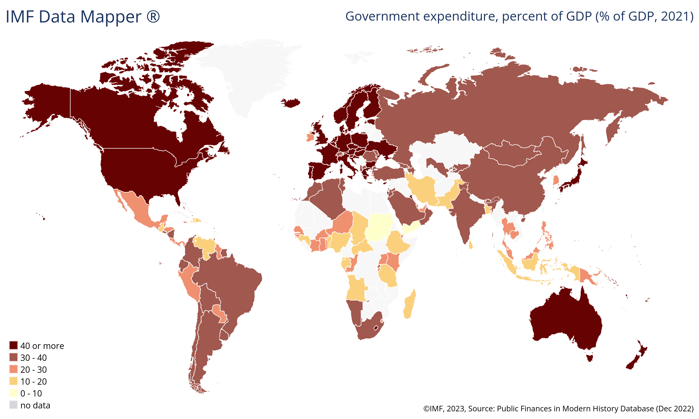

The relationship between government spending and Gross Domestic Product (GDP) has garnered significant attention from economists, investors, and policymakers in recent years. This interest stems from the need to understand how government expenditures influence economic performance and fiscal stability. The ratio of government spending to GDP is a fundamental metric that offers valuable insights into a nation's fiscal health and economic policy direction.

At its core, the government spending to GDP ratio is a measure of how much a country's economic output is accounted for by governmental activities. This ratio assists in assessing the overall size and influence of government within the economy, providing a lens through which to evaluate policy effectiveness and fiscal management.



The dynamics of government spending in relation to GDP can have profound implications for economic performance. Higher spending may suggest an active government role in economic affairs, potentially stimulating growth during downturns by way of infrastructure projects, social welfare programs, and other public sector initiatives. Conversely, lower ratios may be indicative of a reliance on private sector dynamics to drive growth, placing emphasis on market forces.

Understanding this ratio is not only pivotal for economic analysis but also for financial markets. Algorithmic trading systems, which operate by executing trades based on coded strategies, increasingly incorporate economic indicators like the government spending to GDP ratio into their models. By doing so, algorithmic traders attempt to capture trends and forecast changes in the economic environment, thereby making more informed trading decisions.

In summary, the government spending to GDP ratio serves as a crucial tool for evaluating a country's economic strategies and fiscal health. This article aims to explore the nuances of this relationship, shedding light on its influence within the economy and its application in modern financial markets, including the realm of algorithmic trading.

## Table of Contents

## Understanding Government Spending and GDP

Government spending represents the total expenditures undertaken by a government to deliver public services and implement policy objectives. These expenditures encompass a wide range of activities, including investments in infrastructure projects such as roads, bridges, and public transport systems. Defense spending, social welfare programs, education, healthcare, and public safety also form substantial portions of government budgets. The allocation and magnitude of these expenditures can reflect a government’s priorities and strategic goals.

Gross Domestic Product (GDP) is a critical economic indicator that quantifies the monetary value of all finished goods and services produced within a country’s borders during a specific time period, typically annually or quarterly. It serves as a comprehensive measure of a nation’s overall economic activity and health. GDP can be calculated through three approaches: production (or output), income, and expenditure methods, each offering a slightly different perspective but converging towards the same figure for accuracy and validation purposes.

The government spending to GDP ratio is a significant metric utilized by economists and policymakers to assess the extent of government intervention in an economy. This ratio is calculated by dividing the total government spending by the GDP:

$$
\text{Government Spending to GDP Ratio} = \left(\frac{\text{Total Government Spending}}{\text{GDP}}\right) \times 100
$$

This ratio expresses the government's expenditure as a percentage of the national economic output, providing insights into how much of that output is effectively controlled or influenced by government activities. A higher ratio might suggest a greater degree of government involvement which could be due to expansive fiscal policies, extensive welfare programs, or significant infrastructure investments. Conversely, a lower ratio may indicate lesser government intervention, with a relatively larger role played by private enterprises in driving economic activities.

Understanding the factors affecting this ratio is essential for evaluating fiscal health and setting economic policy. Policymakers often debate the optimal level of government spending necessary to stimulate growth, enhance public welfare, or maintain economic stability. An appropriate balance often depends on economic context, societal needs, and political objectives.

## The Significance of Government Spending to GDP Ratio

The government spending to GDP ratio serves as a key indicator for evaluating a nation's fiscal management and economic priorities. This metric allows for a comparative analysis of how different economies allocate resources between the public and private sectors. A higher spending-to-GDP ratio often indicates a greater degree of government intervention, reflecting substantial investments in areas such as infrastructure, healthcare, and education. This may suggest a commitment to addressing social welfare and reducing economic disparities. However, a high ratio can also signal excessive government spending, which might lead to inefficiencies and reduced economic productivity.

Conversely, a lower government spending to GDP ratio typically implies a more private sector-driven economy, with reduced governmental involvement in economic affairs. Such a scenario can foster an environment that encourages private investment and entrepreneurship. Nevertheless, minimal government expenditure might lead to underfunding of essential services and infrastructure, potentially hampering long-term growth and social development.

It is critical to assess the efficiency of government spending rather than relying solely on the ratio itself. Efficient government spending can stimulate economic activity and promote sustainable growth, regardless of the absolute value of the ratio. For example, investments in infrastructure projects that enhance productivity may have a more favorable impact than higher spending on less productive activities. Evaluating the impact involves analyzing outcomes such as economic growth, employment rates, and social welfare improvements.

In summary, while the government spending to GDP ratio offers valuable insights into a country's economic priorities and the extent of public sector involvement, it is essential to consider the broader context and effectiveness of such expenditures to obtain a holistic understanding of fiscal health and economic policy implications.

## Global Perspectives: A Look at Government Spending Ratios

Countries around the world display significant variation in their government spending to GDP ratios, primarily influenced by their unique economic structures and policy decisions. This ratio, representing the proportion of national economic output accounted for by government activities, serves as a critical indicator of how nations allocate resources.

In certain countries, high government spending to GDP ratios are observed. For instance, Kiribati has a notably high ratio, largely due to its reliance on government expenditure to support its small, open economy with limited private sector activity. The economy of Kiribati is significantly influenced by external factors, and the government plays a vital role in providing essential services and infrastructure development [1]. Similarly, Ukraine's high ratio can be attributed to its geopolitical challenges and the necessity for substantial government investment in areas such as defense and social welfare [2]. Both countries exemplify scenarios where government intervention is crucial in maintaining economic stability and addressing specific national issues.

Conversely, countries like Haiti and Venezuela present lower government spending to GDP ratios. In Haiti, this may result from limited fiscal capacity and significant economic challenges, including infrastructure deficits and dependency on foreign aid [3]. The public sector's constrained ability to invest in development projects results in a lower ratio. Venezuela, despite having vast natural resources, suffers from an economic crisis characterized by hyperinflation and reduced government spending capability, thus translating into a lower ratio [4]. In both instances, the ratios reflect underlying economic difficulties that restrict extensive government expenditure.

These examples illustrate how differing economic circumstances and policy priorities influence government spending relative to GDP. Identifying these factors provides valuable insights into the economic strategies countries employ and the challenges they face in shaping fiscal policy.

### References:
1. International Monetary Fund (IMF). (2022). Kiribati: 2022 Article IV Consultation-Press Release; Staff Report; and Statement by the Executive Director for Kiribati.
2. Reuters. (2023). Ukraine economy to shrink another 5% after last year's crash, says IMF.
3. World Bank. (2022). Haiti Overview.
4. International Monetary Fund (IMF). (2022). World Economic Outlook Database, October 2022 Edition.

## Algorithmic Trading and Economic Indicators

Algorithmic trading employs computer programs to execute trades automatically, based on criteria established in advance. These predefined criteria often encompass a range of economic indicators to optimize trading performance. One such indicator is the government spending to GDP ratio, which provides insights into the economic climate by showing the extent of government involvement in a nation's economy. By incorporating this ratio, algorithmic systems can adjust trading parameters to align with fiscal policy shifts and government expenditure trends.

The integration of economic indicators like the government spending to GDP ratio allows algorithmic traders to make well-informed decisions. For instance, if a country exhibits a rising government spending to GDP ratio, it might indicate increased government intervention, possibly leading to inflationary pressures or shifts in interest rates. Trading algorithms can be designed to consider such changes, allowing traders to adjust their strategies in response to anticipated economic conditions.

Here is a conceptual example in Python to illustrate how economic indicators might be integrated into an [algorithmic trading](/wiki/algorithmic-trading) strategy:

```python
def trading_strategy(government_spending_gdp_ratio, other_indicators):
    threshold_ratio = 0.3  # Hypothetical threshold
    position = "neutral"

    if government_spending_gdp_ratio > threshold_ratio:
        # Potentially increased government intervention
        position = "sell"
    else:
        # More private sector-driven economy
        position = "buy"

    # Incorporate other economic indicators
    for indicator in other_indicators:
        if indicator < 0:
            position = "sell"
        elif indicator > 0:
            position = "buy"

    return position

# Example usage
ratio = 0.35
other_indicators = [0.1, -0.2, 0.05]  # Hypothetical economic indicators
trade_decision = trading_strategy(ratio, other_indicators)
print(f"Trade decision: {trade_decision}")
```

In this illustrative code, the function `trading_strategy` takes in the government spending to GDP ratio alongside other indicators to determine whether to adopt a buy or sell position. The algorithm adjusts the position based on predefined thresholds and additional economic signals, demonstrating the flexibility and responsiveness of algorithmic trading systems.

The incorporation of such economic data into trading algorithms transforms these systems into potent tools for navigating the financial markets. By continuously monitoring and responding to changes in economic indicators, algorithmic trading ensures enhanced adaptability and precision in investment decision-making.

## Conclusion

The government spending to GDP ratio serves as a vital indicator for assessing economic policies and a nation's fiscal health. By comparing the total government expenditures to the Gross Domestic Product, this ratio highlights the degree of government involvement in economic activities. Although the ratio provides essential insights, it should be analyzed in conjunction with other financial indicators, such as inflation rates, unemployment levels, and current account balances, to obtain a more comprehensive understanding of a country's economic status. A solitary focus on the government spending to GDP ratio might not fully capture the nuances of economic well-being or the efficiency of resource allocation.

Moreover, the intersection of this metric with algorithmic trading showcases its significance in financial markets. Algorithmic trading utilizes economic data, including the government spending to GDP ratio, to automate trading strategies based on predefined criteria. Consequently, incorporating this ratio into trading algorithms allows for enhanced decision-making processes, enabling traders to better assess the economic environment and adjust strategies in response to fiscal policy changes. As such, algorithmic trading becomes a formidable tool for navigating the complexities of financial markets, offering a systematic approach to investing that integrates comprehensive economic analyses with real-time trading execution.

## References & Further Reading

[1]: Reinhart, C. M., & Rogoff, K. S. (2010). ["Growth in a Time of Debt."](https://www.nber.org/papers/w15639) American Economic Review, 100(2), 573-578.

[2]: ["Fiscal Policy and Economic Growth in Europe and Central Asia: An Overview."](https://openknowledge.worldbank.org/handle/10986/6883?show=full) World Bank Policy Research Working Paper No. 7107.

[3]: Frankel, J. A., & Romer, D. (1999). ["Does Trade Cause Growth?"](https://www.aeaweb.org/articles?id=10.1257/aer.89.3.379) American Economic Review, 89(3), 379-399.

[4]: Agnello, L., & Sousa, R. M. (2014). ["The Determinants of Public Deficit Volatility."](https://papers.ssrn.com/sol3/papers.cfm?abstract_id=1367529) Applied Economics Letters, 21(31), 2195-2199.

[5]: IMF (2022). ["World Economic Outlook Database, October 2022 Edition."](https://www.imf.org/en/Publications/WEO/Issues/2022/10/11/world-economic-outlook-october-2022) International Monetary Fund.