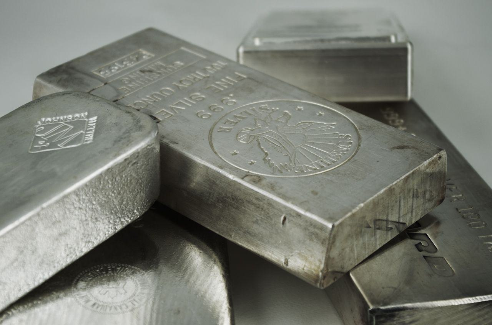

Silver remains a pivotal element in both industrial and investment domains, commanding attention due to its unique properties and diverse applications. As a metal, silver boasts exceptional reflectivity, high electrical and thermal conductivity, and antibacterial qualities, making it indispensable in various industries, including electronics, photovoltaics, and medicine. Its widespread utility underscores the strategic importance of silver production across the globe.

The dynamic landscape of silver production is shaped by the leading silver-producing nations, with Mexico, China, and Peru at the forefront. These countries collectively contribute a significant portion of the world's silver supply, driven by rich mineral deposits and established mining infrastructures. Mexico, in particular, consistently ranks as the top global producer, owing to its prolific mines and favorable geological conditions.



In addition to its industrial importance, silver is also a sought-after investment commodity. Investors are increasingly incorporating algorithmic trading techniques in their silver investment strategies to navigate the complexities of the market efficiently. Algorithmic trading utilizes advanced algorithms and computational tools to execute trades at speeds and frequencies impossible for human traders, often leading to optimized investment outcomes. This trend reflects a broader shift towards technology-driven financial strategies, enabling more precise and informed decision-making.

Silver's role as both an industrial staple and a monetary asset highlights its value within the global economy. As industries continue to innovate and financial markets evolve, the demand and production of silver are subject to change, influenced by technological advancements and economic dynamics. Understanding these factors is crucial for stakeholders aiming to capitalize on silver's multifaceted potential.

## Table of Contents

## Top Silver Producing Countries

Mexico, China, and Peru stand as the world's leading silver-producing countries, significantly contributing to the global silver supply. Each country exhibits unique characteristics based on their mining capacities, operational mines, and production strategies.

### Mexico

Mexico is the largest producer of silver globally, consistently maintaining its position due to abundant natural resources and a well-established mining industry. In recent years, Mexico produced approximately 6,300 metric tons of silver annually. A prominent feature of Mexico’s silver production is its extensive array of mining companies and mines.

The most notable companies include Fresnillo plc, the world’s largest primary silver mining company, and Industrias Peñoles, both of which are significant contributors. Fresnillo’s flagship mine, the Fresnillo mine, has proven to be one of the richest silver deposits in the world. Other significant mines include the Saucito and La Ciénega mines, known for both their silver and gold outputs.

### China

China is the third-largest producer of silver, contributing around 3,700 metric tons annually. Despite being traditionally known for its coal and rare earth elements, China's silver production has steadily increased due to its broad industrial base and ongoing exploration and development efforts. 

One of the key players in China’s silver production is the China Minmetals Corporation, which operates several important mines. The Dulong mine is acknowledged for its silver as well as lead-zinc production, adding substantial [volume](/wiki/volume-trading-strategy) to China's silver output. The country's focus on technological advancement and efficiency has helped streamline mining processes, enhancing overall production capabilities.

### Peru

Peru holds a prominent position as the second-largest silver producer, annually generating approximately 3,800 metric tons. The country has leveraged its abundant mineral reserves and mining-friendly regulations to foster silver production. 

Major mining companies such as Compañía de Minas Buenaventura and Volcan Compañía Minera dominate the landscape. Cerro de Pasco and Colquijirca are among the country’s significant mining sites, making considerable contributions to silver as well as base metal production. Peru’s mining industry is characterized by its focus on maintaining sustainable and environmentally friendly practices, responding to global environmental interests and concerns.

### Overview

The cumulative output from these countries forms the backbone of global silver supply. Their industries are built on robust mining sectors supported by technological advancements and strategic investments. Each country's production is not only vital for the silver market but also pivotal in driving their respective economies, providing employment and generating significant revenue streams. 

Technological investments, supportive policies, and exploration will continue to play critical roles in the growth of silver production in these leading countries.

## Factors Driving Silver Production

Silver production is influenced by a multitude of factors that vary significantly across different countries. The interplay of technological advancement, political factors, and mining investments constitutes the primary drivers affecting the scale and efficiency of silver production worldwide.

Technological advancements have a profound impact on silver mining operations. The implementation of modern extraction techniques and equipment can enhance the efficiency of extracting silver from ores, reduce costs, and increase output. For example, the use of automated machinery and drones in mining operations helps in accurate mapping and exploration, optimizing the extraction process, and ensuring worker safety. Innovative technologies in mineral processing, like the development of bioleaching methods, also contribute to higher recovery rates of silver, particularly from low-grade ores.

Political factors play a crucial role in shaping the silver mining landscape. Government policies related to mining rights, taxation, and export regulations can directly affect the economic viability of mining operations. Stable political environments foster foreign investment and long-term commitments from multinational mining companies. Conversely, political instability and regulatory uncertainties can deter investment and hinder production growth. For instance, countries with protective mining policies might limit foreign direct investment, whereas nations with favorable policies might encourage new mining ventures and technological transfers.

Investments in mining infrastructure are critical for expanding silver production capacities. The development of transportation and energy infrastructure is essential to support large-scale mining operations. Investments also encompass research and development in mining technologies, which can lead to more sustainable practices and efficient production methods. Financial investments by private and state-owned enterprises are pivotal in developing new mining sites and enhancing existing ones.

Environmental regulations and sustainability practices are becoming increasingly important in silver mining operations globally. Stricter environmental laws mandate mining companies to adopt sustainable practices, reducing environmental impacts such as habitat destruction, water pollution, and tailings management. Compliance with these regulations often requires significant investment in environmentally friendly technologies and practices, such as waste reduction systems and water recycling processes. Additionally, the adoption of corporate social responsibility initiatives has prompted mining companies to engage more actively with local communities and stakeholders, ensuring that mining operations contribute positively to local development.

As countries balance the demand for silver with environmental sustainability, mining companies are exploring innovative solutions to achieve eco-friendly operations. For example, the integration of renewable energy sources into mining operations helps reduce carbon footprints. Furthermore, reclamation projects aim to restore mined land, aiding in biodiversity conservation and reducing the ecological impact of mining activities.

The dynamic nature of these factors—technological, political, economic, and environmental—ultimately shapes the global silver production landscape. Understanding these elements is essential for stakeholders, including policymakers and investors, to navigate the complexities of the silver market and make informed decisions.

## Silver in the Global Economy

Silver is a significant commodity in the global economy, offering unparalleled benefits across various sectors due to its unique properties. Its conductivity, ductility, and resistance to corrosion make it indispensable in industries ranging from electronics to medicine. In the technology sector, silver's high electrical conductivity makes it a critical component in electronic devices, batteries, and solar panels. The photovoltaic properties of silver are particularly vital as the world shifts towards renewable energy sources. For instance, the addition of silver in the production of photovoltaic cells substantially enhances their efficiency, contributing to the growing demand for solar energy solutions.

In automotive industries, silver is utilized in the production of electric vehicles, reflecting its increasing importance in modern transportation. Furthermore, its antimicrobial properties make it valuable in the medical field for instruments and coatings. These diverse applications underline silver's integral role in promoting technological advancements and efficiency improvements across industries.

Apart from its industrial applications, silver has historically been a monetary asset, often regarded as a safe haven in times of economic instability. Its role as a form of currency dates back thousands of years, and it remains a key component in the creation of coins and bullion, appealing to investors seeking to hedge against inflation and currency devaluation. Silver's dual role as both an industrial and monetary asset ensures its continued relevance in global markets, balancing its price between supply-demand dynamics and speculative financial factors.

The demand for silver is subject to various economic and geopolitical trends. In recent years, there has been robust growth in demand driven by the renewable energy sector and electronics, juxtaposed against fluctuating mining outputs. This divergence highlights the complexities of predicting future shifts in production rankings. For instance, as countries ramp up efforts in green energy transitions, there is potential for increased silver consumption, subsequently influencing its global production landscape.

Forecasting future shifts in silver production involves assessing geopolitical stability, technological advancements in mining, and environmental policies that affect mining operations. While countries like Mexico, China, and Peru lead in current silver production, changes in these variables could alter this hierarchy. Sustainable mining practices and investment in technology can enhance silver extraction efficiency, affecting production outputs.

In summary, silver's utility across various economic sectors ensures it remains a cornerstone of the global economy, meeting diverse industrial needs and serving as a strategic monetary reserve. The interplay of technological advancements, energy demands, and sustainable practices will shape silver's future demand, with significant implications for its global production and market dynamics.

## Algorithmic Trading in Silver Markets

Algorithmic trading has significantly transformed investment strategies in silver markets, utilizing advanced technologies to enhance trading efficiency and optimize investment portfolios. By automating decision-making processes and executing trades at high speed, [algorithmic trading](/wiki/algorithmic-trading) can identify market trends and strategies that might be impossible for human traders to perceive.

One of the primary benefits of algorithmic trading is its ability to process large volumes of data with speed and accuracy, significantly reducing the time required to analyze market trends and execute trades. This capability is particularly advantageous in the volatile silver markets, where price fluctuations can occur rapidly. Algorithms can be programmed to detect patterns and price discrepancies across various exchanges, exploiting [arbitrage](/wiki/arbitrage) opportunities for profit.

Moreover, algorithmic trading helps in mitigating the emotional biases that often affect human traders, such as fear and greed. By basing trading decisions on rigorous quantitative models, it ensures a more disciplined approach to investment. For example, trading algorithms can utilize [statistical arbitrage](/wiki/statistical-arbitrage), [machine learning](/wiki/machine-learning), and other sophisticated models to predict price movements. Python, a popular programming language in finance, provides numerous libraries such as Pandas, NumPy, and scikit-learn that facilitate the implementation of these algorithms.

Below is a basic example of a moving average crossover strategy implemented in Python, a common algorithmic trading strategy used to exploit trends:

```python
import pandas as pd

# Assume 'data' is a DataFrame containing historical silver price data with a 'close' column
def moving_average_crossover(data, short_window=40, long_window=100):
    data['short_mavg'] = data['close'].rolling(window=short_window, min_periods=1).mean()
    data['long_mavg'] = data['close'].rolling(window=long_window, min_periods=1).mean()

    data['signal'] = 0
    data['signal'][short_window:] = np.where(data['short_mavg'][short_window:] 
                                             > data['long_mavg'][short_window:], 1, 0)
    data['positions'] = data['signal'].diff()

    return data

# Usage:
# silver_data = pd.read_csv('path_to_silver_data.csv')
# strategy_data = moving_average_crossover(silver_data)
```

In commodity markets, algorithmic trading can facilitate extensive strategies beyond basic trend-following techniques, such as market-making, where algorithms provide [liquidity](/wiki/liquidity-risk-premium) to the market by placing buy and sell orders. They are also crucial in high-frequency trading, where thousands of orders might be executed in fractions of a second, reacting almost instantly to market changes.

Ultimately, algorithmic trading in silver markets enables traders to devise strategies that align with their risk tolerance and investment goals, allowing for diversified and potentially higher returns. As technology and data analytics continue to evolve, algorithmic trading is likely to play an increasingly significant role in shaping the future of silver market investments.

## Conclusion

Silver production remains a critical component of the global economy, underpinned by its diverse applications across industrial sectors and as a robust investment vehicle. The dominance of countries such as Mexico, China, and Peru highlights the concentration of silver mining activities in specific geographies, influenced by local factors like technology advancements, political climate, and regulatory frameworks. With advancing technology and heightened environmental concerns, the silver mining landscape is continually evolving, demanding sustainable practices and innovative mining techniques.

Algorithmic trading has emerged as a transformative force in silver markets, offering investors the ability to navigate the complexities of commodities trading with increased precision. By leveraging sophisticated algorithms, traders can optimize their portfolios, mitigate risks, and capitalize on volatile market conditions. This integration of technology into silver trading underscores a broader trend of digitalization within financial markets, presenting new opportunities and challenges for investors.

Looking ahead, the silver market is poised for potential shifts in production and demand dynamics. Factors such as technological innovations in solar energy, electronics, and healthcare are likely to spur increased demand for silver. Simultaneously, geopolitical developments and environmental regulations will play pivotal roles in shaping production strategies globally.

For those interested in further exploring silver investment opportunities, resources such as industry reports, market analysis tools, and financial advisories are invaluable. Platforms offering real-time market data and insights into algorithmic trading can equip investors with the knowledge needed to make informed decisions. As the market continues to evolve, staying informed and adaptable will be crucial for navigating the future landscape of silver investment.

## References & Further Reading

[1]: Verboven, H., et al. (2020). ["Technological Advancements in Silver Mining."](https://www.sciencedirect.com/science/article/abs/pii/S2214799320300217) Journal of Mining Science and Technology, 32(4), 227-237.

[2]: Lopez de Prado, M. (2018). ["Advances in Financial Machine Learning."](https://www.amazon.com/Advances-Financial-Machine-Learning-Marcos/dp/1119482089) John Wiley & Sons.

[3]: Aronson, D. R. (2007). ["Evidence-Based Technical Analysis: Applying the Scientific Method and Statistical Inference to Trading Signals."](https://www.amazon.com/Evidence-Based-Technical-Analysis-Scientific-Statistical/dp/0470008741) John Wiley & Sons.

[4]: Jansen, S. (2020). ["Machine Learning for Algorithmic Trading."](https://github.com/stefan-jansen/machine-learning-for-trading) Packt Publishing.

[5]: Fresnillo plc. (n.d.). ["Fresnillo Mine Overview."](https://miningdataonline.com/property/1010/Fresnillo-Mine.aspx) Fresnillo PLC Official Website.

[6]: Chan, E. P. (2009). ["Quantitative Trading: How to Build Your Own Algorithmic Trading Business."](https://github.com/ftvision/quant_trading_echan_book) John Wiley & Sons.

[7]: Solar Energy Industries Association. (n.d.). ["Solar Technology Overview."](https://seia.org/) SEIA Official Website.