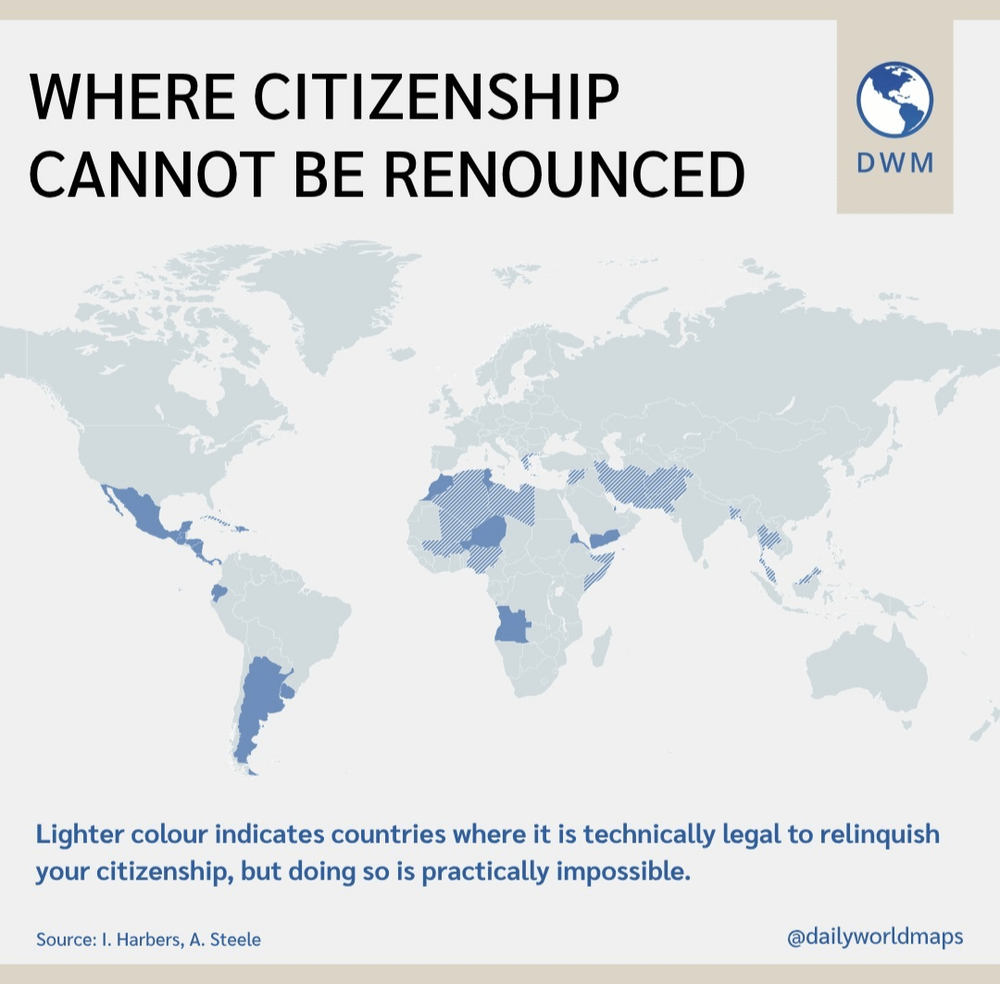

## Table of Contents

## What is citizenship and why is it important?

Citizenship is when a person is a member of a country. It means you have rights and responsibilities in that country. For example, you can vote, get a passport, and use public services like schools and hospitals. You also have to follow the country's laws and maybe even serve in the military or on a jury.

Citizenship is important because it gives you a sense of belonging and identity. It connects you to a community and a nation. This connection can make you feel proud and safe. Also, having citizenship in a country can give you many opportunities, like being able to work and live there legally, travel more easily, and participate in how the country is run by voting or running for office.

## What makes a country's citizenship process challenging?

A country's citizenship process can be challenging for many reasons. One big reason is the paperwork. You need to fill out a lot of forms and gather many documents, like your birth certificate, proof that you've been living in the country, and sometimes even letters from people who know you. If you don't have all the right papers, or if they are not in the right language or format, your application can be delayed or even rejected.

Another reason is the rules and requirements. Each country has its own set of rules about who can become a citizen. Some countries make you live there for a long time before you can apply, like five or ten years. You might also need to pass a test about the country's history and laws, or prove that you can speak the language well. These rules can be hard to meet, especially if you are trying to work and take care of your family at the same time.

Lastly, the cost can be a big challenge. Applying for citizenship can be expensive. You might need to pay fees for the application, for translations of your documents, and for any required tests. If you can't afford these costs, it can be very hard to get citizenship, even if you meet all the other requirements. All these factors together can make the process feel overwhelming and difficult.

## Which countries are known for having the most difficult citizenship processes?

Some countries are known for having very hard citizenship processes. One of these countries is Switzerland. In Switzerland, you need to live there for at least 10 years before you can apply for citizenship. You also need to speak one of the national languages well and pass a test about Swiss culture and history. The process can be different in each part of the country, which makes it even harder. Another country with a tough process is Japan. In Japan, you need to live there for 5 years, and you have to give up your other citizenship. The application process can take a long time and is very detailed.

Another country with a challenging citizenship process is Austria. In Austria, you need to live there for 10 years, and you need to prove that you have enough money to support yourself. You also need to pass a test about Austrian culture and the German language. The process can be slow and complicated. Qatar is also known for having a difficult citizenship process. In Qatar, it is very rare for someone who is not born there to become a citizen. The rules are strict, and you need to have lived there for 25 years and be able to speak Arabic well. These countries show how hard it can be to become a citizen in some places.

## What are the general requirements for citizenship in these countries?

In Switzerland, becoming a citizen is hard. You need to live there for at least 10 years before you can apply. You also need to speak one of the national languages well and pass a test about Swiss culture and history. The process can be different in each part of the country, which makes it even harder. Japan also has a tough process. You need to live there for 5 years, and you have to give up your other citizenship. The application process can take a long time and is very detailed.

Austria's citizenship process is challenging too. You need to live there for 10 years, and you need to prove that you have enough money to support yourself. You also need to pass a test about Austrian culture and the German language. The process can be slow and complicated. In Qatar, it is very rare for someone who is not born there to become a citizen. The rules are strict, and you need to have lived there for 25 years and be able to speak Arabic well. These countries show how hard it can be to become a citizen in some places.

## How long does the citizenship application process typically take in these countries?

In Switzerland, the citizenship application process can take a long time. It usually takes several months to a year after you apply. But it can be even longer because the rules can be different in each part of the country. You need to live there for at least 10 years before you can apply, so the whole process from start to finish can take more than 10 years.

In Japan, the process also takes a long time. It can take about a year or more after you apply. You need to live there for 5 years before you can apply, so the total time from start to finish can be around 6 years. You also have to give up your other citizenship, which can add more time and steps to the process.

In Austria, the citizenship application process can take about a year or more after you apply. You need to live there for 10 years before you can apply, so the whole process from start to finish can take more than 10 years. The process can be slow and complicated, so you need to be patient. In Qatar, the process can take several years after you apply. You need to live there for 25 years before you can apply, so the total time from start to finish can be very long, often more than 25 years.

## What are the language proficiency requirements for citizenship in these countries?

In Switzerland, you need to speak one of the national languages well to become a citizen. The national languages are German, French, Italian, and Romansh. You need to show that you can speak, read, and write in one of these languages at a good level. This is important because Switzerland has different language areas, and you need to be able to communicate well in the area where you live.

In Japan, you do not need to prove a specific level of Japanese language proficiency to become a citizen. But it can help if you can speak and understand Japanese. It makes the process easier and shows that you are trying to fit into Japanese society. In Austria, you need to speak German well to become a citizen. You need to pass a test that shows you can speak, read, and write in German at a good level. This is important because it helps you to live and work in Austria more easily.

In Qatar, you need to speak Arabic well to become a citizen. You need to show that you can speak, read, and write in Arabic at a good level. This is important because Arabic is the main language in Qatar, and you need to be able to communicate well to be part of the society.

## Are there any residency requirements for citizenship in these countries?

In Switzerland, you need to live there for at least 10 years before you can apply for citizenship. This means you must have a residence permit and live in Switzerland for a long time. The rules can be different in each part of the country, so you need to check the specific requirements for the area where you live.

In Japan, you need to live there for 5 years before you can apply for citizenship. You must have a residence permit during this time. Japan has strict rules, and you also need to give up your other citizenship when you apply.

In Austria, you need to live there for 10 years before you can apply for citizenship. You must have a residence permit and show that you have been living in Austria for this long time. The process can be slow, so you need to be patient. In Qatar, the residency requirement is very long. You need to live there for 25 years before you can apply for citizenship. This makes it very hard for people who were not born in Qatar to become citizens.

## What are the financial costs associated with applying for citizenship in these countries?

Applying for citizenship in Switzerland can cost a lot of money. You need to pay for the application fee, which can be around 100 to 200 Swiss Francs. But the real cost can be higher because you might need to pay for translations of your documents, language tests, and other fees that different parts of the country might ask for. It's hard to say exactly how much it will cost because it can be different in each area.

In Japan, the cost of applying for citizenship is also high. The application fee is about 14,000 to 16,000 Japanese Yen. But you might need to pay more for things like translations of your documents and giving up your other citizenship. The total cost can add up, so it's good to be ready for these extra expenses. In Austria, the cost can be around 1,000 to 1,500 Euros for the application fee. You might also need to pay for language tests and translations. The total cost can be a lot, so it's important to save money for these fees. In Qatar, the cost of applying for citizenship is not clear because it is so hard to get. But you might need to pay for things like language tests and other fees, which can make the process even more expensive.

## Can dual citizenship be obtained in countries with challenging citizenship processes?

In Switzerland, you cannot have dual citizenship if you are an adult applying for Swiss citizenship. You have to give up your other citizenship to become Swiss. This rule makes the process harder for some people because they might not want to give up their other citizenship. But there are some exceptions. For example, if you were born in Switzerland to foreign parents, you might be able to keep both citizenships.

In Japan, you also cannot have dual citizenship if you are an adult applying for Japanese citizenship. You have to give up your other citizenship to become Japanese. This rule can make the process harder because some people might want to keep their other citizenship. In Austria, the rules are different. You can have dual citizenship if you were born in Austria or if you are from another EU country. But if you are an adult from a non-EU country applying for Austrian citizenship, you usually have to give up your other citizenship. In Qatar, dual citizenship is not allowed. You have to give up your other citizenship to become a Qatari citizen. This makes the process even harder because very few people can become citizens in the first place.

## What are the common reasons for rejection of citizenship applications in these countries?

In Switzerland, Japan, Austria, and Qatar, citizenship applications can be rejected for many reasons. One common reason is not meeting the residency requirement. For example, if you haven't lived in Switzerland for at least 10 years, Japan for 5 years, Austria for 10 years, or Qatar for 25 years, your application will be rejected. Another reason is not passing the language test. You need to speak German well in Austria, one of the national languages in Switzerland, Arabic in Qatar, and while not required, speaking Japanese can help in Japan.

Another common reason for rejection is not having the right documents. You need to show proof of your identity, where you've lived, and sometimes even letters from people who know you. If any of these documents are missing or not in the right format, your application can be rejected. Also, if you have a criminal record, this can make it hard to get citizenship. Countries want to make sure that new citizens will follow their laws and be good members of society.

Lastly, financial issues can lead to rejection. If you can't pay the application fees or other costs like translations and language tests, your application might not be accepted. In some countries, like Austria, you also need to prove that you can support yourself financially. If you can't show that you have enough money, your application can be rejected. These reasons show why the citizenship process can be so hard in these countries.

## How do the citizenship processes in these countries compare to global standards?

The citizenship processes in Switzerland, Japan, Austria, and Qatar are often seen as harder than many other countries. Most countries around the world have rules for citizenship, but these four countries have very strict rules. For example, Switzerland and Austria need you to live there for 10 years before you can apply, which is longer than the 3 to 5 years that many other countries ask for. Japan needs you to live there for 5 years, but you also have to give up your other citizenship, which not all countries make you do. Qatar's rule of needing to live there for 25 years is much longer than what most countries ask for.

These countries also have other rules that can make the process harder. Many countries have language tests, but Switzerland, Austria, and Qatar have high standards for these tests. Switzerland needs you to speak one of its national languages well, and Austria needs you to speak German well. Qatar needs you to speak Arabic well, which can be hard for people who don't know the language. Japan doesn't have a strict language test, but speaking Japanese can help your application. Also, the costs of applying for citizenship in these countries can be higher than in many other places. This makes it harder for people to become citizens in these countries compared to global standards.

## What strategies can applicants use to improve their chances of successfully obtaining citizenship in these countries?

To improve their chances of getting citizenship in Switzerland, Japan, Austria, or Qatar, applicants should start by making sure they meet all the residency rules. For Switzerland and Austria, this means living there for at least 10 years. For Japan, it's 5 years, and for Qatar, it's 25 years. Keeping good records of where you live and how long you've been there can help. It's also important to learn the language well. In Switzerland, you need to speak one of the national languages like German, French, Italian, or Romansh. In Austria, you need to speak German well. In Qatar, you need to speak Arabic well. Even though Japan doesn't have a strict language test, speaking Japanese can help your application. Practicing the language a lot and maybe even taking classes can make a big difference.

Another good strategy is to make sure all your documents are in order. This means having your birth certificate, proof of where you've lived, and sometimes even letters from people who know you. If these documents need to be translated, make sure they are done right. It's also important to have enough money to pay for the application fees and other costs like language tests. In Austria, you need to show that you can support yourself financially, so saving money is a good idea. Lastly, staying out of trouble with the law is very important. Having a clean record can help your application a lot. By focusing on these things, applicants can improve their chances of getting citizenship in these countries.

## References & Further Reading

[1]: ["Austrian Citizenship Act"](https://www.bmeia.gv.at/en/austrian-embassy-london/service-for-citizens/citizenship-for-persecuted-persons-and-their-direct-descendants/) - Legal Information System of the Republic of Austria.

[2]: ["German Nationality Act"](https://www.auswaertiges-amt.de/en/-/2664574) - German Federal Ministry of Justice and Consumer Protection.

[3]: ["Guidelines for Naturalization" provided by the Ministry of Justice, Japan](https://www.moj.go.jp/EN/MINJI/minji78.html).

[4]: ["Swiss Citizenship Act"](https://www.sem.admin.ch/sem/en/home/integration-einbuergerung/schweizer-werden.html) - Swiss Confederation.

[5]: ["U.S. Citizenship and Immigration Services (USCIS)"] (https://www.uscis.gov/) - Official website of the Department of Homeland Security.

[6]: Lopez de Prado, M. (2018). ["Advances in Financial Machine Learning,"](https://www.amazon.com/Advances-Financial-Machine-Learning-Marcos/dp/1119482089) Wiley & Sons.

[7]: Jansen, S. (2020). ["Machine Learning for Algorithmic Trading,"](https://github.com/stefan-jansen/machine-learning-for-trading) Packt Publishing.

[8]: Chan, E. P. (2009). ["Quantitative Trading: How to Build Your Own Algorithmic Trading Business,"](https://github.com/ftvision/quant_trading_echan_book) Wiley & Sons.