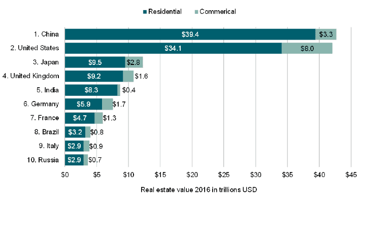

## Table of Contents

## What are the common challenges foreign buyers face in real estate markets?

Foreign buyers often face several challenges when entering real estate markets in other countries. One major challenge is understanding the local laws and regulations. Each country has its own set of rules about buying property, and these can be hard to understand, especially if the buyer doesn't speak the local language. Additionally, foreign buyers may need to deal with different tax laws, which can be confusing and might lead to unexpected costs.

Another common challenge is financing the purchase. Banks in the country where the property is located might not offer loans to foreigners, or they might have strict rules that make it hard to get a loan. This means foreign buyers often need to have all the money ready to buy the property, which can be a big challenge. Also, currency exchange rates can change, making it more expensive to buy property if the buyer's home currency loses value against the currency of the country where the property is located.

Lastly, cultural differences can also pose challenges. Real estate practices and negotiations can be very different from one country to another. What is considered normal in one place might be seen as strange or rude in another. This can make it hard for foreign buyers to feel comfortable and confident during the buying process. Building trust with local agents and understanding local customs takes time and effort.

## Which countries are considered to have challenging real estate markets for foreign buyers?

Some countries are known to be tough for foreign buyers in the real estate market. For example, in China, the government has strict rules about who can buy property. Foreigners need to meet certain conditions and go through a lot of paperwork. Also, the prices can be very high in big cities like Beijing and Shanghai. In Canada, especially in cities like Vancouver and Toronto, foreign buyers have to pay extra taxes. These taxes can make buying a home much more expensive and can change suddenly, making it hard to plan.

Another challenging market is in Australia. Here, foreign buyers need to get approval from the Foreign Investment Review Board before they can buy property. This process can take time and there's no guarantee of approval. Also, like in Canada, there are extra taxes for foreigners in some areas. In the United States, while it's generally easier to buy property, the high prices in popular cities like New York and San Francisco can be a big hurdle. Plus, the rules can be different from state to state, adding to the complexity for foreign buyers.

## What are the legal restrictions for foreign buyers in these countries?

In China, foreign buyers face strict legal restrictions. They must meet certain conditions before they can buy property, like having lived in China for at least a year. They also need to go through a lot of paperwork and get approval from the government. This can make the process long and complicated. In big cities like Beijing and Shanghai, there are also limits on the number of properties foreigners can buy, making it even harder.

In Canada, foreign buyers have to deal with extra taxes in some places. For example, in cities like Vancouver and Toronto, there are special taxes just for foreigners buying homes. These taxes can make buying a home much more expensive. The rules can also change suddenly, which can be confusing and make it hard to plan. In Australia, foreign buyers need to get approval from the Foreign Investment Review Board before they can buy property. This approval process can take time and there's no guarantee they will say yes. Also, in some areas, there are extra taxes for foreigners, adding to the cost and complexity.

In the United States, the rules for foreign buyers can be different from state to state. While it's generally easier to buy property than in some other countries, the high prices in popular cities like New York and San Francisco can be a big challenge. Foreign buyers also need to be aware of any local laws or restrictions that might apply to them. Overall, the legal restrictions in these countries can make buying property as a foreigner a complicated process.

## How do currency exchange rates affect foreign real estate investments in these markets?

Currency exchange rates can make a big difference for foreign buyers in real estate markets. If the buyer's home currency loses value compared to the currency of the country where the property is located, the property becomes more expensive. For example, if someone from Europe wants to buy a house in the United States and the euro gets weaker against the dollar, the house will cost more euros. This can make it harder for foreign buyers to afford the property they want, especially if they have to pay all at once because they can't get a loan in the new country.

The opposite can also happen. If the buyer's home currency gets stronger, the property becomes cheaper in their currency. This can be a good thing for foreign buyers because they can get more for their money. But, exchange rates can change quickly and without warning. This means foreign buyers need to keep an eye on the rates and be ready for changes. It can add a lot of uncertainty to their investment plans, especially in countries like China, Canada, Australia, and the United States where other challenges like legal restrictions and high prices already make buying property difficult.

## What are the tax implications for foreign buyers in challenging real estate markets?

Foreign buyers in challenging real estate markets often face extra taxes that can make buying a home more expensive. In Canada, for example, cities like Vancouver and Toronto have special taxes for foreigners. These taxes can add a lot to the cost of the property. In Australia, there might be extra taxes too, depending on where the property is. These taxes can change and make it hard for foreign buyers to plan their investments.

In the United States, the tax rules can be different from state to state. While there aren't always extra taxes just for foreigners, the high prices in popular cities like New York and San Francisco can be a big challenge. Foreign buyers need to understand the local tax laws because they can affect how much they have to pay. In China, the government might also add extra costs or fees for foreign buyers, making it more expensive to buy property there.

## How does political stability influence real estate investment decisions in these countries?

Political stability is very important for foreign buyers thinking about investing in real estate. If a country is politically stable, it means the rules and laws about buying property are less likely to change suddenly. This makes it easier for foreign buyers to plan their investments because they can be more sure about what will happen in the future. For example, in Canada and the United States, where the political situation is generally stable, foreign buyers can feel more confident about their investments. They know the rules are not going to change overnight, which makes it easier to decide to buy a home.

On the other hand, if a country has a lot of political changes or unrest, it can make buying property much riskier. In China, the government can change rules quickly, which can be scary for foreign buyers. They might worry that new laws or taxes could make their investment less valuable or more expensive. In Australia, even though it's usually stable, any political changes can affect the Foreign Investment Review Board's decisions, making it harder for foreigners to buy property. So, political stability is a big [factor](/wiki/factor-investing) that foreign buyers need to think about before they decide to invest in real estate in these countries.

## What role do local real estate agents play in navigating these challenging markets?

Local real estate [agents](/wiki/agents) are very important for foreign buyers in tough markets. They know the local rules and can help explain them in a way that's easy to understand. This is really helpful because each country has different laws about buying property. Agents can also help with the paperwork and make sure everything is done right. They know how to talk to the people who need to approve the purchase, like the government in China or the Foreign Investment Review Board in Australia. This can make the whole process a lot easier and less scary for foreign buyers.

Agents also help with finding the right property and negotiating the price. They know the local market well and can tell buyers which areas are good and which ones to avoid. This is important because foreign buyers might not know which neighborhoods are safe or which ones are likely to grow in value. Agents can also help with understanding local customs and how to negotiate in a way that works in that country. This can make a big difference in getting a good deal. Overall, having a good local real estate agent can make a big difference in successfully buying property in challenging markets.

## How can foreign buyers assess the true value of properties in these markets?

Foreign buyers can assess the true value of properties in challenging markets by working with local real estate agents who know the area well. These agents can provide information on recent sales of similar properties, which helps buyers understand what prices are like in the area. They can also point out which neighborhoods are likely to grow in value and which ones might not be a good investment. By comparing the property they're interested in with others that have sold recently, foreign buyers can get a better idea of whether the price is fair.

Another way to assess the true value is by doing research on the local market. Foreign buyers can look at online real estate websites and property listings to see what similar homes are selling for. They should also check out local economic reports and news to see if there are any big changes coming that could affect property values. For example, if a new factory is being built nearby, it might make the area more valuable. By combining this research with advice from a local agent, foreign buyers can make a smart decision about whether a property is worth the price.

## What financing options are available to foreign buyers in these challenging markets?

In challenging real estate markets, foreign buyers often find it hard to get financing. Banks in countries like China, Canada, Australia, and the United States might not give loans to foreigners, or they might have strict rules that make it hard to get a loan. This means foreign buyers usually need to have all the money ready to buy the property. They can't borrow money from the bank in the country where the property is. This can be a big problem because it means they need a lot of money upfront.

There are some other options for financing, but they can be complicated. Some foreign buyers might be able to get a loan from a bank in their home country, but these loans might have high interest rates or other tough conditions. Another option is to work with private lenders or investment companies that specialize in helping foreign buyers. These lenders might be more willing to give loans, but they could charge higher interest rates or fees. It's important for foreign buyers to understand all their options and talk to a local real estate agent or a financial advisor to find the best way to finance their purchase.

## How do cultural differences impact real estate transactions in these countries?

Cultural differences can make buying a home in another country more difficult for foreign buyers. In places like China, the way people do business can be very different from what foreign buyers are used to. For example, building trust with the seller or the agent might take a lot of time. Foreign buyers might need to go to many meetings and dinners to get to know everyone involved. This can feel strange or slow to someone from another country, but it's important to show respect and build a good relationship.

In Canada and Australia, the way people negotiate can also be different. In these countries, it's common to use a real estate agent to help with the whole process. But the way agents work and what they expect from buyers can be different from what foreign buyers are used to. For example, in some cultures, it's normal to offer a lower price than you're willing to pay and then negotiate up. But in these countries, that might not work the same way. Understanding these differences can help foreign buyers avoid misunderstandings and make the buying process smoother.

## What are the long-term investment prospects in these challenging real estate markets?

The long-term investment prospects in challenging real estate markets like China, Canada, Australia, and the United States can be good if foreign buyers do their homework. In China, big cities like Beijing and Shanghai might keep growing, making property values go up. But the government can change rules quickly, so it's important to keep an eye on what's happening. In Canada, cities like Vancouver and Toronto are popular places to live, so the demand for homes might stay high. But the extra taxes for foreigners can make it hard to make a profit. In Australia, the economy is usually strong, which can be good for property values. But getting approval to buy can be tough, and there might be extra taxes too.

In the United States, cities like New York and San Francisco are always in demand, which can make property values go up over time. But the prices are already high, so it might be hard to find a good deal. Also, the rules can be different in each state, so foreign buyers need to understand what's going on in the area they're interested in. Overall, these markets can be good for long-term investment if foreign buyers are ready for the challenges. They need to understand the local rules, keep an eye on the economy, and be ready for changes that might affect their investment.

## How can foreign buyers mitigate risks when investing in these challenging markets?

Foreign buyers can reduce risks in challenging real estate markets by doing a lot of research and working with local experts. They should learn about the local laws, taxes, and any rules that might change. Talking to a local real estate agent can help a lot because these agents know the area and can explain things clearly. They can also help with all the paperwork and make sure everything is done right. It's important for foreign buyers to understand the local market, so they should look at recent sales and talk to people who know the area well.

Another way to lower risks is by planning for changes in currency exchange rates and the economy. Foreign buyers need to keep an eye on the value of their home currency compared to the currency of the country where they want to buy property. If their home currency gets weaker, the property will cost more. They should also think about what might happen in the local economy and how that could affect property values. By being ready for these changes and having a good plan, foreign buyers can make smarter decisions and feel more confident about their investment.

## References & Further Reading

[1]: Rogoff, K. S., & Reinhart, C. M. (2008). ["The Aftermath of Financial Crises."](https://www.nber.org/papers/w14656) American Economic Review, 99(2), 466-472.

[2]: Geltner, D., Miller, N. G., Clayton, J., & Eichholtz, P. (2013). ["Commercial Real Estate Analysis and Investments."](https://www.researchgate.net/publication/245702364_Commercial_Real_Estate_Analysis_and_Investments) South-Western College Pub.

[3]: Knight Frank. (2022). ["Global Cities 2022: Future Drivers of Real Estate Investment Growth."](https://www.knightfrank.com/research/article/2021-12-27-global-real-estate-round-up-2021)

[4]: Narula, M. (2020). ["Algorithmic Real Estate Investing: How AI is Necessitating a Paradigm Shift."](https://journals.sagepub.com/doi/10.1177/23409444211020761?icid=int.sj-full-text.citing-articles.280) Journal of Public and International Affairs.

[5]: Florida, R. (2017). ["The New Urban Crisis: How Our Cities Are Increasing Inequality, Deepening Segregation, and Failing the Middle Class—and What We Can Do About It."](https://link.springer.com/article/10.1007/s10901-018-9632-3) Basic Books.