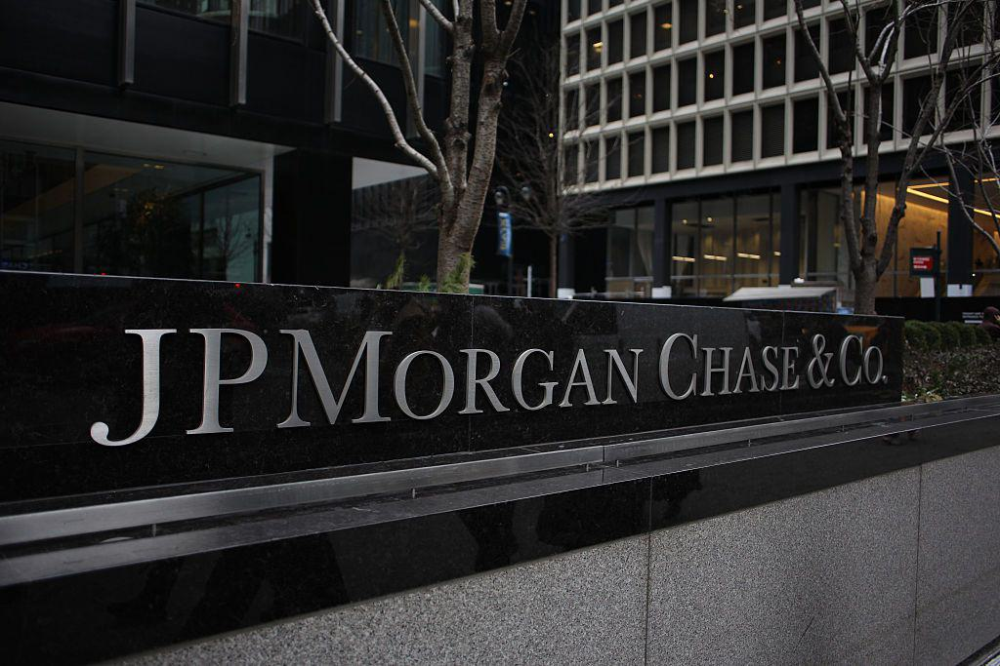

The global financial landscape has undergone substantial transformations, significantly impacting the banking sector and financial markets worldwide. Central to these changes is the emergence of algorithmic trading, a powerful force reshaping the execution of transactions across diverse markets. Algorithmic trading involves the use of computer algorithms to automate trading decisions, enabling faster and more efficient transaction processes. This development has provided a new dimension to financial markets, facilitating higher trading volumes and enhancing market liquidity.

The integration of automated systems in financial markets and global banking has led to the evolution of a sophisticated ecosystem where intricate transactions are managed with precision and speed. Algorithmic trading systems often leverage advanced technologies such as artificial intelligence and machine learning to analyze vast datasets, identify trading opportunities, and execute trades within milliseconds.



This article investigates the intersection of global banking, financial markets, and the rise of algorithmic trading, shedding light on how these elements interact and their mutual influence. By exploring these interactions, one can acquire a comprehensive understanding of the current and future dynamics that define the financial landscape, underscoring the increasing reliance on technology and innovation to drive growth and efficiency within the industry. Throughout this examination, key insights will be offered on the manner in which algorithmic trading not only influences market operations but also enhances the strategic decisions within global banking entities, ultimately reshaping the future of international finance.

## Table of Contents

## Understanding Financial Markets and Global Banking

Financial markets are integral components of the global economy, providing platforms where individuals and institutions can buy and sell financial instruments, which include stocks, bonds, and commodities. These markets enable the mobilization of savings for investment purposes, thus facilitating economic growth and development.

### Financial Markets Overview

#### Stocks
Stock markets are venues where shares of publicly listed companies are traded. They are instrumental in helping companies raise capital by issuing shares to the public through processes like initial public offerings (IPOs). Investors buy stocks to gain equity ownership in companies, allowing them to benefit from dividends and capital gains. Prominent stock exchanges include the New York Stock Exchange (NYSE), NASDAQ, and the London Stock Exchange (LSE).

#### Bonds
The bond market involves the buying and selling of debt securities, which are primarily government and corporate bonds. Bonds serve as a means for governments and corporations to borrow funds from investors, promising to pay back the principal amount with interest. This market is crucial for funding infrastructure projects, government deficits, and corporate expansions. The bond market is often seen as less volatile than the stock market, providing a more stable income stream for investors.

#### Commodities
Commodity markets deal with the trading of raw materials like gold, oil, natural gas, and agricultural products. These markets are vital for price discovery, which helps stabilize prices and manage price risks for producers and consumers. Commodities trading can occur in both spot markets, for immediate delivery, and futures markets, for delivery at a later date.

### The Role of Global Banking

Global banking systems are pivotal in the facilitation of international trade and financial stability. Banks act as intermediaries that help smooth transactions between various parties, ensuring [liquidity](/wiki/liquidity-risk-premium) and flexibility in financial markets. They provide safety through well-regulated frameworks and minimize risks through diversification and asset management.

By accepting deposits and extending loans, banks mobilize savings and channel them into productive investments, hence maintaining the economic balance. Moreover, they offer sophisticated financial instruments and services, such as derivatives and international money transfers, which are critical for cross-border trade and global financial operations.

### Influence of Major Banking Entities

The landscape of global banking is dominated by several large entities whose operations have far-reaching impacts on international finance. These institutions include JPMorgan Chase, Bank of America, Industrial and Commercial Bank of China (ICBC), and HSBC. Their influence is manifested in several dimensions:

1. **Capital Access and Allocation**: Large banks have substantial capital bases, enabling them to finance projects ranging from small business developments to large-scale international infrastructure projects.

2. **Financial Innovation**: These banks are at the forefront of financial innovation, providing advanced products that cater to the complex needs of global markets. Innovations include securitization, asset-backed securities, and sophisticated trading platforms.

3. **Stability and Confidence**: The sheer size and significance of these banks mean they play a crucial role in providing stability to financial markets. They act as anchors during economic turbulence, often backed by central banks and governments.

4. **Global Networking**: Their extensive global operations enable seamless financial transactions across borders, fostering economic integration and collaboration. This networking ability enhances efficiency and reliability in global trade.

5. **Risk Management**: By leveraging advanced risk management tools and strategies, these banks are equipped to handle financial crises and mitigate systemic risks, thereby safeguarding global economic stability.

The interconnectedness of global banking institutions means their actions can have significant ripple effects on the broader economy. Understanding their roles in facilitating and sustaining financial markets is critical for comprehending the global financial ecosystem's complexity and dynamism.

## The Evolution and Impact of Algorithmic Trading

Algorithmic trading, often referred to as algo trading, represents a significant shift in the execution of trades in financial markets, originating from innovations in technology and data analysis. Its history traces back to the early 1970s, with the introduction of electronic trading systems. Pioneering efforts such as the New York Stock Exchange's Designated Order Turnaround (DOT) system in 1976 marked the onset of computer-assisted trading operations. These systems enabled the automated routing of orders, primarily enhancing the efficiency and speed of trade execution.

The early 1980s and 1990s witnessed a gradual acceptance of quantitative methods and algorithm-based strategies by hedge funds and large financial institutions. The successful application of statistical [arbitrage](/wiki/arbitrage), pioneered by Morgan Stanley in the late 1980s, demonstrated the potential of algorithms to exploit small price differences across markets. This marked a turning point, fostering the acceptance of algorithmic models as viable tools for maximizing profits.

Several technological advancements have driven the proliferation of [algorithmic trading](/wiki/algorithmic-trading). The massive increase in computing power and the advent of high-frequency trading ([HFT](/wiki/high-frequency-trading-strategies)) have been crucial. High-frequency trading, characterized by rapid trade execution and large volumes, became prevalent in the 2000s, enabled by improvements in network infrastructure and processing speeds. The use of colocation services, which place traders' servers in close proximity to exchange servers, minimizes latency and is essential for high-frequency trading strategies.

Advancements in software engineering and data analysis have further fueled algo trading. Machine learning and big data technologies now allow market participants to develop complex algorithms that can analyze vast datasets, identify patterns, and make split-second trading decisions. These algorithms range from simple rules-based systems to sophisticated models incorporating [artificial intelligence](/wiki/ai-artificial-intelligence). For instance, popular programming languages such as Python enable traders to develop, backtest, and deploy algorithms efficiently. A basic strategy can be implemented using libraries like Pandas for data manipulation, NumPy for numerical computations, and SciKit-learn for [machine learning](/wiki/machine-learning):

```python
import pandas as pd
import numpy as np
from sklearn.linear_model import LinearRegression

# Example: Simple linear regression for predicting stock prices
data = pd.read_csv('stock_prices.csv')
features = data[['feature1', 'feature2', 'feature3']]
target = data['target_price']

# Train model
model = LinearRegression()
model.fit(features, target)

# Predict prices
predictions = model.predict(features)
```

Algorithmic trading's impact on market dynamics is profound. It enhances market efficiency by reducing bid-ask spreads and providing continuous liquidity. By executing trades based on predefined criteria, algorithmic systems minimize human errors and emotions, often leading to more stable markets. However, the proliferation of algorithmic trading is not without its challenges. Market participants have raised concerns over increased [volatility](/wiki/volatility-trading-strategies) and the risk of "flash crashes," exemplified by the 2010 event where the Dow Jones Industrial Average plunged and recovered rapidly within minutes.

In summary, the evolution of algorithmic trading is a testament to the transformative power of technology in financial markets. By harnessing advanced computational capabilities and data analysis tools, algorithmic systems have redefined how trades are executed, fostering efficiency and liquidity while simultaneously presenting new challenges for market stability.

## Algo Trading in the Global Banking Sector

Algorithmic trading, an integral aspect of modern financial markets, has significantly enhanced trading efficiency within the global banking sector. Banks have progressively integrated sophisticated algorithmic trading systems to streamline operations, reduce transaction costs, and optimize trade execution. These systems utilize mathematical models and computational algorithms to make complex trading decisions rapidly and efficiently, reflecting real-time market conditions.

Banks leverage algorithmic trading primarily to bolster liquidity provision, a crucial function in financial markets. Liquidity refers to the ability to buy or sell assets without causing significant price changes. By deploying algorithms, banks can quickly match buy and sell orders, thereby facilitating smoother transactions and maintaining market stability. Algorithms enable banks to assess vast amounts of data, identify trading signals, and execute orders with minimal delay, enhancing market liquidity.

Leading global banks have utilized algorithmic trading effectively. For instance, Goldman Sachs has been at the forefront, employing sophisticated algorithms to manage and execute trades within milliseconds, thus reducing market impact and improving execution quality. Similarly, JPMorgan Chase & Co. has developed innovative algorithmic strategies that capitalize on high-frequency trading, allowing them to react promptly to market fluctuations while maintaining a competitive edge [1].

Algorithmic trading systems in banks are often tailored to specific strategies, such as [statistical arbitrage](/wiki/statistical-arbitrage), which exploits pricing inefficiencies across related securities. For example, an arbitrage algorithm might monitor the pricing relationship between an [ETF](/wiki/etf-trading-strategies) and its underlying stocks, executing trades when discrepancies arise. These strategies often require advanced computing power and real-time data analysis to be effective.

Integration of machine learning techniques into algorithmic trading systems has further revolutionized banking operations. Machine learning algorithms can learn from historical market data, recognize patterns, and make predictive trading decisions. This capability enables banks to enhance their trading strategies continuously, adapting to new market trends and improving profitability.

In summary, algorithmic trading plays a pivotal role in enhancing the efficiency and liquidity provision of global banks. By adopting cutting-edge technology and tailoring complex algorithms to specific trading strategies, banks have significantly improved their operational capabilities, contributing to more stable and efficient financial markets.

[1] Baer, G. "Goldman Sachs: The Evolution of Trading." *Cio.com*.

## Regulatory Challenges and Risk Management

The regulatory landscape surrounding algorithmic trading is multifaceted, involving a range of challenges that financial institutions must navigate to ensure compliance and stability. As algo trading systems execute orders at high speeds and volumes, they have the potential to disrupt financial markets significantly. Consequently, regulators have developed stringent guidelines to oversee these systems, focusing on transparency, fairness, and the prevention of market manipulation.

One of the primary challenges in regulating algorithmic trading is ensuring that these systems do not compromise market integrity. High-frequency trading (HFT), a subset of algorithmic trading, has been particularly scrutinized following incidents where it has been implicated in exacerbating market volatility. Regulators such as the U.S. Securities and Exchange Commission (SEC) and the European Securities and Markets Authority (ESMA) have established frameworks to monitor and control the impact of HFT and other algo trading activities. These frameworks often require firms to implement robust systems for tracking their trading algorithms and maintaining records of their performance and strategies.

Risk management is a critical component for banks engaged in algorithmic trading, as the speed and complexity of these systems can lead to significant losses if not adequately controlled. Banks employ various risk management frameworks that combine real-time monitoring, stress testing, and scenario analysis to mitigate potential risks. For instance, using technologies like artificial intelligence and machine learning can enhance the ability to detect anomalies and predict potential market dislocations. Furthermore, risk limits are established to cap the exposure of trading algorithms under varying market conditions.

Governance models play an essential role in overseeing algorithmic trading activities within financial institutions. Effective governance involves setting clear policies and procedures for the development, testing, and deployment of trading algorithms. This includes regular audits and reviews of algorithms by independent teams to ensure that they operate as intended and comply with regulatory requirements. Governance also involves the establishment of dedicated committees to oversee the algorithmic trading activities, ensuring that senior management is informed and accountable for these operations.

In summary, the regulatory challenges and risk management protocols associated with algorithmic trading necessitate a proactive approach by financial institutions. Maintaining a balance between innovation and rigorous oversight is key to ensuring that algorithmic trading contributes positively to the financial markets while safeguarding against potential risks. Robust governance, combined with advanced technological solutions, forms the foundation for an effective framework to manage these complex systems.

## Current Trends and the Future of Algorithmic Trading

Algorithmic trading continues to evolve, driven by several key trends shaping its adoption and integration within financial markets. One prominent trend is the increasing reliance on big data analytics. Financial institutions are leveraging large datasets to enhance their trading algorithms, allowing for more precise and informed decision-making. The proliferation of data sources, including social media, economic indicators, and news feeds, provides a comprehensive landscape for generating predictive models and algorithms that react quickly to market changes.

Cloud computing is another significant trend, offering scalable computing power and storage, which facilitates complex algorithmic computations and the management of vast data volumes. The flexibility and cost-effectiveness of cloud services have made it easier for smaller financial firms to compete with established players by accessing high-performance computing resources.

Furthermore, the rise of low-latency trading infrastructures, such as direct market access (DMA) and co-location services, is creating opportunities for traders to execute orders with minimal delay. This reduction in latency is crucial for high-frequency trading (HFT), where the success of an algorithm often depends on speed and timing.

Looking toward the future, algorithmic trading is expected to integrate more advanced artificial intelligence (AI) and machine learning technologies. These technologies enable the development of adaptive algorithms that can learn from market conditions and historical data, improving their performance over time. Machine learning models can identify complex patterns and correlations, which may not be apparent through traditional statistical methods.

Incorporating AI involves various machine learning techniques, such as [reinforcement learning](/wiki/reinforcement-learning), which optimizes trading strategies through trial and error, and [deep learning](/wiki/deep-learning), which enhances pattern recognition capabilities. For example, Python libraries such as TensorFlow or PyTorch can be utilized to build sophisticated neural networks for financial predictions:

```python
import tensorflow as tf
from tensorflow import keras

# Sample neural network model for price prediction
model = keras.Sequential([
    keras.layers.Dense(64, activation='relu', input_shape=(input_dim,)),
    keras.layers.Dense(32, activation='relu'),
    keras.layers.Dense(1)  # Output layer for predictions
])

# Compile the model with Mean Squared Error loss and an optimizer
model.compile(optimizer='adam', loss='mean_squared_error')
```

Predictions for the future of algorithmic trading in financial markets and global banking highlight an environment characterized by increased autonomy and reduced human intervention. Autonomous trading systems, guided by AI, can execute complex trading strategies and adapt dynamically without needing continuous human oversight.

Moreover, the integration of blockchain technology for smart contracts in trading systems is anticipated to streamline processes and reduce counterparty risk. Through smart contracts, transactions can be automated and enforced based on pre-defined conditions, enhancing transparency and efficiency.

In summary, the fusion of data analytics, cloud computing, low-latency technologies, and AI is reshaping algorithmic trading, making it increasingly sophisticated and accessible. As financial markets continue to embrace these innovations, algorithmic trading is poised to become even more integral to global banking and financial operations.

## Conclusion

The exploration of financial markets, global banking, and algorithmic trading has revealed a complex yet integrated system that continues to evolve with technological advances. Financial markets, comprising stocks, bonds, and commodities, provide the foundational infrastructure for global economic transactions. Within this framework, global banking entities play a crucial role by facilitating these transactions and ensuring stability. These banks influence international finance significantly, acting as both participants and regulators in the interconnected financial landscape.

A major development in financial markets has been the rise of algorithmic trading, which has transformed how transactions are executed. Algorithmic trading has introduced efficiencies and changed market dynamics by enabling high-frequency trading and enhancing liquidity. This technology-driven approach allows for the execution of complex trading strategies at speeds unattainable by human traders alone.

The symbiotic relationship between global banking and algorithmic trading becomes apparent when considering how banks leverage these technologies. Banks integrate algorithmic trading systems to improve their trading efficiency, provide liquidity, and manage their portfolios more effectively. The advancements in algorithmic trading have supported banks in meeting these objectives, contributing to more stable and efficient financial markets.

As the financial industry progresses, innovation continues to be a driving force behind new developments. The integration of artificial intelligence and machine learning will likely shape the next stage of algorithmic trading, offering even more sophisticated and adaptive trading strategies. These technologies promise to further enhance market efficiency and stability, allowing for a deeper understanding of market trends and risks.

In summary, the interplay between financial markets, global banking, and algorithmic trading represents a dynamic ecosystem driven by innovation. The continued mutual growth of these sectors is critical for the advancement of the global financial system, with new technologies poised to propel future advancements.

## References & Further Reading

[1]: Bergstra, J., Bardenet, R., Bengio, Y., & Kégl, B. (2011). ["Algorithms for Hyper-Parameter Optimization."](https://papers.nips.cc/paper/4443-algorithms-for-hyper-parameter-optimization) Advances in Neural Information Processing Systems 24.

[2]: ["Advances in Financial Machine Learning"](https://www.amazon.com/Advances-Financial-Machine-Learning-Marcos/dp/1119482089) by Marcos Lopez de Prado

[3]: ["Evidence-Based Technical Analysis: Applying the Scientific Method and Statistical Inference to Trading Signals"](https://books.google.com/books/about/Evidence_Based_Technical_Analysis.html?id=MeoJAQAAMAAJ) by David Aronson

[4]: ["Machine Learning for Algorithmic Trading"](https://github.com/stefan-jansen/machine-learning-for-trading) by Stefan Jansen

[5]: ["Quantitative Trading: How to Build Your Own Algorithmic Trading Business"](https://www.amazon.com/Quantitative-Trading-Build-Algorithmic-Business/dp/1119800064) by Ernest P. Chan