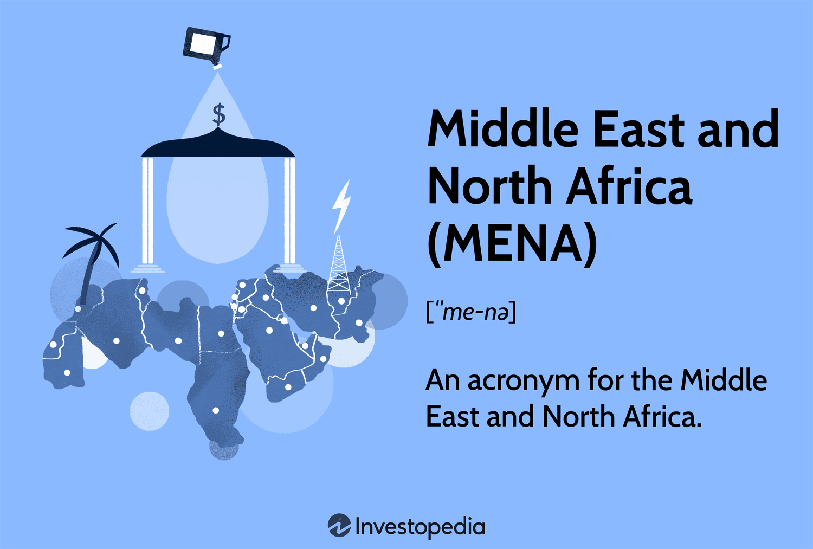

## Table of Contents

## What countries are included in the Middle East and North Africa region?

The Middle East and North Africa region, often called MENA, includes many countries. Some of the countries in the Middle East are Saudi Arabia, Iran, Iraq, Syria, Jordan, Lebanon, Israel, Palestine, Kuwait, Bahrain, Qatar, United Arab Emirates, Oman, and Yemen. These countries share cultural, historical, and political ties.

In North Africa, the countries that are part of the MENA region are Egypt, Libya, Tunisia, Algeria, Morocco, and Mauritania. These countries are located along the northern coast of Africa and have strong connections to the Middle Eastern countries. The MENA region is known for its diverse cultures and significant historical landmarks.

Overall, the MENA region is important because it connects three continents: Asia, Africa, and Europe. It plays a key role in global politics and economics, especially because of its oil and gas resources.

## What are the main economic sectors in the Middle East and North Africa?

The main economic sectors in the Middle East and North Africa are oil and gas, which are very important for the region. Many countries in this area have large amounts of oil and gas under the ground. Countries like Saudi Arabia, Iran, Iraq, and the United Arab Emirates make a lot of money from selling oil and gas to other countries. This money helps them build roads, hospitals, and schools. However, relying too much on oil and gas can be risky because prices can go up and down.

Apart from oil and gas, other important sectors include tourism, agriculture, and manufacturing. Tourism is big in places like Egypt, where people come to see the pyramids and other ancient sites. In North African countries like Morocco and Tunisia, tourism also brings in a lot of money. Agriculture is important too, especially in countries like Egypt and Morocco, where they grow crops like wheat, vegetables, and fruits. Manufacturing is growing, with countries like the United Arab Emirates and Turkey making more cars, electronics, and other goods.

Overall, the Middle East and North Africa region is trying to diversify its economy. This means they want to depend less on oil and gas and grow other sectors like tourism, agriculture, and manufacturing. This can help make their economies stronger and more stable in the long run.

## How does oil and gas influence the economies of Middle Eastern and North African countries?

Oil and gas are very important for the economies of many countries in the Middle East and North Africa. These countries, like Saudi Arabia, Iran, and the United Arab Emirates, have a lot of oil and gas under the ground. They sell this oil and gas to other countries and make a lot of money from it. This money helps them build roads, hospitals, and schools. It also helps them create jobs and support their people. Because they make so much money from oil and gas, these countries often depend a lot on these resources.

However, relying too much on oil and gas can be risky. The prices of oil and gas can go up and down, and if they go down, these countries can have less money to spend on important things. This can make their economies unstable. That's why many countries in the Middle East and North Africa are trying to find other ways to make money. They are working on growing other parts of their economies, like tourism, agriculture, and manufacturing. By doing this, they hope to make their economies stronger and less dependent on oil and gas.

## What are the major economic challenges faced by countries in the Middle East and North Africa?

Countries in the Middle East and North Africa face many economic challenges. One big problem is that many of these countries rely a lot on oil and gas. When the prices of oil and gas go down, these countries can have less money to spend on important things like schools and hospitals. This can make their economies unstable. They need to find other ways to make money, but it can be hard to change their economies quickly.

Another challenge is high unemployment, especially among young people. Many young people in these countries can't find good jobs. This can lead to problems like poverty and unrest. Governments are trying to create more jobs, but it takes time. They are working on growing other parts of their economies, like tourism and manufacturing, to help create more jobs.

There are also issues with political instability and conflict in some countries. This can scare away businesses and tourists, which hurts the economy. It can be hard to attract investment when there is uncertainty. Governments are trying to create more stable environments to encourage economic growth, but it is a difficult and ongoing process.

## How has tourism impacted the economies of Middle Eastern and North African countries?

Tourism has had a big impact on the economies of many Middle Eastern and North African countries. Places like Egypt, Morocco, and the United Arab Emirates attract millions of tourists every year. These tourists come to see famous sites like the pyramids in Egypt, the old cities in Morocco, and the modern skyscrapers in Dubai. When tourists visit, they spend money on hotels, food, and souvenirs. This money helps create jobs for people in these countries, like tour guides, hotel workers, and restaurant staff. Tourism can be a big part of the economy, bringing in a lot of money that helps build roads, schools, and hospitals.

However, tourism can also be a challenge. In some countries, political problems and conflicts can scare tourists away. When fewer tourists come, it hurts the economy because businesses lose money. Also, relying too much on tourism can be risky. If something bad happens, like a natural disaster or a global health crisis, the number of tourists can drop suddenly. This can make the economy unstable. So, while tourism is very important, these countries need to find other ways to make money too, to make sure their economies stay strong even if tourism goes down.

## What role does agriculture play in the economy of the Middle East and North Africa?

Agriculture is an important part of the economy in the Middle East and North Africa. Countries like Egypt and Morocco grow a lot of crops like wheat, vegetables, and fruits. These crops help feed people in their own countries and can also be sold to other countries. This brings in money that helps the economy grow. Agriculture also creates jobs for many people, like farmers and workers in food processing. This is important because it helps reduce unemployment and poverty.

However, agriculture in this region faces some challenges. One big problem is water. Many countries in the Middle East and North Africa are very dry, and it can be hard to find enough water for farming. This makes it difficult to grow enough food. Another challenge is that the weather can be unpredictable, with droughts and floods that can hurt crops. Governments are trying to help by building better irrigation systems and finding new ways to farm that use less water. But it's a big challenge, and agriculture will need to keep adapting to help the economy stay strong.

## How do trade and investment patterns affect the economies of the region?

Trade and investment are very important for the economies of the Middle East and North Africa. When countries in this region trade with other countries, they can sell things like oil, gas, and agricultural products. This brings in a lot of money that helps the economy grow. Investment from other countries can also help. When foreign companies invest in building factories or starting businesses in the region, it creates jobs and helps the economy get stronger. However, the region needs to make sure it is not too dependent on just a few countries for trade and investment. This can make the economy unstable if something changes with those countries.

One challenge is that political problems and conflicts can scare away investors and make it hard to trade. If there is uncertainty, companies might not want to invest in the region. This can slow down economic growth. Another issue is that some countries in the region have strict rules about trade and investment. These rules can make it harder for businesses to operate and grow. To help the economy, countries in the Middle East and North Africa are trying to make trade easier and attract more investment. By doing this, they hope to create more jobs and make their economies stronger and more stable.

## What are the effects of political instability on the economies of Middle Eastern and North African countries?

Political instability can hurt the economies of Middle Eastern and North African countries a lot. When there are conflicts or political problems, businesses might not want to invest in these countries. They worry that their money and projects could be at risk. This means fewer jobs are created and the economy doesn't grow as fast. Also, tourists might not want to visit places where there is unrest, which can hurt the tourism industry. This industry is important for many countries in the region because it brings in a lot of money.

Another way political instability affects the economy is by making it harder to plan for the future. Governments find it difficult to make long-term plans for things like building schools or improving roads when the political situation keeps changing. This can slow down development and make it hard for the economy to grow steadily. People might also lose trust in their government, which can lead to more unrest and make the economic situation even worse. So, having a stable political environment is very important for the economies of these countries.

## How have economic diversification efforts been implemented in the Middle East and North Africa?

Many countries in the Middle East and North Africa are trying to diversify their economies so they don't rely too much on oil and gas. They are doing this by growing other parts of their economies, like tourism, agriculture, and manufacturing. For example, countries like the United Arab Emirates are building more hotels and attractions to attract tourists. They are also encouraging foreign companies to invest in manufacturing, like building cars and electronics. By doing this, they hope to create more jobs and make their economies stronger.

In Egypt and Morocco, agriculture is a big focus. These countries are working on improving their farming methods to grow more food, even in dry areas. They are also trying to export more of their crops to other countries to bring in more money. Another way they are diversifying is by improving their education systems to train people for jobs in different industries. This can help people find work in areas other than oil and gas. Overall, these efforts are helping the region move towards a more balanced and stable economy.

## What is the impact of global economic trends on the Middle East and North Africa region?

Global economic trends have a big impact on the Middle East and North Africa. When the world economy grows, countries in this region can sell more oil and gas because other countries need more energy. This brings in a lot of money and helps their economies grow. But if the world economy slows down, the demand for oil and gas can drop, which means these countries make less money. This can hurt their economies because they depend a lot on oil and gas. Also, if the prices of oil and gas go down because of global trends, it can make it hard for these countries to spend money on important things like schools and hospitals.

Another way global economic trends affect the region is through trade and investment. When the world economy is doing well, more companies want to invest in the Middle East and North Africa. This can create jobs and help the economy grow. But if there is a global economic crisis, companies might not want to invest, which can slow down growth. Also, if there are trade wars or new trade rules around the world, it can make it harder for countries in the region to sell their products to other countries. This can hurt their economies because they rely on trade to bring in money. Overall, what happens in the global economy can have a big effect on the Middle East and North Africa.

## How do economic policies and reforms vary across different countries in the Middle East and North Africa?

Economic policies and reforms in the Middle East and North Africa vary a lot from one country to another. Some countries, like the United Arab Emirates and Saudi Arabia, are trying to move away from relying too much on oil and gas. They are making new laws to attract businesses and investors in other areas like tourism and technology. For example, the UAE is building big projects like the Dubai Expo to bring in more tourists and businesses. Saudi Arabia has a plan called Vision 2030 that aims to grow other parts of the economy and create more jobs that are not related to oil.

Other countries, like Egypt and Morocco, are focusing more on agriculture and manufacturing. They are trying to grow more food and make more things to sell to other countries. Egypt is working on improving its irrigation systems to help farmers grow more crops, even in dry areas. Morocco is investing in renewable energy and trying to make more cars and other products. Both countries are also working on making it easier for businesses to operate by changing some of their rules and laws. This can help attract more investment and create more jobs.

Overall, while the goal of many countries in the region is to diversify their economies and reduce dependence on oil and gas, the specific policies and reforms they use can be very different. Some focus on tourism and technology, while others work on agriculture and manufacturing. Each country is trying to find the best way to grow its economy and improve the lives of its people, but the paths they take can vary a lot based on their resources and needs.

## What future economic trends are predicted for the Middle East and North Africa region?

In the future, the Middle East and North Africa region is expected to see some big changes in its economy. One big trend is that many countries will keep trying to diversify their economies. They want to depend less on oil and gas and grow other parts like tourism, agriculture, and technology. Countries like the United Arab Emirates and Saudi Arabia are already working on big plans to do this. They are building new hotels, theme parks, and tech hubs to attract more tourists and businesses. This can help create more jobs and make the economy stronger and more stable.

Another trend is that more countries in the region will focus on renewable energy. Places like Morocco are already building big solar and wind farms to produce clean energy. This can help them use less oil and gas and sell more energy to other countries. It can also create new jobs in the energy sector. At the same time, global economic trends will still affect the region. If the world economy grows, it can help countries in the Middle East and North Africa sell more of their products and attract more investment. But if there is a global economic crisis, it can make things harder for them. Overall, the future of the region's economy will depend a lot on how well they can adapt to these trends and changes.

## References & Further Reading

[1]: ["Saudi Arabia's Vision 2030."](https://www.vision2030.gov.sa/en) Saudi Arabia's Vision 2030 Official Website.

[2]: Advan, H., & Masih, R. (2020). ["The Impact of Algorithmic Trading on Volatility and Trading Volume: Evidence from the Saudi Stock Exchange."](https://www.wisdomlib.org/uploads/journals/wjpr/volume-11,-february-issue-2_18684.pdf) Journal of Financial Economic Policy.

[3]: Al-Khouri, R. (2010). ["The Macroeconomic Performance of the MENA Region: From Oil Dependency to Diversification Strategies."](https://www.sciencedirect.com/science/article/abs/pii/S0939362516300553) Economic Journal of Emerging Markets.

[4]: Dubai Financial Market. ["Annual Report 2022."](https://assets.dfm.ae/docs/default-source/dfm-ir/dfm-fs-2022-en.pdf?sfvrsn=fadeef81_0) Dubai Financial Market Official Website.

[5]: Sheikh, R. A., & Asad, M. (2021). ["FinTech and the future of finance."](https://link.springer.com/chapter/10.1007/978-3-031-14941-2_5) Journal of Financial Economic Theory.