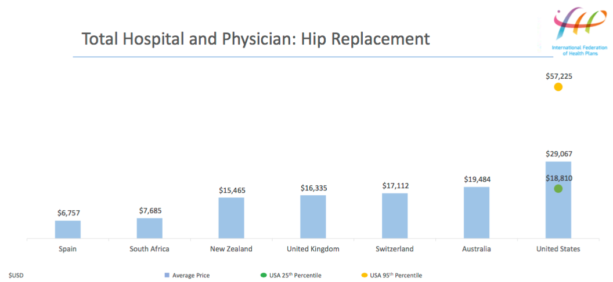

## Table of Contents

## What is healthcare expenditure?

Healthcare expenditure refers to the total amount of money spent on health services and goods in a specific period, usually a year. This includes costs for things like doctor visits, hospital stays, medications, and preventive care. It can be measured for individuals, families, or entire countries. Governments, private insurance companies, and out-of-pocket payments from individuals all contribute to the total healthcare expenditure.

Understanding healthcare expenditure is important because it helps us see how much a society values health and how accessible healthcare is to its people. High healthcare costs can make it hard for some people to get the care they need, while low costs might mean that the quality of care is not as good. By looking at healthcare expenditure, policymakers can make better decisions about how to improve health systems and make sure that everyone can get the care they need without facing financial hardship.

## How is healthcare expenditure measured?

Healthcare expenditure is measured by adding up all the money spent on health services and goods over a certain time, usually a year. This includes costs like doctor visits, hospital stays, medicines, and things like vaccinations. The money can come from different places, like the government, insurance companies, and what people pay themselves. To get the total, experts look at records from hospitals, clinics, pharmacies, and insurance companies to see how much was spent.

The measurement can be done for a whole country, a smaller area, or even for individual people or families. For a country, the total healthcare expenditure is often shown as a percentage of the country's total economy, called the Gross Domestic Product (GDP). This helps compare how much different countries spend on health. For individuals or families, it might be looked at as a part of their income to see if healthcare costs are too high for them. By measuring healthcare expenditure in these ways, we can understand how much is being spent on health and if it's fair and enough.

## Which countries spend the most on healthcare?

The United States spends the most money on healthcare compared to other countries. In the U.S., a lot of money goes to hospitals, doctors, and medicines. People in the U.S. often pay for healthcare through insurance or out of their own pockets. The total amount spent on healthcare in the U.S. is a big part of the country's economy, about 18% of its Gross Domestic Product (GDP).

Other countries that spend a lot on healthcare include Germany, Switzerland, and Norway. These countries have systems where the government helps pay for healthcare, so people don't have to pay as much out of their own pockets. In Germany and Switzerland, about 12% to 13% of their GDP goes to healthcare. Norway spends around 10% of its GDP. These countries try to make sure everyone can get good healthcare without spending too much money.

## What percentage of GDP do different countries allocate to healthcare?

The United States spends the most on healthcare, around 18% of its Gross Domestic Product (GDP). This means that almost one fifth of all the money the country makes goes to healthcare. People in the U.S. pay for healthcare through insurance or out of their own pockets. This high spending can make healthcare expensive for many people.

Other countries also spend a lot on healthcare but not as much as the U.S. Germany and Switzerland spend about 12% to 13% of their GDP on healthcare. These countries have systems where the government helps pay for healthcare, so people don't have to pay as much out of their own pockets. Norway spends around 10% of its GDP on healthcare, trying to make sure everyone can get good care without spending too much money.

## How does per capita healthcare spending vary across countries?

Per capita healthcare spending means how much money is spent on healthcare for each person in a country. The United States spends the most per person, around $10,000 each year. This is a lot more than many other countries. People in the U.S. often pay for healthcare through insurance or out of their own pockets, which can make it expensive.

Other countries spend less per person on healthcare. For example, Germany spends about $6,000 per person, and Switzerland spends around $7,000. These countries have systems where the government helps pay for healthcare, so people don't have to pay as much out of their own pockets. Norway spends about $6,000 per person, trying to make sure everyone can get good care without spending too much money.

## What are the main components of healthcare expenditure?

Healthcare expenditure includes all the money spent on health services and goods. This can be things like going to the doctor, staying in the hospital, buying medicines, and getting vaccinations. The money comes from different places like the government, insurance companies, and what people pay themselves. For example, when you go to the doctor, part of the cost might be paid by your insurance, and you might have to pay some out of your own pocket.

The main parts of healthcare expenditure are direct costs and indirect costs. Direct costs are the things you can see and touch, like the fees for seeing a doctor or the price of medicine. Indirect costs are harder to see but still important, like the time and money people lose when they are sick and can't work. Both types of costs add up to the total amount spent on healthcare, and they help us understand how much health matters to a country and how easy it is for people to get the care they need.

## How does public vs. private healthcare spending differ by country?

Public healthcare spending comes from the government, using taxes to pay for healthcare services for everyone. In countries like the United Kingdom and Canada, public spending is high because the government wants to make sure everyone can get healthcare without paying a lot out of their own pockets. These countries have systems called universal healthcare, where the government covers most of the costs. For example, in the UK, about 80% of healthcare spending is public. This means less money comes from private sources like insurance or what people pay themselves.

Private healthcare spending, on the other hand, comes from insurance companies or what people pay out of their own pockets. The United States has a lot of private spending, around 50% of its total healthcare costs. This is because many people in the U.S. get health insurance from their jobs or buy it themselves, and they pay for part of their healthcare. In contrast, countries like Japan and Germany have less private spending, around 20% to 30%, because their governments cover more of the costs through public spending. The mix of public and private spending can change how easy it is for people to get healthcare and how much they have to pay.

## What trends can be observed in global healthcare expenditure over the last decade?

Over the last decade, global healthcare expenditure has been increasing. This means that countries around the world are spending more money on health services and goods like doctors, hospitals, and medicines. One big reason for this increase is that the world's population is growing and getting older. Older people often need more healthcare, so as more people get older, more money is needed to take care of them. Also, new medicines and treatments are being developed, which can be expensive but help people live longer and healthier lives.

Another trend is that more money is being spent on public healthcare, especially in countries that want to make sure everyone can get the care they need without spending too much out of their own pockets. Governments in places like Europe and some parts of Asia are putting more money into public healthcare systems to cover the costs. At the same time, private healthcare spending is also growing, especially in countries like the United States, where many people pay for healthcare through insurance or out of their own pockets. This mix of public and private spending shows that countries are trying different ways to make healthcare better and more accessible for everyone.

## How does healthcare expenditure correlate with health outcomes in different countries?

Healthcare expenditure and health outcomes are closely linked, but the relationship can be complex. Generally, countries that spend more money on healthcare tend to have better health outcomes, like longer life expectancy and lower death rates from diseases. For example, countries like Japan and Switzerland, which spend a lot on healthcare, have some of the highest life expectancies in the world. This is because more spending can mean better hospitals, more doctors, and access to new medicines and treatments. However, just spending more money doesn't always mean better health. How the money is spent is also important. If the money goes to the right places, like preventive care and making sure everyone can get healthcare, then health outcomes can improve a lot.

On the other hand, some countries spend less on healthcare but still have good health outcomes. For instance, Costa Rica spends less on healthcare than many richer countries but has a high life expectancy because it focuses on preventive care and making sure everyone can get healthcare. This shows that smart spending can make a big difference. Also, other factors like education, income, and lifestyle can affect health outcomes, not just how much money is spent on healthcare. So, while spending more on healthcare can help, it's not the only thing that matters for good health.

## What factors influence healthcare expenditure levels in different countries?

Many things can affect how much a country spends on healthcare. One big [factor](/wiki/factor-investing) is how rich the country is. Countries with more money, like the United States or Germany, can spend more on healthcare because they have more money to go around. Another factor is how old the people in the country are. Countries with a lot of older people, like Japan, need to spend more because older people often need more healthcare. Also, the way a country's healthcare system works matters a lot. If the government pays for most of the healthcare, like in the UK or Canada, public spending will be higher. But if people pay more out of their own pockets or through insurance, like in the US, private spending will be higher.

Another important factor is how healthy the people in the country are. If a lot of people have health problems or diseases, the country will need to spend more on healthcare to take care of them. The cost of medicines and treatments can also affect healthcare spending. New medicines and treatments can be expensive, so countries that use a lot of these will spend more. Finally, how the country chooses to spend its healthcare money can make a difference. If the country focuses on preventing sickness and helping everyone get healthcare, it might spend its money differently than a country that focuses more on treating sick people after they get sick. All these things together help explain why healthcare spending can be so different from one country to another.

## How do healthcare systems and policies affect expenditure in various countries?

Healthcare systems and policies have a big impact on how much money a country spends on healthcare. In countries like the UK and Canada, the government pays for most of the healthcare through taxes. This means that a lot of the money spent on healthcare comes from public funds, and people don't have to pay as much out of their own pockets. These countries try to make sure everyone can get healthcare without spending too much money. Because the government is in charge, they can decide how to spend the money, like focusing on preventing sickness or helping people stay healthy. This can keep costs down and make healthcare more affordable for everyone.

On the other hand, in countries like the United States, a lot of healthcare spending comes from private sources, like insurance companies and what people pay themselves. This can make healthcare more expensive because insurance companies and people have to pay for a lot of it. The government still helps pay for some healthcare, especially for older people or those with low incomes, but it's not as much as in countries with mostly public healthcare. The way the healthcare system is set up can also affect how much money is spent. For example, if there are a lot of rules and paperwork, it can make healthcare more expensive. So, the type of healthcare system and the policies a country has can really change how much money they spend on healthcare and how easy it is for people to get the care they need.

## What are the future projections for healthcare expenditure by country?

Over the next few years, experts think that healthcare spending will keep going up in many countries. This is because more people are getting older and need more healthcare. Also, new medicines and treatments are being made, which can be expensive but help people live longer and healthier lives. Countries like the United States, Japan, and Germany are expected to spend even more money on healthcare because they have a lot of older people and their healthcare systems cost a lot. These countries will need to find ways to pay for this growing cost, maybe by changing their healthcare systems or finding new ways to save money.

In poorer countries, healthcare spending is also expected to go up, but not as much as in richer countries. These countries are trying to make their healthcare better and make sure more people can get the care they need. They might get help from other countries or organizations to pay for this. As more people in these countries get better healthcare, they might live longer and healthier lives, but it will take time and money. Overall, no matter how rich or poor a country is, healthcare spending is expected to keep growing in the future.

## References & Further Reading

[1]: Organisation for Economic Co-operation and Development (OECD). (2021). [Health Statistics.](https://www.oecd-ilibrary.org/social-issues-migration-health/health-at-a-glance-2021_ae3016b9-en)

[2]: World Health Organization (WHO). (2021). [Global Health Expenditure Database.](https://apps.who.int/nha/database)

[3]: Commonwealth Fund. (2021). [Mirror, Mirror 2021: Reflecting Poorly.](https://www.commonwealthfund.org/sites/default/files/2021-08/Schneider_Mirror_Mirror_2021.pdf)

[4]: World Bank. (2021). [Data on Health Expenditure as a percentage of GDP.](https://data.worldbank.org/indicator/SH.XPD.CHEX.GD.ZS?most_recent_value_desc=true&view=map)

[5]: Kaiser Family Foundation. (2021). [Health Insurance Coverage of the Total Population.](https://www.kff.org/other/state-indicator/total-population/)

[6]: McKinsey Global Institute. (2020). [The Future of Healthcare: Value Creation through Innovation and Transformation.](https://www.mckinsey.com/industries/healthcare/our-insights/the-future-of-healthcare-value-creation-through-next-generation-business-models)