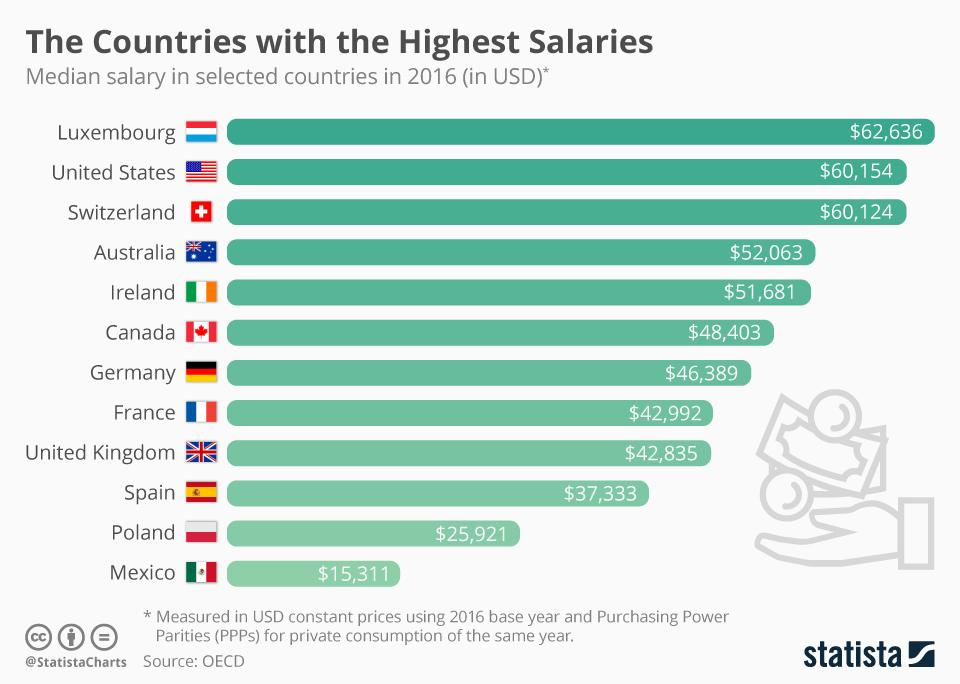

Welcome to our in-depth exploration of income levels in the world's wealthiest countries and how algorithmic trading is impacting these economies. In this article, we will explore disposable income per capita, a vital metric for assessing the wealthiest nations. Disposable income per capita provides insights into the average amount of money individuals have available for spending and saving after paying taxes. It serves as a key indicator of economic well-being and quality of life in different countries.

We will examine the top countries by income levels and identify the driving factors behind these high incomes. Some nations are prominent leaders due to their robust economic structures, supported by specific industries, fiscal policies, and educational systems. By understanding these factors, we aim to highlight how different economic strategies contribute to higher disposable incomes.

In addition to traditional economic elements, we will explore how advancements in algorithmic trading are reshaping economic landscapes. Algorithmic trading, which involves the use of computer algorithms to automate trading decisions, has revolutionized financial markets. It brings unprecedented speed and precision to investment strategies and plays a pivotal role in influencing wealth distribution and income generation.

Throughout this exploration, we will touch upon the intricacies of global wealth and income disparity, examining how financial technology is transforming these dynamics. By analyzing these trends, we aim to provide a comprehensive understanding of how both traditional and modern economic elements converge to shape the prosperity of the world's wealthiest nations.

## Table of Contents

## Understanding Income Levels in Wealthy Countries

Disposable income per capita, defined as the amount of money an individual has available after taxes and social security charges, serves as a key indicator of the economic health and standard of living in a country. The countries that often top the list in terms of disposable income per capita are the United States, Luxembourg, and Switzerland. This section examines the specific economic sectors, government policies, and demographic trends that contribute to the high income levels in these nations.

In the United States, a diverse economy with significant contributions from technology, finance, and healthcare sectors drives high disposable incomes. The presence of global technology giants like Apple, Google, and Amazon, coupled with a strong financial sector centered in New York City, contributes to substantial economic outputs. Additionally, the U.S. benefits from a relatively flexible labor market and entrepreneurial culture, which fosters innovation and business growth. Government policies, such as investment in infrastructure and education, further enhance economic opportunities.

Luxembourg, despite its small size, consistently ranks among the highest in disposable income per capita. This is primarily due to its robust financial sector, which benefits from favorable tax policies and a strategic location in Europe. Luxembourg's financial services, including banking and investment funds, attract international corporations and wealthy individuals. Furthermore, Luxembourg's stable political environment and regulatory framework support economic growth. The country also has high levels of government investment in education and technology, which contribute to maintaining a skilled workforce.

Switzerland, known for its banking and finance sectors, also ranks high in disposable income per capita. The Swiss banking system, renowned for its stability and confidentiality, attracts wealth from around the world. Switzerland's economy benefits from high-value industries such as pharmaceuticals, machinery, and chemicals. The Swiss government invests heavily in public services and education, ensuring a well-educated workforce that sustains high income levels. Moreover, Switzerland's political stability and strong trade relationships further enhance its economic prosperity.

Factors influencing income levels across these countries include population dynamics, government investment, and educational attainment. For example, immigration can impact population size and the demand for goods and services, potentially boosting economic growth. Government investments in infrastructure, education, and technology can enhance productivity and innovation, leading to higher incomes. The educational status of the workforce is crucial, as higher education levels typically correlate with higher [earning](/wiki/earning-announcement) potential.

In summary, the United States, Luxembourg, and Switzerland exemplify how a combination of advanced sectors, strategic policies, and educated workforces contribute to high levels of disposable income. These factors, supported by governmental and demographic considerations, highlight the complex interplay between economic structures and income levels in wealthy countries.

## The Role of Algorithmic Trading

Algorithmic trading has become an integral component of financial markets, revolutionizing investment strategies by utilizing advanced algorithms to automate trading decisions. This approach leverages mathematical models and computational power to analyze vast datasets, identify trading opportunities, and execute orders at speeds that are impossible for human traders.

### Rise of Algorithmic Trading and Its Impact

The growth of electronic trading platforms and the availability of real-time data have contributed significantly to the rise of [algorithmic trading](/wiki/algorithmic-trading). Today, a substantial portion of trade [volume](/wiki/volume-trading-strategy) on major exchanges is executed through algorithms. This method of trading offers several advantages, including enhanced speed and precision. Algorithms can swiftly process complex algorithms to decide on buying or selling assets, often executing trades within milliseconds. This increased speed minimizes transaction costs and can lead to improved profit margins.

### Advantages of Algorithmic Trading

1. **Speed and Efficiency**: Algorithms operate on a level of speed that is unattainable by human traders. They can scan multiple markets and securities simultaneously and execute orders instantly once predefined criteria are met. This efficiency reduces the likelihood of market slippage—the phenomenon where the actual transaction price differs from the intended one.

2. **Data Analysis Capabilities**: Algorithmic trading algorithms harness big data and predictive analytics to assess historical and current market data. By identifying patterns and trends that are invisible to the human eye, algorithms can optimize trading strategies and adapt to market changes in real time.

3. **Reduced Human Emotion**: Automated systems avert the common pitfalls of human emotion—such as fear and greed—that often lead to suboptimal trading decisions. By sticking strictly to the predefined strategies, algorithms maintain discipline and consistency in trading actions.

### Algorithmic Trading and Wealth Distribution

Algorithmic trading has significant implications for income generation and wealth distribution, particularly in wealthy nations. In leading financial hubs like New York, London, and Hong Kong, algorithmic trading strategies are pivotal in shaping market dynamics. These financial centers have seen a surge in high-frequency trading ([HFT](/wiki/high-frequency-trading-strategies)) firms that deploy algorithms to capitalize on minute price discrepancies in various asset classes. 

### Case Studies in Financial Hubs

- **United States**: The New York Stock Exchange and NASDAQ have witnessed the profound impact of algorithmic trading on liquidity and market efficiency. HFT firms often represented a large proportion of trading volume, significantly influencing price movements.

- **United Kingdom**: In London, the European financial center, algorithmic traders have been instrumental in foreign exchange markets. Algorithms help manage large orders over time, mitigating the price impact while enabling efficient currency trades.

- **Hong Kong**: As an emerging hub for algorithmic trading in Asia, Hong Kong hosts a growing number of firms specializing in algorithm development. The city has seen algorithms adeptly handle the complexities of trading across borders and different asset classes.

Despite these benefits, the rise of algorithmic trading also presents challenges, including the potential for market [volatility](/wiki/volatility-trading-strategies) and systemic risks if not properly managed. In summary, algorithmic trading is reshaping wealth dynamics in high-income countries by introducing efficiencies that enable more sophisticated and targeted investment strategies.

## Countries With the Highest Incomes

To ascertain which countries have the highest disposable incomes, we assess several key economic indicators. A nation's economic health is frequently gauged by disposable income per capita, which essentially refers to the amount individuals have available to spend or save after taxes. Here, we examine the top 10 countries with the highest disposable incomes, their primary economic drivers, and the financial strategies they employ to sustain and grow wealth.

### 1. Luxembourg
Luxembourg consistently tops the list with a high disposable income per capita. This high-income level is primarily driven by a robust financial sector, which accounts for a significant portion of its GDP. The nation's strategic location in Europe, coupled with favorable tax regulations, has attracted numerous multinational corporations. To maintain this prosperity, Luxembourg invests heavily in innovation and education, ensuring a highly skilled workforce.

### 2. Switzerland
Switzerland follows closely, known for its stability and neutral political stance that continues to attract foreign investments. Key economic drivers include finance, precision manufacturing, and pharmaceuticals. The Swiss economy also benefits from a strong emphasis on research and development, significantly contributing to technological advancements. The financial strategies here include maintaining a balanced budget and investing in infrastructure and education.

### 3. United States
The United States' high disposable income is largely supported by its diverse economy, encompassing major industries such as technology, finance, and healthcare. Innovation is a cornerstone of its economic strategy, driven by a large pool of venture capital and research institutions. The U.S. also benefits from a vast domestic market and relatively low taxes compared to other advanced economies.

### 4. Norway
Norway's high disposable income is substantially supported by its petroleum industry. The country has adeptly managed its oil profits through its Government Pension Fund, one of the world's largest sovereign wealth funds. Additionally, Norway promotes high living standards through well-funded social welfare systems, free education, and universal healthcare, all contributing to strong income resilience.

### 5. Ireland
Ireland attracts high-income levels largely due to its favorable corporate tax rates, which have drawn many global tech giants like Google and Apple to establish European headquarters there. The country's open and flexible business environment, coupled with government incentives for startups and innovation, bolsters its economic status.

### 6. Australia
Australia's high disposable income is supported by natural resources, such as coal and iron ore, along with a significant services sector. The nation invests in sustainable mining practices and technological education, ensuring a future-proof economy. Government policies focus on maintaining stable economic conditions and promoting trade partnerships, particularly in the Asia-Pacific region.

### 7. Denmark
Denmark's income levels are driven by its diversified economy, with strengths in pharmaceuticals, shipping, and renewable energy. Innovation is encouraged by supportive government policies and a strong emphasis on sustainability. Denmark maintains a high living standard through extensive social benefits funded by high tax revenues, reflecting a socio-economic model that balances growth with equality.

### 8. Sweden
Sweden's economy benefits from high levels of innovation, skilled labor force, and strong industrial sectors like automotive and telecommunications. The nation invests heavily in R&D and maintains open trade policies. Sweden's approach to wealth includes fostering a cooperative labor market and prioritizing social welfare systems.

### 9. Germany
Germany, Europe's largest economy, boasts a high disposable income due to its robust industrial sector, particularly in automotive manufacturing and engineering. The nation's financial strategies emphasize export-oriented growth and investment in vocational training systems that support industrial productivity. Germany also heavily invests in sustainable technology and energy solutions.

### 10. Netherlands
The Netherlands rounds out the list with high income levels supported by a major logistics hub and strong finance and technology sectors. The nation's economy thrives on a well-educated workforce and favorable business regulations that encourage digital entrepreneurship. Financial strategies include maintaining a competitive tax framework and investing in digital infrastructure.

These countries leverage unique economic drivers and financial strategies to achieve high disposable income levels, illustrating the diverse pathways to prosperity and economic stability. Each nation, through innovation, sound fiscal policies, and strategic use of resources, has developed a sustainable model that not only supports high incomes but also invests in the future.

## What Drives Higher Average Incomes?

Wealthy nations often exhibit high average incomes driven by multiple factors, including effective economic policies and advanced educational systems, which collectively enhance productivity and standards of living. A critical component contributing to high income levels is the implementation of lower tax rates and efficient government policies. These policies can encourage investment and foster a conducive environment for business activity. For instance, countries like Singapore and Switzerland leverage competitive tax regimes to attract multinational corporations, thereby creating numerous high-paying jobs and boosting national income levels.

Educational advancements significantly contribute to high income levels in affluent nations. Countries such as Finland and South Korea showcase robust education systems that emphasize both foundational knowledge and advanced technical skills. This educational excellence ensures a well-prepared workforce capable of contributing to high-value industries such as technology and finance. Notably, there is a strong correlation between the educational attainment of a population and its income levels, with higher education often leading to better employment opportunities and increased earning potential.

Technological advancements further bolster high income levels as countries embrace innovation to drive economic growth. The proliferation of digital technologies has transformed traditional industries, leading to the creation of new sectors and enhancing productivity. In high-income countries, investments in research and development (R&D) not only spur technological innovation but also pave the way for high-skilled jobs that command higher wages. Sectors such as [artificial intelligence](/wiki/ai-artificial-intelligence), biotechnology, and information technology are pivotal in this transformation, providing lucrative opportunities for skilled professionals.

The impact of automation and digital advancements on workforce income is an essential consideration. Automation can lead to the displacement of certain low-skilled jobs; however, it simultaneously creates demand for high-skilled roles that involve designing, implementing, and maintaining automated systems. This shift necessitates a workforce equipped with skills in programming, data analysis, and systems engineering. While automation contributes to economic growth and increased productivity, it also underscores the importance of continual learning and adaptation within the workforce to secure high-income roles.

In conclusion, the interplay of economic policies, educational systems, technological innovation, and automation collectively shapes the income landscape of wealthy nations. By fostering a skilled workforce and enabling technological integration, these countries maintain their status as high-income economies.

## The Intersection of Technology and Wealth

Technological development, particularly advancements in artificial intelligence (AI) and big data, is fundamentally altering traditional income models across the globe. In high-income countries, these technologies are driving substantial economic shifts by creating new avenues for revenue generation and reshaping existing business landscapes.

AI and big data are transforming traditional income models by improving efficiency and productivity. AI algorithms optimize supply chains, personalize marketing strategies, and automate customer service, reducing operational costs and enhancing profit margins. Big data analytics enable companies to process vast amounts of information to uncover actionable insights, informing strategic decisions and driving innovation. This technology-driven shift is visible in sectors such as finance, healthcare, and retail, where data-driven decision-making has become integral to maintaining competitive advantage.

Tech companies and startups are at the forefront of shaping the economic future of high-income countries. Giants like Apple, Google, and Amazon have leveraged technology to dominate global markets, contributing significantly to their countries’ GDPs. Startups are fostering innovation, creating high-value jobs, and attracting substantial investment. These companies operate on scalable business models, often characterized by high growth potential and disruptive technologies, enabling them to capture market share rapidly. The success of tech hubs such as Silicon Valley and Shenzhen exemplifies how technology companies drive economic growth and influence global market dynamics.

Technological advancement presents numerous opportunities and challenges. Opportunities include increased economic productivity, job creation in tech-driven industries, and the potential for enhanced quality of life through innovative products and services. However, challenges such as job displacement due to automation, data privacy concerns, and the need for regulatory frameworks to manage technological integration also arise.

Moreover, the rapid pace of technological change demands a skilled workforce capable of navigating and leveraging these tools effectively. As technology continues to evolve, there is an increased need for educational institutions and government policies to focus on STEM (science, technology, engineering, and mathematics) education to prepare the workforce for future demands.

In conclusion, while technological advancements offer significant potential for wealth creation and economic advancement, they also necessitate a proactive approach to address the accompanying challenges. Balancing innovation with regulation and workforce preparedness will be crucial for high-income countries to harness these technologies effectively, ensuring sustained economic growth and stability.

## Conclusion

In examining the income levels of the world's wealthiest countries, we explored how disposable income per capita serves as a vital metric for economic well-being. Wealthy nations like the United States, Luxembourg, and Switzerland continue to lead due to specific economic sectors and policies that drive high incomes. These nations benefit from factors such as government investment and a well-educated workforce, contributing significantly to their substantial income levels.

Algorithmic trading has emerged as a transformative force in financial markets, enhancing investment strategies with its speed and data analysis capabilities. This technology has reshaped wealth dynamics within high-income countries, contributing to income generation and altering wealth distribution. Algorithmic trading's influence on these economies underscores a trend toward increased automation and technological integration in financial systems.

Technological advancements, particularly in AI and big data, have disrupted traditional income models, with tech companies and startups redefining economic landscapes. These innovations present both opportunities and challenges, as they drive efficiency and growth while also emphasizing the need for equitable wealth distribution strategies.

Looking forward, the continued adoption of algorithmic trading and financial technologies by wealthy nations could further solidify their economic status. However, these developments also pose potential challenges in achieving global economic equality. Nations may need to balance embracing these innovations with strategies to ensure inclusive growth and reduce income disparities. As financial technologies evolve, the pathways these countries choose will significantly impact their ability to sustain or increase wealth, and their role in shaping a more equitable global economy.

## References & Further Reading

[1]: ["Advances in Financial Machine Learning"](https://books.google.com/books/about/Advances_in_Financial_Machine_Learning.html?id=oU9KDwAAQBAJ) by Marcos Lopez de Prado

[2]: ["Evidence-Based Technical Analysis: Applying the Scientific Method and Statistical Inference to Trading Signals"](https://www.amazon.com/Evidence-Based-Technical-Analysis-Scientific-Statistical/dp/0470008741) by David Aronson

[3]: ["Machine Learning for Algorithmic Trading"](https://github.com/PacktPublishing/Machine-Learning-for-Algorithmic-Trading-Second-Edition) by Stefan Jansen

[4]: ["Quantitative Trading: How to Build Your Own Algorithmic Trading Business"](https://www.amazon.com/Quantitative-Trading-Build-Algorithmic-Business/dp/0470284889) by Ernest P. Chan

[5]: Shiller, R. J. (2015). ["Irrational Exuberance"](https://www.jstor.org/stable/j.ctt1287kz5), Princeton University Press. 

[6]: Piketty, T. (2014). ["Capital in the Twenty-First Century"](https://www.jstor.org/stable/j.ctt6wpqbc), Harvard University Press.

[7]: Brynjolfsson, E., & McAfee, A. (2014). ["The Second Machine Age: Work, Progress, and Prosperity in a Time of Brilliant Technologies"](https://psycnet.apa.org/record/2014-07087-000), W. W. Norton & Company.