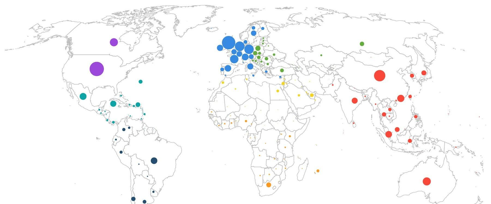

## Table of Contents

## What is a multinational corporation?

A multinational corporation is a big company that does business in more than one country. These companies have offices, factories, or stores in different countries around the world. They sell their products or services to people in many different places. Some examples of multinational corporations are Coca-Cola, McDonald's, and Apple.

These companies are important because they can bring jobs and money to the countries where they work. They also help to spread new ideas and technology around the world. But sometimes, they can cause problems too. They might pay workers very little or harm the environment. Governments and people often have to think carefully about how to work with multinational corporations to make sure they help more than they harm.

## How do you measure the concentration of multinational corporations in a country?

To measure the concentration of multinational corporations in a country, you can look at how many of these big companies are doing business there. This can be done by counting the number of foreign companies that have offices, factories, or stores in the country. Another way is to see how much of the country's economy is made up of these multinational corporations. This is often shown as a percentage of the total business activity in the country.

You can also look at how much money these companies are making in the country. This is called their revenue or sales. If a lot of the money being made in a country comes from multinational corporations, it means they have a big presence there. Sometimes, people also look at how many people work for these companies to see how important they are to the job market in the country.

## Which countries have the highest number of multinational corporations headquartered within their borders?

The United States has the highest number of multinational corporations headquartered within its borders. Big companies like Apple, Microsoft, and Coca-Cola are all based in the U.S. This means that many of the world's biggest and most famous companies come from America. The country's strong economy and business-friendly environment help it attract and grow these large corporations.

Europe also has a lot of multinational corporations, with countries like the United Kingdom, Germany, and France being home to many big companies. For example, companies like Unilever, Siemens, and L'Oréal are based in these countries. Europe's diverse markets and skilled workforce make it a good place for multinational corporations to set up their headquarters.

In Asia, Japan and China are important hubs for multinational corporations. Japan is home to companies like Toyota and Sony, while China has companies like Alibaba and Tencent. Both countries have strong economies and are important players in the global market, which helps them support a high number of multinational corporations.

## What industries are most represented by multinational corporations in these countries?

In the United States, multinational corporations are often found in the technology, finance, and consumer goods industries. Big tech companies like Apple, Microsoft, and Google are headquartered here, showing how important technology is to the U.S. economy. Finance is also a big industry, with companies like JPMorgan Chase and Goldman Sachs based in the U.S. Consumer goods companies like Coca-Cola and Procter & Gamble are also very common, showing that the U.S. is good at making and selling products that people use every day.

In Europe, multinational corporations are often in the automotive, pharmaceuticals, and luxury goods industries. Germany has big car companies like Volkswagen and BMW, while France is home to luxury brands like LVMH and L'Oréal. The UK has strong pharmaceutical companies like AstraZeneca and GlaxoSmithKline. These industries show that Europe is good at making high-quality products, from cars and medicines to fancy clothes and beauty products.

In Asia, multinational corporations are often found in the electronics, automotive, and e-commerce industries. Japan is known for its electronics companies like Sony and Panasonic, as well as its car companies like Toyota and Honda. China has become a leader in e-commerce with companies like Alibaba and JD.com. These industries show that Asia is a big player in making and selling electronics, cars, and online shopping, which are all very important to the world economy.

## What economic factors attract multinational corporations to these countries?

Multinational corporations are drawn to the United States because of its large and wealthy market. The U.S. has a lot of people who can buy things, and they have money to spend. This makes it a great place for companies to sell their products. The U.S. also has good laws and rules that help businesses grow. There are many skilled workers in the U.S., and the country is a leader in technology and innovation. This means companies can find the people and ideas they need to do well.

In Europe, countries like Germany, France, and the UK attract multinational corporations because of their strong economies and skilled workers. Germany is known for making high-quality products like cars and machines, so companies want to be there to make their own products. France and the UK have good education systems, so there are many smart people who can work for these companies. Europe also has good transportation and communication systems, which makes it easy for companies to move their products around.

In Asia, Japan and China are attractive to multinational corporations because of their large markets and growing economies. Japan has a lot of technology and is good at making electronics and cars, so companies want to be there to use this technology. China has a huge number of people who can buy things, and the country is growing quickly. This makes it a good place for companies to sell their products. Both countries also have good infrastructure, which means they have the roads, ports, and communication systems that companies need to do business.

## How does the presence of multinational corporations impact the local economy of these countries?

The presence of multinational corporations can help the local economy of a country in many ways. These big companies bring in a lot of money and create jobs for people. When they set up offices or factories, they hire workers and pay them salaries. This means more people have money to spend, which can help other businesses in the area grow. Multinational corporations also bring new technology and ideas to the country. This can make local businesses better and help the country's economy grow faster. For example, in the United States, big tech companies like Apple and Microsoft help make the country a leader in technology, which creates many jobs and brings in a lot of money.

However, the presence of multinational corporations can also have some negative effects on the local economy. Sometimes, these big companies can take business away from smaller, local companies. This can make it hard for small businesses to survive. Multinational corporations might also pay their workers very little, especially in countries where labor laws are not strong. This can lead to problems for workers and their families. In some cases, these companies can harm the environment by polluting the air or water. Governments need to make sure they have rules in place to protect workers and the environment while still benefiting from the money and jobs that multinational corporations bring.

## What are the social and environmental impacts of multinational corporations in these countries?

Multinational corporations can have big effects on the people and the world around them in the countries where they work. They can bring good things like jobs and money to local people. When these companies build factories or offices, they hire workers and pay them. This means more people have money to spend on things they need, like food and homes. But sometimes, these companies pay workers very little, especially in places where the laws about work are not strong. This can make life hard for workers and their families. Also, when big companies come into a country, they might change the way people live and think. They can bring new ideas and ways of doing things, which can be good or bad depending on how people see it.

The environment can also be affected by multinational corporations. Some companies can harm the air, water, and land by polluting them. For example, factories might put dirty smoke into the air or waste into rivers. This can make it hard for people and animals to live healthy lives. But not all effects are bad. Some multinational corporations try to be good to the environment. They might use clean energy or find ways to make less waste. Governments need to make rules to make sure these companies do not hurt the environment too much. It's important to find a balance so that the country can get the good things from these companies without too much harm to the world around us.

## How do government policies in these countries support or hinder multinational corporations?

Government policies in the United States often help multinational corporations. The U.S. has laws that make it easy for businesses to start and grow. These laws protect companies and make it easier for them to make money. For example, tax breaks and other incentives can attract big companies to set up offices or factories in the U.S. However, there are also rules that can make things harder for these corporations. Laws about the environment and workers' rights can increase costs for companies. They have to follow these rules, which might make them think twice about setting up in the U.S. if they want to save money.

In Europe, government policies can be both helpful and challenging for multinational corporations. Countries like Germany, France, and the UK have strong economies and good infrastructure, which attract big companies. They also have laws that protect workers and the environment, which can be good for society but might increase costs for businesses. Some European countries offer incentives like tax breaks to attract multinational corporations, but strict regulations on labor and the environment can make it harder for these companies to operate. It's a balance between attracting business and protecting people and the planet.

In Asia, countries like Japan and China use different policies to support multinational corporations. Japan has a strong focus on technology and innovation, which attracts tech companies. The government there often works closely with businesses to help them grow. China, on the other hand, has a huge market and a fast-growing economy, which is very attractive to multinational corporations. The Chinese government offers incentives like tax breaks and special economic zones to attract these companies. However, both countries have strict rules about certain things, like technology transfers in China or labor practices in Japan, which can make it harder for multinational corporations to do business there.

## What are the trends in the growth or decline of multinational corporations in these countries over the past decade?

Over the past decade, the number of multinational corporations in the United States has grown steadily. Big companies in technology, like Apple and Google, have continued to expand, creating more jobs and bringing in more money. The U.S. government's support for business through tax breaks and other incentives has helped this growth. However, there have been some challenges too. Stricter environmental and labor laws have made it more expensive for some companies to operate in the U.S. Despite these challenges, the overall trend has been one of growth, with the U.S. remaining a top destination for multinational corporations.

In Europe, the growth of multinational corporations has been mixed over the last ten years. Countries like Germany and France have seen steady growth in industries like automotive and luxury goods. These countries have strong economies and good infrastructure, which attract big companies. However, Brexit has caused some uncertainty in the UK, leading to a slight decline in the number of multinational corporations setting up there. Strict regulations on labor and the environment have also made it more expensive for some companies to do business in Europe. Overall, while some European countries have seen growth, others have faced challenges.

In Asia, Japan and China have both seen significant growth in multinational corporations over the past decade. Japan's focus on technology and innovation has attracted many tech companies, leading to steady growth. China's huge market and fast-growing economy have made it a top destination for multinational corporations, especially in e-commerce and electronics. The Chinese government's incentives, like tax breaks and special economic zones, have helped this growth. However, strict regulations, especially in China regarding technology transfers, have posed some challenges. Overall, the trend in Asia has been one of strong growth for multinational corporations.

## How do multinational corporations in these countries interact with global trade policies and agreements?

Multinational corporations in the United States work closely with global trade policies and agreements. These big companies often support free trade agreements like the North American Free Trade Agreement (NAFTA) and the United States-Mexico-Canada Agreement (USMCA). These agreements help them sell their products more easily in other countries. The U.S. government works with these companies to make sure the trade deals are good for them. But sometimes, these companies face challenges too. For example, tariffs or trade wars can make it harder for them to sell their products in other countries. Overall, multinational corporations in the U.S. try to use global trade policies to grow their business and make more money.

In Europe, multinational corporations also interact a lot with global trade policies and agreements. The European Union (EU) has many trade agreements with countries around the world, which help these big companies sell their products in different markets. For example, the EU has trade deals with countries like Japan and Canada, which make it easier for European companies to do business there. But there are challenges too. Brexit has caused some uncertainty for multinational corporations in the UK, making it harder for them to trade with the rest of Europe. Despite these challenges, multinational corporations in Europe use global trade policies to expand their reach and grow their business.

In Asia, multinational corporations in countries like Japan and China also engage with global trade policies and agreements. Japan is part of the Comprehensive and Progressive Agreement for Trans-Pacific Partnership (CPTPP), which helps its companies sell products in many countries. China, on the other hand, has been working on the Regional Comprehensive Economic Partnership (RCEP), which makes it easier for Chinese companies to trade with other countries in Asia. Both countries use these agreements to help their multinational corporations grow. However, trade tensions, like those between the U.S. and China, can create challenges for these companies. Despite these issues, multinational corporations in Asia use global trade policies to expand their business and reach new markets.

## What case studies illustrate the success or challenges of multinational corporations in these countries?

In the United States, Apple is a great example of a successful multinational corporation. Apple makes iPhones, iPads, and other products that people all over the world want to buy. The company has grown a lot in the past decade, thanks to its new ideas and strong brand. The U.S. government helps Apple by giving it tax breaks and making trade deals with other countries. This makes it easier for Apple to sell its products everywhere. But Apple also faces some challenges. For example, trade wars with China can make it harder for Apple to sell its products there. Even with these challenges, Apple keeps growing and making a lot of money.

In Europe, Volkswagen is a good case study of a multinational corporation that has had both success and challenges. Volkswagen is a big car company from Germany that sells cars all over the world. The company has done well because it makes good cars and has a strong brand. The European Union helps Volkswagen by making trade deals with other countries, like Japan and Canada, which makes it easier for the company to sell its cars there. But Volkswagen has faced big challenges too. In 2015, the company got in trouble for cheating on emissions tests. This made people angry and cost the company a lot of money. Even with this problem, Volkswagen is still a big and important company in Europe.

In Asia, Alibaba is a successful multinational corporation from China. Alibaba is a big e-commerce company that helps people buy and sell things online. The company has grown a lot because China has a huge market and many people want to shop online. The Chinese government helps Alibaba by making special economic zones and giving tax breaks, which makes it easier for the company to do business. But Alibaba also faces challenges. For example, trade tensions with the United States can make it harder for Alibaba to sell its products there. Despite these challenges, Alibaba keeps growing and is very important to China's economy.

## What are the future projections for the concentration of multinational corporations in these countries?

In the United States, the number of multinational corporations is expected to keep growing over the next few years. The country has a big and rich market, which makes it a great place for big companies to sell their products. The U.S. government will likely keep helping these companies with tax breaks and good trade deals. But there might be some challenges too. Things like stricter rules about the environment and workers' rights could make it more expensive for these companies to do business in the U.S. Still, the overall trend looks good for multinational corporations in the United States.

In Europe, the future for multinational corporations is a bit mixed. Countries like Germany and France are expected to see more big companies setting up there because they have strong economies and good infrastructure. The European Union will probably keep making trade deals that help these companies sell their products around the world. But there could be some challenges too. Things like Brexit and strict rules about labor and the environment might make it harder for some companies to do business in Europe. Overall, while some parts of Europe might see more multinational corporations, others might face some difficulties.

In Asia, Japan and China are expected to see a lot of growth in multinational corporations in the coming years. Japan's focus on technology and innovation will likely attract more tech companies, helping the country's economy grow. China's huge market and fast-growing economy will continue to make it a top destination for big companies, especially in e-commerce and electronics. The Chinese government will probably keep offering incentives like tax breaks and special economic zones to attract these companies. But there could be some challenges too, like strict rules about technology transfers in China. Despite these issues, the future looks bright for multinational corporations in Asia.

## References & Further Reading

[1]: [Bergstra, J., Bardenet, R., Bengio, Y., & Kégl, B. (2011). "Algorithms for Hyper-Parameter Optimization."](https://dl.acm.org/doi/10.5555/2986459.2986743) Advances in Neural Information Processing Systems 24.

[2]: ["Advances in Financial Machine Learning"](https://www.amazon.com/Advances-Financial-Machine-Learning-Marcos/dp/1119482089) by Marcos Lopez de Prado

[3]: ["Evidence-Based Technical Analysis: Applying the Scientific Method and Statistical Inference to Trading Signals"](https://www.amazon.com/Evidence-Based-Technical-Analysis-Scientific-Statistical/dp/0470008741) by David Aronson

[4]: ["Machine Learning for Algorithmic Trading"](https://github.com/stefan-jansen/machine-learning-for-trading) by Stefan Jansen

[5]: ["Quantitative Trading: How to Build Your Own Algorithmic Trading Business"](https://www.amazon.com/Quantitative-Trading-Build-Algorithmic-Business/dp/1119800064) by Ernest P. Chan