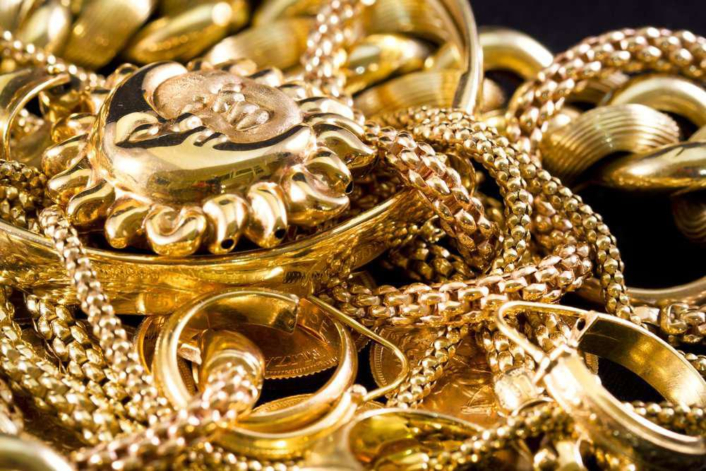

The global demand for gold jewelry has always been substantial, driven by a combination of cultural, economic, and social factors. Countries like India, China, and the United States consistently rank at the top of gold jewelry consumption due to their unique cultural contexts and economic conditions. In many societies, gold jewelry holds a profound cultural significance, often associated with traditional rituals, festive occasions, and familial wealth transfer, making it more than just an ornament.

Gold jewelry is highly valued not only for its aesthetic appeal but also as a form of investment and a symbol of wealth and prosperity. This dual role makes gold a coveted asset across various demographics. Investors and consumers alike are drawn to its perceived stability and enduring value, particularly during times of economic uncertainty. Moreover, in emerging markets, rising disposable incomes and urbanization contribute to increased purchasing power and, consequently, a higher demand for gold jewelry.



In recent years, algorithmic trading in the gold jewelry market has gained traction as technological advancements provide investors with sophisticated tools to optimize their strategies. Algorithmic trading involves the use of computer programs to execute trades based on predetermined criteria, allowing for faster and often more efficient decision-making processes. This approach is transforming the gold jewelry market by enabling investors to analyze vast datasets and execute trades at speeds unattainable by human traders alone.

This article will explore the countries that are registering the highest demand for gold jewelry and how algorithmic trading is beginning to influence this dynamic market. By examining the intersection of cultural norms, economic growth, and technological innovation, we will gain a comprehensive understanding of the factors shaping the global demand for gold jewelry and the strategic advancements in trading practices.

## Table of Contents

## Gold Jewelry Consumption: Historical Overview

Gold jewelry has held a prominent place in various cultures throughout history, symbolizing wealth, status, and religious significance. In ancient Egypt, gold was revered as the flesh of the gods, used extensively in jewelry and royal artifacts. Similarly, in the Indian subcontinent, gold jewelry has been integral to cultural ceremonies and weddings, often seen as a stable investment for generations. The demand for gold jewelry in China also has deep historical roots, influenced by traditions that regard gold as a symbol of prosperity and luck.

Examining trends in global gold jewelry consumption, the year 2019 stood out due to geopolitical uncertainties and economic fluctuations, leading to a notable increase in demand. According to the World Gold Council, gold jewelry consumption reached approximately 2,107 tonnes worldwide in 2019. However, the onset of the COVID-19 pandemic in 2020 significantly impacted global markets, with gold prices fluctuating erratically. By 2022, as economies around the world began to stabilize, gold jewelry demand saw a resurgence, driven by renewed consumer confidence and the easing of restrictions on social gatherings and ceremonies where gold jewelry is traditionally exchanged.

Focusing on the top countries, China, India, and the United States consistently rank high in gold jewelry consumption. In 2019, China consumed an estimated 637 tonnes of gold jewelry, attributed to its large population and cultural affinity towards gold as an investment and status symbol. India, with its rich tradition of gold jewelry in weddings and festivals, accounted for approximately 611 tonnes. The United States, influenced by both fashion trends and investment considerations, consumed about 144 tonnes of gold jewelry the same year.

Despite the challenges posed by the global pandemic, the resilience of the gold jewelry market was evident in 2022, with China and India maintaining their positions as leading consumers. Their cultural emphasis on gold as a stable asset and symbol of prosperity continues to drive demand, reflecting broader global consumption trends in the gold jewelry sector.

## Current Top Countries in Gold Jewelry Demand

India and China continue to dominate the global gold jewelry market, with their demand profoundly influenced by a blend of cultural traditions and robust economic factors. In both nations, gold is deeply embedded in social customs, serving as a symbol of wealth and prosperity. This cultural significance is particularly evident in India, where gold jewelry is integral to major cultural celebrations such as weddings and religious festivals. The Indian market's demand is further augmented by rural consumers, who view gold as a reliable investment, providing a hedge against inflation amidst economic uncertainties.

China, on the other hand, combines tradition with evolving consumer preferences. The rising middle class and increased urbanization have driven the demand for gold jewelry, with younger generations seeking more contemporary designs. Gold remains a traditional gift during significant cultural events such as the Chinese New Year, reflecting its continued importance in Chinese society.

Economic factors are equally significant. In India, the purchasing power and availability of disposable income significantly affect gold demand. This is visible in how changes in GDP and currency strength can either bolster or diminish market activity. Similarly, China's economic policies, such as the regulation of capital flows and the adjustment of tariffs, impact gold jewelry consumption. 

Geopolitical events also play a crucial role. Fluctuations in global gold prices due to international tensions or trade policies can affect demand. For instance, in times of international economic sanctions or tariffs, gold is often seen as a safe investment, leading to increased purchases. India's gold market is particularly sensitive to such changes due to its dependence on imports, while China, as a significant gold producer, has different influencing factors.

Economic policies, such as import duties in India or China's efforts to boost domestic consumption, have immediate impacts on demand. In recent years, the Indian government's initiatives to curb black money led to increased transparency in transactions, affecting the informal gold market. Meanwhile, China's economic strategies, aimed at maintaining sustainable growth, often influence consumer spending patterns on luxury goods, including gold jewelry.

In conclusion, the demand for gold jewelry in India and China is a complex interplay of cultural significance and economic dynamics, with external geopolitical and economic policies shaping market trends. Understanding these factors is essential for predicting future demand and strategizing in the gold jewelry market.

## Algorithmic Trading in Gold Jewelry

Algorithmic trading, often known as algo-trading, refers to the use of computer algorithms to automate the trading process. It involves the execution of trading orders at speeds and frequencies that are impossible for human traders. This approach employs complex formulas, mathematical models, and high-speed computing to make decisions about buying or selling assets. In the context of the gold market, [algorithmic trading](/wiki/algorithmic-trading) has begun to influence investment strategies in gold jewelry.

The application of algorithmic trading in the gold jewelry market primarily revolves around leveraging price discrepancies, optimizing the timing of purchases and sales, and managing risk. Given the rapid price fluctuations often observed in the gold market due to socio-economic and geopolitical factors, algorithmic trading can provide significant advantages by executing trades based on predetermined conditions set by quantitative models.

**Benefits of Algorithmic Trading**

1. **Speed and Efficiency**: Algorithms can process vast amounts of data and execute transactions at speeds much faster than human capabilities. This rapid processing facilitates the quick buying and selling of gold jewelry stocks or related assets to capitalize on short-lived price differentials. 

2. **Precision**: Algo-trading allows for precise entry and exit strategies, reducing the likelihood of human errors such as incorrect timing or transaction sizes. This precision helps in minimizing slip-ups and optimizing returns.

3. **Cost Reduction**: Reducing human intervention tends to lower transaction costs. Algorithms can consistently and efficiently manage complex trades, reducing the need for large teams of analysts and traders, thus cutting operational costs.

4. **Risk Management**: Algorithms can be programmed to account for various risk parameters and adjust strategies accordingly in real-time. This capability is crucial in volatile markets such as gold, where unforeseen fluctuations can significantly impact valuations.

**Challenges of Algorithmic Trading**

1. **Technical Failures**: Despite the robustness of modern algorithms, system failures or bugs can lead to significant losses. Ensuring thorough testing and redundancy systems is vital to mitigate such risks.

2. **Market Impact**: The rapid pace of algo-trading can sometimes lead to increased volatility rather than reducing it. An influx of algorithm-driven orders can cause sharp swings in prices, affecting overall market stability.

3. **Regulatory Concerns**: This method of trading often faces scrutiny under financial regulations that aim to maintain fair and transparent market conditions. Compliance with these regulations can be complex and demand stringent audits and documentation.

**Examples of Algorithmic Trading Strategies**

- **Statistical Arbitrage**: This strategy involves using statistical models to identify mispricing in gold futures compared to jewelry stock prices, creating opportunities for arbitrage trades. By employing mean reversion models, traders can exploit transient pricing inefficiencies.

- **Momentum Trading**: Algorithms can identify trends, going long or short on gold assets based on current market momentum. For example, if gold prices are climbing due to geopolitical tensions, an algorithm may buy into this upward trend, driving investments in gold jewelry.

- **Machine Learning Models**: Advanced algorithms imbued with machine learning capabilities analyze historical data to predict future price movements. These models can adapt to new data, improving prediction accuracy over time, and providing valuable insights for trading strategies.

In conclusion, while algorithmic trading presents numerous opportunities for increased efficiency and reduced costs in gold jewelry investments, it also brings certain challenges that require careful consideration. Balancing these factors is essential for leveraging the full potential of algo-trading in this niche market.

## The Future of Gold Jewelry Demand and Trading

The future of gold jewelry demand is poised to be shaped by a confluence of economic, cultural, and technological factors. The enduring allure of gold as a symbol of wealth and status, combined with its investment potential, suggests sustained interest across global markets. However, potential shifts in demand will be influenced by economic stability, cultural evolution, and rapid technological advancements.

### Economic Stability and Cultural Shifts

Economic stability remains a critical determinant of gold jewelry demand. In periods of economic growth, disposable incomes typically increase, allowing consumers to spend more on luxury items, including gold jewelry. Countries like China and India, which have robust cultural affinities toward gold, are likely to continue being major consumers, especially as their middle classes expand. Cultural shifts, such as changing fashion trends and increased environmental awareness, may also impact the types of gold jewelry favored by consumers. Moreover, younger generations might prioritize sustainability and ethical sourcing, potentially driving demand for recycled gold and fair-trade jewelry.

### Technological Advancements and Algorithmic Trading

Technological advancements are expected to play a pivotal role in shaping the future of gold jewelry markets. Algorithmic trading, which employs computer algorithms to execute trades at high speed, is increasingly being integrated into the precious metals market. Though traditionally associated with stocks and commodities, algorithms are being adapted for the gold jewelry sector to optimize trading strategies and predict market movements.

The potential growth of algorithmic trading in this market segment is substantial. These systems can analyze vast datasets to identify patterns and trends that are not readily evident to human traders. Algorithmic trading offers the advantage of eliminating emotional bias, enabling more objective decision-making in investment strategies.

To better understand this, consider a simple moving average crossover strategy, often used in trading:

```python
def moving_average(data, window_size):
    return np.convolve(data, np.ones(window_size)/window_size, mode='valid')

# Hypothetical example for gold jewelry market prices
gold_prices = [1500, 1520, 1540, 1530, 1550, 1570, 1560, 1580, 1600, 1620]
short_window = moving_average(gold_prices, 3)
long_window = moving_average(gold_prices, 5)

buy_signals = (short_window > long_window)[:-2]

print("Buy signals at:", np.nonzero(buy_signals)[0])
```

### Challenges Ahead

Despite these opportunities, the industry faces significant challenges. Economic fluctuations and geopolitical instability can abruptly alter market dynamics. Regulatory changes and tariffs can influence trade flows and pricing structures. Additionally, the implementation of algorithmic trading systems is not without its hurdles; it requires substantial investment in technology and expertise, and the risk of technical failures could lead to financial losses.

Cybersecurity remains a pressing concern as increasing digitalization exposes trading platforms to potential cyber threats. Ensuring the integrity and security of these systems will be integral to maintaining investor confidence and market stability.

In conclusion, while the future of gold jewelry demand and trading is laden with opportunities driven by economic growth and technological innovation, it must also navigate an array of challenges to realize its full potential.

## Conclusion

In reviewing the landscape of gold jewelry demand, it becomes clear that cultural, economic, and technological factors play significant roles in shaping global markets. Countries such as India and China remain at the forefront of gold consumption, driven by cultural traditions and burgeoning economies, which contribute to sustained demand. Meanwhile, economic policies and geopolitical events continue to influence market dynamics.

Algorithmic trading, with its systematic approach to investment and market analysis, is increasingly being recognized for its potential to revolutionize trading strategies in the gold jewelry sector. By employing algorithms to analyze vast amounts of data and predict market trends, investors can optimize their decision-making processes, thus enhancing their potential for returns. While algorithmic trading offers numerous benefits, such as removing emotional bias and improving efficiency, it is not without its challenges, including the need for sophisticated technology and potential market [volatility](/wiki/volatility-trading-strategies).

For investors in the gold market, adapting to these technological advancements is imperative. Embracing algorithmic trading could provide a competitive edge, enabling them to navigate the complexities of gold jewelry investments more effectively. Future exploration and research into advanced trading strategies are essential for understanding how these tools can be further refined and applied to maximize investment outcomes. The continued evolution of technology in the gold jewelry market promises not only to transform trading but to unlock new opportunities for growth and innovation.

## References & Further Reading

[1]: World Gold Council. (2019). ["Gold Demand Trends Full Year 2019."](https://www.gold.org/goldhub/research/gold-demand-trends/gold-demand-trends-full-year-2019) 

[2]: World Gold Council. (2022). ["Gold Demand Trends Full Year 2022."](https://www.gold.org/goldhub/research/gold-demand-trends/gold-demand-trends-full-year-2022)

[3]: Lopez de Prado, M. (2018). ["Advances in Financial Machine Learning."](https://www.amazon.com/Advances-Financial-Machine-Learning-Marcos/dp/1119482089) John Wiley & Sons.

[4]: Chan, E. P. (2009). ["Quantitative Trading: How to Build Your Own Algorithmic Trading Business."](https://github.com/ftvision/quant_trading_echan_book) Wiley Trading.

[5]: Aronson, D. R. (2006). ["Evidence-Based Technical Analysis: Applying the Scientific Method and Statistical Inference to Trading Signals."](https://www.amazon.com/Evidence-Based-Technical-Analysis-Scientific-Statistical/dp/0470008741) Wiley.

[6]: Jansen, S. (2020). ["Machine Learning for Algorithmic Trading."](https://github.com/stefan-jansen/machine-learning-for-trading) Packt Publishing.