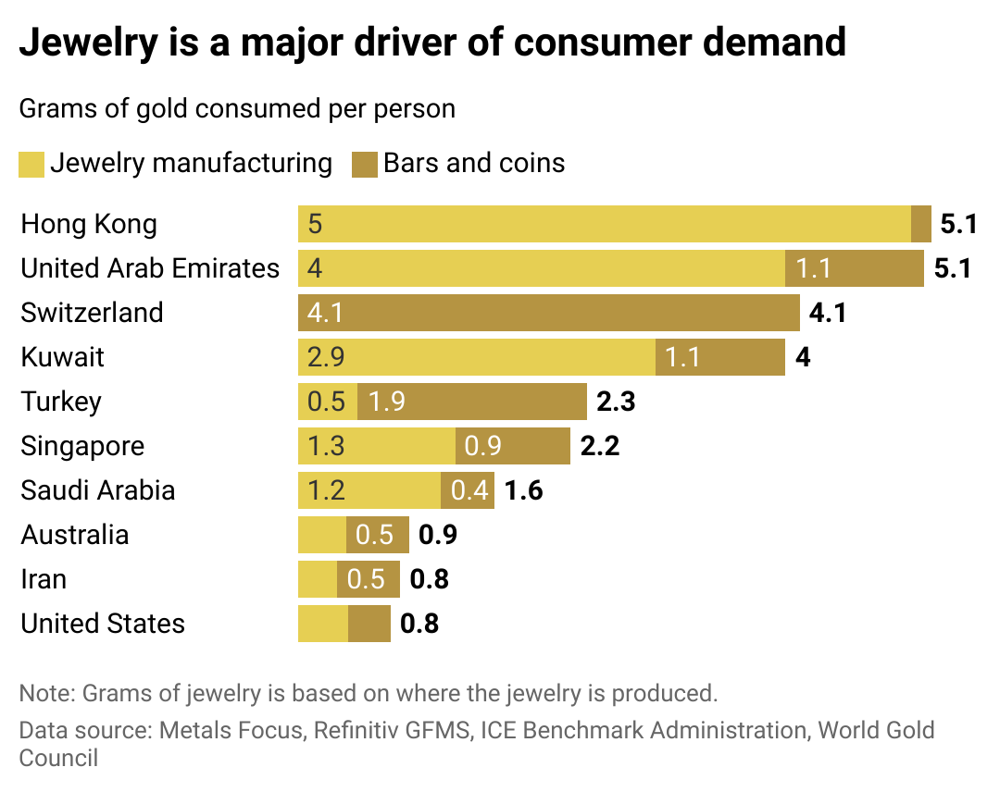

## Table of Contents

## What is gold jewelry?

Gold jewelry is jewelry made from gold, a shiny yellow metal that people have loved for thousands of years. It can be made into rings, necklaces, bracelets, and earrings. People wear gold jewelry because it looks nice and it can make them feel special. Gold is soft, so it is often mixed with other metals to make it stronger. This mix is called an alloy.

There are different kinds of gold jewelry. Some are made of pure gold, which is 24 karats. But this is very soft and not used often for jewelry. Most gold jewelry is 14 or 18 karats, which means it is mixed with other metals. The color of gold jewelry can be yellow, white, or even rose, depending on what other metals are mixed with it. People choose gold jewelry for special events like weddings or to give as gifts because it is valuable and lasts a long time.

## Why do people buy gold jewelry?

People buy gold jewelry for many reasons. One big reason is that gold looks beautiful and shiny. It makes people feel special and pretty when they wear it. Gold jewelry is also a way to show love or celebrate special times like weddings or birthdays. When someone gives gold jewelry as a gift, it shows they care a lot because gold is expensive and valuable.

Another reason people buy gold jewelry is because it can be a good investment. Gold keeps its value over time, so it can be a way to save money. If the price of gold goes up, the jewelry can be worth more than what was paid for it. Also, gold is a metal that lasts a long time, so the jewelry can be passed down in families from one generation to the next. This makes it not just a piece of jewelry, but a family treasure.

## Which country has the highest demand for gold jewelry?

India has the highest demand for gold jewelry in the world. People in India love gold and use it a lot for special events like weddings. It's a big part of their culture. In Indian weddings, the bride often wears a lot of gold jewelry. It's also common for families to give gold as gifts during festivals and celebrations.

The demand for gold jewelry in India is also because many people see gold as a good way to save money. They buy gold not just to wear, but also to keep as a valuable thing that can be sold later if they need money. This makes gold very important in Indian households, and it's why India buys more gold jewelry than any other country.

## How is the demand for gold jewelry measured?

The demand for gold jewelry is measured by looking at how much gold jewelry people buy in a certain time, like a year. This can be done by checking how much gold is sold to jewelry makers and then how much of that gold is turned into jewelry that people buy. Countries keep track of this by looking at sales numbers from jewelry stores and gold markets.

Another way to measure demand is by looking at how much gold is imported into a country. If a country does not have its own gold mines, it will buy gold from other places. By seeing how much gold a country brings in, we can guess how much of it will be used for making jewelry. This helps to understand if the demand for gold jewelry is going up or down.

## What cultural factors influence gold jewelry demand in different countries?

In many countries, culture plays a big role in how much gold jewelry people buy. For example, in India, gold is very important for weddings and festivals. When people get married, the bride wears a lot of gold jewelry. It shows wealth and brings good luck. Families also give gold as gifts during special times like Diwali. This makes the demand for gold jewelry in India very high. People there see gold not just as something pretty to wear, but also as a way to save money for the future.

In China, gold jewelry is also popular, but for different reasons. Red and gold are lucky colors in Chinese culture. People buy gold jewelry for the Chinese New Year and other celebrations. It's common to give gold as a gift to wish someone good luck and happiness. Also, in China, buying gold is seen as a smart way to keep money safe. This cultural belief makes the demand for gold jewelry in China strong. 

In the Middle East, especially in countries like the United Arab Emirates, gold jewelry is a big part of the culture too. People there wear a lot of gold to show their wealth and status. Gold is also important for weddings and other special events. Women often wear heavy gold jewelry as a sign of their family's wealth. This cultural practice keeps the demand for gold jewelry high in these countries.

## How has the demand for gold jewelry changed over the past decade?

Over the past decade, the demand for gold jewelry has seen some big changes. In countries like India and China, the demand has been strong, but it has gone up and down because of things like the economy and changes in what people want. For example, when the economy is doing well, people buy more gold jewelry because they have more money to spend. But when the economy is not doing well, they might buy less because they need to save money. Also, more people are now choosing different kinds of jewelry, like those made from other metals or even fake jewelry that looks like gold.

In other parts of the world, like Europe and the United States, the demand for gold jewelry has not grown as much. People there are buying less gold jewelry than before. This is because they are more interested in other types of jewelry, like those made from silver or platinum. Also, some people are choosing to spend their money on other things, like technology or travel, instead of buying gold jewelry. So, while the demand for gold jewelry has stayed strong in some places, it has changed a lot in others over the past ten years.

## What economic factors affect the demand for gold jewelry?

Economic factors play a big role in how much gold jewelry people buy. When the economy is doing well, people have more money to spend on things they want, like gold jewelry. They feel confident about their jobs and money, so they are more likely to buy expensive items. But when the economy is not doing well, people might be worried about losing their jobs or not having enough money. This makes them spend less on things like gold jewelry and save their money for things they need more.

The price of gold itself is another important economic factor. If the price of gold goes up a lot, people might think twice before buying gold jewelry because it becomes more expensive. On the other hand, if the price of gold goes down, more people might buy gold jewelry because it feels like a good deal. Also, changes in the value of money, like inflation, can affect how much gold jewelry people buy. If prices for everything are going up, people might see gold as a safe way to keep their money's value, so they might buy more gold jewelry.

## How do government regulations impact the gold jewelry market?

Government rules can change how people buy and sell gold jewelry. Some countries have laws about how much gold can be brought into the country. If the government makes it hard to bring in gold, it can make gold jewelry more expensive or harder to find. This can make people buy less gold jewelry. Also, governments might put taxes on gold, which makes the price go up. When gold jewelry costs more because of taxes, people might choose to buy less of it or look for cheaper options.

Another way government rules affect the gold jewelry market is by setting standards for the quality of gold. Some countries have rules that say how pure gold has to be in jewelry. This can help make sure people get what they pay for, but it can also make it harder for small jewelry makers to sell their products if they can't meet these standards. Governments might also control how gold is sold, like making sure it is sold in certain places or with certain labels. These rules can change how much gold jewelry people buy and how much it costs.

## What are the trends in gold jewelry design that influence demand?

Gold jewelry designs change over time, and these changes can make people want to buy more or less gold jewelry. One big trend now is for jewelry that mixes gold with other metals like silver or rose gold. This makes the jewelry look different and modern. People like this because it is a new way to wear gold. Another trend is for jewelry that has a lot of detail, like tiny patterns or stones set into the gold. This makes the jewelry look special and fancy, so more people want to buy it.

Another trend that affects how much gold jewelry people buy is the move towards simpler, cleaner designs. Some people like jewelry that is not too busy and looks more like art. This kind of jewelry is often called "minimalist." It can be just a simple gold ring or a thin gold chain. People who like this style might buy more gold jewelry because it fits with their taste. Also, the use of recycled gold is becoming more popular. People who care about the environment like to buy jewelry made from gold that has been used before. This can make the demand for gold jewelry go up because more people want to buy eco-friendly products.

## How does the recycling of gold jewelry affect overall demand?

Recycling gold jewelry can change how much new gold jewelry people want to buy. When people recycle their old gold jewelry, it can be turned into new pieces. This means less new gold needs to be mined from the earth. If more people choose to buy jewelry made from recycled gold, it might make the demand for new gold jewelry go down a little. But if people like the idea of recycling and see it as a good thing, it can also make them want to buy more gold jewelry because they feel good about helping the environment.

Also, recycling gold jewelry can keep the demand for gold high because it keeps gold valuable. When people know they can sell their old gold jewelry and get money for it, they might be more likely to buy gold jewelry in the first place. This is because they know it's not just something pretty to wear, but also something they can use again later. So, recycling can make the demand for gold jewelry stay strong or even grow because people see gold as a smart choice that lasts a long time.

## What role do gold mining and production play in meeting jewelry demand?

Gold mining and production are very important for making gold jewelry. When people want to buy gold jewelry, the gold has to come from somewhere. Most of the time, it comes from mines. People dig deep into the earth to find gold. After they find it, they take it out and clean it up. This gold then goes to places where it is turned into jewelry. If a lot of people want to buy gold jewelry, more gold needs to be mined and produced to meet that demand.

But mining gold can be hard and expensive. It takes a lot of work and money to get gold out of the ground. Sometimes, the price of gold goes up because it is hard to find or because it costs a lot to mine it. When the price of gold goes up, it can make gold jewelry more expensive. This might make people buy less gold jewelry. But if new ways to mine gold are found, or if more gold is found in the ground, it can help keep the price down and make more gold jewelry available for people to buy.

## How do global economic conditions forecast future demand for gold jewelry?

Global economic conditions can help us guess how much gold jewelry people might want to buy in the future. When the world's economy is doing well, people have more money to spend on things they like, like gold jewelry. They feel safe about their jobs and money, so they are more likely to buy expensive things. But if the economy is not doing well, people might worry about losing their jobs or not having enough money. This can make them spend less on things like gold jewelry and save more for things they really need.

The price of gold also plays a big role in how much gold jewelry people will buy. If the price of gold goes up a lot, gold jewelry can become more expensive, and people might buy less of it. But if the price of gold goes down, more people might buy gold jewelry because it feels like a good deal. Also, if there are big changes in the world, like wars or big money problems, people might see gold as a safe way to keep their money. This can make the demand for gold jewelry go up because people want to protect their money by buying gold.

## References & Further Reading

[1]: World Gold Council. (2019). ["Gold Demand Trends Full Year 2019."](https://www.gold.org/goldhub/research/gold-demand-trends/gold-demand-trends-full-year-2019) 

[2]: World Gold Council. (2022). ["Gold Demand Trends Full Year 2022."](https://www.gold.org/goldhub/research/gold-demand-trends/gold-demand-trends-full-year-2022)

[3]: Lopez de Prado, M. (2018). ["Advances in Financial Machine Learning."](https://www.amazon.com/Advances-Financial-Machine-Learning-Marcos/dp/1119482089) John Wiley & Sons.

[4]: Chan, E. P. (2009). ["Quantitative Trading: How to Build Your Own Algorithmic Trading Business."](https://github.com/ftvision/quant_trading_echan_book) Wiley Trading.

[5]: Aronson, D. R. (2006). ["Evidence-Based Technical Analysis: Applying the Scientific Method and Statistical Inference to Trading Signals."](https://www.amazon.com/Evidence-Based-Technical-Analysis-Scientific-Statistical/dp/0470008741) Wiley.

[6]: Jansen, S. (2020). ["Machine Learning for Algorithmic Trading."](https://github.com/stefan-jansen/machine-learning-for-trading) Packt Publishing.