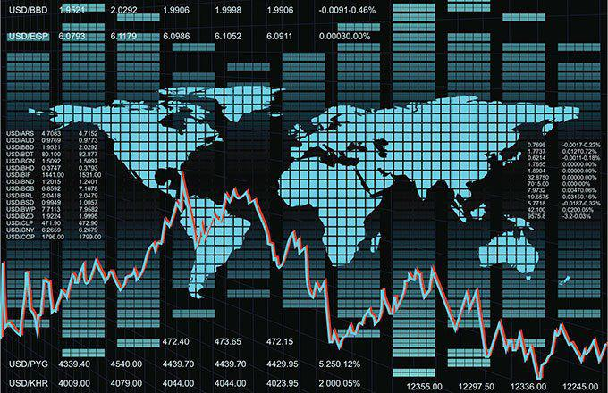

Understanding savings rates is crucial for assessing the economic health of different countries. Savings rates represent the proportion of income that is saved rather than spent. High savings rates are often indicative of a country’s potential for future investment and development, as savings form the basis for capital accumulation.

This article explores the top countries with high savings rates and the factors influencing these rates. Countries with high savings rates usually possess unique economic characteristics and social behaviors encouraging individuals and governments to prioritize saving. These factors can range from cultural attitudes toward frugality to strategic governmental policies that foster an environment conducive to saving.



We also examine the role of algorithmic trading in managing these savings effectively. In today's financial ecosystems, algorithmic trading has become a pivotal tool for optimizing savings and investment portfolios. Advanced algorithms analyze vast datasets to make informed decisions, thereby maximizing returns and managing risks better than traditional investment approaches.

Ultimately, a holistic view of savings rates helps in navigating investment and economic strategies globally. Understanding the dynamics of savings not only provides insights into economic stability but also helps in strategizing for long-term growth. High savings rates can be both an opportunity and a challenge, requiring careful navigation to balance between saving and consumption, ensuring sustainable economic development.

Let's begin with a closer look at countries known for their high savings rates and explore the underlying reasons. By examining these nations, we can identify patterns and strategies that other economies might adopt to enhance their savings frameworks and unlock potential growth avenues.

## Table of Contents

## The Top High Savings Countries

Understanding savings rates is a vital component in analyzing the economic stability and growth potential of countries around the globe. Several countries stand out for their high national savings rates, reflecting a combination of wealth accumulation, strategic resource management, and cultural inclinations towards savings.

Djibouti is remarkable for its unexpected surge in national savings, reaching a significant rate of 84.9%. This figure represents a monumental increase over its historical averages, however, detailed analyses on why Djibouti's savings rate has reached such levels are scant but could be attributed to recent economic policies encouraging monetary retention and foreign aid inflows contributing to national reserves.

Qatar exemplifies a high savings rate driven predominantly by its lucrative oil and gas revenues. As one of the richest countries per capita, Qatar has capitalized on its vast oil exports to bolster its national reserves. The state’s sovereign wealth fund, Qatar Investment Authority, effectively manages these funds to ensure long-term economic stability. Furthermore, a robust exchange rate regime underpins this financial foundation by maintaining currency stability, further encouraging savings.

Ireland's high savings rate is noteworthy, particularly in light of recent financial crises impacting Europe. The country’s economic resilience is attributed to a diversified economy that includes a strong tech sector, international investments, and adaptive fiscal policies. These elements combine to support disposable income levels, encouraging both household savings and national reserves.

Similarly, nations like Gabon and Brunei benefit considerably from their oil resources. Gabon's economy, heavily reliant on oil exports, directs a significant portion of its revenue into savings to sustain national development and economic stability. Brunei, with its substantial oil and gas sectors, channels income into its sovereign wealth fund, allowing for significant savings while planning for a post-oil economy.

Singapore, renowned for its high savings rate, demonstrates the impact of disciplined economic policies and a developed industrial sector. The island nation’s government has historically promoted a savings culture through compulsory contributions to the Central Provident Fund, a pension system that mandates savings for retirement. Coupled with policies fostering industrialization and trade, Singapore has positioned itself as a global financial hub with substantial national savings.

Each of these countries exemplifies unique paths to achieving and sustaining high savings rates. Whether through natural resource management, economic resilience, or strategic policy implementations, the common [factor](/wiki/factor-investing) is a commitment to enhancing economic stability and preparing for future growth opportunities.

## Economic Factors Behind High Savings Rates

Economic growth is often closely linked with higher savings rates, primarily due to rising incomes that enable individuals and households to set aside a larger portion of their earnings. This section explores the economic factors that contribute to high savings rates in various countries and how these elements can impact national and global economic landscapes.

A significant contributor to high savings rates is the presence of oil wealth. Countries rich in oil resources, such as Qatar and Brunei, often experience substantial inflows of revenue from oil exports. This wealth accumulation enables these nations to funnel earnings into national reserves and sovereign wealth funds, ensuring long-term financial stability. For instance, sovereign wealth funds, which are state-owned investment funds, have been instrumental in managing and investing the oil revenues of these countries to enhance their savings rates further.

Moreover, the tax regime of a country plays a critical role in influencing savings behavior. Lower taxes on income and capital gains increase disposable income, allowing individuals to retain a larger share of their earnings rather than spending or investing them immediately. This incentivization of retention over consumption can result in domestic and foreign stakeholders accumulating substantial savings within a country. Luxembourg, renowned for its favorable tax environment, serves as a prominent example. Its status as a tax haven attracts foreign capital, thereby boosting national savings rates significantly.

Additionally, strategic economic policies can also influence savings rates. Governments may implement programs that encourage savings through state-sponsored savings schemes or incentivize investment in pension funds and other long-term savings plans. These initiatives can amplify national savings by providing structured avenues for citizens to allocate their financial resources.

Countries that manage to balance these economic factors effectively tend to exhibit robust savings rates, contributing to their overall economic health and resilience. By understanding these dynamics, policymakers can design strategies to foster an environment conducive to both savings and sustainable economic growth.

## The Role of Algorithmic Trading in Savings Management

Algorithmic trading employs advanced computational techniques and mathematical models to manage investment portfolios, offering strategic advantages in managing savings in high-savings economies. By automating the trading process, these algorithms ensure efficient and effective management of financial assets, optimizing returns over time while minimizing human errors.

In high-savings economies, where large volumes of capital are involved, [algorithmic trading](/wiki/algorithmic-trading) becomes indispensable. It maximizes returns by executing trades at optimal prices and speeds unachievable by manual trading. These algorithms analyze vast amounts of market data, identifying trends and patterns that inform trading decisions. For instance, they can process real-time market prices, economic indicators, and historical data to forecast market movements and adjust trading strategies accordingly.

One significant advantage of algorithmic trading is its ability to mitigate risks associated with fluctuating global markets. Through diversified portfolio management and strategic asset allocation, these algorithms reduce exposure to market [volatility](/wiki/volatility-trading-strategies). For example, they can execute hedging strategies that protect against downside risks or re-balance portfolios to maintain a favorable risk-return ratio, as exemplified in the following Python implementation:

```python
import numpy as np

def calculate_hedge_ratio(portfolio_values, benchmark_values):
    covariance_matrix = np.cov(portfolio_values, benchmark_values)
    hedge_ratio = covariance_matrix[0, 1] / covariance_matrix[1, 1]
    return hedge_ratio

# Example usage
portfolio = np.array([120, 130, 150, 170])
benchmark = np.array([115, 125, 145, 165])
hedge_ratio = calculate_hedge_ratio(portfolio, benchmark)
print("Hedge Ratio:", hedge_ratio)
```

Algorithmic trading further facilitates the efficient allocation of resources within sovereign wealth funds (SWFs), which are pivotal in high-savings countries. These funds often manage enormous assets that require sophisticated strategies to harness economic benefits for future generations. By employing algorithmic trading, SWFs can dynamically adjust asset allocations, optimize foreign exchange operations, and implement structured investment policies to maximize long-term gains.

In summary, algorithmic trading significantly enhances the management of savings in high-savings countries by maximizing returns, mitigating risks, and ensuring efficient resource allocation within sovereign wealth funds. This innovative approach leverages computational prowess to navigate complex financial landscapes, safeguarding and boosting the economic welfare of nations with hefty savings.

## Challenges of High Savings Rates

While high savings rates hold many advantages, such as providing a cushion during economic downturns and increasing national wealth, they also present several challenges. One prominent issue is the potential reduction in consumption, which can slow economic growth. According to the Keynesian economic theory, consumption is a primary driver of economic activity. Thus, when savings rates are excessively high, a significant portion of income is withheld from the market, leading to lower consumption and reduced aggregate demand. This scenario can stagnate or slow down economic growth, as businesses experience decreased revenue and may subsequently reduce production and investment.

During recessions, the inclination towards increased savings can exacerbate economic downtrends. Known as the paradox of thrift, this concept highlights how, when individuals collectively increase savings in times of economic uncertainty, it can lead to a fall in overall demand. This decreased demand can deepen economic slumps, as reduced spending leads to lower GDP growth and can further depress economic conditions. For instance, if consumers and businesses alike decide to save rather than spend, the resulting drop in consumption can lead to unemployment and reduced economic output, creating a feedback loop that is difficult for an economy to escape from.

The balance between savings and investment is crucial, particularly in developing economies. These economies need a steady inflow of investments to drive growth, boost infrastructure, and develop industries. High savings rates should ideally translate into increased investments. However, if these savings are not efficiently converted into productive investments, they may lead to capital hoarding rather than fostering economic expansion. Developing nations often struggle with channeling savings into investments due to infrastructural deficits, limited financial market depth, or lack of investment opportunities. Therefore, policy interventions that facilitate the transformation of savings into domestic investments are essential to ensure that savings contribute positively to economic growth.

In conclusion, while high savings rates have undeniable benefits, they must be managed carefully to avoid adverse economic impacts. Striking a balance between savings and consumption and ensuring that savings lead to productive investments can help mitigate these challenges and foster sustainable economic growth.

## Case Studies: Lessons from High-Saving Countries

Norway, Singapore, and China provide insightful examples of how high-savings countries effectively utilize their savings to bolster economic stability and growth.

### Norway: A Model of Prudence
Norway exemplifies the effective management of natural resource wealth through its Government Pension Fund Global, often referred to as the Oil Fund. This fund is financed primarily by oil revenues and is used to ensure long-term financial stability for future generations. Norway's strategy combines this oil wealth with a prudent financial approach characterized by conservative fiscal policies and diversified investments. The country's emphasis on fiscal responsibility and transparent governance strengthens economic resilience and prevents dependency on volatile oil prices. By investing in a diverse global portfolio, Norway mitigates risks and ensures stable returns, benefiting both current and future citizens.

### Singapore: Strategic Investment in Technology and Infrastructure
Singapore demonstrates how strategic government policies can turn a high savings rate into a tool for rapid development. The country's Central Provident Fund (CPF) is a comprehensive social security savings plan that mandates savings from workers, ensuring high national savings. The CPF system supports public housing, healthcare, and retirement, illustrating effective savings utilization. Furthermore, Singapore invests heavily in technology and infrastructure, fostering an environment conducive to innovation and business. This strategic focus attracts foreign direct investment, underpins economic growth, and enhances the city-state's global competitiveness.

### China: Cultural and Economic Planning Influences
China's high savings rate is shaped by both cultural attitudes and economic planning. Traditionally, Chinese households exhibit a strong propensity to save, influenced by cultural norms emphasizing financial security. This behavior is complemented by government policies that encourage savings and investments. China's approach involves channeling household and corporate savings into significant infrastructure and industrial projects, facilitating rapid economic development. Additionally, China's financial institutions are organized to direct savings into productive investments, driving industrialization and urbanization. The high savings rate has been pivotal in financing the country's expansive economic growth and transformation into a manufacturing powerhouse.

These case studies illustrate the diverse ways high-savings countries manage their resources effectively. By examining successful strategies, other nations can learn to harness their savings rates to support sustainable economic growth and stability.

## Strategies for Harnessing Savings Rates for Economic Growth

Balancing public policy to encourage both savings and consumption plays a vital role in leveraging high savings rates for economic growth. When savings are overly prioritized, consumption can fall, potentially stalling economic dynamism. Therefore, crafting policies that create a conducive environment for both savings and spending is vital. These policies may include offering tax incentives for savings while also promoting spending through targeted fiscal policies that enhance consumer confidence.

Implementing algorithmic trading is another strategy to optimize the management of accumulated savings. Algorithmic trading employs sophisticated computational methods to manage investment portfolios efficiently. By using algorithms, countries with high savings can achieve optimal returns on investments by identifying profitable opportunities in real-time and executing trades that minimize risk. This technology can process large datasets to forecast market trends, helping to stabilize returns even in volatile markets. An example of a simple moving average crossover strategy utilized in algorithmic trading is as follows:

```python
def moving_average(data, window_size):
    return data.rolling(window=window_size).mean()

# Example usage
import pandas as pd

prices = pd.Series([100, 102, 104, 103, 105, 107])  # example price data
short_window = moving_average(prices, 2)
long_window = moving_average(prices, 4)

signals = []

for short, long in zip(short_window[1:], long_window[3:]):
    if short > long:
        signals.append('Buy')
    else:
        signals.append('Sell')

signals
```

Encouraging investment in infrastructure and technology is essential for fostering economic resilience and utilizing savings productively. Infrastructure investment, such as in transportation, energy, and communication, can boost economic activity by improving efficiency and connectivity. Likewise, investing in technology can propel innovation, improve productivity, and create new industries, thereby contributing to long-term economic growth. By strategically channeling savings into these areas, countries can build robust economic systems that are capable of withstanding global economic fluctuations and enhancing living standards. 

In summary, harmonizing public policy, leveraging algorithmic trading, and investing in infrastructure and technology are crucial strategies for harnessing savings rates to stimulate economic growth effectively.

## Conclusion

High savings rates are a double-edged sword for global economies, offering both substantial opportunities and notable challenges. On one hand, they provide a robust buffer against economic instability, enabling countries to weather financial storms. Nations with high savings profiles have a distinct advantage, as considerable reserves can be leveraged for investment in critical infrastructure, healthcare, and education, thus laying the groundwork for sustainable development. To maximize these benefits, countries must employ efficient investment strategies that not only preserve wealth but also facilitate long-term economic growth.

One of the most significant advancements in the management of national wealth in high-savings nations is the implementation of algorithmic trading. Algorithmic trading employs sophisticated algorithms to manage investment portfolios, optimizing returns while minimizing risks. This technology is crucial for handling the complex and often volatile nature of global financial markets. By adopting algorithmic trading, countries can enhance the efficiency of their savings management, ensuring that their substantial reserves are invested wisely and effectively.

Moreover, understanding and navigating the dynamics of savings and consumption is critical for maintaining a healthy balance within an economy. Excessive savings can lead to reduced consumption, which might slow economic growth by curtailing demand. Thus, it is essential for countries to strike a balance between encouraging savings and stimulating consumption to avoid stagnation.

Countries that master the art of managing high savings rates can achieve sustainable economic growth by channeling their reserves into productive investments that bolster their economic resilience. This involves not only implementing advanced trading technologies but also crafting policies that support a balanced economic environment. In conclusion, high savings rates, when managed adeptly, can serve as a cornerstone for long-term prosperity and economic stability.

## References & Further Reading

[1]: Bergstra, J., Bardenet, R., Bengio, Y., & Kégl, B. (2011). ["Algorithms for Hyper-Parameter Optimization."](https://papers.nips.cc/paper/4443-algorithms-for-hyper-parameter-optimization) Advances in Neural Information Processing Systems 24.

[2]: ["Advances in Financial Machine Learning"](https://www.amazon.com/Advances-Financial-Machine-Learning-Marcos/dp/1119482089) by Marcos Lopez de Prado

[3]: ["Evidence-Based Technical Analysis: Applying the Scientific Method and Statistical Inference to Trading Signals"](https://www.amazon.com/Evidence-Based-Technical-Analysis-Scientific-Statistical/dp/0470008741) by David Aronson

[4]: ["Machine Learning for Algorithmic Trading"](https://github.com/stefan-jansen/machine-learning-for-trading) by Stefan Jansen

[5]: ["Quantitative Trading: How to Build Your Own Algorithmic Trading Business"](https://books.google.com/books/about/Quantitative_Trading.html?id=j70yEAAAQBAJ) by Ernest P. Chan