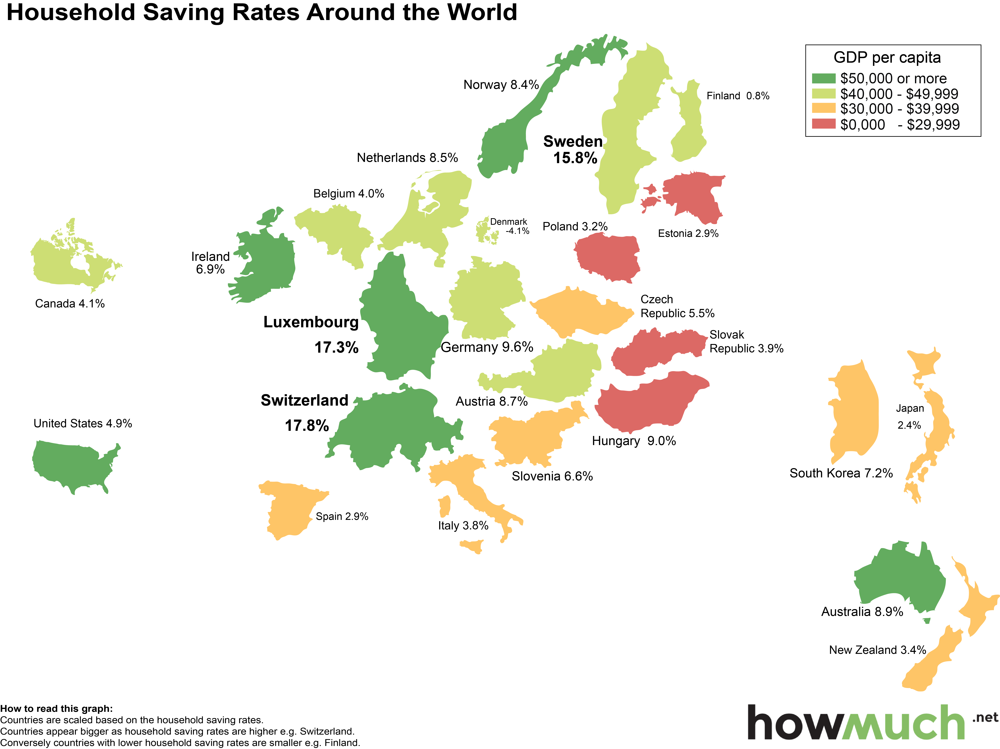

## Table of Contents

## What is a savings rate?

A savings rate is the percentage of your income that you save instead of spending. It shows how much of your money you are putting aside for the future. For example, if you earn $100 and save $10, your savings rate is 10%. This rate is important because it helps you understand if you are saving enough to reach your financial goals, like buying a house or retiring.

To calculate your savings rate, you take the amount of money you save each month and divide it by your total income for that month. Then, you multiply the result by 100 to get a percentage. For instance, if you save $500 out of a $2,000 monthly income, your savings rate is (500 / 2000) * 100 = 25%. A higher savings rate means you are setting aside more money for the future, which can help you achieve financial security.

## Why is the savings rate important for a country's economy?

The savings rate is important for a country's economy because it shows how much money people are saving instead of spending. When people save more, they have more money to invest in things like businesses, homes, and education. This can help the economy grow because businesses can use the money to create jobs and make new products. If many people save a lot, banks have more money to lend, which can help more people start businesses or buy homes.

On the other hand, if the savings rate is too high, it might mean people are not spending enough. When people don't spend money, businesses might sell less and could have to lay off workers. This can slow down the economy. So, a balance is important. A good savings rate helps the economy by providing money for investment, but it should not be so high that it stops people from spending on goods and services.

## Which countries have the highest savings rates?

Some countries have very high savings rates. For example, in 2022, China had one of the highest savings rates in the world, with people saving about 45% of their income. This high rate is partly because many Chinese families save money to pay for big things like homes and education. Another country with a high savings rate is Singapore, where people saved around 40% of their income. Singapore has a strong culture of saving, and the government also encourages people to save for retirement through programs like the Central Provident Fund.

Other countries with high savings rates include Switzerland and Germany. In Switzerland, people saved about 25% of their income in 2022. The Swiss often save money to keep their finances secure and to invest in their future. In Germany, the savings rate was around 18% in the same year. Germans save money for similar reasons, focusing on financial stability and future investments. These countries show that saving a lot of money is important to many people around the world.

## How is the savings rate calculated?

The savings rate is the percentage of your income that you save instead of spend. To find it, you take the amount of money you save each month and divide it by your total income for that month. Then, you multiply the result by 100 to get a percentage. For example, if you save $200 out of a $1,000 monthly income, your savings rate is (200 / 1000) * 100 = 20%.

This calculation can be used for individuals, but it's also used to find the savings rate for a whole country. For a country, you add up all the money people save and divide it by the total income of everyone in the country. Then, you multiply by 100 to get the national savings rate. This helps show how much people in the country are saving compared to what they earn.

## What factors contribute to high savings rates in certain countries?

Several factors can lead to high savings rates in some countries. One big reason is culture. In places like China and Singapore, people often believe that saving money is very important. Families save money to pay for things like homes, education, and to take care of their parents when they get old. Governments in these countries might also have programs that encourage people to save. For example, Singapore has the Central Provident Fund, which helps people save for retirement.

Another [factor](/wiki/factor-investing) is economic stability. In countries like Switzerland and Germany, people might feel more secure about their jobs and the economy. This makes them more likely to save money for the future. These countries also have strong social safety nets, like good healthcare and retirement plans, which can help people save more. When people feel that their future is secure, they are more likely to put money aside instead of spending it right away.

## How do cultural attitudes towards saving influence savings rates?

Cultural attitudes towards saving can have a big impact on how much people save. In some countries, saving money is seen as very important. For example, in China, families save a lot to pay for big things like houses and education. They also save to help take care of their parents when they get old. This strong cultural belief in saving leads to high savings rates in these countries. People feel that saving is not just good for them, but also for their families and their future.

In other countries, like the United States, people might focus more on spending money to enjoy life now. They might not feel as much pressure to save for the future. This different attitude can lead to lower savings rates. When people believe that spending money on things they want right away is more important than saving, they save less. So, the way people think about money and saving can really change how much they put away for the future.

## What is the relationship between income levels and savings rates?

The relationship between income levels and savings rates can be tricky. Usually, people with higher incomes can save more money because they have more money left over after they pay for what they need. For example, if someone earns a lot of money, they might be able to save a bigger part of it. But this isn't always true. Sometimes, people with high incomes spend a lot on fancy things and might not save as much as you would think.

On the other hand, people with lower incomes might save a higher percentage of their money because they have to be very careful with what they have. They might save to make sure they can pay for important things in the future, like medical bills or emergencies. So, while higher incomes can lead to more savings in total, the savings rate, which is the percentage of income saved, can be high for both rich and poor people, depending on how they manage their money.

## How have savings rates in high-saving countries changed over the past decade?

Over the past decade, savings rates in high-saving countries like China and Singapore have stayed pretty high. In China, people have been saving around 40% to 45% of their income. This is because many Chinese families save money to buy homes and pay for their kids' education. The government also encourages saving, which helps keep the savings rate high. In Singapore, the savings rate has been around 40% too. The government's Central Provident Fund helps people save for retirement, and this has kept the savings rate strong.

In other high-saving countries like Switzerland and Germany, savings rates have been a bit lower but still high. In Switzerland, people saved about 20% to 25% of their income over the past ten years. The Swiss focus on saving to keep their money safe and to invest in the future. In Germany, the savings rate has been around 15% to 18%. Germans save for similar reasons, focusing on financial stability. Overall, these countries have kept their savings rates high because of strong cultural beliefs about saving and good government programs that help people save money.

## What economic policies encourage higher savings rates?

Governments can use different economic policies to encourage people to save more money. One way is by offering tax breaks for saving. For example, if people put money into special savings accounts, they might not have to pay as much tax on that money. This makes saving more attractive because people get to keep more of their money. Another policy is setting up retirement savings plans, like Singapore's Central Provident Fund, where the government helps people save for when they stop working. These plans often require people to save a certain amount of their income, which helps boost the overall savings rate.

Another important policy is keeping the economy stable. When people feel that their jobs and the economy are safe, they are more likely to save money for the future. Governments can do this by managing inflation and making sure there are enough jobs. They can also provide good social services, like healthcare and education, so people don't have to spend all their money on these things right away. By making people feel secure, governments can encourage them to save more. These policies help create a culture where saving money is seen as important and beneficial.

## How do savings rates impact investment and economic growth?

Savings rates have a big impact on investment and economic growth. When people save more money, banks have more money to lend to businesses and people. Businesses can use this money to grow, create new products, and hire more workers. This helps the economy grow because more jobs mean more people can buy things, which helps businesses even more. If many people save a lot, there's more money available for investments, like building new factories or starting new companies. This can lead to a stronger and growing economy.

On the other hand, if savings rates are too high, it might mean people are not spending enough money. When people don't spend, businesses might sell less and could have to lay off workers. This can slow down the economy because fewer people are buying things. So, a balance is important. A good savings rate helps the economy by providing money for investment, but it should not be so high that it stops people from spending on goods and services. This balance helps keep the economy growing and stable.

## What are the potential drawbacks of very high savings rates?

Very high savings rates can have some downsides. When people save too much money and don't spend it, it can hurt businesses. Businesses need people to buy their products to stay open and grow. If people are saving all their money instead of spending it, businesses might sell less and could have to let workers go. This can lead to fewer jobs and a slower economy. It's like a cycle: if people don't spend, businesses struggle, which can make the economy weaker.

Another problem with very high savings rates is that it can make the economy grow too slowly. When people save a lot, they might not invest in new businesses or buy new things. This means there's less money going into the economy to help it grow. While saving is good for personal financial security, if everyone saves too much, it can stop the economy from moving forward. A balance between saving and spending is important to keep the economy healthy and growing.

## How do international comparisons of savings rates account for different economic structures?

When people compare savings rates between countries, they have to think about how different countries' economies work. Some countries might have a lot of businesses that make things, like cars or computers. These countries might have high savings rates because people need to save money to buy expensive things like houses. Other countries might focus more on services, like tourism or banking. In these places, people might not need to save as much because they can spend money on experiences instead of big purchases. So, when looking at savings rates, it's important to understand that different types of economies can change how much people save.

Another thing to think about is how governments and banks work in different countries. Some countries have programs that make it easy for people to save money, like retirement plans or special savings accounts. These programs can make savings rates higher. In other countries, the government might not have these programs, so people might save less. Also, if a country's economy is not very stable, people might not trust banks and keep their money at home instead of saving it. So, when comparing savings rates, it's helpful to look at how the government and the economy are set up in each country.

## References & Further Reading

[1]: Bergstra, J., Bardenet, R., Bengio, Y., & Kégl, B. (2011). ["Algorithms for Hyper-Parameter Optimization."](https://papers.nips.cc/paper/4443-algorithms-for-hyper-parameter-optimization) Advances in Neural Information Processing Systems 24.

[2]: ["Advances in Financial Machine Learning"](https://www.amazon.com/Advances-Financial-Machine-Learning-Marcos/dp/1119482089) by Marcos Lopez de Prado

[3]: ["Evidence-Based Technical Analysis: Applying the Scientific Method and Statistical Inference to Trading Signals"](https://www.amazon.com/Evidence-Based-Technical-Analysis-Scientific-Statistical/dp/0470008741) by David Aronson

[4]: ["Machine Learning for Algorithmic Trading"](https://github.com/stefan-jansen/machine-learning-for-trading) by Stefan Jansen

[5]: ["Quantitative Trading: How to Build Your Own Algorithmic Trading Business"](https://books.google.com/books/about/Quantitative_Trading.html?id=j70yEAAAQBAJ) by Ernest P. Chan