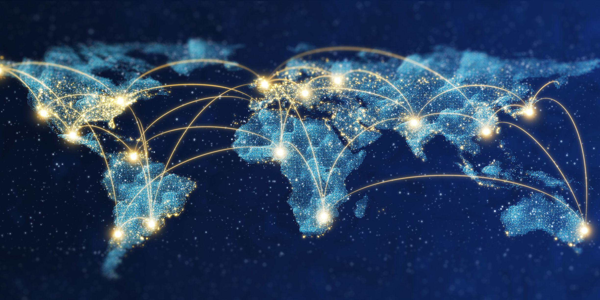

## Table of Contents

## What are tariffs and how do they work?

Tariffs are taxes that a country puts on goods that come from other countries. When a product from another country enters a country with a tariff, the importer has to pay this tax. The main goal of tariffs is to make foreign goods more expensive, so people might choose to buy things made in their own country instead.

Tariffs can help protect local businesses by making it harder for foreign companies to compete. For example, if a country puts a high tariff on imported cars, the price of those cars goes up. This can make cars made in the country cheaper by comparison, which might help the local car industry. However, tariffs can also lead to higher prices for consumers and might cause other countries to put tariffs on goods from the country that started it, which can lead to trade wars.

## Why do countries impose tariffs?

Countries impose tariffs mainly to protect their own industries. When a country puts a tax on imported goods, it makes those goods more expensive. This can help local businesses because people might choose to buy the cheaper, locally made products instead of the more expensive imports. For example, if a country has a strong farming industry, it might put tariffs on imported food to help its farmers sell more.

But tariffs are not just about protecting local businesses. They can also be used to raise money for the government. When importers pay the tariff, that money goes to the government. Sometimes, tariffs are used as a tool in international relations. A country might put tariffs on another country's goods to pressure them in negotiations or to respond to unfair trade practices. However, this can lead to trade disputes and even trade wars, which can harm both countries' economies.

## Which country currently has the highest average tariff rate?

The country with the highest average tariff rate right now is the Bahamas. Their average tariff rate is about 33%. This means that when people bring things into the Bahamas from other countries, they have to pay a lot of money in taxes.

High tariffs like those in the Bahamas can make things more expensive for people who live there. It can also make it hard for other countries to sell their products in the Bahamas. But, it can help local businesses by making their products seem cheaper compared to the imported ones.

## How do tariffs affect international trade?

Tariffs can make international trade harder. When a country puts a tax on things coming from other countries, it makes those things more expensive. This can make it less likely for people to buy things from other countries. It can also make it harder for companies in other countries to sell their stuff in the country with the tariff. This can lead to less trade between countries.

But tariffs can also help the country that uses them. They can protect local businesses by making their products cheaper compared to the more expensive imports. This can help local jobs and industries. However, if other countries get upset about the tariffs, they might put their own tariffs on the country that started it. This can start a trade war, which can hurt both countries' economies.

## What are the differences between tariffs and other trade barriers?

Tariffs are taxes that a country puts on things coming from other countries. They make imported goods more expensive, which can help local businesses by making their products seem cheaper. Other trade barriers, like quotas, limit the amount of a certain product that can come into a country. For example, a country might say only a certain number of cars can be imported each year. This can also help local car makers by reducing competition from abroad.

Another type of trade barrier is a subsidy. This is when a government gives money or other help to local businesses to make their products cheaper. Unlike tariffs, which make imports more expensive, subsidies make local products cheaper, which can also help local businesses. There are also non-tariff barriers like regulations and standards that can make it hard for foreign products to be sold in a country. These can include things like safety rules or quality checks that foreign products have to meet before they can be sold.

All these trade barriers can affect how much countries trade with each other. Tariffs directly increase the cost of imports, while quotas limit how much can be imported. Subsidies and non-tariff barriers can make it harder for foreign products to compete in the local market. Each type of barrier can be used to protect local businesses, but they can also lead to less trade and higher prices for consumers.

## How have tariffs evolved historically in countries with high tariffs?

In the past, many countries used high tariffs to protect their own businesses. For example, in the 1800s, the United States had very high tariffs to help its new industries grow. These tariffs made it hard for other countries to sell their goods in the U.S., which helped American businesses. Over time, as the U.S. became more powerful, it started to lower its tariffs because it wanted to trade more with other countries. This change helped the U.S. become a big player in world trade.

In other places like India, tariffs have also changed a lot. After India became independent in 1947, it used high tariffs to protect its new industries. This was part of a plan to make India less dependent on other countries. But in the 1990s, India started to lower its tariffs because it wanted to be more connected to the world economy. This helped India's economy grow faster, but it also meant more competition for local businesses. Today, countries like the Bahamas still have high tariffs to protect their small economies, but many big countries have lower tariffs to encourage more trade.

## What are the economic impacts of high tariffs on domestic industries?

High tariffs can help domestic industries by making imported goods more expensive. When foreign products cost more, people might choose to buy things made in their own country instead. This can help local businesses sell more and create more jobs. For example, if a country has high tariffs on imported cars, local car makers might sell more cars because they are cheaper than the imported ones. This can help the local economy grow because more people are working and [earning](/wiki/earning-announcement) money.

But high tariffs can also have some downsides for domestic industries. If other countries get upset about the high tariffs, they might put their own tariffs on goods from the country that started it. This can make it harder for local businesses to sell their products abroad. Also, high tariffs can make things more expensive for people who live in the country. If the cost of imported goods goes up, people might have to pay more for things they need. This can hurt the economy if people have less money to spend on other things.

## Can you list the top 10 countries with the highest tariffs and their rates?

The Bahamas has the highest average tariff rate at about 33%. This means they put a big tax on things coming from other countries. Sudan is next with an average tariff rate of about 21%. They also make imported goods more expensive. Bermuda comes in third with a tariff rate of around 20%. This helps their local businesses by making foreign products cost more. Djibouti has an average tariff rate of about 19%, which is a bit lower but still high. Ethiopia's average tariff rate is around 18%, making it the fifth country on the list.

Next is Guinea-Bissau with an average tariff rate of about 17%. They tax imports to help their local economy. The Central African Republic has a tariff rate of around 16%, which is a bit less but still high. Gabon is close behind with an average tariff rate of about 15%. Chad has a tariff rate of around 14%, which helps their local businesses too. Finally, Burundi rounds out the top 10 with an average tariff rate of about 13%. These high tariffs can help local industries but also make things more expensive for people in these countries.

## How do high tariffs influence global supply chains?

High tariffs can mess up global supply chains. When a country puts a big tax on things coming from other countries, it can make it hard for companies to get what they need. For example, if a car company in one country needs parts from another country, and there's a high tariff on those parts, the car company might have to pay a lot more money. This can slow down how fast they make cars and make them more expensive. It can also make companies think about moving their factories to different countries to avoid the high tariffs.

But high tariffs can also make companies look for new ways to do things. If it's too expensive to get parts from one country because of tariffs, a company might start buying parts from a different country that doesn't have such high tariffs. This can change how global supply chains work because companies have to find new suppliers and ways to get what they need. It can make supply chains more complicated and sometimes less reliable, but it can also lead to new business opportunities in countries with lower tariffs.

## What role do international trade agreements play in countries with high tariffs?

International trade agreements can help countries with high tariffs by making it easier for them to trade with other countries. These agreements often include rules that say countries have to lower their tariffs on certain things. This can help countries with high tariffs because it makes their goods cheaper for other countries to buy. It can also help them get more things from other countries without paying so much in taxes. For example, if a country agrees to lower tariffs on cars, it can sell more cars to other countries and also buy cheaper car parts from them.

But sometimes, countries with high tariffs might not want to join these trade agreements. They might think that lowering their tariffs will hurt their local businesses too much. If they join an agreement and have to lower their tariffs, it can make it harder for their local companies to compete with cheaper imports. So, they might choose to keep their high tariffs to protect their own industries, even if it means they don't get to be part of the trade agreement. This can make it harder for them to trade with other countries and can lead to less business overall.

## How do countries with high tariffs respond to trade disputes and WTO rulings?

When countries with high tariffs face trade disputes, they often have to deal with complaints from other countries. These complaints might go to the World Trade Organization (WTO), which helps countries solve trade problems. If the WTO says a country's high tariffs are not fair, that country might have to lower them. But sometimes, countries with high tariffs don't want to change their rules. They might argue that their tariffs are needed to protect their local businesses. If they don't follow the WTO's ruling, it can lead to more problems and even more trade disputes.

Countries with high tariffs might also try to find ways around WTO rulings. They might change their tariffs a little bit or find other ways to keep their imports expensive. This can make other countries upset, and it can lead to more trade fights. But if a country decides to follow the WTO's ruling and lower its tariffs, it can help them trade better with other countries. This can be good for their economy, but it can also be hard for their local businesses that were protected by the high tariffs.

## What are the future trends and predictions for tariffs in countries currently imposing high rates?

Countries with high tariffs might start to lower them in the future. This could happen because more countries are joining big trade agreements that say they have to lower their tariffs. Also, countries might see that having lower tariffs can help them trade more with other countries and grow their economies. But some countries might keep their high tariffs if they think it's important to protect their local businesses. They might think that having high tariffs is worth it if it helps their own people have jobs and make things.

Another thing that could happen is that countries with high tariffs might change how they use them. Instead of having high tariffs on everything, they might put high tariffs on just a few things that are really important to their local businesses. This way, they can still protect those businesses but also trade more with other countries. It's hard to say for sure what will happen, but it looks like countries will keep trying to find a balance between protecting their own industries and trading with the world.

## References & Further Reading

[1]: Lopez de Prado, M. (2018). ["Advances in Financial Machine Learning"](https://www.amazon.com/Advances-Financial-Machine-Learning-Marcos/dp/1119482089). Wiley.

[2]: Krugman, P., & Obstfeld, M. (2005). ["International Economics: Theory and Policy."](https://archive.org/details/internationaleco0000krug_t6h6) Addison-Wesley.

[3]: Aronson, D. R. (2006). ["Evidence-Based Technical Analysis: Applying the Scientific Method and Statistical Inference to Trading Signals"](https://www.amazon.com/Evidence-Based-Technical-Analysis-Scientific-Statistical/dp/0470008741). Wiley.

[4]: Jansen, S. (2020). ["Machine Learning for Algorithmic Trading."](https://github.com/stefan-jansen/machine-learning-for-trading) Packt Publishing.

[5]: Chan, E. P. (2009). ["Quantitative Trading: How to Build Your Own Algorithmic Trading Business"](https://github.com/ftvision/quant_trading_echan_book). Wiley.

[6]: Irwin, D. A. (2011). ["Peddling Protectionism: Smoot-Hawley and the Great Depression."](https://academic.oup.com/jah/article/98/4/1180/922363) Princeton University Press.