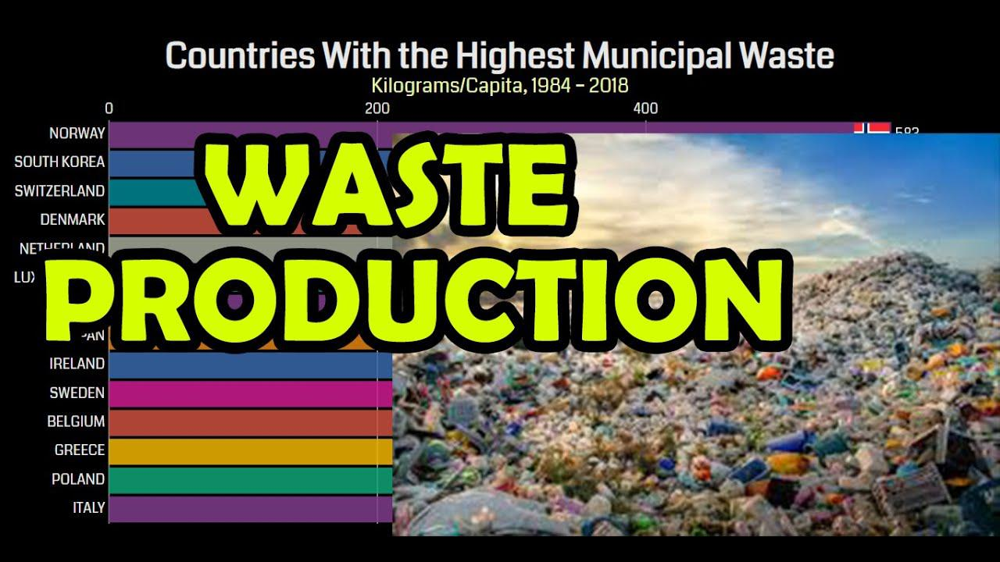

In the modern era, waste production stands as a critical issue with significant environmental impacts. The rapid industrialization and urbanization have escalated the levels of waste generated globally, affecting ecosystems and human health. This article explores the intricate relationship between global waste generation and its effects on the environment. It aims to provide a comprehensive understanding of how waste contributes to environmental degradation through pollution, resource depletion, and greenhouse gas emissions.

Moreover, this exploration extends to algorithmic trading—an innovative approach primarily associated with financial markets. Algorithmic trading involves using complex algorithms and data analysis to optimize processes. Here, the focus is on how these principles intersect with waste management challenges, offering potential solutions to enhance efficiency and reduce environmental impacts. This technological perspective presents an opportunity for rethinking traditional waste management approaches through data-driven strategies.



By understanding these dynamics, we can better appreciate the interconnected nature of global systems, where economic activities, technological innovations, and environmental sustainability coalesce. This introduction sets the stage for a comprehensive examination of these complex topics, emphasizing the necessity of integrating technological advancements with environmental strategies to combat global waste challenges.

## Table of Contents

## Understanding Global Waste Production

Global waste production has witnessed a dramatic rise in recent decades, driven by several key factors. The effects of urbanization, population growth, and industrial activities have been especially pronounced, contributing significantly to the rapid accumulation of waste. Urban areas, in particular, have become hotspots of waste generation due to increased consumption and the high density of populations and industries.

### Major Contributors to Waste Production

1. **Urbanization**: As cities expand, the demand for goods and services increases, leading to greater waste. The infrastructure in many urban settings often struggles to keep pace with the volume of waste produced, leading to challenges in effective waste management.

2. **Population Growth**: A growing global population directly correlates with increased waste. More people result in higher consumption rates, translating to more materials discarded as waste. This includes food, paper, plastics, metals, and other household and commercial waste.

3. **Industrial Activities**: Industrialization has been a cornerstone of economic growth but also a significant driver of waste. Manufacturing processes often produce by-products that contribute to waste streams. Additionally, industries such as packaging, electronics, and textiles frequently generate significant amounts of waste due to production inefficiencies or high turnover rates in products.

### Types of Waste

Understanding the types of waste is critical to addressing waste management challenges. Waste can be broadly categorized into several types:

- **Municipal Solid Waste (MSW)**: This includes everyday items discarded by the public, such as household garbage, furniture, clothing, and small appliances. Growing urban populations contribute heavily to MSW.

- **Industrial Waste**: Often comprises materials left over from manufacturing and industrial processes. This includes chemicals, metals, and sludges, which can be hazardous.

- **Hazardous Waste**: Includes waste with properties that could be dangerous or harmful to human health or the environment. Industrial activities are major sources of hazardous waste.

- **E-waste**: Refers to discarded electrical and electronic products. With rapid technological advancements and obsolescence, e-waste is becoming one of the fastest-growing waste streams globally.

### Geographic and Economic Disparities

Geographic and economic factors significantly influence waste management capabilities. Developed countries, despite having efficient waste management systems, often produce more waste per capita compared to developing nations. However, they have better infrastructure to handle it. Developing countries face challenges such as inadequate waste collection systems, limited funding, and lack of technologies, making efficient waste management difficult.

Moreover, the export of waste from wealthier countries to less developed regions compounds the issue, transferring environmental and health impacts abroad. This practice raises ethical concerns about equity and environmental justice.

### Importance of Identifying Waste Sources

Addressing the complex issue of waste management requires identifying the main sources and types of waste. This understanding helps develop targeted strategies for reduction, reuse, and recycling. Effective management strategies could include waste-to-energy initiatives, improved recycling programs, and policies aimed at reducing consumption and encouraging sustainable practices.

Mathematical models and data analytics can play a pivotal role in optimizing these strategies, allowing for better prediction of waste generation patterns and more efficient resource allocation. By accurately identifying waste sources, policymakers and industries can implement more effective solutions, thereby mitigating the environmental impacts associated with global waste production.

## The Environmental Impact of Waste

Waste management is a critical component in maintaining ecological balance and ensuring public health. Mismanagement of waste presents various environmental challenges, which include pollution, greenhouse gas emissions, and the depletion of natural resources.

Pollution is one of the direct consequences of improper waste management. When waste is not appropriately disposed of, it often ends up contaminating natural ecosystems. Leachate from landfills can seep into groundwater, posing severe risks to human and animal life. Moreover, the burning of waste in open areas releases toxic substances, compromising air quality and contributing to atmospheric pollution. A study by the U.S. Environmental Protection Agency highlights how landfills are America’s third-largest source of human-related methane emissions, a potent greenhouse gas that significantly contributes to climate change (EPA, 2021).

Plastics represent a substantial proportion of global waste and are especially problematic due to their persistence in the environment. Microplastics, resulting from the fragmentation of larger plastic debris, have been detected in oceans, soil, and even within living organisms. These particles can absorb and release toxic chemicals, leading to bioaccumulation in food chains. According to a report by the United Nations Environment Programme, approximately 300 million tons of plastic waste are produced annually, with oceans suffering the brunt of improperly managed waste (UNEP, 2018).

Electronic waste, or e-waste, is another significant concern. It contains hazardous materials such as lead, mercury, and cadmium, which can leach into the environment when e-waste is improperly processed. This not only harms biodiversity but also presents occupational hazards to those involved in informal recycling operations, often in developing countries. The Global E-waste Monitor reported that in 2019, a record 53.6 million metric tons of e-waste was generated worldwide, with only 17.4% being officially documented as collected and recycled (Forti et al., 2020).

Resource depletion arises from the extensive extraction and utilization of natural materials for product manufacturing. Inefficient waste management systems exacerbate the depletion by failing to reclaim valuable materials, which could otherwise be reused or recycled. Circular economy concepts, which promote the re-use, repair, refurbishment, and recycling of products and materials, aim to address this inefficiency by creating closed-loop systems.

Understanding the environmental impacts of waste is crucial for driving changes in how society approaches production and consumption. By recognizing these repercussions, there is a greater impetus to develop policies and practices that emphasize sustainability, reduce waste generation, and enhance recycling efficiencies. Embracing sustainable materials management and investing in advanced waste processing technologies can mitigate the environmental impacts discussed, paving the way for a healthier planet.

**References:**
- U.S. Environmental Protection Agency. (2021). Overview of Greenhouse Gases. Methane Emissions page. 
- United Nations Environment Programme. (2018). Single-use plastics: A roadmap for sustainability.
- Forti, V., Balde, C.P., Kuehr, R., & Bel, G. (2020). The Global E-waste Monitor 2020: Quantities, flows and the circular economy potential. United Nations University.

## The Role of Technology and Algorithmic Trading

Technological innovations have emerged as powerful tools in addressing global waste challenges, offering unique approaches to optimize waste management systems. A particularly intriguing application is the adaptation of [algorithmic trading](/wiki/algorithmic-trading) principles, traditionally reserved for financial markets, to streamline waste management processes. Algorithmic trading involves using computer algorithms to automate and optimize trade decisions, employing data analysis and predictive models to anticipate market trends. By leveraging similar methodologies, waste management systems can achieve enhanced efficiency and resource allocation.

Data analysis forms the cornerstone of this approach. By collecting and processing vast amounts of waste-related data, algorithms can identify patterns and predict waste generation trends. This predictive capability enables proactive decision-making, facilitating more efficient deployment of waste collection resources. For instance, an algorithm could analyze historical waste generation data to optimize the scheduling of waste collection vehicles, thereby reducing fuel consumption and operational costs.

The integration of predictive modeling further enhances the impact of algorithmic trading principles in waste management. Predictive models can forecast future waste production based on variables such as demographic trends, economic activity, and seasonal factors. These forecasts enable municipalities and waste management companies to tailor their strategies, ensuring they are equipped to deal with impending waste surges or declines.

Moreover, algorithmic trading methods can optimize resource allocation by dynamically adjusting waste collection routes and frequencies. This minimizes the environmental footprint associated with waste management operations, as vehicles travel fewer miles and consume less fuel. The result is a dual benefit: reduced greenhouse gas emissions and cost savings for waste management entities.

To illustrate the application of algorithmic trading in waste management, consider a simple Python example that uses historical waste data to predict future waste generation and optimize collection routes. Suppose we have a dataset containing daily waste generation figures. We can employ a linear regression model to predict future values:

```python
import numpy as np
from sklearn.linear_model import LinearRegression

# Sample data: days and corresponding waste generated (in tons)
days = np.array([1, 2, 3, 4, 5]).reshape(-1, 1)
waste_generated = np.array([20, 22, 19, 24, 25])

# Initialize the model
model = LinearRegression()

# Train the model
model.fit(days, waste_generated)

# Predict future waste generation for the next 5 days
future_days = np.array([6, 7, 8, 9, 10]).reshape(-1, 1)
predicted_waste = model.predict(future_days)

print(predicted_waste)
```

In this example, the linear regression model uses past data to predict future waste generation, which could then inform route planning algorithms, adjusting the frequency and timing of waste collection to ensure maximum efficiency.

Technological integration, particularly through algorithmic trading principles, presents an exciting frontier in waste management. By harnessing data-driven insights and automation, it is possible to substantially reduce environmental impacts and operational costs, paving the way for sustainable waste management practices.

## Case Studies and Success Stories

Several cities and corporations around the globe have demonstrated the effectiveness of implementing technology-driven waste management strategies. These case studies reflect the potential of algorithmic approaches in significantly reducing waste and providing insights for further innovation in other regions and industries.

One notable example is the city of Amsterdam, which has adopted smart waste collection systems to optimize the process of waste management. By utilizing sensors installed in waste containers, the system collects data on fill levels. This information is analyzed to determine the most efficient collection routes and schedules, minimizing unnecessary trips and reducing fuel consumption. The deployment of these smart systems has led to a substantial decrease in city congestion and emissions, demonstrating the essential role of data-driven solutions in urban environments.

Similarly, the city of Stockholm has implemented a successful pneumatic waste collection system, integrating technology into urban infrastructure. This system utilizes a network of underground pipes that transport waste directly from residential and commercial buildings to a central collection station. The adoption of such systems has minimized littering and reduced the need for manual collection, thereby lowering carbon footprints and operational costs significantly.

In the corporate sector, Dell Technologies provides a compelling case of integrating circular economy initiatives into business operations to achieve waste reduction. Dell's closed-loop system recycles plastics from old electronic products to produce new components. The company employs sophisticated data analytics to track materials throughout the supply chain, ensuring efficient resource usage and minimal environmental impact. This approach not only illustrates the practicality of circular economy models but also highlights their viability in large-scale corporate environments.

Furthermore, New York's Department of Sanitation operates an analytical platform known as "Waste Management Analytics," which combines historical data with predictive modeling to enhance decision-making processes in waste management. By simulating various scenarios and analyzing their potential outcomes, this tool helps planners design more effective waste reduction strategies. These strategies have successfully improved recycling rates and have minimized landfill dependency, offering a replicable model for other municipalities.

These successes illustrate how integrating technology into environmental management can facilitate more sustainable practices and outcomes. The utilization of algorithmic approaches not only optimizes existing systems but also encourages innovative thinking and application in different contexts, demonstrating the wide-reaching benefits of digital solutions in waste management.

## Challenges and Barriers

Implementing technology in waste management holds great promise for enhancing efficiency and reducing environmental impacts. However, several challenges hinder the widespread adoption of these innovative systems.

### Financial Barriers

The financial costs associated with developing and deploying new technologies in waste management are significant. These costs can include investment in infrastructure, maintenance, and the acquisition of necessary technology. For instance, implementing sensor-based waste tracking systems requires substantial upfront investments, which can be a substantial burden for municipalities with limited budgets. Moreover, ongoing operational costs can strain financial resources, particularly in less economically developed regions.

### Regulatory Barriers

Regulatory frameworks often lag behind the rapid pace of technological advancement. Rigid regulations can limit the opportunities for experimenting with new waste management technologies. For example, the integration of algorithmic trading mechanisms to optimize waste collection schedules may require extensive data sharing, which is often restricted by privacy laws and regulations. Consequently, navigating the regulatory landscape becomes a significant obstacle for stakeholders aiming to implement cutting-edge systems.

### Technical Barriers

From a technical standpoint, challenges arise due to a lack of standardization and interoperability among technological solutions. Disparate systems used in waste management may not communicate effectively with each other, leading to inefficiencies. Furthermore, the collection and analysis of large datasets, pivotal for algorithmic solutions, require advanced technical expertise and infrastructure that may not be available in all regions.

### Solutions and Collaborative Efforts

Addressing these barriers necessitates collaborative efforts among governments, businesses, and communities. Public-private partnerships can play an essential role by pooling resources to share the financial burden of technology implementation. Governments can facilitate innovation by updating regulations to support technology adoption while ensuring privacy and security.

Investing in education and training programs can bridge the technical skills gap, empowering a workforce that can effectively manage and operate new waste management technologies. Additionally, harmonizing standards and encouraging open platforms can enhance interoperability across different systems, fostering a more integrated approach to waste management.

Identifying and addressing these challenges is crucial to harnessing the full potential of innovative technologies in waste management. By surmounting these barriers, stakeholders can transform waste management from a daunting challenge into a successful and sustainable endeavor.

## Future Prospects and Recommendations

The integration of technology in waste management is poised to advance significantly in the coming years. With urban centers expanding and global consumption patterns changing, the need for efficient and innovative waste systems becomes ever more pressing. As technology evolves, predictions indicate that algorithmic trading—a method traditionally associated with financial markets—will play an increasingly critical role in optimizing waste systems. By applying algorithmic principles, waste management can achieve improved resource allocation, seamless integration of supply chain elements, and minimized environmental impact.

For policymakers, industry leaders, and environmentalists, several recommendations emerge to harness these technological advancements effectively. First, there should be a concerted effort to bolster investment in research and development. This investment will not only drive technological innovations but also ensure that emerging solutions are scalable and adaptable to varying geographic contexts. Additionally, fostering cross-sector partnerships between tech companies, waste management firms, and governmental bodies can catalyze the development of holistic solutions that address both technological and regulatory challenges.

Education initiatives should also be prioritized to equip current and future professionals with the skills necessary to implement and manage advanced waste systems. This involves integrating sustainability and data analytics into educational curriculums, thereby creating a workforce adept at navigating the complexities of technology-driven waste management.

By adopting these proactive steps, we can anticipate a transformative shift towards sustainable waste management practices that significantly reduce environmental impact. Successful integration of technology into waste management holds promise not only for cleaner cities and communities but also for a healthier planet overall. The future of waste management will be defined by our ability to leverage cutting-edge technologies responsibly and effectively.

## Conclusion

Waste production, coupled with its significant environmental impact, presents a critical challenge that necessitates urgent global action. The intersection of waste management and technological innovation, particularly through algorithmic trading, offers promising avenues to address these challenges. Algorithmic trading, often associated with financial markets, can be repurposed to enhance the efficiency and effectiveness of waste management systems by deploying its capabilities in data analysis and predictive modeling. This can optimize resources, streamline processes, and potentially lead to reduced environmental footprints and cost savings.

Moreover, achieving impactful solutions requires ongoing collaboration and commitment across various sectors, including governments, industries, and communities. An integrated approach ensures that the financial, technical, and regulatory challenges can be navigated effectively. The collaboration facilitates shared learning and resource allocation crucial for overcoming barriers to implementing such technologies.

Looking ahead, the prudent and responsible leveraging of technology holds significant promise for sustainable waste management practices. The potential integration of advanced algorithms and [machine learning](/wiki/machine-learning) could revolutionize waste management by enabling dynamic adaptations to evolving waste patterns and environmental conditions. However, this requires a concerted effort towards research, investment, and education to harness these technological tools effectively and sustainably.

This article emphasizes the importance of innovative strategies in preserving environmental health. By aligning technological advancements with environmental objectives, there is an opportunity to not only mitigate the pressing issue of waste production and its impacts but also to forge a path toward a more sustainable future. Through continued innovation and proactive measures, a balance can be achieved that benefits both human populations and the planet.

## References & Further Reading

[1]: United Nations Environment Programme. (2018). ["Single-use plastics: A roadmap for sustainability."](https://www.unep.org/resources/report/single-use-plastics-roadmap-sustainability)

[2]: Forti, V., Balde, C.P., Kuehr, R., & Bel, G. (2020). ["The Global E-waste Monitor 2020: Quantities, flows and the circular economy potential."](https://collections.unu.edu/view/UNU:7737) United Nations University.

[3]: U.S. Environmental Protection Agency. (2021). ["Overview of Greenhouse Gases: Methane Emissions page."](https://www.epa.gov/ghgemissions/overview-greenhouse-gases)

[4]: Ellen MacArthur Foundation. (2013). ["Towards the Circular Economy: Economic and business rationale for an accelerated transition."](https://www.ellenmacarthurfoundation.org/towards-the-circular-economy-vol-1-an-economic-and-business-rationale-for-an)

[5]: Stock, T., & Seliger, G. (2016). ["Opportunities of Sustainable Manufacturing in Industry 4.0."](https://www.sciencedirect.com/science/article/pii/S221282711600144X) Procedia CIRP, 40, 536-541.