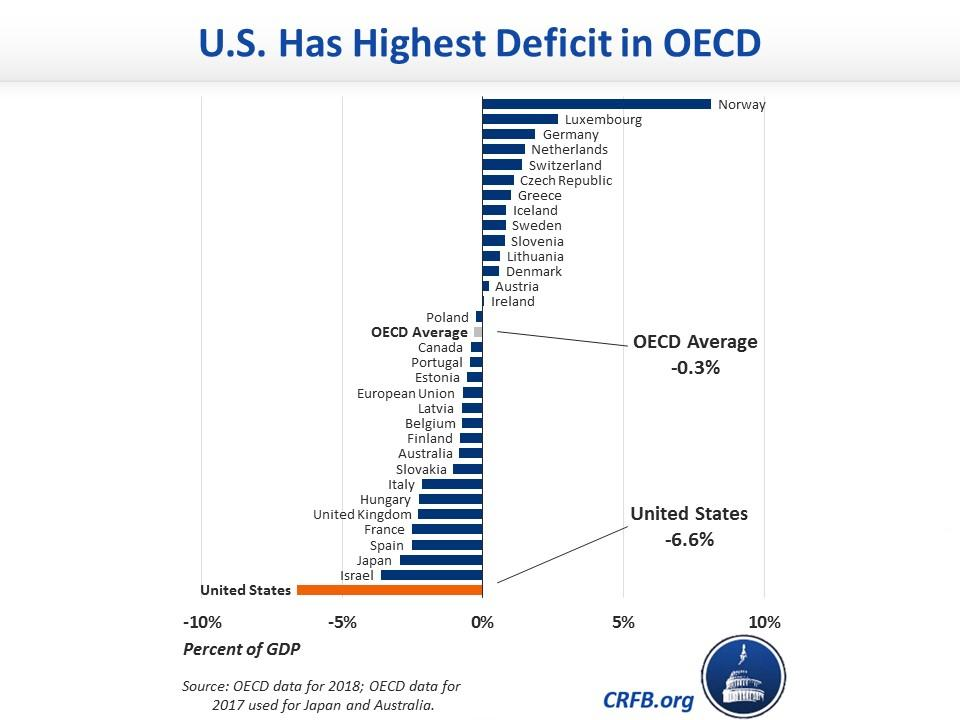

## Table of Contents

## What is a budget deficit?

A budget deficit happens when a government spends more money than it earns in a year. Governments earn money mainly through taxes and other fees. When their spending on things like healthcare, education, and defense is higher than what they collect, they have a deficit.

To cover a budget deficit, governments usually borrow money by selling bonds. This increases the national debt. If deficits keep happening year after year, the total debt can grow a lot. This can be a problem because the government has to pay interest on the debt, which can take money away from other important programs.

## How is a budget deficit calculated?

A budget deficit is calculated by subtracting the total amount of money a government earns from the total amount it spends in a year. The money a government earns comes mostly from taxes, like income tax and sales tax, and other sources like fees and fines. If the government spends more than it earns, the difference is the budget deficit.

For example, if a government earns $100 billion in a year but spends $120 billion, the budget deficit would be $20 billion. This calculation is done every year to see if the government is spending more than it is [earning](/wiki/earning-announcement). If the government earns more than it spends, it has a budget surplus instead of a deficit.

## Why do countries have budget deficits?

Countries often have budget deficits because their governments spend more money than they collect in taxes and other revenues. Governments need to spend money on important things like schools, hospitals, roads, and defense. Sometimes, they decide to spend more to help the economy grow or to help people during tough times, like during a recession or a crisis. If the money they collect isn't enough to cover all these costs, they end up with a budget deficit.

Another reason for budget deficits is that it can be hard for governments to predict exactly how much money they will collect and how much they will need to spend. For example, if the economy is doing poorly, people might earn less money and pay less in taxes. At the same time, the government might need to spend more to help people who are struggling. This mismatch between what comes in and what goes out can lead to a deficit. Governments sometimes plan for deficits if they believe the extra spending will help the country in the long run.

## Which countries currently have the largest budget deficits?

Some countries with big budget deficits right now are the United States, Japan, and Italy. The United States has a large deficit because it spends a lot on things like defense, healthcare, and social programs, but it doesn't always collect enough in taxes to cover these costs. Japan also has a big deficit, partly because it has an aging population that needs more healthcare and social services, and its economy has been slow to grow. Italy faces similar problems, with high spending on pensions and healthcare, and a struggling economy that makes it hard to collect enough taxes.

These countries use borrowing to cover their deficits. They sell bonds to other countries, investors, and their own citizens to get the money they need. This increases their national debt. If deficits keep happening year after year, the total debt can grow a lot. This can be a problem because the government has to pay interest on the debt, which can take money away from other important programs.

## What are the economic impacts of a large budget deficit?

A large budget deficit can have big effects on a country's economy. When a government spends more than it earns, it usually borrows money by selling bonds. This can lead to higher interest rates because there's more demand for money. Higher interest rates can make it more expensive for people and businesses to borrow money, which can slow down the economy. Also, if investors think a country's debt is too high, they might not want to buy its bonds, which can make borrowing even more expensive.

Another impact of a large budget deficit is that it can lead to more inflation. When the government borrows a lot of money, it puts more money into the economy. If there's too much money chasing too few goods, prices can go up. This can make things more expensive for everyone. On the other hand, if the government uses the borrowed money to spend on things like building roads or helping people during tough times, it can help the economy grow. But if the deficit is too big for too long, it can cause problems.

In the long run, large budget deficits can lead to a bigger national debt. The government has to pay interest on this debt, which can take money away from important programs like education and healthcare. If the debt gets too big, it can make people worried about the country's financial health. This can hurt the country's credit rating and make it harder and more expensive to borrow money in the future. Balancing the need to spend with the need to keep deficits under control is a big challenge for governments.

## How do budget deficits affect a country's currency?

Budget deficits can affect a country's currency in different ways. When a government has a big deficit, it often needs to borrow more money by selling bonds. If investors think the country's debt is too high, they might not want to buy its bonds, or they might demand higher interest rates. This can make the country's currency weaker because people might not want to hold onto it if they think it's risky.

On the other hand, if a country's economy is doing well despite the deficit, its currency might stay strong. For example, if the government uses the borrowed money to spend on things that help the economy grow, like building roads or helping people during tough times, it can make the country's currency more attractive to investors. But if the deficit is too big for too long, it can lead to inflation, which can make the currency weaker over time.

## What are the differences between a budget deficit and national debt?

A budget deficit happens when a government spends more money than it earns in a year. The money a government earns comes mostly from taxes, like income tax and sales tax, and other sources like fees and fines. If the government spends more than it earns, the difference is the budget deficit. For example, if a government earns $100 billion in a year but spends $120 billion, the budget deficit would be $20 billion. This calculation is done every year to see if the government is spending more than it is earning.

National debt, on the other hand, is the total amount of money a government owes over time. When a government has a budget deficit, it usually borrows money to cover the difference. This borrowing adds to the national debt. If a government keeps having deficits year after year, the national debt can grow a lot. For example, if a government has a $20 billion deficit every year for 5 years, the national debt will increase by $100 billion over those 5 years. The national debt is the sum of all the money the government has borrowed and not yet paid back.

## How do governments finance their budget deficits?

Governments finance their budget deficits mainly by borrowing money. They do this by selling bonds to investors, which can be other countries, banks, or even their own citizens. When people buy these bonds, they are lending money to the government. In return, the government promises to pay back the money with interest over time. This is how governments get the extra money they need to cover their spending when their income from taxes isn't enough.

Sometimes, governments can also finance deficits by using money from their reserves or by getting help from international organizations like the International Monetary Fund (IMF). But borrowing through bonds is the most common way. When a government borrows a lot, it can lead to a bigger national debt. This means the government has to pay more interest in the future, which can affect how much money it has for other important things like schools and hospitals.

## What are the long-term consequences of persistent budget deficits?

If a country keeps having budget deficits year after year, it can lead to a lot of debt. This debt can become a big problem because the government has to pay interest on it. The more debt there is, the more money goes to paying interest instead of things like schools, hospitals, and roads. This can make it hard for the government to spend money on important programs that people need. Also, if the debt gets too big, people might worry about the country's money problems, and this can make it harder and more expensive for the government to borrow money in the future.

Another long-term problem with big budget deficits is that they can make the economy less stable. When the government borrows a lot of money, it can lead to higher interest rates. This makes it more expensive for people and businesses to borrow money too, which can slow down the economy. If the government keeps spending more than it earns, it can also cause inflation. This means prices go up, and money becomes worth less. Over time, these problems can make it harder for the country to grow and for people to live better lives.

## How do budget deficits influence interest rates?

When a government has a big budget deficit, it usually needs to borrow more money by selling bonds. This can lead to higher interest rates because there's more demand for money. When the government borrows a lot, it competes with other people and businesses who also want to borrow money. If there's a lot of borrowing happening, lenders might raise the interest rates to make sure they get a good return on their money. Higher interest rates can make it more expensive for everyone to borrow money, which can slow down the economy.

On the other hand, if investors think a country's debt is too high because of big deficits, they might not want to buy its bonds, or they might demand even higher interest rates to take on the risk. This can make borrowing even more expensive for the government. If the government has to pay more interest, it can take money away from other important things like schools and hospitals. So, big budget deficits can push interest rates up, which can affect the whole economy.

## What measures can governments take to reduce budget deficits?

Governments can reduce budget deficits by cutting their spending. This means they might spend less on things like building new roads, helping people with healthcare, or giving money to schools. They can also look at their programs and see if there are any that aren't working well or are too expensive. By making these programs smaller or getting rid of them, the government can save money and lower the deficit. Another way to cut spending is to make their government work more efficiently, so they don't waste money.

Another way to reduce a budget deficit is to increase the money the government earns. They can do this by raising taxes. For example, they might increase income tax, sales tax, or taxes on things like gas and cigarettes. By getting more money from taxes, the government can have more money to cover its spending. They can also try to make the economy grow faster. When the economy grows, people earn more money and pay more taxes, which can help lower the deficit. Balancing these measures is hard, but it's important for keeping the country's finances healthy.

## How do global economic conditions affect a country's budget deficit?

Global economic conditions can have a big impact on a country's budget deficit. When the world economy is doing well, countries might see more money coming in from trade and investments. This can help lower their budget deficits because they earn more money. But if the world economy is struggling, like during a global recession, countries might earn less money from taxes and trade. This can make their budget deficits bigger because they still need to spend money on things like healthcare and education, but they have less money coming in.

Also, global interest rates can affect a country's budget deficit. If interest rates around the world go up, it can be more expensive for a country to borrow money to cover its deficit. This can make the deficit even bigger because the government has to pay more interest on its debt. On the other hand, if global interest rates are low, borrowing can be cheaper, which can help keep the deficit smaller. So, what happens in the world economy can make it easier or harder for a country to manage its budget deficit.

## What is Understanding Budget Deficits?

A budget deficit occurs when a government's total expenditures surpass its revenue within a given fiscal year. In contrast to the national debt, which accumulates over multiple years, a budget deficit is concerned with the financial gap in a single period. Governments may intentionally run budget deficits to support public projects, which can bolster infrastructure, education, and healthcare. Such investments can stimulate economic growth by creating jobs and increasing consumer spending, contributing to a more robust economic environment.

Additionally, budget deficits often arise from the need to address unforeseen expenses, such as natural disasters or financial crises. During such events, governments may need to inject funds into the economy to stabilize it, using deficit spending as a tool to mitigate economic downturns.

However, persistent budget deficits can lead to substantial national debts, posing risks to a country's economic health and credit standing. A rising national debt resulting from continuous deficits can undermine a nation's creditworthiness, making it more challenging to borrow funds at favorable rates.

To illustrate the dynamics quantitatively, if $R$ represents a nation's revenue and $E$ its expenditures for a given year, a budget deficit $D$ can be expressed as:

$$
D = E - R
$$

When $D > 0$, a deficit occurs, indicating that the government has spent more than it has earned. Continuous years of deficits add to the national debt, $ND$, which can be expressed as:

$$
ND_{t+1} = ND_t + D
$$

where $ND_t$ represents the national debt accumulated up to the previous year.

Overall, while strategic deficit spending can serve vital economic functions, unchecked and prolonged deficits may necessitate stringent fiscal measures to restore balance to public finances.

## References & Further Reading

[1]: Bergstra, J., Bardenet, R., Bengio, Y., & Kégl, B. (2011). ["Algorithms for Hyper-Parameter Optimization."](https://papers.nips.cc/paper/4443-algorithms-for-hyper-parameter-optimization) Advances in Neural Information Processing Systems 24.

[2]: ["Advances in Financial Machine Learning"](https://www.amazon.com/Advances-Financial-Machine-Learning-Marcos/dp/1119482089) by Marcos Lopez de Prado.

[3]: Tornell, A., & Velasco, A. (2000). ["Fixed versus Flexible Exchange Rates: Which Provides More Fiscal Discipline?"](https://www.sciencedirect.com/science/article/pii/S0304393299000574) National Bureau of Economic Research.

[4]: ["Evidence-Based Technical Analysis: Applying the Scientific Method and Statistical Inference to Trading Signals"](https://www.amazon.com/Evidence-Based-Technical-Analysis-Scientific-Statistical/dp/0470008741) by David Aronson.

[5]: Price, C. (1998). ["Economic Impacts of Budget Deficit: A Case Study of Kenya."](https://erepository.uonbi.ac.ke/bitstream/handle/11295/153998/Kanchori_The%20effect%20of%20budget%20deficit%20on%20economic%20growth%20in%20Kenya.pdf?sequence=1) Journal of African Economies.

[6]: ["Machine Learning for Algorithmic Trading"](https://github.com/stefan-jansen/machine-learning-for-trading) by Stefan Jansen.

[7]: ["Quantitative Trading: How to Build Your Own Algorithmic Trading Business"](https://github.com/LucindaYa/quant-resources/blob/master/Quantitative%20Trading%20How%20to%20Build%20Your%20Own%20Algorithmic%20Trading%20Business.pdf) by Ernest P. Chan.