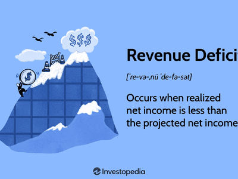

In today's interconnected global economy, budget deficits are prevalent among many countries. A budget deficit occurs when a government's expenditures exceed its revenue within a particular fiscal period, necessitating borrowing to cover the shortfall and often leading to an increase in national debt. The persistent occurrence of budget deficits can have significant implications for fiscal stability and influence the global economic landscape. 

Countries grapple with varying reasons for their deficits, including financing public infrastructure projects, boosting economic growth during downturns, or managing unforeseen expenses such as natural disasters or economic crises. Continuous deficits, however, may lead to escalating national debts, which can diminish a country's creditworthiness and detract from its economic health. For instance, nations like the United States, France, and Italy regularly encounter sizable deficits due to substantial government programs and interventions aimed at sustaining their economies.



Moreover, in an era where technology plays an integral role in financial markets, the employment of algorithmic trading emerges as a strategic tool for managing fiscal risks associated with budget deficits. Algorithmic trading utilizes sophisticated algorithms to execute trades at high speeds, offering the potential to optimize returns and buffer against economic uncertainties exacerbated by large deficits. As governments and financial institutions increasingly rely on such modern trading techniques, exploring their role in fiscal management becomes crucial for maintaining economic stability amidst continuous budget challenges.

## Table of Contents

## Understanding Budget Deficits

A budget deficit occurs when a government's total expenditures surpass its revenue within a given fiscal year. In contrast to the national debt, which accumulates over multiple years, a budget deficit is concerned with the financial gap in a single period. Governments may intentionally run budget deficits to support public projects, which can bolster infrastructure, education, and healthcare. Such investments can stimulate economic growth by creating jobs and increasing consumer spending, contributing to a more robust economic environment.

Additionally, budget deficits often arise from the need to address unforeseen expenses, such as natural disasters or financial crises. During such events, governments may need to inject funds into the economy to stabilize it, using deficit spending as a tool to mitigate economic downturns.

However, persistent budget deficits can lead to substantial national debts, posing risks to a country's economic health and credit standing. A rising national debt resulting from continuous deficits can undermine a nation's creditworthiness, making it more challenging to borrow funds at favorable rates.

To illustrate the dynamics quantitatively, if $R$ represents a nation's revenue and $E$ its expenditures for a given year, a budget deficit $D$ can be expressed as:

$$
D = E - R
$$

When $D > 0$, a deficit occurs, indicating that the government has spent more than it has earned. Continuous years of deficits add to the national debt, $ND$, which can be expressed as:

$$
ND_{t+1} = ND_t + D
$$

where $ND_t$ represents the national debt accumulated up to the previous year.

Overall, while strategic deficit spending can serve vital economic functions, unchecked and prolonged deficits may necessitate stringent fiscal measures to restore balance to public finances.

## Countries with the Largest Budget Deficits

As of recent data, countries such as Timor-Leste, South Sudan, and Libya exhibit some of the largest budget deficits globally, with deficits surpassing 50% of their Gross Domestic Product (GDP). These substantial deficits often arise from internal conflicts that disrupt economic activities, governance challenges that hinder effective fiscal management, and elevated levels of government expenditure without a parallel increase in revenue generation. In these regions, reliance on a narrow range of economic activities or volatile revenues, such as oil-dependent economies, further exacerbates fiscal instability.

Timor-Leste's budget deficit is primarily influenced by its dependency on oil revenues. The country's Petroleum Fund, which finances its budget, is subject to fluctuations in global oil prices, affecting fiscal stability. South Sudan, emerging from years of civil conflict, grapples with economic disruptions and weak institutional frameworks that impede effective budgetary processes. Similarly, Libya faces challenges due to prolonged political instability and conflict, which have severely dampened oil production—its main revenue source—and led to significant fiscal imbalances.

In contrast, economically stable countries like the United States, France, and Italy also report significant budget deficits. These deficits are primarily strategic, aimed at financing extensive government programs and economic interventions intended to stimulate growth and sustain welfare systems. For instance, the United States routinely runs a budget deficit to fund social security, healthcare, and defense while investing in infrastructure and responding to economic slowdowns with fiscal stimulus measures. Similarly, France and Italy engage in deliberate deficit financing to support social welfare programs and stimulate economic activity, despite facing constraints due to the European Union's fiscal rules.

The divergent reasons for budget deficits across these countries highlight the complex economics and policy choices underlying fiscal health. In less stable economies, addressing fiscal deficits requires enhancing governance, diversifying revenue sources, and promoting peace and stability. Economically robust nations focus on balancing long-term growth with fiscal responsibility, ensuring that government spending promotes sustainable economic outcomes.

## Economic Implications of Large Deficits

Large budget deficits can significantly impact a country's economic landscape by imposing substantial constraints on its financial resources. When government expenditures consistently surpass revenues, it can lead to inflationary pressures. Inflation can occur when the government resorts to printing more money to finance its deficit, reducing the currency's purchasing power. Additionally, high budget deficits often compel countries to borrow extensively, elevating national debt levels and potentially leading to higher interest rates. Elevated interest rates can deter private investment, as borrowing costs for businesses and consumers increase, impacting overall economic growth.

Moreover, persistent deficits can hinder a country's ability to invest in critical sectors such as healthcare, education, and infrastructure. These sectors are vital for sustainable economic development and enhancing the standard of living. As government debt mounts, part of the national budget must be allocated to interest payments, diverting funds from productive investments. For example, if the interest payments on the debt take up a significant portion of the budget, less money is available for investments in areas that could foster long-term economic growth.

In some cases, governments may have to implement austerity measures to address large deficits and stabilize their economies. Austerity measures often involve reducing public spending and increasing taxes, which can have immediate negative effects on public services and welfare. Reduced government spending may lead to cuts in social programs, affecting the most vulnerable populations, and potentially leading to social unrest. Increased taxes can also reduce disposable income, curbing consumer spending and further slowing economic growth.

Balancing the need to manage budget deficits while promoting economic growth and maintaining public services is a challenging task. Policymakers must carefully evaluate their fiscal policies to mitigate the adverse effects of large deficits. This involves finding a balance between short-term fiscal adjustments and long-term strategic investments to ensure sustainable economic development.

## Algorithmic Trading and Budget Deficits

Algorithmic trading, commonly referred to as algo trading, utilizes computer programs to conduct trades at high speed and [volume](/wiki/volume-trading-strategy). These programs use complex algorithms that analyze multiple market variables and execute trades without human intervention. The rapid execution and precision of algo trading make it a vital tool in contemporary financial markets.

Algo trading significantly influences risk management in these markets, particularly for entities dealing with the fiscal instability resulting from national budget deficits. Large budget deficits can create economic [volatility](/wiki/volatility-trading-strategies), which poses a considerable risk to financial markets. In such situations, [algorithmic trading](/wiki/algorithmic-trading) systems can provide a buffer by enabling governments and financial institutions to hedge against adverse effects. These systems can rapidly respond to market changes, thus managing and redistributing risk efficiently.

For example, hedge funds and institutional investors often use algorithmic strategies to offset the potential fallout from economic instability due to large deficits. By executing complex trades that take advantage of minute discrepancies in market prices, these algorithms help stabilize portfolios against macroeconomic shocks. Algorithmic trading can also engage in strategies such as statistical [arbitrage](/wiki/arbitrage), index arbitrage, and volatility arbitrage, which can help mitigate risks associated with budget deficits.

Moreover, by optimizing investment returns, algo trading assists governments and financial organizations in strengthening their financial standing amidst budget deficits. Algorithms can assess and exploit market opportunities that might be too challenging for human traders to identify quickly. This not only enhances return on investment but also aids in maintaining a stable economic environment.

In practical terms, Python—a preferred language due to its simplicity and extensive libraries—can be employed for developing and implementing algorithmic trading strategies. Libraries such as NumPy, pandas, and PyAlgoTrade facilitate the creation of predictive models and trading algorithms. A basic Python strategy may look like this:

```python
import pandas as pd
import numpy as np

# Sample trading algorithm using moving average crossover
def moving_average_crossover_strategy(prices, short_window, long_window):
    signals = pd.DataFrame(index=prices.index)
    signals['price'] = prices
    signals['short_mavg'] = prices.rolling(window=short_window, min_periods=1, center=False).mean()
    signals['long_mavg'] = prices.rolling(window=long_window, min_periods=1, center=False).mean()

    signals['signal'] = 0.0
    signals['signal'][short_window:] = np.where(signals['short_mavg'][short_window:] > signals['long_mavg'][short_window:], 1.0, 0.0)   

    signals['positions'] = signals['signal'].diff()

    return signals

# Simulated asset prices
prices = pd.Series([100, 102, 101, 104, 107, 109, 105, 108, 110, 112])

# Execute strategy
signals = moving_average_crossover_strategy(prices, short_window=3, long_window=5)
print(signals)
```

This example illustrates a simple moving average crossover strategy, where trades are executed based on the interaction of short-term and long-term moving averages. Such strategies can be scaled and tailored to hedge against the volatility associated with macroeconomic factors like budget deficits.

In conclusion, algorithmic trading offers significant advantages to financial markets contending with the ramifications of national budget deficits. By enabling precise, high-speed trading, it not only mitigates risks but also enhances the potential for economic stability through optimized investment returns.

## Strategies to Mitigate Deficits

Countries facing substantial budget deficits often employ a range of strategies aimed at fiscal consolidation to manage and reduce these deficits. One primary approach is the reduction of public spending. By cutting unnecessary expenditures and prioritizing essential services, governments can better align their spending with available revenues. This often involves rigorous reviews of governmental projects and departments, identifying areas where efficiency can be improved without compromising service quality.

Increasing taxes is another fundamental strategy for boosting government revenues. Tax reforms may include expanding the tax base, closing loopholes that allow for tax avoidance, and adjusting tax rates to ensure fairness and equity. These measures not only enhance immediate revenue collection but also contribute to more sustainable fiscal policies by reducing reliance on borrowing.

Boosting economic efficiency is crucial in deficit mitigation. This may involve structural reforms aimed at enhancing productivity within the economy, incentivizing private sector investment, and improving the regulatory environment to facilitate business operations. By ensuring a more dynamic economic environment, governments can stimulate growth, which in turn generates higher revenues.

Technological advancements play a significant role in enhancing revenue collection and curbing undue expenses. For instance, countries are increasingly adopting digital tools to improve tax collection processes. Automation and data analytics can identify discrepancies, predict tax evasion risks, and streamline the collection process, making it more efficient and less prone to errors.

In the field of expenditure management, technology aids government agencies in monitoring spending patterns in real-time, enabling more informed decision-making. Advanced budgeting software and financial management systems help track expenditures against forecasts, ensuring that spending remains within allocated budgets.

In addition to these strategies, innovative trading techniques, such as algorithmic trading, offer avenues for governments to optimize investment returns. While directly linked to financial markets rather than fiscal policy, these techniques can provide an auxiliary buffer against economic volatility, indirectly assisting in deficit management. Through these comprehensive strategies combining fiscal prudence and modern technology, countries can more effectively control budget deficits and foster economic resilience.

## Conclusion

Budget deficits signify a shortfall in national revenue relative to government expenditures, yet they are not inherently detrimental if managed within a structured economic strategy. These deficits can serve as strategic tools, especially when harnessed to stimulate economic growth, finance essential public services, or address acute financial needs. Effective management involves ensuring such deficits do not escalate into unsustainable national debt levels, which can hamper a country's economic health and creditworthiness.

The rise of modern trading technologies, notably algorithmic trading, presents innovative solutions to counter the financial strains associated with large budget deficits. Algorithmic trading leverages advanced computational techniques to execute financial market trades at high speeds and volumes. Governments and financial institutions can utilize these technologies to optimize their investment strategies, potentially offsetting the economic turbulence often triggered by budget deficits. Algo trading's capacity to process vast datasets and respond swiftly to market changes provides a buffer against economic volatility, enabling countries to stabilize their economic environments more effectively.

As nations steer their fiscal policies through complex global economic landscapes, maintaining a balanced approach becomes crucial. This encompasses a blend of fiscal prudence, innovative trading strategies, and strategic investment in sectors that foster long-term economic growth. By prioritizing these elements, countries can transform budget deficits into instruments that support, rather than hinder, sustainable economic development. Ensuring that fiscal policies resonate with broader economic goals will be key for nations striving for stability and growth amidst challenges posed by budgetary constraints.

## References & Further Reading

[1]: Bergstra, J., Bardenet, R., Bengio, Y., & Kégl, B. (2011). ["Algorithms for Hyper-Parameter Optimization."](https://papers.nips.cc/paper/4443-algorithms-for-hyper-parameter-optimization) Advances in Neural Information Processing Systems 24.

[2]: ["Advances in Financial Machine Learning"](https://www.amazon.com/Advances-Financial-Machine-Learning-Marcos/dp/1119482089) by Marcos Lopez de Prado.

[3]: Tornell, A., & Velasco, A. (2000). ["Fixed versus Flexible Exchange Rates: Which Provides More Fiscal Discipline?"](https://www.sciencedirect.com/science/article/pii/S0304393299000574) National Bureau of Economic Research.

[4]: ["Evidence-Based Technical Analysis: Applying the Scientific Method and Statistical Inference to Trading Signals"](https://www.amazon.com/Evidence-Based-Technical-Analysis-Scientific-Statistical/dp/0470008741) by David Aronson.

[5]: Price, C. (1998). ["Economic Impacts of Budget Deficit: A Case Study of Kenya."](https://erepository.uonbi.ac.ke/bitstream/handle/11295/153998/Kanchori_The%20effect%20of%20budget%20deficit%20on%20economic%20growth%20in%20Kenya.pdf?sequence=1) Journal of African Economies.

[6]: ["Machine Learning for Algorithmic Trading"](https://github.com/stefan-jansen/machine-learning-for-trading) by Stefan Jansen.

[7]: ["Quantitative Trading: How to Build Your Own Algorithmic Trading Business"](https://github.com/LucindaYa/quant-resources/blob/master/Quantitative%20Trading%20How%20to%20Build%20Your%20Own%20Algorithmic%20Trading%20Business.pdf) by Ernest P. Chan.