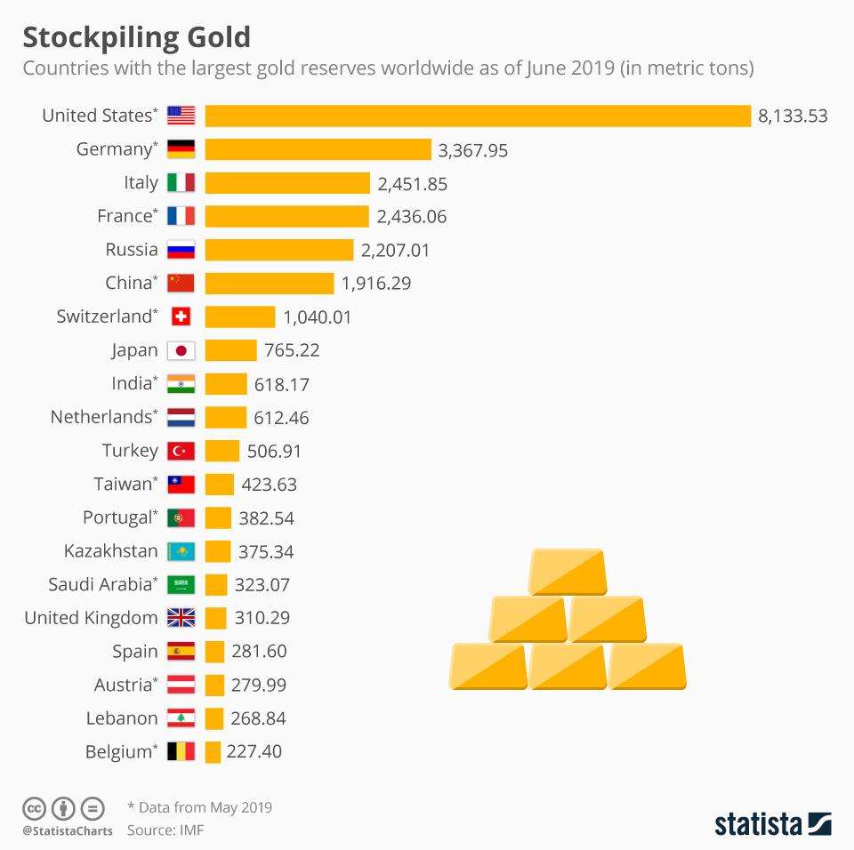

## Table of Contents

## What are gold reserves and why are they important for a country?

Gold reserves are the amount of gold that a country's government or central bank holds. This gold is usually kept in secure places like vaults. Countries keep gold reserves because gold is seen as a valuable and safe asset. It can be used to back up the country's currency, which means it helps make the money more trustworthy. Gold reserves can also be used in times of economic trouble to help stabilize the country's economy.

Gold is important for a country because it gives people confidence in the country's money. If a country has a lot of gold, people might think that the country's economy is strong and stable. This can make investors want to put their money into that country. Also, during times when the economy is not doing well, gold can be sold to get cash quickly. This can help the government or central bank take action to fix the economy. So, having gold reserves is like having a safety net for the country's financial health.

## Which country currently holds the largest gold reserves in the world?

The United States has the largest gold reserves in the world. They have about 8,133 tons of gold. This is a lot more than any other country. The gold is kept safe in places like Fort Knox and the Federal Reserve Bank in New York.

Having so much gold helps the United States a lot. It makes people trust the American dollar more because they know the country has a lot of gold to back it up. This can also help the U.S. during tough economic times because they can use the gold to get money quickly if they need to.

## How do gold reserves affect a country's economy?

Gold reserves can really help a country's economy. When a country has a lot of gold, it makes people feel more confident about that country's money. This is because gold is seen as a safe and valuable thing to have. When people trust a country's money more, they might want to invest in that country. This can bring more money into the country and help its businesses and economy grow.

Also, gold reserves can be a big help during tough economic times. If a country's economy is struggling, the government or central bank can sell some of its gold to get cash quickly. This cash can be used to help fix the economy, like by helping banks or businesses that are in trouble. So, having gold reserves is like having a safety net that can catch a country if it starts to fall economically.

## What is the historical trend of gold reserve accumulation for the top countries?

Over the years, the amount of gold that countries keep has changed a lot. In the past, many countries used gold to back up their money. This means they promised that their money was worth a certain amount of gold. The United States, for example, had a lot of gold because it used the gold standard until 1971. After that, countries started to move away from the gold standard, but they still kept gold because it was seen as a safe thing to have. The U.S. has always had the most gold, and it still does today.

Other countries have also been adding to their gold reserves over time. Germany, for example, started building up its gold reserves after World War II and became one of the top countries with gold. In recent years, countries like China and Russia have been buying more gold to make their economies stronger. They want to have more gold to show that their money is trustworthy and to have something valuable in case of economic problems. So, while the reasons for keeping gold have changed over time, many countries still see it as an important part of their economy.

## How are gold reserves measured and reported?

Gold reserves are measured in weight, usually in tons or metric tonnes. A ton is a big amount, about 1,000 kilograms. Countries keep track of how much gold they have and report it to the International Monetary Fund (IMF) and other groups. These reports show how many tons of gold a country has in its vaults. The numbers are important because they help people understand how strong a country's economy might be.

Countries report their gold reserves regularly, often every month or every year. They do this to show that they are being open about their finances. The reports go to the IMF and other places that keep track of global economics. Sometimes, the numbers can change if a country buys or sells gold. People and other countries look at these reports to see if a country's economy is doing well or if it might need help.

## What role do gold reserves play in international trade and finance?

Gold reserves play a big role in international trade and finance. They help make a country's money seem more trustworthy. When a country has a lot of gold, other countries might want to trade with them more because they think the country's money is strong. This can help the country buy and sell things with other countries more easily. Gold reserves also make investors feel more confident about putting their money into a country. If investors think a country's money is backed by gold, they might be more willing to invest there, which can bring in more money and help the country's economy grow.

In times of trouble, gold reserves can be very important for international finance. If a country's economy is struggling, it can sell some of its gold to get cash quickly. This cash can be used to pay for things the country needs from other countries, like food or medicine. It can also help the country pay back money it owes to other countries. So, having gold reserves is like having a safety net that can help a country keep trading and working with other countries, even when things are tough.

## How do countries acquire and manage their gold reserves?

Countries get their gold reserves in different ways. They can buy gold from other countries or from big companies that mine gold. Sometimes, they might get gold by trading with other countries, using money or other things they have. Central banks, which are like big banks for the whole country, are in charge of buying and keeping the gold safe. They usually store the gold in special vaults that are very secure, like in Fort Knox in the United States or in the Bank of England in the UK.

Managing gold reserves is also important. Central banks keep an eye on how much gold they have and decide when to buy more or sell some. They might sell gold if they need cash quickly to help the country's economy, or they might buy more if they want to make their money seem stronger. They report how much gold they have to groups like the International Monetary Fund (IMF) to show that they are being open about their finances. This helps other countries and investors trust them more.

## What are the geopolitical implications of holding large gold reserves?

Having a lot of gold can make a country look strong and stable to other countries. When a country has big gold reserves, other countries might want to trade with them more because they think the country's money is safe and trustworthy. This can help the country make more deals and get better prices in international trade. It can also make other countries see the country as a big player in the world, which can give them more power in talks and agreements. For example, if a country has a lot of gold, it might be able to get better terms when borrowing money from other countries or from big groups like the International Monetary Fund.

On the other hand, having big gold reserves can also cause some problems. Other countries might get worried if one country has too much gold, because it might seem like they are trying to control the world's gold market. This can lead to tension and disagreements between countries. Also, if a country with a lot of gold starts to sell it suddenly, it could make the price of gold go down, which could hurt other countries that have gold too. So, while having a lot of gold can make a country look strong, it can also make things tricky in the world of international politics and trade.

## Can you compare the gold reserve policies of the top three countries with the largest reserves?

The United States, Germany, and Italy are the top three countries with the largest gold reserves. The United States has the most gold, about 8,133 tons, and they keep it in places like Fort Knox and the Federal Reserve Bank in New York. They started collecting a lot of gold when they were using the gold standard, but they stopped using it in 1971. Now, they keep the gold as a safety net for their economy. The U.S. reports their gold reserves to the International Monetary Fund (IMF) and other groups to show they are being open about their finances.

Germany has the second largest gold reserves, with about 3,355 tons. They started building up their gold after World War II to make their money more trustworthy. Germany keeps most of its gold in their own country, but some is also stored in places like the United States and the United Kingdom. They report their gold reserves regularly to the IMF and other groups. Italy has the third largest gold reserves, with about 2,452 tons. Italy also keeps their gold to make their money seem strong and to have something valuable in case of economic trouble. They report their gold reserves to the IMF and other groups to show they are being open about their finances.

All three countries use their gold reserves to help make their economies look strong and stable. They can sell some of their gold if they need cash quickly during tough economic times. By reporting their gold reserves, they show other countries and investors that they are being honest about their finances. This helps them get more trust and respect in the world of international trade and finance.

## How have global events, such as economic crises or pandemics, impacted countries' gold reserves?

Global events like economic crises and pandemics can change how countries handle their gold reserves. During tough economic times, countries might sell some of their gold to get cash quickly. This can help them pay for things they need or help their economy get better. For example, during the 2008 financial crisis, some countries sold gold to help their banks and businesses that were struggling. Also, when the economy is not doing well, people and investors might want to buy more gold because they see it as a safe thing to have. This can make the price of gold go up, which might make countries think about buying more gold to add to their reserves.

Pandemics, like the COVID-19 outbreak, can also affect gold reserves. When a big health crisis happens, it can make the world's economy slow down. Countries might need to use their gold reserves to help their people and businesses. For example, during the COVID-19 pandemic, some countries sold gold to get money to help their health systems and to support their economies. At the same time, because people were worried about the economy, they bought more gold, which made its price go up. This can make countries want to buy more gold to make their money seem stronger and to have something valuable in case things get worse.

## What are the future predictions for changes in gold reserve holdings among leading countries?

In the future, countries might change how much gold they keep in their reserves. Some countries, like China and Russia, have been buying more gold in recent years. They might keep doing this to make their money seem stronger and to have something valuable in case their economies get into trouble. Other countries, like those in Europe, might not change their gold reserves much because they already have a lot and they feel their economies are stable. But if there is another big economic crisis or a new global problem, more countries might start buying or selling gold to help their economies.

Also, new technologies and changes in how the world trades could affect gold reserves. For example, if more countries start using digital money, they might not need as much gold to back up their money. But if gold becomes even more valuable because of new uses, like in technology, countries might want to hold onto more gold. It's hard to say exactly what will happen, but gold will probably stay important for countries because it helps them feel safe and strong in the world's economy.

## How do gold reserves influence a country's monetary policy and currency stability?

Gold reserves play a big role in a country's monetary policy and help keep its currency stable. When a country has a lot of gold, it makes people trust the country's money more. This is because gold is seen as a safe and valuable thing to have. When people trust a country's money, they might want to invest in that country or use its money for trade. This can help the country's economy grow and keep its money strong. The central bank, which is in charge of a country's money, might use the gold reserves to help control how much money is in the economy. If there's too much money, it can make the money worth less, so the central bank might sell some gold to get cash and take some money out of the economy.

Gold reserves also help a country's currency stay stable during tough times. If the economy is struggling, the government or central bank can sell some of its gold to get cash quickly. This cash can be used to help banks or businesses that are in trouble, which can help the economy get better. Having gold reserves is like having a safety net that can catch the country if it starts to fall economically. So, gold reserves are important for keeping a country's money strong and stable, which helps the whole economy.

## References & Further Reading

[1]: World Gold Council. ["Gold Reserves Data."](https://www.gold.org/goldhub/data/gold-reserves-by-country) Access financial data and analysis relating to gold reserves globally.

[2]: Bain & Company. ["Updating the Status of Global Gold Reserves"](https://www.bain.com/insights/a-brilliant-recovery-shapes-up-the-global-diamond-industry-2021-to-22/) Focusing on long-term trends and economic implications of gold reserve holdings.

[3]: Yermack, D. (1997). ["Good Timing: CEO Stock Option Awards and Company News Announcements."](https://www.jstor.org/stable/2329486) National Bureau of Economic Research. Discusses financial markets and trends relevant to gold trading.

[4]: Ross, S. A., Westerfield, R. W., & Jaffe, J. (2010). ["Corporate Finance"](https://www.mheducation.com/highered/product/corporate-finance-ross-westerfield/M9781260772388.html) Offers insights into the strategic significance of assets like gold in financial management.

[5]: Hull, J. C. (2018). ["Options, Futures, and Other Derivatives"](https://www.semanticscholar.org/paper/Options%2C-Futures%2C-and-Other-Derivatives-Hull/89bdee500c8623864fc9eb7a471546aa713acc44) Provides understanding of global financial systems affecting liquidity and trading, including gold markets.