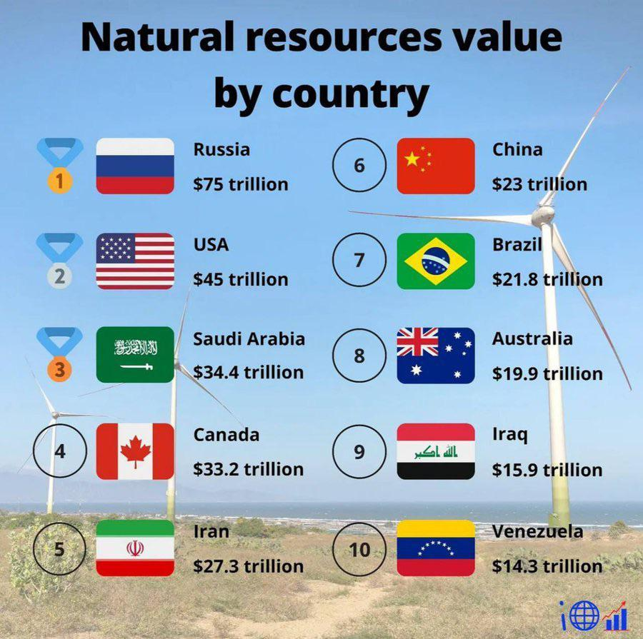

## Table of Contents

## What are natural resources?

Natural resources are things we find in nature that people can use. They include things like water, trees, oil, and minerals. These resources come from the earth and are important for our lives. We use them to build things, make energy, grow food, and do many other activities.

Some natural resources can be used again and again, like sunlight and wind. These are called renewable resources because they don't run out. Other resources, like coal and oil, are called non-renewable resources. Once we use them up, they are gone forever. It's important to use all natural resources wisely so they last longer and help more people.

## How are natural resources categorized?

Natural resources are divided into two main types: renewable and non-renewable. Renewable resources are those that can be replaced naturally over time. Examples include sunlight, wind, water, and trees. These resources can be used again and again because nature keeps making more of them. For example, we can plant new trees to replace the ones we cut down.

Non-renewable resources, on the other hand, cannot be replaced once they are used up. They include things like oil, coal, and natural gas. These resources come from the earth and took millions of years to form. Once we use them all, they are gone forever. That's why it's important to use non-renewable resources carefully and look for other ways to meet our needs.

There is also another way to categorize natural resources: by their state. They can be solid, like minerals and metals; liquid, like oil and water; or gas, like natural gas. Each type has different uses and ways of being extracted from the earth.

## Which countries have the most abundant natural resources?

Some countries have a lot of natural resources. Russia is one of them. It has big amounts of oil, natural gas, coal, and minerals like gold and diamonds. Russia also has a lot of forests and fresh water. The United States is another country with many resources. It has oil, natural gas, coal, and lots of farmland. The U.S. also has many minerals and metals.

Canada is rich in natural resources too. It has huge amounts of oil, natural gas, and minerals. Canada also has a lot of forests and fresh water. Countries like Saudi Arabia and Iran are known for their oil and natural gas. Australia has a lot of minerals and metals, like iron ore and coal. Brazil has a lot of farmland, forests, and minerals.

These countries use their natural resources to help their people and to trade with other countries. It's important for them to use these resources wisely so they can last a long time.

## What are the top natural resources found in each continent?

In North America, the top natural resources include oil, natural gas, and coal. The United States and Canada have a lot of these energy resources. They also have many minerals like gold, silver, and copper. The continent has large areas of farmland and forests, which are important for food and wood. Fresh water is another key resource, with many big lakes and rivers.

South America is rich in natural resources too. Brazil has a lot of farmland and forests, which are important for food and wood. The continent also has a lot of oil, especially in countries like Venezuela. There are also many minerals, like copper and iron ore, found in countries like Chile and Brazil. Fresh water from the Amazon River is a big resource for the continent.

In Europe, natural resources include natural gas and coal, especially in countries like Russia and Ukraine. Europe also has minerals like iron ore and copper. Forests are important for wood, and there are many rivers and lakes for fresh water. In Asia, oil and natural gas are big resources, with countries like Saudi Arabia and Russia having a lot. Asia also has a lot of coal, especially in China. There are many minerals like gold and copper, and large areas of farmland and forests. Africa is rich in oil, especially in Nigeria and Angola, and has a lot of minerals like gold, diamonds, and copper. The continent also has large areas of farmland and forests. Australia has a lot of minerals like iron ore and coal, and also has oil and natural gas. The continent has large areas of farmland and forests too. Antarctica has a lot of fresh water in its ice, but it's hard to use because it's so cold.

## How does the availability of natural resources impact a country's economy?

The availability of natural resources can greatly affect a country's economy. Countries with a lot of resources like oil, gas, and minerals can make a lot of money by selling these to other countries. This can help the country grow richer and create jobs for people. For example, countries like Saudi Arabia and Russia use their oil to earn a lot of money. This money can be used to build roads, schools, and hospitals, making life better for people living there.

However, having a lot of natural resources can also cause problems. Sometimes, countries focus too much on selling these resources and don't spend enough time building other parts of their economy, like factories or technology. This can make the country's economy depend too much on the prices of these resources, which can go up and down. If the prices drop, the country's economy can suffer. It's important for countries to use their natural resources wisely and also work on other parts of their economy to stay strong.

## What are some examples of countries rich in oil and gas?

Some countries have a lot of oil and gas. Saudi Arabia is one of them. It has huge amounts of oil and is one of the biggest oil producers in the world. Russia also has a lot of oil and gas. It uses these resources to make a lot of money and help its economy grow. The United States has a lot of oil and gas too. It has been finding more oil in places like Texas and North Dakota.

Other countries rich in oil and gas include Iran and Iraq. Iran has big oil fields and also a lot of natural gas. Iraq has a lot of oil and is working to produce more. These countries use their oil and gas to earn money and help their people. But they need to be careful because the prices of oil and gas can go up and down, which can affect their economies.

## Which countries are leading in mineral resources like gold and copper?

Some countries have a lot of gold. South Africa used to be the biggest gold producer, but now China is the leader. China has many gold mines and produces a lot of gold every year. Australia also has a lot of gold and is one of the top countries for gold mining. Russia and the United States have a lot of gold too. These countries use their gold to make money and help their economies grow.

Copper is another important mineral, and Chile is the top country for copper. It has huge copper mines and produces a lot of copper every year. Peru is another country with a lot of copper. The United States and China also have a lot of copper mines. These countries use copper to make things like wires and pipes, which are important for many industries. Having a lot of copper helps these countries earn money and grow their economies.

## How do countries manage and regulate their natural resources?

Countries manage and regulate their natural resources in different ways. They often have laws and rules that say how resources can be used and who can use them. For example, a country might have a government agency that gives out permits for mining or drilling. This helps make sure that resources are used safely and fairly. Countries also might tax the companies that take resources out of the ground. This gives the country money to use for things like schools and roads.

Sometimes, countries work together to manage resources that are shared, like big rivers or fish in the ocean. They might make agreements about how much each country can use so that the resource is not used up too quickly. This helps keep the resource available for a long time. Countries also try to protect their resources by making rules about pollution and waste. This helps keep the air, water, and land clean so that resources can keep being used in the future.

## What are the environmental impacts of extracting natural resources?

Extracting natural resources can harm the environment. When we dig for minerals or drill for oil and gas, it can damage the land. Big holes and tunnels can change the way water flows and make the ground unstable. It can also destroy habitats where animals and plants live. This can cause some species to disappear. Pollution is another problem. Mining and drilling can release harmful chemicals into the air, water, and soil. This can make it hard for people and animals to stay healthy.

Using natural resources can also affect the climate. Burning fossil fuels like coal, oil, and gas releases gases that trap heat in the atmosphere. This can make the Earth warmer, which is called global warming. Warmer temperatures can cause more storms, droughts, and floods. These changes can make it hard for people to grow food and find water. It's important for countries to think about these impacts and try to find ways to use resources that are less harmful to the environment.

## How do international trade agreements affect the distribution of natural resources?

International trade agreements help countries share their natural resources. These agreements set rules about how much a country can sell and buy. They help make sure that resources like oil, gas, and minerals are shared fairly among countries. For example, a country with a lot of oil might agree to sell it to another country that needs it. This can help both countries because the one with oil makes money, and the one that needs oil gets to use it.

These agreements can also affect how much money countries make from their resources. If a country agrees to sell its resources at a lower price, it might not make as much money. But it can still be good because it helps the country sell more and keep good relationships with other countries. Sometimes, trade agreements can lead to problems if countries don't follow the rules or if the agreements are not fair. It's important for countries to work together and make sure that everyone benefits from sharing resources.

## What role do renewable resources play in a country's natural resource profile?

Renewable resources are very important for a country's natural resource profile. They include things like sunlight, wind, water, and trees that can be used again and again. These resources help countries make energy without using up resources that can't be replaced, like oil and coal. For example, a country can use wind turbines to make electricity from the wind. This can help the country have more energy and not depend so much on non-renewable resources.

Using renewable resources can also help the environment. They don't release harmful gases like fossil fuels do, which means they don't make the Earth warmer. Countries that use a lot of renewable resources can help fight climate change and keep the air and water clean. This is good for people's health and for the animals and plants that live on the Earth. By focusing on renewable resources, countries can have a strong and sustainable natural resource profile that helps everyone.

## How are technological advancements influencing the exploration and extraction of natural resources?

Technological advancements are making it easier for countries to find and get natural resources. New tools like drones and satellites can look at the earth from above and find where resources like oil and minerals might be. Special machines can go deep into the earth to explore places that were hard to reach before. Computers and software help scientists understand the data they collect, so they can find resources faster and more accurately. This means countries can use their resources better and find new ones that they didn't know about before.

These technologies also help make extracting resources safer and less harmful to the environment. For example, new drilling methods can get oil and gas out of the ground without causing as much damage. Machines can now dig for minerals in a way that is less harmful to the land and water. Also, technology helps us use resources more efficiently, so we don't waste them. This is important because it means we can keep using our resources for a longer time and in a way that is better for the planet.

## References & Further Reading

[1]: Bergstra, J., Bardenet, R., Bengio, Y., & Kégl, B. (2011). ["Algorithms for Hyper-Parameter Optimization."](https://papers.nips.cc/paper/4443-algorithms-for-hyper-parameter-optimization) Advances in Neural Information Processing Systems 24.

[2]: ["Advances in Financial Machine Learning"](https://www.amazon.com/Advances-Financial-Machine-Learning-Marcos/dp/1119482089) by Marcos Lopez de Prado

[3]: ["Evidence-Based Technical Analysis: Applying the Scientific Method and Statistical Inference to Trading Signals"](https://www.amazon.com/Evidence-Based-Technical-Analysis-Scientific-Statistical/dp/0470008741) by David Aronson

[4]: ["Machine Learning for Algorithmic Trading"](https://github.com/stefan-jansen/machine-learning-for-trading) by Stefan Jansen

[5]: ["Quantitative Trading: How to Build Your Own Algorithmic Trading Business"](https://www.amazon.com/Quantitative-Trading-Build-Algorithmic-Business/dp/1119800064) by Ernest P. Chan

[6]: U.S. Geological Survey. ["Mineral Commodity Summaries"](https://www.usgs.gov/publications/mineral-commodity-summaries-2024) - Provides annual data on mineral production, consumption, and international trade.

[7]: Bloomberg New Energy Finance. ["Lithium-ion Battery Market Growth"](https://www.mckinsey.com/industries/automotive-and-assembly/our-insights/battery-2030-resilient-sustainable-and-circular) - Reports and analysis on the growth of the lithium-ion battery market and its impact on resource investment.

[8]: Saipem, L., & McCrackin, T. (2020). ["The Role of Artificial Intelligence in Financial Markets"](https://www.mdpi.com/1911-8074/16/10/434) - An overview of how AI is transforming trading strategies and financial markets.