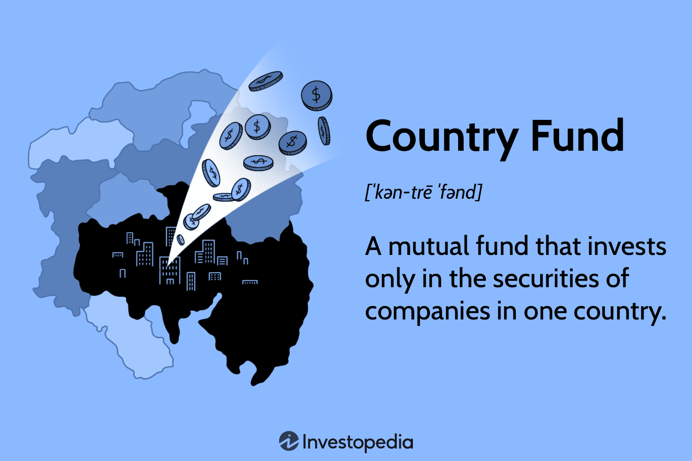

## Table of Contents

## What is a country fund?

A country fund is a type of investment fund that focuses on investing in the stocks, bonds, or other financial assets of a specific country. These funds allow investors to put their money into a particular country's economy without having to buy individual stocks or bonds themselves. This can be useful for people who want to diversify their investments across different countries or who believe that a specific country's economy will do well in the future.

Country funds can be managed by professionals who make decisions about which assets to buy and sell. This can help investors who do not have the time or expertise to research and manage their own investments in foreign markets. However, investing in country funds also comes with risks, such as changes in the country's political or economic situation, which can affect the value of the fund's investments. It's important for investors to understand these risks and consider them when deciding whether to invest in a country fund.

## How does a country fund work?

A country fund works by pooling money from many investors to buy stocks, bonds, or other financial assets from a specific country. When you invest in a country fund, you are buying shares of the fund itself. The fund manager uses the money from all the investors to buy assets in that country. This way, you can invest in a whole country's economy without having to pick individual stocks or bonds yourself.

The value of your investment in a country fund goes up or down based on how well the assets in the fund are doing. If the stocks or bonds in the country do well, the value of the fund goes up, and so does the value of your shares. But if the country's economy has problems, like political issues or a recession, the value of the fund can go down. This is why it's important to think about the risks before you invest in a country fund.

## What are the main objectives of investing in a country fund?

The main goal of investing in a country fund is to spread out your money across different countries. This can help you not put all your eggs in one basket. If one country's economy does not do well, the money you have in other countries might help balance it out. It's like having different kinds of plants in a garden; if one type doesn't grow well, the others might still thrive.

Another objective is to take advantage of growth in a specific country's economy. If you think a certain country will do really well in the future, you can invest in a country fund to benefit from that growth. It's a way to bet on the future success of a country without having to pick out individual companies to invest in. This can be easier and less risky than trying to choose the right stocks on your own.

## What are the advantages of investing in country funds?

One advantage of investing in country funds is that they help you spread your money across different countries. This is called diversification. If you only invest in one country and it has problems, you could lose a lot of money. But if you invest in many countries, the good performance of one country might help balance out the bad performance of another. It's like having different kinds of fruits in your basket; if one fruit goes bad, you still have others to enjoy.

Another advantage is that country funds let you invest in the growth of a specific country without having to pick individual stocks or bonds. If you think a country's economy will do well in the future, you can invest in a fund that focuses on that country. This way, you don't have to be an expert on every company in that country. The fund managers do the hard work of choosing which assets to buy. This can save you time and might be less risky than trying to pick the right stocks on your own.

## What are the potential disadvantages of country funds?

One potential disadvantage of investing in country funds is that they can be risky because they focus on just one country. If that country has economic or political problems, the value of the fund can go down a lot. This is different from a fund that invests in many countries, which might be safer because it's spread out. Also, country funds might not be as easy to buy or sell as other types of funds. This means you might have to wait longer to get your money out if you need it quickly.

Another disadvantage is that country funds can be more expensive. They often have higher fees because they need experts who know a lot about the specific country's market. These fees can eat into your profits over time. Plus, because these funds focus on one country, they might not give you as much variety in your investments as you might want. If you're looking to spread your money across many different types of investments, a country fund might not be the best choice.

## How do country funds differ from other types of investment funds?

Country funds are different from other types of investment funds because they focus on just one country. Most other funds, like global or international funds, spread their investments across many countries. This means that with a country fund, all your money is in one place, which can be riskier if that country has problems. But it can also be a good way to bet on the success of a specific country's economy without having to pick out individual companies.

Another way country funds differ is that they can be more expensive. They often have higher fees because they need experts who know a lot about the specific country's market. These fees can make your investment cost more over time. Also, country funds might not be as easy to buy or sell as other types of funds. If you need your money quickly, you might have to wait longer to get it out of a country fund than from other kinds of funds.

## What are some examples of country funds?

One example of a country fund is the iShares MSCI Japan ETF. This fund focuses on investing in stocks from companies in Japan. If you think Japan's economy will do well, you can buy shares in this fund and benefit from the growth of Japanese companies without having to pick them out yourself. Another example is the iShares MSCI Brazil ETF, which invests in stocks from Brazilian companies. This fund can be a good choice if you believe Brazil's economy has a lot of potential for growth.

Country funds like the iShares MSCI India ETF are also popular. This fund invests in stocks from companies in India, which is known for its fast-growing economy. If you want to invest in India's future, this fund can be a good option. These examples show how country funds let you focus on specific countries and their economies, which can be a good way to diversify your investments and take advantage of growth in different parts of the world.

## How can one evaluate the performance of a country fund?

To evaluate the performance of a country fund, you can start by looking at its returns over time. This means checking how much the value of the fund has gone up or down in the past. You can compare these returns to a benchmark, like an index that tracks the overall market of the country the fund invests in. If the fund does better than the benchmark, it's doing well. Also, look at the fund's performance over different periods, like one year, three years, or five years, to get a good idea of how it's been doing.

Another thing to consider is the risk involved. You can see how much the fund's value goes up and down by looking at its volatility. If the fund's value changes a lot, it's more risky. You can also look at how the fund performs compared to other funds that invest in the same country. This can help you see if the fund is doing a good job compared to its peers. Finally, don't forget to check the fees. Higher fees can eat into your returns, so a fund with lower fees might be a better choice if it performs just as well or better than a fund with higher fees.

## What are the risks associated with country funds?

One risk of investing in country funds is that they focus on just one country. If that country has problems, like a bad economy or political trouble, the value of the fund can go down a lot. This is different from funds that invest in many countries, which might be safer because they spread the risk around. If you put all your money in one country and it does poorly, you could lose a lot.

Another risk is that country funds can be hard to buy or sell quickly. If you need your money fast, you might have to wait longer to get it out of a country fund than from other kinds of funds. Also, country funds can be more expensive because they need experts who know a lot about the specific country's market. These higher fees can make your investment cost more over time, which can eat into your profits.

## How do geopolitical events impact country funds?

Geopolitical events, like wars or changes in government, can have a big impact on country funds. When something big happens in a country, it can make the economy go up or down. If a country has a war or a big political change, people might not want to invest there anymore. This can make the stocks and bonds in that country go down in value, which means the country fund will also go down. For example, if there's a new law that makes it harder for companies to make money, the value of the fund that invests in those companies can drop.

Another way geopolitical events can affect country funds is by causing uncertainty. When people are not sure what will happen in a country, they might pull their money out of that country's investments. This can make the value of the country fund go down even more. For instance, if there's a big election coming up and no one knows who will win, investors might wait to see what happens before they invest. This waiting can make the fund's value go down because fewer people are buying into it. So, it's important to keep an eye on what's happening in the country where your fund is invested.

## What role do country funds play in portfolio diversification?

Country funds help spread out your investments across different countries. This is called diversification. When you invest in just one country, you could lose a lot of money if that country's economy does badly. But if you invest in many countries, the good performance of one country might help balance out the bad performance of another. It's like having different kinds of fruits in your basket; if one fruit goes bad, you still have others to enjoy.

By using country funds, you can put money into different parts of the world without having to pick out individual stocks or bonds yourself. This can make your investments safer because you're not relying on just one place. If you think a certain country will do well in the future, you can invest in a fund that focuses on that country. This way, you can take advantage of growth in different countries and make your overall investment strategy stronger.

## What are the tax implications of investing in country funds?

When you invest in country funds, you need to think about taxes. If the fund makes money, you might have to pay taxes on that money. The tax rules can be different depending on where you live and where the fund is based. For example, if you live in the United States and the fund is in another country, you might have to pay taxes in both places. This can make things more complicated, and you might need to fill out extra tax forms.

Another thing to know is that country funds might have special tax treatments. Some countries have rules that can help you pay less tax on your investments. But these rules can change, and they might not always work in your favor. It's a good idea to talk to a tax expert who can help you understand how taxes will affect your investment in a country fund. They can help you plan so you don't end up paying more in taxes than you need to.

## References & Further Reading

[1]: Bergstra, J., Bardenet, R., Bengio, Y., & Kégl, B. (2011). ["Algorithms for Hyper-Parameter Optimization."](https://dl.acm.org/doi/10.5555/2986459.2986743) Advances in Neural Information Processing Systems 24.

[2]: ["Advances in Financial Machine Learning"](https://www.amazon.com/Advances-Financial-Machine-Learning-Marcos/dp/1119482089) by Marcos Lopez de Prado

[3]: ["Evidence-Based Technical Analysis: Applying the Scientific Method and Statistical Inference to Trading Signals"](https://www.amazon.com/Evidence-Based-Technical-Analysis-Scientific-Statistical/dp/0470008741) by David Aronson

[4]: ["Machine Learning for Algorithmic Trading"](https://github.com/stefan-jansen/machine-learning-for-trading) by Stefan Jansen

[5]: ["Quantitative Trading: How to Build Your Own Algorithmic Trading Business"](https://www.amazon.com/Quantitative-Trading-Build-Algorithmic-Business/dp/1119800064) by Ernest P. Chan