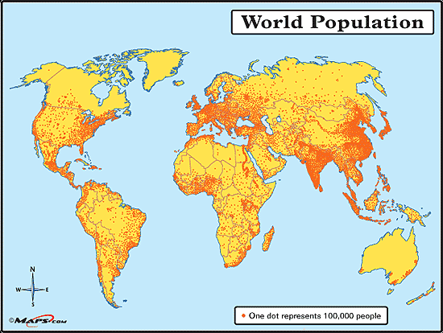

Country Picking is a key strategy in asset allocation, offering a robust framework for diversification, especially in algorithmic trading. Algorithmic trading, characterized by its reliance on quantitative methods and automated systems, benefits significantly when strategies include diverse market exposures. By targeting various country categories, investors gain access to markets that are broadly categorized as developed, emerging, or frontier. 

Developed markets, with their established financial systems and high levels of stability, provide a dependable foundation for portfolios. Emerging markets, on the other hand, present growth opportunities due to rapid industrialization and improving infrastructure. Frontier markets, often seen as high-risk but high-reward, offer potential for outsized returns due to their nascent economic and market development stages. 

Country Picking enables investors to construct a more balanced and globally diversified portfolio, potentially enhancing returns while managing risks effectively. This approach allows investors to tap into different economic cycles, geopolitical climates, and market performances, all of which contribute to portfolio resilience against region-specific downturns. The strategic selection of countries supports investment goals, whether for maximizing returns, minimizing risks, or both.

In this article, we will explore the various facets of country picking and its integration into algorithmic trading strategies. We will analyze the benefits it offers and its role in enhancing investment performance through diversified market exposure.



## Table of Contents


## Understanding Country Categories

Country classification is a pivotal element of global asset allocation, helping investors align their portfolios with specific risk and return profiles. The primary classifications—developed, emerging, and frontier markets—offer distinct investment environments with varying economic conditions, growth potential, and risk factors.

**Developed Markets**

Developed markets are characterized by robust economic infrastructures, high income levels, and mature capital markets. Countries such as the United States, Germany, and Japan fall into this category. They often exhibit lower risk compared to other classifications due to stable political environments and well-established legal frameworks. The risk-return profile of developed markets typically yields lower volatility, meaning returns are often more stable and predictable. Investors in developed markets might expect moderate returns, but benefit from reduced risk.

**Emerging Markets**

Emerging markets represent economies that are in the process of rapid industrialization and growth. Nations like China, India, and Brazil are examples of emerging markets. These markets are often marked by higher risk-return characteristics. The potential for high returns is counterbalanced by increased volatility and risk, stemming from political instability, foreign exchange fluctuations, and less mature financial systems. Economic fundamentals in these regions can drive significant asset price movements, correlating closely with market performance.

**Frontier Markets**

Frontier markets are the least developed, encompassing countries like Vietnam, Nigeria, and Morocco. These markets are generally smaller, less accessible, and involve higher risks compared to developed and emerging markets. They offer opportunities for substantial growth, but with correspondingly high levels of risk, often derived from political instability, underdeveloped infrastructure, and limited market regulation. Frontier markets can exhibit limited correlations with global markets, offering diversification benefits but also requiring careful risk assessment.

**Economic Fundamentals and Asset Correlations**

Economic fundamentals such as GDP growth, inflation rates, and fiscal policies significantly influence asset correlations within a country. In developed markets, economic stability often means that assets such as stocks and bonds may show predictable correlation patterns based on risk appetite and interest rate changes. In contrast, emerging and frontier markets might see more volatile and less predictable correlations due to frequent changes in economic policies and external shocks. Recognizing these dynamics helps investors tailor their strategies according to the unique economic backdrop and asset behaviors within each market category. 

In summary, understanding the distinctions between developed, emerging, and frontier markets, alongside their risk-return profiles and economic fundamentals, is crucial for effective country picking. This knowledge underpins the development of diversified, balanced, and strategic asset allocation approaches in international portfolios.


## The Role of ETFs in Country Picking

Exchange-Traded Funds (ETFs) offer distinctive advantages for investors engaging in country picking compared to direct investments. The primary benefits arise from enhanced diversification, cost efficiency, and ease of access to specific markets.

Firstly, one of the primary advantages of ETFs in country picking is the inherent diversification they offer. By investing in an ETF that tracks a country's index, investors gain exposure to a basket of stocks representing that country's market. This diversification reduces the unsystematic risk associated with holding individual stocks. For instance, an ETF tracking the FTSE 100 allows investors to diversify across the major companies in the UK, insulating against the volatility of single stocks.

Moreover, the correlation benefits of country ETFs are significant. By choosing ETFs from different countries, investors can tailor a portfolio with assets that have lower correlations with one another, potentially smoothing returns over time. For example, the correlation coefficient between emerging markets and developed markets often varies, providing a strategic advantage in balancing risk and potential returns.

Cost efficiency is another critical factor favoring ETFs. ETFs generally have lower expense ratios compared to traditional mutual funds due to their passive management structure. Additionally, trading in ETFs typically incurs lower transaction costs than buying a collection of individual stocks. The transparency of ETF fees, which include the expense ratio, makes it easier for investors to predict and manage costs effectively.

ETFs also provide a straightforward way for investors to enter and exit positions thanks to their liquidity. They trade on major exchanges just like stocks, enabling investors to buy and sell throughout the trading day at market prices. This liquidity makes it simpler for investors to respond to market changes and adjust their positions as needed.

Lastly, ETFs succinctly capture the essence of a country's market by replicating its index performance. This makes them an attractive option for those aiming to align their investments with the overall economic health and trends of a specific country. By holding an ETF, investors effectively track the market movements of the entire country, thereby capturing the macroeconomic factors driving its performance.

In conclusion, ETFs stand out as a preferred vehicle for country picking due to their diversification benefits, cost efficiencies, transparent fee structure, and market-aligned performance, making them ideal for investors looking to gain exposure to specific national markets.


## Anomalies and Country Selection Strategies

In the world of international investing, anomalies play a critical role in shaping country selection strategies, offering investors unique opportunities to enhance returns. These anomalies refer to patterns or irregularities in market behavior that can be exploited for profit. Key studies by researchers such as Meb Faber and scholars like Balvers and Wu have significantly contributed to understanding how momentum and reversal effects manifest at the country level, informing strategies akin to those employed in equity markets.

One of the prominent strategies involves capitalizing on momentum effects, where countries with strong recent performance are expected to continue outperforming in the short term. This notion is supported by the findings of Faber, who highlighted that countries exhibiting strong momentum tend to offer better near-term returns. Similarly, Balvers and Wu's work underscores the prevalence of momentum in country indices, showing that past winners often remain winners, consistent with momentum strategies in individual stocks.

Conversely, reversal effects represent another anomaly where countries that have underperformed might be poised for recovery, providing contrarian investment opportunities. This strategy aligns with the well-documented reversal effect in equities, where recent losers often outperform recent winners over time. The contrast between momentum and reversal strategies allows investors to balance their portfolios by strategically timing exposure to different markets based on these patterns.

Parallel to strategies used in equity markets, country selection strategies grounded in anomalies require a meticulous approach to data and analysis. The effectiveness of these strategies can be enhanced through algorithmic tools that optimize the timing and allocation of investments. By leveraging quantitative models, investors can systematically identify and act upon these anomalies, thus improving decision-making processes and ultimately enhancing portfolio performance. 

In summary, the principles of exploiting anomalies for country selection share a remarkable resemblance to equity market strategies, allowing investors to diversify their approaches and harness cross-market opportunities. As these anomalies continue to be explored and modeled, they offer valuable insights into global asset allocation, urging investors to develop robust methodologies to navigate the complexities of international markets.


## Understanding and Measuring Country Risk

Country risk is a crucial factor in international investments, representing the potential for financial loss due to changes in a country's political, economic, and social environment. Understanding this risk is essential for investors looking to diversify portfolios across various geographic markets, while also ensuring an alignment with their risk tolerance and investment objectives.

### Types of Country Risk

1. **Economic Risk**: This relates to the stability and growth prospects of a country's economy. Economic risk assessments consider factors such as GDP growth rates, inflation levels, unemployment rates, and balance of payments. A country with a robust and growing economy typically presents lower economic risk compared to one facing recession or high inflation.

2. **Political Risk**: Political risk involves the likelihood of changes in a country's political environment that may adversely impact investments. This includes changes in government leadership, regulatory policies, tax laws, and even the potential for civil unrest or war. Political stability often attracts more foreign investment by promising a secure and predictable investment climate.

3. **Sovereign Risk**: This type of risk is associated with a nation's ability to meet its debt obligations. It includes the assessment of a country's creditworthiness and its likelihood of defaulting on debt repayments. Sovereign risk is often influenced by both the economic and political dynamics within a country.

### Tools and Ratings for Assessing Country Risk

Investors can assess country risk using various tools and rating systems. Moody's, Standard & Poor's (S&P), and Fitch Ratings are major agencies that provide sovereign credit ratings reflecting the perceived risk of investing in a particular country. These ratings are a comprehensive analysis of a country's financial health, governance, and economic conditions.

- **Moody's Ratings**: Moody's provides a country risk score ranging from Aaa (highest quality, lowest risk) to C (lowest quality, highest risk), with various grades in between indicating differing levels of credit risk.

- **Standard & Poor's Ratings**: S&P assigns ratings from AAA (extremely strong capacity to meet financial commitments) to D (default), with respective pluses and minuses indicating relative status within major rating categories.

These ratings and tools are integral for investors to benchmark and quantify the risks associated with international investments. They help guide investment decisions by presenting a clearer picture of a country's current standing and future outlook. Consequently, comprehending and measuring country risk enables investors to strategically allocate assets, mitigate potential losses, and pursue potential growth opportunities effectively.


## Exploiting Country-Level Anomalies through Algo Trading

Country-level anomalies present an intriguing opportunity for generating alpha returns, especially when leveraged through algorithmic trading. These anomalies are inefficiencies or irregular patterns in country-specific markets that can be predicted and exploited for profit. Unlike stock-level anomalies, which are extensively studied and hence more competitive, country-specific anomalies remain relatively under-exploited, offering unique prospects for investors.

Currently, the state of country-specific anomalies is distinct from stock-level anomalies. Stock markets are highly liquid and efficient due to the vast amount of data and the number of participants scrutinizing individual equities. However, country markets can be less efficient due to varying degrees of transparency, economic maturity, and regulatory environments across different nations. This inefficiency makes it possible to identify and capitalize on trends and patterns that might not be apparent in more efficient stock markets.

Algorithmic tools are instrumental in optimizing country-picking strategies. By using sophisticated algorithms, traders can process large datasets, identify anomalies, and execute trades at speeds and accuracies unattainable manually. Here are some ways algorithmic tools enhance these strategies:

1. **Data Analysis and Pattern Recognition**: Algorithms can analyze economic indicators, currency exchange rates, political stability, and other country-specific data to identify anomalies. Machine learning models can be trained to recognize patterns and predict future market movements based on historical data.

   ```python
   import pandas as pd
   from sklearn.ensemble import RandomForestClassifier

   # Load country-specific data
   data = pd.read_csv('country_data.csv')

   # Define feature variables and target variable
   X = data[['gdp_growth', 'inflation_rate', 'political_stability']]
   y = data['market_movement']

   # Initialize Random Forest Classifier
   model = RandomForestClassifier(n_estimators=100)

   # Train the model
   model.fit(X, y)

   # Predict future movements
   predictions = model.predict(X)
   ```

2. **Backtesting and Risk Management**: Before deploying a strategy, it can be backtested using historical data to assess its potential performance. Algorithms can evaluate the strategy's risk-reward profile and adjust parameters for optimal returns, considering country risk factors such as economic or political instability.

3. **Execution Efficiency**: Algorithms can execute trades at the best possible prices by optimizing order types and timing, minimizing market impact and slippage, which is especially important in less liquid markets like those of emerging or frontier countries.

4. **Portfolio Optimization**: Advanced algorithms can assist in optimizing the composition of a portfolio by dynamically adjusting country exposures based on predicted returns and risk assessments. This involves real-time data processing and decision-making based on set parameters and objectives.

By leveraging these tools, investors can potentially unlock enhanced alpha returns by systematically identifying and exploiting country-level anomalies. The continued evolution of algorithmic trading tools holds promise for even more sophisticated and effective country-picking strategies in the future.


## Conclusion

Country picking is a cornerstone of strategic asset allocation in algorithmic trading, enabling investors to leverage the dynamics and unique characteristics of various international markets. By selecting countries to invest in—categorized as developed, emerging, or frontier—traders can significantly diversify their portfolios. International diversification not only spreads risk across multiple markets but also enhances potential returns by tapping into the growth prospects of different economic landscapes.

ETFs provide an accessible and efficient way to implement country-picking strategies. They offer cost-effective exposure to specific nations without the complexities and expenses associated with direct investments. This accessibility allows investors to capture the essence and performance of a country's market efficiently.

Moreover, tapping into country-level anomalies presents another layer of opportunity. Anomalies such as momentum and reversal effects at the country level can be systematically exploited using algorithmic trading strategies. These strategies parallel those used in equity markets, although certain patterns may be more pronounced or unique at the country level.

However, one must be keenly aware of the various forms of country risk, including economic, political, and sovereign risks. Thorough analysis using tools and ratings from organizations like Moody's and S&P is crucial for assessing these risks. Understanding and measuring country risk is paramount for informed decision-making.

In conclusion, integrating country picking into algorithmic trading offers a host of opportunities to optimize returns through diversified investment strategies. Strategic use of algorithmic tools enhances the ability to analyze, select, and capitalize on these opportunities effectively. As global markets continue to evolve, those who employ thoughtful and informed country picking will be well-positioned to maximize their portfolio performance across international landscapes.
