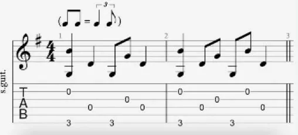

## Table of Contents

## What is country picking and how does it differ from other picking styles?

Country picking is a guitar playing style often used in country music. It involves using a flat pick to play the melody and bass notes, while also using the fingers of the picking hand to add extra notes. This technique allows guitarists to play complex rhythms and melodies at the same time, creating a full sound that can mimic the sound of a whole band.

Unlike other picking styles, country picking combines elements of both flatpicking and fingerpicking. In flatpicking, a guitarist uses a pick to play single notes or strum chords, which is simpler but can't create the layered sound of country picking. Fingerpicking, on the other hand, involves using the fingers to pluck the strings, which is great for arpeggios and intricate patterns but doesn't usually include the strong bass lines found in country picking. By blending these techniques, country picking offers a unique way to play that is central to the sound of country music.

## What are the essential techniques for beginners to start with country picking?

To start with country picking, beginners should first focus on holding the pick correctly. Hold the pick between your thumb and index finger, letting it rest lightly against your middle finger for stability. Practice moving the pick in a smooth, downward motion across the strings. This will help you play the bass notes clearly, which is a key part of country picking.

Next, you should learn to use your other fingers to pluck the higher strings. Start by using your middle and ring fingers to play simple melodies or harmonies while you keep playing bass notes with the pick. This might feel tricky at first, but with practice, you'll get better at coordinating your pick and fingers. Begin with slow, simple songs and gradually increase the speed as you become more comfortable.

Finally, practice switching between bass notes and melody notes smoothly. This is called 'alternating bass,' where you play a bass note with the pick, then a melody note with your fingers, and repeat. Start with easy patterns and songs that use this technique. As you practice, you'll develop the muscle memory needed to make country picking sound smooth and natural.

## Which instruments are commonly used for country picking?

Country picking is most often done on the guitar. This is because the guitar is very important in country music. It has six strings that can be played with a pick and fingers at the same time. This makes it easy to do the special picking style that country music needs. Many country songs use the guitar to play both the main tune and the bass notes, making the music sound full and rich.

Sometimes, other instruments can be used for country picking too. The banjo is another instrument that can do this style well. It has a bright sound that fits with country music. Like the guitar, the banjo can play both melody and bass notes at the same time. This makes it a good choice for country picking, even though it is not used as often as the guitar.

## How can one develop the right hand technique for effective country picking?

To develop the right hand technique for country picking, start by practicing how to hold the pick. Hold it between your thumb and index finger, and let it rest lightly against your middle finger. This helps keep the pick steady. Begin by moving the pick in a smooth, downward motion across the strings. Focus on playing clear bass notes with the pick. This is important because in country picking, the bass notes give the music its strong beat.

Next, work on using your other fingers to play the higher strings. Use your middle and ring fingers to pluck the strings while you keep playing bass notes with the pick. It might feel hard at first, but keep practicing. Start with slow, easy songs and try to play them faster as you get better. The key is to practice switching between the bass notes and the melody notes smoothly. This is called 'alternating bass.' Keep practicing until you can do it without thinking, and your country picking will sound great.

## What are some common rhythms and patterns used in country picking?

In country picking, one common rhythm is the 'boom-chick' pattern. This means you play a bass note on the first beat with your pick, and then play a chord or higher note on the second beat with your fingers. It makes a sound like 'boom-chick, boom-chick.' This pattern is simple but it makes the music feel steady and strong. Many country songs use this rhythm to keep the beat going.

Another pattern often used is the 'alternating bass' pattern. In this, you play a bass note on the first and third beats with your pick, and then play melody notes on the second and fourth beats with your fingers. It goes like 'bass-melody, bass-melody.' This pattern lets you play both the main tune and the bass line at the same time, making the music sound full and interesting. It takes practice to switch smoothly between the bass and melody, but it's a key part of country picking.

## Can you explain the role of hybrid picking in country music?

Hybrid picking is a way of playing the guitar that is really important in country music. It mixes using a pick with using your fingers to play the strings. In country music, this helps guitarists make a big, full sound all by themselves. They can play the low bass notes with the pick and the higher melody notes with their fingers at the same time. This makes the music sound like there's more than one instrument playing.

This technique is great for country picking because it lets players do a lot with just one guitar. Songs in country music often have a strong beat and a clear tune. With hybrid picking, a guitarist can play both the beat and the tune at the same time. It makes the music more interesting and fun to listen to. By practicing hybrid picking, anyone can start to play country music the way it's meant to be played.

## What are some famous songs that feature country picking and how can they be learned?

One famous song that features country picking is "Wagon Wheel" by Old Crow Medicine Show. This song uses the 'boom-chick' rhythm, where you play a bass note with the pick and then a higher note with your fingers. To learn it, start by practicing the main chords slowly. Focus on switching between the bass notes and the melody notes smoothly. Once you feel comfortable, try playing along with the song at a slow speed and then speed up as you get better. 

Another great song is "Jambalaya (On the Bayou)" by Hank Williams. This song has a fun, upbeat feel and uses the 'alternating bass' pattern. You play bass notes on the first and third beats and melody notes on the second and fourth beats. Start by learning the chords and the basic rhythm. Practice the bass and melody parts separately before putting them together. As you practice, try to keep the rhythm steady and play along with the song to get the feel right. 

Both songs are good for learning country picking because they show how to use different rhythms and patterns. By starting slow and practicing a lot, you can learn to play these songs well. Keep practicing and you'll get better at country picking and be able to play more country songs.

## How does one incorporate slides, bends, and hammer-ons into country picking?

To add slides, bends, and hammer-ons to your country picking, start with slides. A slide is when you play a note and then move your finger to a different note without lifting it off the string. In country picking, you can slide from one note to another to make your playing sound smooth and connected. For example, if you're playing a melody, try sliding from one note to the next. Practice sliding up and down the neck of the guitar until it feels easy and sounds good.

Next, try adding bends to your playing. A bend is when you push or pull a string to change its pitch. In country picking, bends can add emotion to your music. Play a note and then bend it up to make it sound higher. Start with small bends and practice until you can bend the string smoothly without it sounding sharp or off. Bends can be used in the melody part of your country picking to make it more expressive.

Finally, work on hammer-ons. A hammer-on is when you play a note and then quickly press down another finger on a higher fret without picking the string again. This makes the new note sound without another pick. In country picking, hammer-ons can help you play faster and smoother. Start by playing a note and then hammer on to a higher note. Practice this until you can do it quickly and cleanly. Using slides, bends, and hammer-ons will make your country picking sound more interesting and professional.

## What advanced techniques can elevate a player's country picking skills?

To take your country picking skills to the next level, try using more complex rhythms and patterns. Instead of just playing the 'boom-chick' or 'alternating bass' patterns, mix them up. You can add syncopation, where you play notes on the off-beats to make the rhythm more interesting. Also, try playing more notes in each beat, like playing triplets or sixteenths. This will make your playing sound faster and more exciting. Practice these new rhythms slowly at first, and then speed up as you get better.

Another way to improve is by adding more advanced techniques like double stops and pull-offs to your country picking. Double stops are when you play two notes at the same time, which can make your melodies richer and fuller. Practice playing double stops with your fingers while still using the pick for the bass notes. Pull-offs are the opposite of hammer-ons; you play a note and then pull your finger off to sound a lower note without picking again. Using pull-offs can help you play faster and smoother. Keep practicing these techniques, and they will make your country picking sound more professional and polished.

## How can a musician blend country picking with other genres like blues or rock?

A musician can blend country picking with blues by using the same picking style but playing blues scales and chords. In country picking, you play bass notes with a pick and melody notes with your fingers. You can do the same thing but use the blues scale to make the music sound bluesy. Also, you can add bluesy techniques like bends and slides to your country picking. This will make the music sound like a mix of country and blues. It's a good way to make your playing more interesting and show off your skills.

To blend country picking with rock, you can use the same picking technique but play rock chords and rhythms. Country picking is great for playing both the bass and melody at the same time, which is something rock music can use too. You can play rock songs using the 'boom-chick' or 'alternating bass' patterns from country picking. This will make the rock music sound fuller and more interesting. Also, you can add rock techniques like power chords and fast strumming to your country picking to make it sound more like rock. By mixing these styles, you can create a unique sound that stands out.

## What are the best practice routines for mastering country picking?

To master country picking, start with a daily practice routine that focuses on building the right hand technique. Begin by holding the pick correctly between your thumb and index finger, resting it lightly against your middle finger for stability. Practice moving the pick smoothly across the strings to play clear bass notes. Then, use your middle and ring fingers to pluck the higher strings while keeping the bass notes going with the pick. Start slow and simple, playing easy songs that use the 'boom-chick' or 'alternating bass' patterns. As you get better, try playing faster and adding more complex rhythms and patterns to your practice.

Once you feel comfortable with the basics, add more advanced techniques to your routine. Practice using slides, bends, and hammer-ons to make your country picking sound smoother and more expressive. Try playing double stops and pull-offs to add richness and speed to your playing. Also, mix in other styles like blues or rock by using country picking techniques with different scales and rhythms. Keep practicing these techniques every day, starting slow and gradually speeding up. This will help you master country picking and make your playing sound professional and unique.

## Who are some influential country pickers and what can we learn from their style?

One influential country picker is Chet Atkins. He was famous for his smooth and clear playing. Chet used a lot of fingerpicking and hybrid picking in his music. He mixed different styles like jazz and pop with country. We can learn from Chet that it's good to try different techniques and not be afraid to mix styles. His music shows that practicing a lot and being creative can make your playing sound special.

Another great country picker is Doc Watson. He was known for his fast and precise playing. Doc used flatpicking a lot, but he also did some fingerpicking. He played a lot of traditional country and folk songs. From Doc, we can learn the importance of playing with feeling and keeping a steady rhythm. His style shows that you can make simple songs sound amazing with good technique and passion.

## References & Further Reading

[1]: López de Prado, Marcos. (2018). ["Advances in Financial Machine Learning"](https://www.amazon.com/Advances-Financial-Machine-Learning-Marcos/dp/1119482089) John Wiley & Sons.
