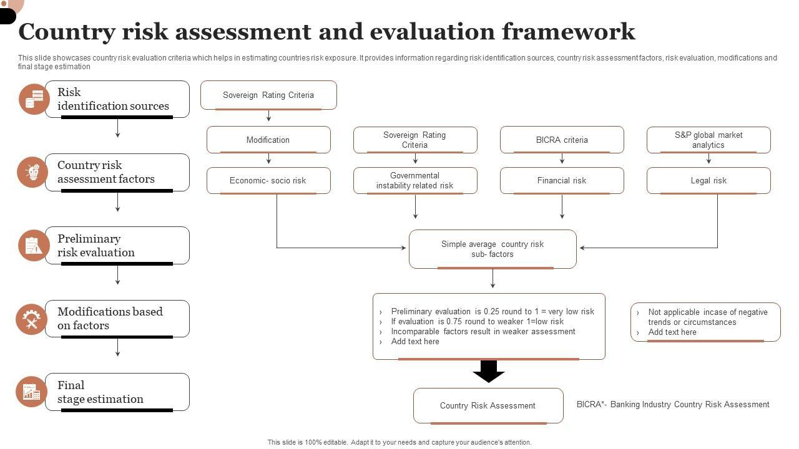

## Table of Contents

## What is country risk assessment?

Country risk assessment is when people study a country to see how safe and stable it is for businesses and investments. They look at things like the country's politics, economy, and even natural disasters to figure out if it's a good place to do business. This helps companies decide if they should invest money there or if it's too risky.

The assessment includes looking at the government's stability, like if there are elections or conflicts happening. It also checks the economy, seeing if it's growing or shrinking, and if there are enough jobs. Another part is checking if the country has a lot of debt or if it can pay back loans. All these pieces help paint a picture of how risky it is to do business in that country.

## Why is country risk assessment important for businesses?

Country risk assessment is important for businesses because it helps them understand if a country is a safe place to invest their money. When a company wants to start a new project or expand in a different country, they need to know if that country is stable. If the country has a lot of political problems or its economy is not doing well, the business might lose money. By doing a country risk assessment, businesses can see these risks before they invest and decide if it's worth it or if they should look for a safer place.

Also, country risk assessment helps businesses plan better. If they know a country might have natural disasters or high crime rates, they can prepare for these problems. This means they can set up safety measures or buy insurance to protect their investment. Knowing about these risks ahead of time can save a lot of money and keep the business running smoothly, even when unexpected things happen.

## What are the main types of country risks?

Country risks come in different forms, but the main ones are political, economic, and social risks. Political risks are about the government and politics in the country. This can include things like wars, changes in government, or new laws that might hurt businesses. For example, if a new government comes to power and changes the rules about foreign companies, it could make it hard for a business to operate there.

Economic risks are about the money and economy of the country. This includes things like inflation, which is when prices go up a lot, or when the country has a lot of debt and can't pay it back. If the economy is not doing well, businesses might not make as much money as they hoped. Social risks are about the people in the country. This can include crime rates, health issues, or even cultural differences that might affect how a business works.

Another type of risk is environmental risk, which is about natural disasters like earthquakes or floods. These can damage businesses and make it hard for them to keep running. Understanding all these types of risks helps businesses decide if a country is a good place to invest their money.

## How do political factors influence country risk?

Political factors can have a big impact on country risk because they affect how safe and stable a place is for businesses. If there is a war or a lot of fighting in a country, it can be dangerous for companies to operate there. Also, if the government changes a lot or if there are big protests, it can make things unpredictable. Businesses don't like uncertainty because it's hard to plan when they don't know what might happen next. For example, if a new government comes into power and decides to nationalize industries, which means the government takes control of businesses, it can be bad for companies that were already there.

Another way political factors influence country risk is through laws and regulations. If a country makes new rules that make it harder for foreign companies to do business, it can increase the risk. For instance, if the government starts taxing foreign companies more or puts limits on what they can do, it can hurt their profits. Also, if there is corruption, where people in power take bribes or misuse money, it can make it hard for businesses to trust the government. All these political factors can make a country less attractive for investment because they add to the risk that businesses might lose money.

## What economic indicators are used in country risk evaluation?

When people look at a country's risk, they check many economic signs to see if it's a good place for business. One big thing they look at is the Gross Domestic Product (GDP), which shows how much the country's economy is growing or shrinking. If the GDP is going up, it means the economy is doing well, and businesses might want to invest there. Another important sign is the inflation rate, which tells us how fast prices are going up. High inflation can make it hard for businesses because it makes things more expensive and can hurt their profits.

They also look at the unemployment rate, which tells us how many people in the country don't have jobs. A high unemployment rate can be bad because it means people don't have money to spend, which can slow down the economy. Another thing to check is the country's debt. If a country has a lot of debt and can't pay it back, it can be risky for businesses. Finally, they look at the exchange rate, which is how much the country's money is worth compared to other countries' money. If the exchange rate is unstable, it can make it hard for businesses to plan and can add to the risk of investing there.

## How can social and cultural factors affect country risk?

Social and cultural factors can really change how risky it is to do business in a country. For example, if a country has a lot of crime, it can be dangerous for businesses and their workers. High crime rates can scare away customers and make it hard for companies to keep their stores or offices safe. Also, if there are a lot of health problems in the country, like diseases that spread easily, it can affect how many workers can come to work and how many customers feel safe visiting the business. These social issues can make a country less attractive for investment because they add to the risk that businesses might lose money.

Cultural differences are another big thing to think about. When a company from one country tries to do business in another country, they might not understand the local customs and traditions. This can lead to mistakes that upset people or make it hard to sell products. For example, if a company advertises in a way that offends the local culture, it can lose customers and harm its reputation. Understanding and respecting the local culture is important for businesses to succeed and reduce the risks of operating in a new country.

## What role do legal and regulatory environments play in country risk?

The legal and regulatory environment in a country can make a big difference in how risky it is for businesses. If the country has clear and fair laws, it's easier for companies to know what they can and can't do. This helps them plan and feel more secure about their investments. But if the laws are confusing or change a lot, it can be hard for businesses to keep up. They might worry about breaking rules without meaning to, which can lead to fines or even having to stop their business.

Also, if the government is strict and makes a lot of rules that are hard to follow, it can make it tough for companies to operate. For example, if there are a lot of taxes or if it's hard to get the right permits, it can slow down business and add to the costs. On the other hand, if the government helps businesses by making it easier to start and run a company, it can lower the risk. So, the legal and regulatory environment is really important for businesses to think about when they decide if a country is a good place to invest.

## How are country risk ratings typically calculated?

Country risk ratings are usually calculated by looking at many different pieces of information about a country. People who do these ratings, like experts from companies or organizations, gather data on things like the country's politics, economy, and social issues. They use numbers and scores to show how risky a country is. For example, they might give a score for how stable the government is, another for how the economy is doing, and another for social problems like crime or health issues. All these scores are put together to make a final rating that shows the overall risk of doing business in that country.

Sometimes, different groups use their own special ways to calculate these ratings. They might weigh some factors more than others based on what they think is most important. For example, one group might think that the economy is the most important thing, so they give it a bigger part of the final score. Another group might focus more on political stability. But no matter how they do it, the goal is the same: to give businesses a clear picture of how risky it is to invest in a certain country. This helps companies decide if it's worth the risk or if they should look somewhere else.

## What are some common methodologies for assessing country risk?

One common way to assess country risk is by using a checklist or a scoring system. Experts gather information about different parts of a country, like its government, economy, and social issues. They give each part a score based on how risky it is. For example, if a country has a lot of political problems, it might get a high score for political risk. All these scores are added up to make a final rating that shows how risky the country is overall. This helps businesses see if it's a good place to invest their money.

Another method is to use models or formulas that weigh different factors. Some groups might think that the economy is more important than politics, so they give it a bigger part of the final score. These models can be very detailed and use a lot of data to predict how risky a country will be in the future. By looking at past trends and current conditions, these models try to give a clear picture of the risks. This helps companies plan better and decide if the risks are worth taking.

Sometimes, experts also use qualitative methods, which means they talk to people who know a lot about the country. They might interview local business leaders, government officials, or other experts to get their opinions on the risks. This can give a more complete picture because it includes things that numbers alone can't show, like how people feel about the government or the economy. By combining these different methods, businesses can get a good idea of the country's risk and make smarter decisions about where to invest.

## How can companies mitigate country risk in their operations?

Companies can reduce country risk by first doing a lot of research before they start working in a new country. They need to look at things like the government, the economy, and social issues to see what might be risky. Once they know the risks, they can make plans to deal with them. For example, if there is a chance of political problems, they might buy insurance that protects them if something bad happens. They can also spread their business across different countries so that if one place has problems, they won't lose everything.

Another way to lower country risk is by working closely with local people and understanding the culture. If a company knows the local customs and traditions, it can avoid mistakes that might upset people or hurt its business. They can also hire local experts who know a lot about the country and can help the company make good decisions. By building good relationships with the government and the community, companies can make their business safer and more successful, even in risky places.

## What advanced tools and technologies are used in modern country risk analysis?

In modern country risk analysis, companies use advanced tools like big data and [artificial intelligence](/wiki/ai-artificial-intelligence) (AI) to get a better understanding of risks. Big data helps them gather a lot of information from different places, like news reports, social media, and government records. This lets them see patterns and trends that they might miss otherwise. AI can then take this data and use it to make predictions about what might happen in the future. For example, AI can look at past economic data and guess how the economy might change in the next few years, helping companies plan better.

Another tool that's really helpful is geographic information systems (GIS). GIS uses maps to show where risks are in a country. It can show things like where natural disasters happen a lot or where crime rates are high. This helps companies see exactly where the risks are and decide where to put their business or how to protect it. Also, some companies use special software that can do simulations, which means they can test different situations to see how their business might be affected. By using these advanced tools, companies can get a clearer picture of country risks and make smarter decisions about where to invest their money.

## How do global events and trends impact country risk assessments over time?

Global events and trends can change how risky a country is for businesses. For example, if there is a big economic crisis around the world, like the one in 2008, it can make it harder for countries to grow their economies. This can increase the risk for businesses because they might not make as much money. Also, if there is a global health problem, like the COVID-19 pandemic, it can hurt a country's economy and make it riskier for companies. These events show how connected the world is and how something happening far away can affect a business's plans.

Over time, trends like climate change can also change country risk assessments. If a country is more likely to have natural disasters because of climate change, it can be riskier for businesses to invest there. They might need to spend more money on things like insurance or safety measures. Also, trends in global politics, like changes in trade agreements or international relations, can make a country more or less risky. For example, if two countries stop trading with each other, it can hurt the economy of both countries and increase the risk for businesses. By keeping an eye on these global events and trends, companies can better understand and prepare for the risks they might face.

## References & Further Reading

For those interested in expanding their knowledge of financial [machine learning](/wiki/machine-learning) and [algorithmic trading](/wiki/algorithmic-trading), a number of academic papers and [books](/wiki/algo-trading-books) offer comprehensive insights. Noteworthy literature includes "Advances in Financial Machine Learning" by Marcos López de Prado, which provides a detailed examination of advanced methods, including testing and deploying ML models in algorithmic trading environments. Such works enhance understanding of how machine learning algorithms can be utilized to predict market trends and inform trading strategies.

Implementing robust risk assessments within trading frameworks requires the use of advanced statistical and programming techniques. Texts like "Quantitative Risk Management" by Alexander J. McNeil, Rüdiger Frey, and Paul Embrechts explore the mathematical foundations necessary for quantifying and mitigating risk in financial portfolios. These guidelines are crucial for practitioners looking to integrate risk parameters within trading algorithms, thus improving the dynamic responsiveness of trading strategies.

For strategic international investment planning, insights from economic outlook reports are invaluable. Publications from financial institutions such as the International Monetary Fund (IMF) provide detailed analyses of global economic conditions, allowing investors to better comprehend macroeconomic trends and country-specific risks. These reports serve as a foundation for forecasting economic shifts that may influence international markets.

Overall, these resources collectively equip investors and financial analysts with the technical expertise and economic insights essential for navigating and succeeding in the complex field of international investing, particularly when leveraging algorithmic trading and risk management strategies.

