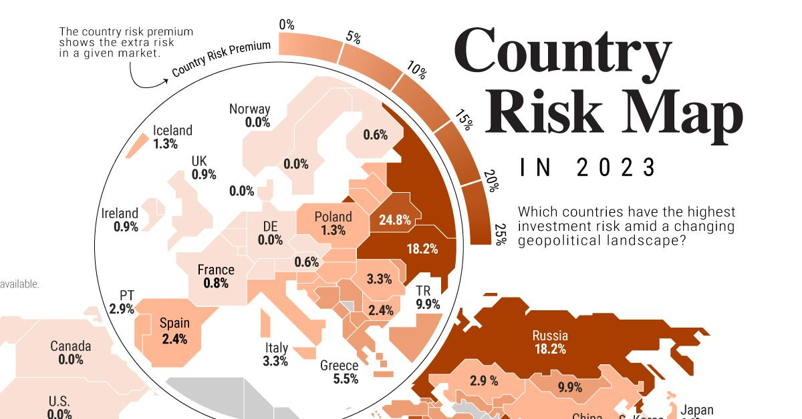

In a globalized economy, international investing presents a vast array of opportunities, appealing to investors seeking to diversify their portfolios and capitalize on growth prospects beyond domestic markets. However, this expansion across borders also introduces a range of inherent risks that investors must navigate. As financial markets become increasingly interconnected, understanding these risks has become crucial for optimizing investment outcomes.

This article will examine the imperative role of risk assessment in international investing, emphasizing two pivotal components: country risk and algorithmic trading. Country risk involves evaluating the potential financial losses associated with economic and political instability in foreign nations. Factors such as political unrest, economic volatility, and regulatory shifts can significantly impact the profitability of international investments, necessitating meticulous analysis and strategic foresight.



Simultaneously, algorithmic trading has transformed the landscape of international finance, leveraging technology to enhance the speed, efficiency, and accuracy of trading decisions. By using complex algorithms, investors can process vast quantities of market data, identify trends, and execute trades with minimal human intervention. This technological advancement has introduced new dimensions to risk management, offering the potential to mitigate losses and capitalize on global market opportunities.

The interplay between country risk and algorithmic trading forms the crux of informed decision-making in international investing. Understanding how these components interact and influence investment strategies is essential for minimizing risks and maximizing returns. As global markets continue to evolve, the need for sophisticated risk management techniques becomes increasingly apparent.

This article explores the nuanced dynamics of risk management within international financial markets, providing insights into how investors can align country risk evaluations with algorithmic trading strategies to navigate complexities effectively. Through a thorough examination of these interconnected elements, investors can enhance their ability to make informed decisions, optimize their portfolios, and achieve improved financial outcomes in the ever-changing landscape of international investing.

## Table of Contents

## Understanding Risk Assessment in International Investing

Risk assessment plays a pivotal role in devising robust investment strategies, more so in the landscape of international markets where variables are more numerous and intricate. It encompasses evaluating various types of risks, including market risk, credit risk, and country-specific risks, each with distinct impacts and considerations.

Market risk, often synonymous with systematic risk, involves the potential for an investor to incur losses due to movements in market prices. This form of risk is influenced by changes in economic indicators, interest rates, and inflation rates, which universally affect all investments. In the context of international markets, market risk is heightened by currency fluctuations and disparities in economic conditions across countries.

Credit risk, or default risk, refers to the possibility of a loss resulting from a borrower's failure to repay a loan or meet contractual obligations. In international investing, credit risk assessment requires analyzing the creditworthiness of foreign entities, which can be more complex due to differences in accounting standards, regulatory environments, and transparency. Investors should consider sovereign credit ratings issued by major financial agencies as a baseline for assessing credit risk.

Country-specific risks, collectively termed as country risk, encompass political, economic, and social factors unique to each nation. Political risk includes the instability brought forth by governmental changes, regulatory shifts, or corruption, which can alter the investment landscape. Economic risk covers aspects like economic growth rates, fiscal policies, and external debt levels. Social risk involves societal factors such as income inequality, labor relations, and demographic shifts. These elements can significantly influence the profitability and viability of investments in a foreign nation.

Evaluating these factors holistically enables investors to make informed and strategic decisions in international markets. For instance, understanding the political climate of a country can help anticipate regulatory changes that may impact the operational environment or the legal framework within which businesses operate. Analyzing economic indicators provides insights into potential market expansions or contractions, helping investors align their portfolios with macroeconomic trends.

In the digital age, quantitative risk assessment tools and techniques have become indispensable. Investors employ statistical models, such as Value at Risk (VaR) and Conditional Value at Risk (CVaR), to quantify potential losses in investment portfolios. VaR, for instance, estimates the maximum expected loss over a specified time frame at a given confidence level. Implementing a Python script to calculate VaR might involve the following:

```python
import numpy as np

def calculate_var(returns, confidence_level=0.95):
    mean_return = np.mean(returns)
    std_dev = np.std(returns)
    var = np.percentile(returns, 100 - confidence_level * 100)
    return mean_return + std_dev * var

# Example usage with hypothetical returns data
returns_data = np.random.randn(1000)  # replace with actual return data
var_result = calculate_var(returns_data)
print(f"Value at Risk: {var_result}")
```

By examining these risks systematically, investors can better manage uncertainty and construct resilient investment portfolios. Integrating both traditional assessment methods and quantitative models fosters a comprehensive approach, aiding investors in navigating and capitalizing on the complexity of international financial landscapes.

## Country Risk: Definition and Implications

Country risk refers to the potential for financial losses that investors may face due to instability within a foreign nation. This form of risk is crucial to consider in international investing, as it reflects the uncertainties associated with political, economic, and regulatory environments of foreign countries. Essentially, country risk can significantly impact the returns on investments in these regions.

Factors that contribute to country risk include political unrest, economic instability, and regulatory changes. Political unrest, such as civil unrest, coups, or unstable government policies, can lead to unpredictable investment environments. Economic instability, encompassing elements like inflation rates, exchange rate [volatility](/wiki/volatility-trading-strategies), and fiscal deficits, can further exacerbate uncertainty for investors. Regulatory changes, which might involve unfavorable shifts in taxation, trade tariffs, or foreign investment policies, can also alter the risk landscape.

Investors analyze country risk to predict and mitigate the impact on their investments. By evaluating potential risks, investors can make informed decisions on whether to enter or [exit](/wiki/exit-strategy) markets and how to allocate resources effectively among different geographic regions. The assessment typically involves various tools, including political risk assessments, economic indicators, and historical data analysis.

Political risk assessments involve the evaluation of a country's governance stability, potential for political change, and the likelihood of policy shifts. These factors can be assessed using qualitative methods, such as analyzing expert opinions or scenario planning. Economic indicators, such as GDP growth rates, fiscal balances, and current account statuses, provide quantitative measures of a country's economic health and are integral to risk evaluation.

Historical data analysis provides insights into past occurrences that may indicate future risks. By examining patterns of political or economic disruptions and their impacts on markets, investors can better anticipate potential future risks. This approach often employs statistical techniques to identify trends and forecast future developments.

Employing these assessment tools allows investors to manage risk by diversifying investments, hedging against potential adverse movements, and actively monitoring the geopolitical and economic climate of investment destinations. By understanding and accounting for country risk, investors can better navigate the complexities of international investment and minimize potential negative impacts on their portfolios.

## Role of Algorithmic Trading in International Investing

Algorithmic trading leverages sophisticated algorithms to automate trading decisions based on real-time market data, significantly impacting international investing. This technological advancement has exponentially increased the speed, efficiency, and accuracy of trading across global markets, facilitating extensive analysis and execution of trades that are unfeasible for manual processes.

The essence of [algorithmic trading](/wiki/algorithmic-trading) lies in its ability to process vast amounts of financial data, lightning-fast, enabling the identification of [arbitrage](/wiki/arbitrage) opportunities and optimal trading times. Algorithms can implement complex trading strategies with high precision, which minimizes the impact of human error and psychological bias. By systematically assessing market conditions and executing trades at optimal moments, algorithms ensure that investors capitalize on market movements in an unbiased manner.

One of the key advantages of algorithmic trading in international contexts is its capacity to analyze diverse market patterns and trends, providing investors with a competitive edge. Sophisticated algorithms can detect subtle price fluctuations and market inefficiencies across multiple asset classes and geographical locations. For example, algorithms could simultaneously monitor [forex](/wiki/forex-system), equities, and commodities markets, identifying profitable correlations and executing trades in milliseconds.

Understanding these market patterns involves statistical and mathematical models, often employing techniques such as moving averages, mean reversion, and [momentum](/wiki/momentum) strategies. For instance, a simple moving average crossover strategy can be implemented in Python as follows:

```python
import pandas as pd

def moving_average_strategy(data, short_window, long_window):
    data['Short_MA'] = data['Price'].rolling(window=short_window).mean()
    data['Long_MA'] = data['Price'].rolling(window=long_window).mean()
    data['Signal'] = 0
    data['Signal'][short_window:] = np.where(data['Short_MA'][short_window:] > data['Long_MA'][short_window:], 1, 0)
    data['Position'] = data['Signal'].diff()

    return data

# Example usage
data = pd.DataFrame({'Price': [/* Insert price data here */]})
strategy_result = moving_average_strategy(data, short_window=40, long_window=100)
```

By automating the task of monitoring and executing trades based on these analyses, investors can optimize their portfolios and enhance their financial returns. However, employing such strategies requires continuous evaluation and updating of algorithms to reflect market changes, ensuring that trading decisions remain aligned with current global market dynamics.

Through algorithmic trading, investors gain the ability to efficiently exploit market discrepancies across international borders, achieving optimized trade execution and ultimately improving portfolio performance.

## Integration of Risk Assessment and Algorithmic Trading

Integrating risk assessment with algorithmic trading enhances decision-making in international investing by allowing for a more systematic and efficient approach to managing investments. This synergy creates a dynamic framework that can adapt to ever-changing global market conditions, ultimately optimizing investment outcomes.

Algorithms can be programmed to incorporate risk assessments, such as country risk, into trading strategies. This is achieved by embedding risk parameters into the algorithmic models, enabling them to respond to specific market signals correlated with identified risks. For example, when country-specific economic indicators suggest increased volatility or political instability, the algorithm can automatically adjust positions to mitigate potential exposure.

One of the core advantages of this integration is its ability to provide dynamic adaptation. Unlike static trading strategies that may become obsolete in a volatile market, algorithms integrated with real-time risk assessments can adjust their trading behaviors instantaneously. For instance, [machine learning](/wiki/machine-learning) models can analyze extensive datasets to detect patterns and predict market movements influenced by geopolitical events. These models can then modify their strategies on-the-fly, ensuring that the portfolio remains aligned with the investment objectives, irrespective of sudden market fluctuations.

Investors can also automate their responses to risk events, thereby reducing potential losses. Automation allows for immediate execution of predefined trade decisions in response to risk triggers, minimizing the reaction time and human error that might occur in manual trading environments. Python, a popular programming language in quantitative finance, provides libraries such as NumPy and pandas for handling data analysis and facilitating the incorporation of complex risk assessments into trading algorithms. 

Here is an example of how Python can be used to integrate risk assessments into an algorithmic trading strategy:

```python
import numpy as np
import pandas as pd

# Example data: economic indicators representing country risk
economic_data = pd.DataFrame({
    'GDP_growth': [0.02, 0.015, -0.005, 0.03],  # GDP growth rates
    'Inf_rate': [0.02, 0.025, 0.03, 0.015],  # Inflation rates
    'Political_stability': [0.8, 0.7, 0.4, 0.9]  # Political stability index
})

# Define a simple risk assessment algorithm
def assess_risk(economic_data):
    risk_score = np.mean((economic_data['GDP_growth'] < 0) |
                         (economic_data['Inf_rate'] > 0.025) |
                         (economic_data['Political_stability'] < 0.6))
    return risk_score

# Integrate the risk score into a trading decision
risk_score = assess_risk(economic_data)

if risk_score > 0.5:
    print("High Risk: Reduce exposure.")
else:
    print("Low Risk: Maintain current strategy.")
```

In this script, economic indicators are evaluated to determine a risk score. The risk score is then used to alter trading decisions, highlighting how automated strategies can incorporate risk analysis to safeguard investments effectively.

Overall, the integration of risk assessment and algorithmic trading provides a more adaptable and informed framework for international investors, allowing them to continuously adjust to global market developments while protecting and enhancing their investment portfolios.

## Challenges and Considerations

The integration of risk assessment and algorithmic trading, while beneficial, presents several challenges that investors must address. One significant challenge is market volatility. Algorithms, designed to execute trades based on predefined criteria, may struggle in highly volatile environments where market conditions rapidly change. Such volatility can lead to unexpected outcomes, necessitating robust testing and adaptive strategies to mitigate potential losses.

Data quality is another critical aspect affecting algorithm performance. Algorithms rely on vast amounts of data to make informed decisions. If the data is incomplete, outdated, or erroneous, the effectiveness of these algorithms diminishes, leading to suboptimal trading decisions. Therefore, ensuring high-quality data inputs is essential for maintaining algorithm accuracy.

Technology limitations also pose challenges. The processing power required for complex algorithms can be substantial, and technical glitches, such as system crashes or network failures, can disrupt trading activities. This underscores the need for reliable technological infrastructure and contingency planning.

Regular updates to risk assessments and trading algorithms are vital to adapting to changing global conditions. With political, economic, and social factors evolving continuously, static algorithms may become obsolete, unable to account for new dynamics. Hence, investors must frequently review and adjust their strategies to align with the latest market realities.

In addition to technical challenges, ethical considerations also emerge in the use of algorithmic trading. Algorithms can unintentionally exacerbate market inequalities by favoring larger, faster players able to invest in the most advanced technologies. Furthermore, the lack of transparency in algorithmic decisions can obscure accountability, leading to ethical dilemmas.

Finally, regulatory compliance is a crucial consideration. Different jurisdictions have varying rules governing algorithmic trading, and non-compliance can result in significant penalties. Investors must ensure their algorithms adhere to these regulations, requiring thorough understanding and regular compliance checks to avoid legal repercussions.

## Conclusion

Risk assessment and algorithmic trading are pivotal in navigating the complexities inherent in international investing. The intricate interplay between these elements allows investors to manage the diverse challenges posed by global financial markets effectively. By integrating comprehensive risk evaluations with sophisticated trading strategies, investors can optimize their portfolios amidst uncertainties.

Continuous adaptation is essential for investors operating in an ever-evolving global environment. This entails regularly updating risk assessments to accommodate shifting economic, political, and social landscapes. Algorithmic trading, powered by technological advancements, facilitates the swift execution of trades while minimizing human bias and error. The implementation of algorithms that incorporate real-time risk analysis ensures that investors can dynamically adjust their strategies, thereby enhancing decision-making processes.

Proper balance between risk assessment and algorithmic trading can lead to more informed investment decisions. Investors who employ a combination of thorough risk evaluations and automated trading strategies are likely to achieve improved financial outcomes. This balanced approach not only mitigates potential losses but also capitalizes on emerging opportunities in international markets.

As technology continues to evolve, remaining informed and proactive will be crucial to the success of international investing endeavors. Embracing innovations in data analysis and trading methodologies allows investors to stay ahead in competitive markets. Ultimately, the integration of risk assessment and algorithmic trading serves as a cornerstone for investors seeking to navigate the complex landscape of international finance responsibly and effectively.

## References & Further Reading

[1]: Bergstra, J., Bardenet, R., Bengio, Y., & Kégl, B. (2011). ["Algorithms for Hyper-Parameter Optimization."](https://papers.nips.cc/paper/4443-algorithms-for-hyper-parameter-optimization) Advances in Neural Information Processing Systems 24.

[2]: ["Advances in Financial Machine Learning"](https://www.amazon.com/Advances-Financial-Machine-Learning-Marcos/dp/1119482089) by Marcos Lopez de Prado

[3]: ["Evidence-Based Technical Analysis: Applying the Scientific Method and Statistical Inference to Trading Signals"](https://www.amazon.com/Evidence-Based-Technical-Analysis-Scientific-Statistical/dp/0470008741) by David Aronson

[4]: ["Machine Learning for Algorithmic Trading"](https://github.com/stefan-jansen/machine-learning-for-trading) by Stefan Jansen

[5]: ["Quantitative Trading: How to Build Your Own Algorithmic Trading Business"](https://www.amazon.com/Quantitative-Trading-Build-Algorithmic-Business/dp/1119800064) by Ernest P. Chan