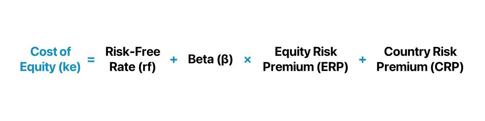

Financial risk assessment plays a pivotal role in the global financial markets by evaluating potential risks associated with investment opportunities. This process primarily aims to measure the uncertainty in achieving expected returns, thereby guiding investors and financial institutions in their decision-making. A critical component of financial risk assessment is the Country Risk Premium (CRP), which quantifies the additional return an investor requires to invest in a foreign country rather than a risk-free domestic asset. Another key element underpinning modern financial systems is algorithmic trading, where computer algorithms automatically execute trading decisions at high speeds, thereby enhancing market efficiency and liquidity.

The objective of this article is to elucidate the methods of calculating the Country Risk Premium and to explore its relevance to algorithmic trading. Accurate calculation of CRP is crucial for investors aiming to optimize their international portfolios as it takes into account political stability, economic performance, and currency risks. Given the interconnectedness of global financial markets, integrating country risk assessments, such as CRP, into financial models is becoming increasingly important for predicting potential economic shifts and mitigating losses. 



This article will cover several key areas: understanding financial risk assessment and its vital role in investment; defining and emphasizing the significance of the Country Risk Premium; exploring various methodologies for calculating CRP; analyzing how algorithmic trading incorporates CRP into its strategies, with real-world case studies illustrating successful implementations; and tackling the challenges faced, along with the potential future prospects in the domain of CRP assessment. Our concluding remarks will reinforce the necessity for continuous research and advancement in CRP modeling, highlighting its impact on shaping robust international investment strategies.

## Table of Contents

## Understanding Financial Risk Assessment

Financial risk assessment is a systematic process used to evaluate the potential risks associated with financial investments. It is critical for investors and financial institutions as it helps in quantifying the uncertainties and potential losses related to investment decisions. This assessment provides a structured approach to understanding the various risks that could impact investment portfolios, thereby enabling more informed decision-making.

There are several types of financial risks that investors and institutions must consider. Market risk refers to the potential for losses due to changes in market prices, including stocks, bonds, and commodities. Credit risk involves the possibility that a borrower will not meet its obligations in accordance with agreed terms, leading to a financial loss for the lender. Liquidity risk is the risk of not being able to quickly sell an asset without significantly affecting its price, impacting the ability to convert investments into cash when needed.

Assessing financial risk is crucial as it allows investors and institutions to understand the risk-reward profile of different investments. By accurately measuring risk, financial entities can make strategic decisions to mitigate adverse effects, optimize their return on investments, and comply with regulatory requirements. This assessment also helps in the allocation of capital in ways that are aligned with an entity’s risk appetite and objectives.

Common methodologies used in financial risk assessment include Value at Risk (VaR), stress testing, sensitivity analysis, and scenario analysis. VaR estimates the potential loss in value of a risky asset or portfolio over a defined period for a given confidence interval. Stress testing involves evaluating how certain stress conditions, such as economic downturns or market crashes, affect the investment. Sensitivity analysis examines how the variation in the output of a model can be apportioned to different sources of variation in the inputs. Scenario analysis deals with hypothetical situations to predict impacts on investment portfolios.

An important component of financial risk is the Country Risk Premium (CRP). CRP represents the additional expected return for an investment in a specific country, reflecting the country's political, economic, and financial stability risks. It captures risks such as government default, expropriation, and exchange rate [volatility](/wiki/volatility-trading-strategies) which are not present when investing in stable markets. Evaluating CRP is vital for investors seeking international diversification, as it assists in determining whether the potential returns justify the specific country risks involved. 

By integrating CRP and other risk factors into financial assessments, investors can develop strategies that balance potential gains with an acceptable level of risk, thereby ensuring the resilience and robustness of their investment portfolios in a complex and interconnected global market.

## Country Risk Premium (CRP): Definition and Importance

The Country Risk Premium (CRP) represents the additional return investors demand to compensate for the risk associated with investing in a foreign country. This premium is critical for assessing investment risk across different countries as it adjusts expected returns based on perceived risk factors. A country's CRP is influenced by several elements, including political stability, economic performance, and currency risk.

Political stability significantly affects a country's CRP. Political unrest, potential changes in government policies, or uncertainty in regulatory frameworks can increase the perceived risk for investors, leading to a higher CRP. Conversely, stable political environments tend to reduce the CRP, making investments more attractive.

Economic performance is another major [factor](/wiki/factor-investing) influencing the CRP. Indicators such as GDP growth, inflation rates, and fiscal health are closely monitored. Strong economic fundamentals typically correlate with a lower CRP, illustrating a safer investment climate. In contrast, struggling economies with volatile markets usually exhibit higher CRPs.

Currency risk also plays a pivotal role in CRP. Fluctuations in exchange rates can significantly impact investment returns. Investors seek a premium to guard against potential losses arising from unfavorable currency movements. Countries with stable currencies are likely to have a lower CRP compared to those with volatile exchange rates.

The CRP affects investment decisions and portfolio management by informing asset allocation and risk assessment strategies. Investors use CRP to gauge the risk-reward profile of international investments, guiding them on whether the potential returns justify the risks involved. This decision-making process influences how portfolios are diversified and managed to optimize returns while minimizing exposure to high-risk environments.

In international investment strategies, CRP is vital in evaluating the comparative advantage of investing in different countries. Investors may avoid regions with high CRP due to perceived higher risks, or they might venture into such markets if they believe the potential returns outweigh the risks. Effective assessment of CRP allows investors to optimize their international portfolios by balancing risk across various markets.

For traders using algorithmic models, CRP is crucial as it integrates real-time data to assess and react to varying conditions across countries. Algorithmic trading systems can incorporate CRP calculations to adjust strategies dynamically, ensuring that exposure to international risks is managed effectively. This capability enhances the ability of traders to respond swiftly to market changes, optimizing their trading decisions in the global financial landscape.

## CRP Calculation: Methods and Models

Country Risk Premium (CRP) is a critical component in evaluating investment risks across different nations. Calculating CRP involves various methods, each with its own set of strengths and challenges. Understanding these methodologies is vital for finance professionals who integrate CRP into their investment strategies and risk assessments.

### Traditional CRP Calculation Methods

**Sovereign Spread Method:**
The Sovereign Spread Method is one of the most traditional approaches used to estimate CRP. It involves calculating the difference between the yield of a country's sovereign bonds and a risk-free benchmark, typically U.S. Treasury bonds. The formula is:

$$
\text{CRP} = \text{Yield of Sovereign Bond} - \text{Yield of U.S. Treasury Bond}
$$

This method provides a straightforward measure of the additional risk premium investors demand for bearing the country-specific risk. Its main advantage is its simplicity and directness in reflecting market perceptions of a country's risk.

**Ratings-Based Method:**
The Ratings-Based Method relies on credit ratings assigned by agencies like Moody’s or S&P. Each rating is associated with a default risk spread, which can be used to estimate CRP. Countries with lower ratings indicate higher risk and thus higher premium.

This method is beneficial because it incorporates detailed analysis by professional rating agencies. However, it is often criticized for being somewhat subjective and may lag in reflecting real-time risk changes due to infrequent updates.

### Modern Approaches

**Statistical and Econometric Models:**
Recent advances in econometrics offer sophisticated models to estimate CRP. These models often utilize regression analysis where CRP is modeled as a function of macroeconomic variables such as GDP growth, inflation rates, or political stability indices. Machine learning algorithms can also be applied to enhance estimation accuracy and adaptability.

Python Example:

```python
import numpy as np
from sklearn.linear_model import LinearRegression

# Hypothetical data representing macroeconomic factors and known CRP values
X = np.array([[2.5, 3.1], [1.8, 2.9], [3.0, 4.5], [2.2, 3.3]])  # e.g., [GDP growth, Inflation]
y = np.array([0.5, 0.4, 0.7, 0.6])  # Known CRP values

# Create a linear regression model
model = LinearRegression().fit(X, y)
predicted_crp = model.predict(np.array([[2.4, 3.0]]))  # Predict CRP for new data
```

Econometric models allow for dynamic CRP calculations, adaptive to changing economic conditions, providing greater flexibility and precision compared to traditional methods.

### Comparison of Methods

**Advantages and Disadvantages:**

- **Sovereign Spread Method**: 
  - *Advantage*: Simple and reactive to market perceptions.
  - *Disadvantage*: Can be affected by temporary market fluctuations and doesn't account for non-financial risks.

- **Ratings-Based Method**:
  - *Advantage*: Incorporates expert assessments of country-specific risks.
  - *Disadvantage*: Potential delays in reflecting current conditions and subjectivity in ratings.

- **Econometric Models**:
  - *Advantage*: High precision with real-time adaptability.
  - *Disadvantage*: Complex and data-intensive, requiring reliable inputs and substantial computation power.

### Reliability and Challenges

Calculating CRP involves challenges such as obtaining accurate and timely data, especially from emerging markets with less developed financial infrastructures. Econometric models, while powerful, require robust data inputs and can be sensitive to model specifications and assumptions.

In summary, while traditional methods like the Sovereign Spread and Ratings-Based approaches provide foundational insights into CRP, modern statistical and econometric techniques offer more nuanced and adaptable frameworks. Nevertheless, the choice of method depends on the specific context and available resources of the financial institution or investor.

## Algorithmic Trading and Risk Management

Algorithmic trading, also known as algo trading, employs computer algorithms to execute trading strategies in financial markets at speeds and efficiencies incomprehensible to human traders. This form of trading dominates modern finance, automating complex decisions using pre-defined rules to analyze market variables, including price, [volume](/wiki/volume-trading-strategy), and time. The primary role of [algorithmic trading](/wiki/algorithmic-trading) is to enhance the speed and accuracy of trades, minimize market impact, and enable traders to execute orders in fractions of a second.

One of the significant advantages of algorithmic trading is risk management. By automating the trading process, algorithms can quickly respond to market fluctuations, thereby minimizing potential losses. They assist traders in maintaining a disciplined approach to investing by adhering strictly to set parameters, reducing the emotional influence on trading decisions. Additionally, they improve efficiency by executing trades at optimal prices, which reduces transaction costs and enhances market [liquidity](/wiki/liquidity-risk-premium).

The integration of Country Risk Premium (CRP) into algorithmic trading strategies marks a crucial advancement in risk assessment for investments across various markets. CRP, which quantifies the additional risk associated with investing in a foreign country compared to a risk-free environment, is vital for traders seeking to enter or manage positions in international markets. By integrating CRP into their algorithms, traders can better calibrate their strategies based on the investment risk profile of different countries, aligning trading operations with geopolitical and economic realities.

Algorithmic trading systems have the capability to adapt dynamically to varying CRP values. They employ advanced statistical and [machine learning](/wiki/machine-learning) models to analyze real-time data inputs, adjusting their trading strategies in response to changes in CRP. For instance, if the CRP for a particular country increases due to political instability, algorithmic systems can automatically adjust their risk exposure by scaling down their trading positions in assets related to that country. This adaptability ensures that trading strategies remain robust and responsive to the evolving risk landscape.

The importance of real-time data and analytics in algorithmic trading cannot be overstated. Live data feeds allow algorithms to receive and process information instantaneously, making informed trade decisions based on the latest market developments. Advanced analytics, including real-time data processing techniques, play a critical role in evaluating CRP and other risk metrics, offering traders a strategic advantage by providing timely insights into market conditions. Algorithmic systems analyze streams of data, identify patterns, and execute trades faster than human traders, making them indispensable in today's high-frequency trading environments.

In summary, algorithmic trading revolutionizes the efficiency and precision of trade execution, especially concerning risk management through the incorporation of the Country Risk Premium. By leveraging real-time data and analytics, these systems not only enhance trading strategies but also ensure adaptability in a complex global market context, providing a robust framework for managing financial risks effectively.

## Case Studies: Implementing CRP in Algo Trading

The integration of Country Risk Premium (CRP) into algorithmic trading is a noteworthy development in financial markets, allowing traders to better manage and optimize their investment strategies on an international scale. Several financial institutions have successfully navigated this integration, offering insightful case studies that illustrate the practical impact of CRP in trading models.

### Real-World Scenarios of CRP Impact

One prominent example is a multinational investment firm that structured its emerging markets portfolio by incorporating CRP into its algorithmic trading algorithms. In this scenario, the firm utilized CRP to adjust its risk-reward strategy, particularly in countries with volatile political climates. By incorporating CRP, the algorithms dynamically adjusted asset allocations to mitigate potential losses arising from geopolitical events. This adaptation led to a significant reduction in portfolio volatility and improved risk-adjusted returns.

Additionally, a [hedge fund](/wiki/hedge-fund-trading-strategies) specializing in foreign exchange trading deployed CRP models to enhance its currency trading algorithms. By factoring in the CRP for different countries, the fund was able to fine-tune its pricing models and better predict currency fluctuations. This approach not only increased the accuracy of its trading signals but also provided a competitive edge in exploiting [arbitrage](/wiki/arbitrage) opportunities across various currency pairs.

### Outcomes and Benefits

The case studies illustrate several key outcomes and benefits associated with integrating CRP into algorithmic trading. Firstly, incorporating CRP allowed traders to quantify and price in country-specific risks more effectively. This resulted in more informed investment decisions and enhanced the precision of the traders’ algorithms, leading to stronger performance over time.

Secondly, the adaptive nature of CRP-enhanced algorithms enabled real-time adjustments to trading strategies, accommodating for sudden geopolitical events or economic changes. This adaptability minimized the negative impacts of unforeseen market shifts, making trading operations more resilient.

### Lessons Learned and Best Practices

From these cases, certain best practices have emerged. One fundamental lesson is the importance of using high-quality and up-to-date data for CRP calculations, as inaccurate estimates can mislead trading decisions. Furthermore, integrating CRP requires a careful balance between model complexity and computational efficiency. Algorithms must be robust enough to capture essential risk factors without being overly cumbersome.

Another key takeaway is the necessity for continuous model validation and back-testing. As market conditions evolve, CRP models must be constantly refined to maintain their predictive power.

### Future Trends

Looking ahead, the use of CRP in trading systems is expected to grow more sophisticated with advancements in technology and data analytics. Machine learning and [artificial intelligence](/wiki/ai-artificial-intelligence) will likely play a larger role in enhancing CRP models, offering deeper insights into risk factors and improving the adaptability of trading algorithms. Additionally, real-time data integration could become standard practice, allowing for even more responsive trading strategies in volatile markets.

Overall, the successful implementation of CRP in algorithmic trading highlights its potential to transform international investment strategies, providing a framework for better managing country-specific risks and maximizing returns. As these models evolve, they will undoubtedly contribute to a more dynamic and informed financial trading landscape.

## Challenges and Future Prospects

Calculating and using the Country Risk Premium (CRP) in financial models present several challenges. One of the primary issues is data accuracy. The integrity of data is crucial, as inaccurate or outdated information can significantly distort CRP estimations. Reliable data sources are vital for obtaining correct economic indicators, political stability metrics, and financial market [statistics](/wiki/bayesian-statistics). Given the dynamic nature of global events, maintaining the most current data is imperative but often challenging.

Geopolitical changes also pose a substantial challenge. Sudden shifts in government policies, political instability, or geopolitical conflicts can dramatically alter a country's risk landscape. For instance, sanctions, military conflicts, or regime changes can increase the perceived risk of investing in a particular country, leading to fluctuating CRP values. These unpredictable changes necessitate constant adjustments and reevaluations in financial models, impacting investment decisions.

Market volatility further complicates CRP calculation and integration into financial models. Unforeseen economic events, global financial crises, or major shifts in commodity prices can cause significant swings in market conditions. These can affect a country's economic stability and risk profile, thereby influencing its CRP. Financial models must be robust enough to adapt to these volatilities without sacrificing accuracy.

Looking ahead, financial risk assessment and algorithmic trading are expected to undergo significant transformations. The integration of artificial intelligence and machine learning can enhance the precision and adaptability of CRP calculations. These technologies can process vast quantities of data more efficiently, identify patterns, and predict potential risk shifts better than traditional methods. For example, machine learning algorithms could be trained to recognize geopolitical patterns or macroeconomic indicators that precede significant changes in country risk.

Moreover, blockchain technology could offer improvements in data accuracy and transparency, which would be beneficial for CRP computations. By providing a decentralized and tamper-proof ledger, blockchain could ensure the integrity of the data used in CRP calculations, enhancing the reliability of investment models.

Enhanced CRP models have the potential to significantly impact global trading. More accurate risk assessments can lead to smarter investment decisions, optimized portfolio management, and improved risk management strategies. As CRP models become more sophisticated, they can provide better insights into emerging markets, uncover investment opportunities, and help mitigate risk exposure. Consequently, improved CRP models could contribute to more stable financial markets, fostering international economic growth and cooperation.

## Conclusion

The essential points discussed throughout this article underline the pivotal role of Country Risk Premium (CRP) in financial risk assessment and algorithmic trading. Accurately calculating CRP is of paramount importance, as it equips investors and institutions with the ability to effectively evaluate investment risks across different countries. Accurate CRP estimates not only aid in understanding political, economic, and currency risks but also provide critical insights that shape international investment strategies. By incorporating CRP into these strategies, investors can make informed decisions that optimize their portfolios while mitigating potential risks associated with different geopolitical environments.

The integration of CRP into algorithmic trading highlights its significance in modern financial markets. Algorithmic systems, with their ability to process vast amounts of real-time data, are particularly adept at leveraging CRP to adjust trading strategies dynamically. This adaptability is crucial in an ever-changing global economic landscape where geopolitical shifts can influence market conditions rapidly. Therefore, ongoing research and enhancement of CRP models are essential to maintain accuracy and reliability, allowing financial institutions to adjust swiftly to market changes and optimize their risk assessment methodologies.

Investing in the development and refinement of CRP models will improve financial models' precision, further benefiting algorithmic trading's effectiveness. As financial markets become increasingly interconnected, the ability to integrate timely and precise country risk evaluations will enhance global trading strategies, ultimately leading to more robust investment landscapes. Consequently, a continued focus on bolstering CRP analysis will not only elevate individual and institutional trading capabilities but also contribute to the overall stability and efficiency of international financial systems.

## References & Further Reading

[1]: Damodaran, A. (2012). ["Investment Valuation: Tools and Techniques for Determining the Value of Any Asset."](https://books.google.com/books/about/Investment_Valuation.html?id=5SRHAAAAQBAJ) John Wiley & Sons.

[2]: Fabozzi, F. J., & Peterson Drake, P. (2009). ["The Basics of Finance: An Introduction to Financial Markets, Business Finance, and Portfolio Management."](https://onlinelibrary.wiley.com/doi/book/10.1002/9781118267790) John Wiley & Sons.

[3]: Krugman, P., Obstfeld, M., & Melitz, M. (2015). ["International Economics: Theory and Policy."](https://www.pearson.com/se/Nordics-Higher-Education/subject-catalogue/economics/International-Economics-Theory-and-Policy-Krugman.html) Pearson Education.

[4]: ["The Financial Crisis and the Role of Credit Rating Agencies"](https://www.stern.nyu.edu/sites/default/files/assets/documents/con_039549.pdf) by the Centre for European Policy Studies

[5]: Brunnermeier, M. K., & Pedersen, L. H. (2009). ["Market Liquidity and Funding Liquidity."](https://www.jstor.org/stable/30225714) The Review of Financial Studies, 22(6), 2201-2238.