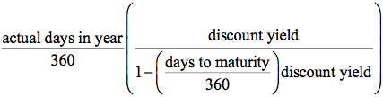

## Table of Contents

## What is the Coupon Equivalent Rate (CER)?

The Coupon Equivalent Rate (CER) is a way to figure out the annual interest rate for short-term investments, like Treasury bills, that don't pay interest in the usual way. Instead of paying interest every year, these investments are sold at a lower price than their value at maturity. The CER helps investors understand what the annual interest rate would be if the investment paid interest like a regular bond.

To calculate the CER, you need to know the price you paid for the investment, its face value at maturity, and how long you will hold it. The formula takes these numbers and turns them into an annual rate that you can compare with other investments. This makes it easier to see if a short-term investment is a good deal compared to other options that pay interest annually.

## How is the Coupon Equivalent Rate calculated?

To find the Coupon Equivalent Rate (CER), you need to know three things: the price you paid for the investment, its face value when it matures, and how long you will hold it. Let's say you buy a Treasury bill for $980, and it will be worth $1,000 when it matures in 180 days. First, you figure out the interest you will earn, which is the face value minus the price you paid, so $1,000 - $980 = $20. Then, you calculate the annual interest rate by imagining what the interest would be if you held the investment for a whole year. Since you're holding it for half a year, you double the interest to $40 for a full year.

Next, you need to find out what that $40 interest would be as a percentage of the price you paid. You do this by dividing the annual interest ($40) by the price you paid ($980), which gives you about 0.0408. To turn this into a percentage, you multiply by 100, so the CER is about 4.08%. This rate helps you compare the Treasury bill to other investments that pay interest annually, making it easier to decide if it's a good deal.

## Why is the Coupon Equivalent Rate important for investors?

The Coupon Equivalent Rate is important for investors because it helps them understand how much they will earn from short-term investments like Treasury bills. These investments don't pay interest in the usual way, so it can be hard to compare them to other investments that do. By figuring out the CER, investors can see what the annual interest rate would be if the investment paid interest like a regular bond. This makes it easier to decide if a short-term investment is a good deal compared to other options.

For example, if an investor is choosing between a Treasury bill and a bond that pays interest every year, the CER helps them see which one offers a better return. Without the CER, it would be tough to compare these different types of investments. By using the CER, investors can make smarter choices about where to put their money, making sure they get the best possible return on their investment.

## Can you explain the difference between Coupon Equivalent Rate and Yield to Maturity?

The Coupon Equivalent Rate (CER) and Yield to Maturity (YTM) are both ways to figure out how much money you can make from an investment, but they are used for different types of investments. The CER is used for short-term investments like Treasury bills, which don't pay interest in the usual way. Instead, you buy them at a lower price and get the full amount when they mature. The CER helps you see what the annual interest rate would be if the investment paid interest like a regular bond. This makes it easier to compare short-term investments to other options that pay interest every year.

On the other hand, Yield to Maturity is used for bonds that pay interest regularly, like every six months or every year. YTM tells you the total interest rate you will earn if you hold the bond until it matures. It takes into account the interest payments you get along the way, as well as any difference between the price you paid for the bond and its value at maturity. So, while CER is about figuring out an annual rate for short-term investments, YTM is about understanding the overall return on a bond that pays interest over time.

## How does the Coupon Equivalent Rate relate to bond pricing?

The Coupon Equivalent Rate (CER) helps investors understand how much they will earn from short-term investments like Treasury bills. These investments don't pay interest in the usual way. Instead, you buy them for less than they're worth when they mature. The CER figures out what the annual interest rate would be if the investment paid interest like a regular bond. This makes it easier to compare short-term investments to bonds that pay interest every year. By knowing the CER, investors can see if the price they're paying for a Treasury bill is a good deal.

Bond pricing is all about figuring out what a bond is worth. The CER doesn't directly set the price of a bond, but it helps investors decide if the price is right. If the CER of a Treasury bill is high, it might mean the bond is a good buy because the annual return is better than other investments. On the other hand, if the CER is low, investors might look for other bonds with better returns. So, while the CER itself doesn't change the price of a bond, it helps investors make smart choices about what prices are fair and where to invest their money.

## What are the common uses of the Coupon Equivalent Rate in financial analysis?

The Coupon Equivalent Rate is often used by investors to compare short-term investments like Treasury bills to other investments that pay interest every year. Since Treasury bills don't pay interest in the usual way, the CER helps figure out what the annual interest rate would be if they did. This makes it easier for investors to decide if a Treasury bill is a good deal compared to other options. For example, if an investor is choosing between a Treasury bill and a bond that pays interest every year, the CER helps them see which one offers a better return.

Financial analysts also use the Coupon Equivalent Rate to understand and communicate the value of short-term investments to their clients. By converting the return on a Treasury bill into an annual rate, analysts can help clients see how these investments stack up against other opportunities. This is especially useful when putting together investment portfolios, where understanding the annual return of all investments helps in making balanced and informed decisions.

## How does the Coupon Equivalent Rate affect investment decisions?

The Coupon Equivalent Rate (CER) helps investors make smarter choices about where to put their money. When you're looking at short-term investments like Treasury bills, which don't pay interest in the usual way, the CER tells you what the annual interest rate would be if they did. This makes it easier to compare these investments to other options that pay interest every year. For example, if you're choosing between a Treasury bill and a bond, the CER can show you which one gives you a better return. This way, you can decide if the Treasury bill is worth buying at its current price.

Financial advisors also use the CER to help their clients understand the value of short-term investments. By turning the return on a Treasury bill into an annual rate, advisors can show clients how these investments compare to others in their portfolio. This is really helpful when planning investments because it helps everyone see the big picture and make balanced decisions. Knowing the CER helps investors pick the best options and get the most out of their money.

## What are the limitations of using the Coupon Equivalent Rate?

The Coupon Equivalent Rate (CER) is useful, but it has some limits. One big limit is that it only works well for short-term investments like Treasury bills. If you try to use it for longer-term investments or ones that pay interest in different ways, it might not give you the right picture. Also, the CER assumes you hold the investment until it matures. If you sell it before then, the actual return you get might be different from what the CER says.

Another thing to think about is that the CER doesn't take into account other costs you might have, like taxes or fees. These can make a big difference in how much money you actually make from an investment. So, while the CER is a good tool for comparing short-term investments, it's important to look at the whole picture and not just rely on this one number when making investment choices.

## How does the Coupon Equivalent Rate compare to other yield measures like the Bank Discount Rate?

The Coupon Equivalent Rate (CER) and the Bank Discount Rate are both ways to figure out how much money you can make from short-term investments like Treasury bills, but they do it differently. The CER tells you what the annual interest rate would be if the Treasury bill paid interest like a regular bond. It's based on the price you pay and the face value you get at maturity, and it's helpful for comparing these short-term investments to other investments that pay interest every year. On the other hand, the Bank Discount Rate is calculated differently. It's based on the face value of the Treasury bill, not the price you pay, and it's usually a bit lower than the CER. This rate is often used by banks when they're buying and selling Treasury bills.

The key difference between these two rates is how they handle the investment's price and face value. The CER uses the price you actually pay, which makes it a better measure for investors trying to figure out their return. The Bank Discount Rate, however, uses the face value, which can make the return seem smaller. Because of this, the CER is generally more useful for investors who want to compare their options and see which one gives them the best deal. The Bank Discount Rate is more commonly used in the banking world, where it's part of how banks handle their transactions with Treasury bills.

## Can the Coupon Equivalent Rate be used for non-annual coupon payments?

The Coupon Equivalent Rate (CER) is mainly used for short-term investments like Treasury bills, which don't pay interest in the usual way. These investments are bought at a lower price and then paid back at their full value when they mature. The CER helps figure out what the annual interest rate would be if the investment paid interest like a regular bond. This makes it easier to compare short-term investments to other options that pay interest every year.

While the CER is great for comparing short-term investments, it's not usually used for investments that pay interest more often than once a year. If an investment pays interest every six months or every month, the CER might not give you the right picture of how much you're [earning](/wiki/earning-announcement). For these kinds of investments, other measures like the Yield to Maturity (YTM) are better because they take into account the timing of the interest payments. So, while the CER is helpful, it's best used for investments that don't pay interest until they mature.

## How do changes in interest rates impact the Coupon Equivalent Rate?

When interest rates go up or down, it can change the Coupon Equivalent Rate (CER) for short-term investments like Treasury bills. If interest rates go up, new Treasury bills will be sold at a lower price to make their CER higher. This makes them more attractive to investors because they can earn more money compared to other investments. On the other hand, if interest rates go down, new Treasury bills will be sold at a higher price, which makes their CER lower. This means investors might look for other investments that offer a better return.

The CER helps investors compare short-term investments to other options that pay interest every year. When interest rates change, it's important for investors to look at the CER to see if the return on a Treasury bill is still a good deal. If the CER goes up because of higher interest rates, it might be a good time to buy Treasury bills. But if the CER goes down because of lower interest rates, investors might want to wait or look at other investments.

## What advanced strategies can investors employ using the Coupon Equivalent Rate?

Investors can use the Coupon Equivalent Rate (CER) to find the best times to buy short-term investments like Treasury bills. When interest rates go up, the CER of new Treasury bills goes up too. This means investors can buy these bills at a lower price and earn more money compared to other investments. By keeping an eye on interest rates and the CER, investors can decide when to buy Treasury bills to get the highest return. For example, if they see that interest rates are going to go up soon, they might wait to buy Treasury bills until after the rates increase, so they can get a better CER.

Another strategy is to use the CER to balance an investment portfolio. Investors can compare the CER of Treasury bills to the returns of other investments like stocks or bonds. If the CER is high, it might be a good time to put more money into Treasury bills because they offer a better return than other options. This can help spread out the risk in a portfolio. By using the CER, investors can make smart choices about where to put their money to get the best mix of safety and return.

## What is Understanding Bond Yield?

Bond yield is a critical metric in the bond market, representing the return an investor can expect to earn from holding a bond until maturity. It is essential for assessing the profitability and risk associated with investing in bonds.

Unlike the fixed coupon rate, which is the annual interest paid by the bond's issuer, the bond yield can vary. The coupon rate is predetermined when the bond is issued and does not change over the bond's life. Conversely, bond yield is dynamic, influenced by the bond's current market price and prevailing interest rates. It reflects the income the bond generates relative to its price.

The bond yield fluctuates with market conditions, primarily due to changes in interest rates. When interest rates rise, existing bonds typically decrease in price, leading to an increase in yield. This inverse relationship occurs because newer bonds enter the market with higher coupon rates, making existing bonds with lower rates less attractive. Conversely, when interest rates fall, existing bonds become more valuable, as their higher coupon rates are in demand compared to newly issued bonds with lower rates.

Investors use bond yields as a key indicator for making investment decisions. A rising yield often signals higher potential returns, but it also suggests increased risks, such as credit risk or changes in the economic environment. Conversely, falling yields may indicate lower returns but potentially more stable conditions.

The yield to maturity (YTM) is the most common measure used, calculated using the formula:

$$
YTM = \frac{C + \frac{(F - P)}{n}}{\frac{(F + P)}{2}}
$$

where:
- $C$ is the annual coupon payment,
- $F$ is the face value of the bond,
- $P$ is the price of the bond,
- $n$ is the number of years to maturity.

This formula provides an annualized return that assumes the bond is held to maturity and that all payments are received as scheduled. An understanding of bond yields is crucial for investors aiming to optimize their portfolios by effectively balancing returns and risks amidst shifting market landscapes.

## What is the Coupon Equivalent Rate (CER)?

The Coupon Equivalent Rate (CER) is a financial metric used to equate the yield of zero-coupon bonds with that of coupon-paying bonds, facilitating a direct comparison between these two types of securities. In essence, CER allows investors to understand better the returns they might expect from zero-coupon bonds in the context of the regular interest payments associated with coupon bonds.

To calculate the Coupon Equivalent Rate, the following formula is typically used:

$$
\text{CER} = \left( \frac{F - P}{P} \right) \times \left( \frac{365}{n} \right)
$$

where $F$ represents the face value of the bond, $P$ is the purchase price, and $n$ is the number of days until maturity. The formula derives the effective annualized interest rate that equates the purchase of a zero-coupon bond with that of a similar coupon-paying bond.

The practical implications of CER are significant for investors aiming to compare different short-term debt instruments. For zero-coupon bonds, which do not distribute periodic interest payments and are instead sold at a discount to their face value, CER provides a standardized return metric. This enables investors to assess whether the returns on zero-coupon bonds are competitive when compared to those of traditional coupon-bearing bonds.

Understanding CER is particularly crucial for evaluating short-term debt securities given their typically lesser durations and immediate yield expectations. For investors in money market instruments or those with a particular focus on treasury bills, CER presents an essential tool for precise performance assessment within the bond market. By equating various bonds' returns, CER ensures informed decision-making, driving effective investment strategies and enhancing portfolio management.

## What factors influence bond yield and coupon rates?

Interest rates play a quintessential role in shaping bond prices and yields. Fundamentally, there exists an inverse relationship between bond prices and interest rates. When interest rates rise, existing bond prices generally fall, and conversely, when interest rates decline, bond prices increase. This is because newly issued bonds will offer yields that align more closely with the current market interest rates, thereby rendering older bonds with lower returns less attractive, hence driving their prices down.

The yield of a bond, often expressed as a percentage, is influenced heavily by market conditions, particularly interest rates. The yield can be calculated as:

$$

\text{Yield} = \frac{\text{Annual Coupon Payment}}{\text{Current Market Price of the Bond}} 
$$

Credit ratings, assigned by agencies such as Moody’s, S&P Global, and Fitch Ratings, are another significant [factor](/wiki/factor-investing) in determining bond yields. These ratings evaluate the issuer’s creditworthiness or the likelihood of the issuer defaulting on their payments. A bond with a high credit rating typically offers lower yields due to the decreased risk associated with it, while those with lower credit ratings offer higher yields to attract investors wary of potential default.

A change in a bond's credit rating can have substantial implications. For instance, a downgrade can increase the yield spread—a measure reflecting the additional yield above a risk-free benchmark, typically government securities. This increase compensates investors for the perceived increase in risk.

The mathematical relationship tying bond prices to yields is encapsulated in the bond’s duration and convexity. Duration measures the bond's price sensitivity to changes in interest rates. For a bond with price $P$, duration $D$, and yield $y$, a small change in yield $\Delta y$ induces a change in price $\Delta P$ approximately given by:

$$

\Delta P \approx -D \times P \times \Delta y 
$$

Further complexities in this relationship can be captured through the notion of convexity, which accounts for the curvature—or non-linear component—of the price-yield relationship. It refines the estimate provided by duration, especially significant in larger [interest rate](/wiki/interest-rate-trading-strategies) movements.

$$

\Delta P \approx -D \times P \times \Delta y + \frac{1}{2} \times \text{Convexity} \times P \times (\Delta y)^2 
$$

In summary, an investor examining the intricacies of bond markets must consider the intricate interplay between interest rates, credit ratings, and the mathematical relationships defining price and yield behavior to make informed investment decisions.

## What are the special considerations in bond investing?

Bonds are essential instruments in the financial markets, offering a range of investment opportunities with varying risk and reward characteristics. Among these, municipal, corporate, and treasury bonds are the most prevalent, each possessing unique attributes that influence investor decisions.

Municipal bonds, issued by local or state governments, are often considered more secure compared to corporate bonds due to their government backing. A defining feature of municipal bonds is their tax-exempt status; interest earned is typically exempt from federal income taxes, and often from state and local taxes if the investor resides in the state where the bond is issued. However, this tax advantage is reflected in lower yields compared to taxable bonds. Risk in municipal bonds primarily revolves around credit risk, particularly for revenue bonds, which depend on specific revenue sources for repayment.

Corporate bonds, issued by companies, offer higher yields to compensate for higher risk levels compared to government bonds. The credit risk is a major consideration, as it is contingent on the issuer's financial health. Companies with lower credit ratings must offer higher yields to attract investors, reflecting the greater risk of default. Interest on corporate bonds is fully taxable, impacting after-tax returns for investors.

Treasury bonds are securities issued by the U.S. government and are considered virtually risk-free in terms of default risk. They serve as a benchmark for other interest rates due to their [liquidity](/wiki/liquidity-risk-premium) and perceived safety. While they are subject to federal taxes, they are free from state and local taxes. The primary risk associated with treasury bonds is interest rate risk, as their prices are inversely related to changes in interest rates.

Two key metrics in bond evaluation are Yield to Maturity (YTM) and Yield to Call (YTC). YTM is the total return anticipated if the bond is held until it matures, encompassing all coupon payments and the difference between the purchase price and par value. YTM calculation assumes that coupon payments are reinvested at the same rate. It is expressed by the following equation:

$$
\text{YTM} = \frac{C + \frac{F - P}{n}}{\frac{F + P}{2}}
$$

where $C$ is the annual coupon payment, $F$ is the face value, $P$ is the price, and $n$ is the years to maturity.

Yield to Call is relevant for callable bonds, which can be redeemed by the issuer before maturity. It is calculated similarly to YTM, but the call date and call price are used instead of the maturity date and face value. YTC is significant for investors, particularly in environments where interest rates are falling, as issuers might opt to call bonds to reissue at a lower interest rate.

Understanding these characteristics and metrics is crucial for evaluating bond investments, balancing potential returns with associated risks and tax considerations intrinsic to each bond type.

## References & Further Reading

1. Fabozzi, Frank J. "The Handbook of Fixed Income Securities." McGraw-Hill Education, 2012. This comprehensive guide covers various aspects of bond markets, including pricing, risk management, and investment strategies. It is an essential resource for understanding bond yields and coupon rates.

2. Hull, John C. "Options, Futures, and Other Derivatives." Pearson Education, 2017. This book provides a deep understanding of derivative instruments, which often intersect with bond markets, particularly in hedging strategies and yield curve applications.

3. Choudhry, Moorad. "The Bond & Money Markets: Strategy, Trading, Analysis." Butterworth-Heinemann, 2004. This book discusses bond market mechanisms and trading strategies, with an emphasis on the application of analytical tools to enhance investment decision-making.

4. Aldridge, Irene. "High-Frequency Trading: A Practical Guide to Algorithmic Strategies and Trading Systems." Wiley, 2013. This resource explores algorithmic trading with practical insights into developing and implementing trading systems, relevant for both equity and bond markets.

5. Fabozzi, Frank J., and Steven V. Mann. "Introduction to Fixed Income Analytics: Relative Value Analysis, Risk Measures and Valuation." Wiley, 2010. This work focuses on bond valuation and risk analysis, offering detailed methodologies for assessing bond market opportunities.

6. Mishkin, Frederic S. "The Economics of Money, Banking, and Financial Markets." Pearson Education, 2018. Mishkin's book provides an extensive overview of how financial markets operate, including detailed sections about the role of the yield curve in economic predictions.

7. Kritzman, Mark. "The Portable Financial Analyst: What Practitioners Need to Know." Wiley, 2003. This book includes essays on a variety of financial topics, including interest rates and yield curves, providing a versatile understanding of their impact on investments.

8. Jagerson, John, and Wade Hansen. "All About Investing in Bonds." McGraw-Hill Education, 2011. This book is directed at individual investors and explains different types of bonds, their tax implications, and how to effectively evaluate bond investments.

9. Grossman, Sanford J., and Joseph E. Stiglitz. "On the Impossibility of Informationally Efficient Markets." The American Economic Review, 1980. This article discusses market efficiency, indirectly related to trading and investment strategies, including algorithmic approaches in bond markets.

10. Fabozzi, Frank J., ed. "Fixed Income Analysis." CFA Institute Investment Series, John Wiley & Sons, 2015. This textbook provides in-depth coverage of fixed income markets, including quantitative tools used in the analysis and evaluation of bonds. 

These references provide a deep insight into bond markets, [algorithmic trading](/wiki/algorithmic-trading), and financial indicators, equipping readers with the knowledge to understand and evaluate various financial metrics and strategies effectively.

