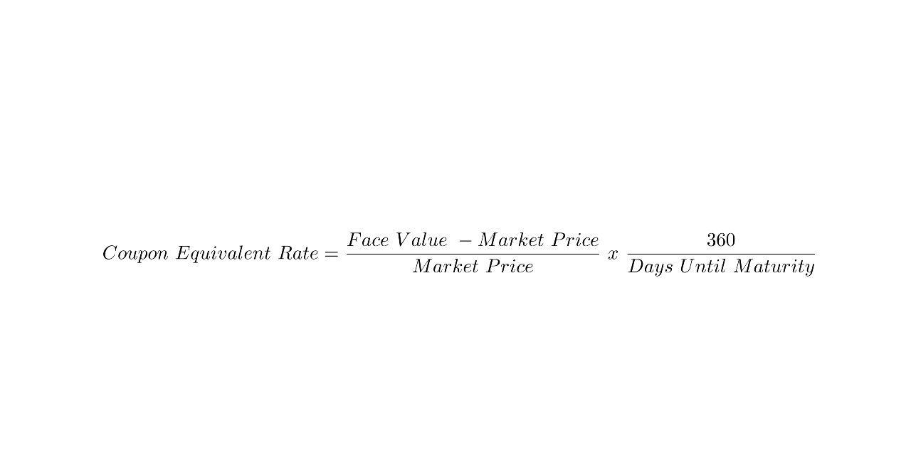

Understanding the complex interplay between various financial metrics and trading strategies is crucial for investors. At the core of these considerations lies the bond market, a fundamental component of the global financial system. This market provides a platform for the issuance, buying, and selling of debt securities, serving as a critical channel through which governments and corporations raise funds to finance their operations and projects. Investors within this domain are particularly concerned with maximizing potential returns while managing risk—a task that requires a keen understanding of several key financial concepts.

This article explores the concepts of bond yield, coupon equivalent rate (CER), and the role of algorithmic trading. Bond yield offers investors a measure of the return they can expect from holding a bond until maturity. It is essential for making strategic investment decisions as it helps compare the returns across different bonds and other investment vehicles. Similarly, the Coupon Equivalent Rate (CER) provides an invaluable tool for investors by facilitating the comparison between zero-coupon and coupon-paying bonds, thereby enhancing portfolio diversification strategies.



Additionally, the rapid advancement of technology has ushered in a new era in the bond market landscape, characterized by the use of algorithmic trading. This modern approach leverages mathematical models and computer algorithms to execute trades at speeds and efficiencies unattainable by human traders alone. Understanding these elements and their interactions can offer valuable insights into effective investment strategies, allowing investors to navigate the complexities of the financial markets successfully.

## Table of Contents

## Understanding Bond Yield

Bond yield is a critical metric in the bond market, representing the return an investor can expect to earn from holding a bond until maturity. It is essential for assessing the profitability and risk associated with investing in bonds.

Unlike the fixed coupon rate, which is the annual interest paid by the bond's issuer, the bond yield can vary. The coupon rate is predetermined when the bond is issued and does not change over the bond's life. Conversely, bond yield is dynamic, influenced by the bond's current market price and prevailing interest rates. It reflects the income the bond generates relative to its price.

The bond yield fluctuates with market conditions, primarily due to changes in interest rates. When interest rates rise, existing bonds typically decrease in price, leading to an increase in yield. This inverse relationship occurs because newer bonds enter the market with higher coupon rates, making existing bonds with lower rates less attractive. Conversely, when interest rates fall, existing bonds become more valuable, as their higher coupon rates are in demand compared to newly issued bonds with lower rates.

Investors use bond yields as a key indicator for making investment decisions. A rising yield often signals higher potential returns, but it also suggests increased risks, such as credit risk or changes in the economic environment. Conversely, falling yields may indicate lower returns but potentially more stable conditions.

The yield to maturity (YTM) is the most common measure used, calculated using the formula:

$$
YTM = \frac{C + \frac{(F - P)}{n}}{\frac{(F + P)}{2}}
$$

where:
- $C$ is the annual coupon payment,
- $F$ is the face value of the bond,
- $P$ is the price of the bond,
- $n$ is the number of years to maturity.

This formula provides an annualized return that assumes the bond is held to maturity and that all payments are received as scheduled. An understanding of bond yields is crucial for investors aiming to optimize their portfolios by effectively balancing returns and risks amidst shifting market landscapes.

## Coupon Equivalent Rate (CER)

The Coupon Equivalent Rate (CER) is a financial metric used to equate the yield of zero-coupon bonds with that of coupon-paying bonds, facilitating a direct comparison between these two types of securities. In essence, CER allows investors to understand better the returns they might expect from zero-coupon bonds in the context of the regular interest payments associated with coupon bonds.

To calculate the Coupon Equivalent Rate, the following formula is typically used:

$$
\text{CER} = \left( \frac{F - P}{P} \right) \times \left( \frac{365}{n} \right)
$$

where $F$ represents the face value of the bond, $P$ is the purchase price, and $n$ is the number of days until maturity. The formula derives the effective annualized interest rate that equates the purchase of a zero-coupon bond with that of a similar coupon-paying bond.

The practical implications of CER are significant for investors aiming to compare different short-term debt instruments. For zero-coupon bonds, which do not distribute periodic interest payments and are instead sold at a discount to their face value, CER provides a standardized return metric. This enables investors to assess whether the returns on zero-coupon bonds are competitive when compared to those of traditional coupon-bearing bonds.

Understanding CER is particularly crucial for evaluating short-term debt securities given their typically lesser durations and immediate yield expectations. For investors in money market instruments or those with a particular focus on treasury bills, CER presents an essential tool for precise performance assessment within the bond market. By equating various bonds' returns, CER ensures informed decision-making, driving effective investment strategies and enhancing portfolio management.

## Factors Influencing Bond Yield and Coupon Rates

Interest rates play a quintessential role in shaping bond prices and yields. Fundamentally, there exists an inverse relationship between bond prices and interest rates. When interest rates rise, existing bond prices generally fall, and conversely, when interest rates decline, bond prices increase. This is because newly issued bonds will offer yields that align more closely with the current market interest rates, thereby rendering older bonds with lower returns less attractive, hence driving their prices down.

The yield of a bond, often expressed as a percentage, is influenced heavily by market conditions, particularly interest rates. The yield can be calculated as:

$$

\text{Yield} = \frac{\text{Annual Coupon Payment}}{\text{Current Market Price of the Bond}} 
$$

Credit ratings, assigned by agencies such as Moody’s, S&P Global, and Fitch Ratings, are another significant [factor](/wiki/factor-investing) in determining bond yields. These ratings evaluate the issuer’s creditworthiness or the likelihood of the issuer defaulting on their payments. A bond with a high credit rating typically offers lower yields due to the decreased risk associated with it, while those with lower credit ratings offer higher yields to attract investors wary of potential default.

A change in a bond's credit rating can have substantial implications. For instance, a downgrade can increase the yield spread—a measure reflecting the additional yield above a risk-free benchmark, typically government securities. This increase compensates investors for the perceived increase in risk.

The mathematical relationship tying bond prices to yields is encapsulated in the bond’s duration and convexity. Duration measures the bond's price sensitivity to changes in interest rates. For a bond with price $P$, duration $D$, and yield $y$, a small change in yield $\Delta y$ induces a change in price $\Delta P$ approximately given by:

$$

\Delta P \approx -D \times P \times \Delta y 
$$

Further complexities in this relationship can be captured through the notion of convexity, which accounts for the curvature—or non-linear component—of the price-yield relationship. It refines the estimate provided by duration, especially significant in larger [interest rate](/wiki/interest-rate-trading-strategies) movements.

$$

\Delta P \approx -D \times P \times \Delta y + \frac{1}{2} \times \text{Convexity} \times P \times (\Delta y)^2 
$$

In summary, an investor examining the intricacies of bond markets must consider the intricate interplay between interest rates, credit ratings, and the mathematical relationships defining price and yield behavior to make informed investment decisions.

## Algorithmic Trading in Bond Markets

Algorithmic trading refers to the use of computer programs and systems to execute financial transactions at high speeds and with minimal human intervention. By employing algorithms, traders can exploit slight price discrepancies across bond markets, thereby optimizing profits with precision. Recently, [algorithmic trading](/wiki/algorithmic-trading) has witnessed a growing role in bond markets, largely due to advancements in technology and increasing data availability.

The benefits of algorithmic trading in bond markets are substantial. One primary advantage is speed; algorithms can process market data and execute trades in fractions of a second, significantly faster than human traders. This speed is particularly advantageous in the highly competitive bond market, where opportunities for [arbitrage](/wiki/arbitrage) and other strategic trades may be fleeting. Additionally, algorithmic trading enhances efficiency through automation, removing the emotional bias and error-prone nature of manual trading. Systems can be programmed to systematically follow defined trading strategies, ensuring consistency in execution.

Risk management is another critical benefit. Algorithmic trading systems are equipped to handle large volumes of transactions across multiple markets simultaneously, thus diversifying risk. They enable pre-programmed triggers to be set, allowing for automatic execution of stop-loss or take-profit orders when certain thresholds are met, mitigating potential losses.

To illustrate the application of algorithmic trading in bond markets, consider a basic strategy implemented using Python. Assume a scenario where the goal is to exploit price discrepancies between two similar bond securities. A Python script can be written to monitor bond prices in real-time and execute trades based on predefined criteria. Below is a simplified example of how a [pair trading](/wiki/pair-trading) strategy might be structured:

```python
import yfinance as yf  # For more datasets, visit: https://paperswithbacktest.com/datasets
import numpy as np

# Define bonds
bond_1 = 'BOND_TICKER_1'
bond_2 = 'BOND_TICKER_2'

# Fetch historical data
data_1 = yf.download(bond_1, period='1mo', interval='1d')
data_2 = yf.download(bond_2, period='1mo', interval='1d')

# Calculate daily returns
returns_1 = data_1['Close'].pct_change().dropna()
returns_2 = data_2['Close'].pct_change().dropna()

# Compute the spread
spread = returns_1 - returns_2

# Define trading rules based on spread
entry_threshold = np.std(spread) * 2
exit_threshold = np.std(spread) * 0.5

# Identify trading signals
buy_signal = spread < -entry_threshold
sell_signal = spread > entry_threshold
exit_signal = np.abs(spread) < exit_threshold

# Example output showing buy/sell signals
print("Buy signals:", buy_signal)
print("Sell signals:", sell_signal)
print("Exit signals:", exit_signal)
```

In this example, the algorithm identifies buy signals when the price spread between two bonds exceeds a certain threshold, implying one bond is undervalued relative to the other. Conversely, sell signals are generated when the spread is too high, suggesting overvaluation. This strategy exemplifies how algorithms can exploit bond market inefficiencies, making algorithmic trading a valuable tool for investors.

## Yield Curve and Its Implications on the Bond Market

The yield curve is a graphical representation that displays the interest rates of bonds having equal credit quality but differing maturity dates. It is a critical economic indicator that provides insights into future interest rate changes and economic activity. The slope of the yield curve reflects the cumulative market views on the trajectory of interest rates, thus serving as a predictor of economic shifts.

There are various types of yield curves:

1. **Normal Yield Curve**: This curve slopes upwards, indicating that longer-term debt securities have a higher yield compared to short-term ones. This makes sense as investors demand a premium for the increased risk of tying up their money for longer periods. Economically, a normal yield curve suggests an expectation of future economic expansion and inflation, leading to higher interest rates.

2. **Inverted Yield Curve**: An inverted yield curve occurs when short-term interest rates are higher than long-term rates, causing the curve to slope downward. This unusual situation often precedes an economic recession. Investors anticipate falling interest rates in the future, signaling expectations of a downturn in economic activity. Historically, an inverted yield curve has been a reliable predictor of economic recessions.

3. **Flat or Humped Yield Curve**: A flat yield curve suggests that there is little difference between short-term and long-term rates. It occurs during transitions between normal and inverted curves and may indicate an economic slowdown or uncertainty in interest rate directions. A humped yield curve, where intermediate rates are higher than both short-term and long-term rates, is relatively rare and can indicate heightened uncertainty or specific economic circumstances affecting the mid-term outlook.

The implications of the yield curve on investment decisions are profound. A normal yield curve encourages longer-term investments as they offer higher returns, reflecting stable economic growth expectations. Conversely, an inverted yield curve might prompt investors to move assets into short-term securities or consider other asset classes, anticipating a recession.

Monetary policy is also impacted by the yield curve. Central banks, such as the Federal Reserve, closely monitor changes in the yield curve to guide interest rate decisions. For instance, an inverted curve may prompt central banks to lower interest rates to stimulate economic activity and avert a potential recession. Conversely, a steepening of the normal yield curve might signal rising inflation, leading to potential interest rate hikes to prevent the economy from overheating.

In summary, the yield curve is a powerful tool in interpreting market sentiments and predicting economic trends. Its shape not only guides investment decisions but also informs monetary policy, reflecting the delicate balance central banks must maintain to foster economic stability and growth.

## Special Considerations in Bond Investing

Bonds are essential instruments in the financial markets, offering a range of investment opportunities with varying risk and reward characteristics. Among these, municipal, corporate, and treasury bonds are the most prevalent, each possessing unique attributes that influence investor decisions.

Municipal bonds, issued by local or state governments, are often considered more secure compared to corporate bonds due to their government backing. A defining feature of municipal bonds is their tax-exempt status; interest earned is typically exempt from federal income taxes, and often from state and local taxes if the investor resides in the state where the bond is issued. However, this tax advantage is reflected in lower yields compared to taxable bonds. Risk in municipal bonds primarily revolves around credit risk, particularly for revenue bonds, which depend on specific revenue sources for repayment.

Corporate bonds, issued by companies, offer higher yields to compensate for higher risk levels compared to government bonds. The credit risk is a major consideration, as it is contingent on the issuer's financial health. Companies with lower credit ratings must offer higher yields to attract investors, reflecting the greater risk of default. Interest on corporate bonds is fully taxable, impacting after-tax returns for investors.

Treasury bonds are securities issued by the U.S. government and are considered virtually risk-free in terms of default risk. They serve as a benchmark for other interest rates due to their [liquidity](/wiki/liquidity-risk-premium) and perceived safety. While they are subject to federal taxes, they are free from state and local taxes. The primary risk associated with treasury bonds is interest rate risk, as their prices are inversely related to changes in interest rates.

Two key metrics in bond evaluation are Yield to Maturity (YTM) and Yield to Call (YTC). YTM is the total return anticipated if the bond is held until it matures, encompassing all coupon payments and the difference between the purchase price and par value. YTM calculation assumes that coupon payments are reinvested at the same rate. It is expressed by the following equation:

$$
\text{YTM} = \frac{C + \frac{F - P}{n}}{\frac{F + P}{2}}
$$

where $C$ is the annual coupon payment, $F$ is the face value, $P$ is the price, and $n$ is the years to maturity.

Yield to Call is relevant for callable bonds, which can be redeemed by the issuer before maturity. It is calculated similarly to YTM, but the call date and call price are used instead of the maturity date and face value. YTC is significant for investors, particularly in environments where interest rates are falling, as issuers might opt to call bonds to reissue at a lower interest rate.

Understanding these characteristics and metrics is crucial for evaluating bond investments, balancing potential returns with associated risks and tax considerations intrinsic to each bond type.

## Conclusion

Understanding bond yields and coupon rates is essential for informed investment decision-making. Bond yields, which represent the return an investor can expect from a bond, play a critical role in assessing the attractiveness of different debt securities. They are influenced by market conditions such as interest rate fluctuations, inflation rates, and the issuer's credit rating. The coupon rate, meanwhile, reflects the annual interest payment made by the bond issuer relative to the bond's face value, offering additional insights into the investment's potential profitability.

Investment strategies are increasingly influenced by algorithmic trading, which has become a key component in bond markets. Algorithmic trading leverages complex mathematical models and high-speed data processing capabilities to identify patterns, predict market movements, and execute trades with precision and speed. The integration of these algorithms enhances trading strategies by ensuring efficient order execution, minimizing transaction costs, and mitigating risk through systematic evaluations unattainable by manual analysis alone.

Despite the advantages of algorithmic trading, human expertise remains crucial. The synergy between sophisticated algorithms and human judgment allows for the assessment of qualitative factors such as market sentiment, geopolitical events, and central bank policies, which algorithms might not fully comprehend. This combination supports a comprehensive investment strategy that balances technological precision with the nuanced understanding of experienced analysts.

In conclusion, the interplay between bond yields, coupon rates, and algorithmic trading underpins effective investment strategies in bond markets. Investors who harness both advanced technologies and human insights can better navigate the complexities of these markets to achieve optimal outcomes. Cultivating a deep understanding of financial metrics and leveraging algorithmic tools will be paramount for successful and informed bond market investments.

## References & Further Reading

1. Fabozzi, Frank J. "The Handbook of Fixed Income Securities." McGraw-Hill Education, 2012. This comprehensive guide covers various aspects of bond markets, including pricing, risk management, and investment strategies. It is an essential resource for understanding bond yields and coupon rates.

2. Hull, John C. "Options, Futures, and Other Derivatives." Pearson Education, 2017. This book provides a deep understanding of derivative instruments, which often intersect with bond markets, particularly in hedging strategies and yield curve applications.

3. Choudhry, Moorad. "The Bond & Money Markets: Strategy, Trading, Analysis." Butterworth-Heinemann, 2004. This book discusses bond market mechanisms and trading strategies, with an emphasis on the application of analytical tools to enhance investment decision-making.

4. Aldridge, Irene. "High-Frequency Trading: A Practical Guide to Algorithmic Strategies and Trading Systems." Wiley, 2013. This resource explores algorithmic trading with practical insights into developing and implementing trading systems, relevant for both equity and bond markets.

5. Fabozzi, Frank J., and Steven V. Mann. "Introduction to Fixed Income Analytics: Relative Value Analysis, Risk Measures and Valuation." Wiley, 2010. This work focuses on bond valuation and risk analysis, offering detailed methodologies for assessing bond market opportunities.

6. Mishkin, Frederic S. "The Economics of Money, Banking, and Financial Markets." Pearson Education, 2018. Mishkin's book provides an extensive overview of how financial markets operate, including detailed sections about the role of the yield curve in economic predictions.

7. Kritzman, Mark. "The Portable Financial Analyst: What Practitioners Need to Know." Wiley, 2003. This book includes essays on a variety of financial topics, including interest rates and yield curves, providing a versatile understanding of their impact on investments.

8. Jagerson, John, and Wade Hansen. "All About Investing in Bonds." McGraw-Hill Education, 2011. This book is directed at individual investors and explains different types of bonds, their tax implications, and how to effectively evaluate bond investments.

9. Grossman, Sanford J., and Joseph E. Stiglitz. "On the Impossibility of Informationally Efficient Markets." The American Economic Review, 1980. This article discusses market efficiency, indirectly related to trading and investment strategies, including algorithmic approaches in bond markets.

10. Fabozzi, Frank J., ed. "Fixed Income Analysis." CFA Institute Investment Series, John Wiley & Sons, 2015. This textbook provides in-depth coverage of fixed income markets, including quantitative tools used in the analysis and evaluation of bonds. 

These references provide a deep insight into bond markets, algorithmic trading, and financial indicators, equipping readers with the knowledge to understand and evaluate various financial metrics and strategies effectively.

