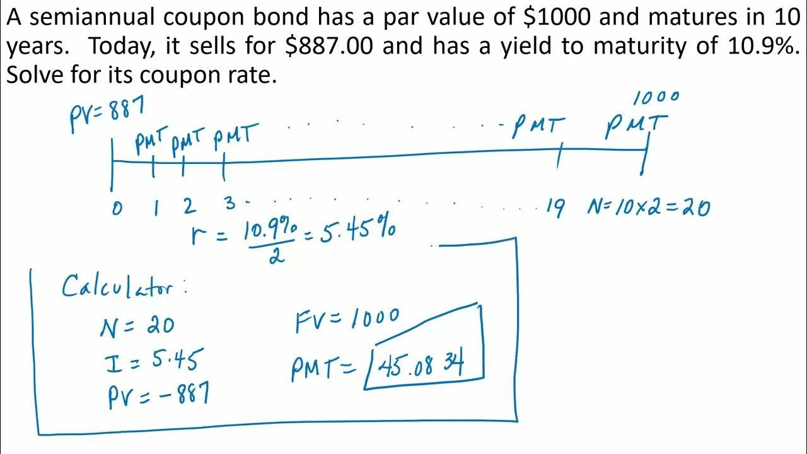

In finance, understanding various elements like bond calculations, coupon rates, and algorithmic trading is crucial for informed investment decisions. Bonds are fundamental financial instruments, serving as a primary method for companies and governments to raise capital. Accurately valuing these bonds requires a solid grasp of bond pricing and yield calculations, which heavily depend on the coupon rate—the fixed annual interest paid to investors. This interest rate affects the bond's attractiveness and price sensitivity to market interest fluctuations, which are pivotal in shaping an investor's decision-making process.

Algorithmic trading introduces a technological layer to finance, automating complex trading strategies by swiftly analyzing market data and executing trades with precision. This method enhances market efficiency and liquidity while minimizing transaction costs, proving indispensable in today's high-speed financial environment.



This article explores the interplay between these components, how they influence financial markets, and their significance in modern trading strategies. Investors need to be aware of how bond pricing works, the role of coupon rates, and how algorithmic trading can optimize investment outcomes. From understanding bond basics to exploring advanced trading techniques, this article covers key concepts to enhance financial literacy. Join us as we unravel the complexities of bond calculations, the importance of coupon rates, and the impact of algorithmic trading on investment portfolios.

## Table of Contents

## Understanding Bonds and Coupon Rates

Bonds are a fundamental component of the financial markets, serving as fixed-income debt securities issued by entities such as governments, municipalities, or corporations to raise capital. When an investor purchases a bond, they effectively lend money to the issuer in exchange for periodic interest payments, known as coupon payments, and the return of the bond's face value at maturity. The coupon rate is the annual interest rate paid by the bond issuer, and it remains constant throughout the bond's term.

Understanding how bond prices are influenced by market interest rates and other economic factors is crucial for investors. Bond prices and market interest rates have an inverse relationship; as market interest rates rise, existing bond prices typically fall, and vice versa. This is because new bonds are issued at prevailing rates, making older bonds with lower coupon rates less attractive.

A higher coupon rate provides a level of protection against increasing market interest rates. Such bonds are favored by investors as they offer greater income in a rising interest rate environment, thereby mitigating potential capital losses due to declining bond prices. Consequently, bonds with higher coupon rates are often more appealing during periods of interest rate volatility.

To calculate the coupon rate, the following formula is used:

$$
\text{Coupon Rate} = \left( \frac{\text{Annual Coupon Payment}}{\text{Face Value of the Bond}} \right) \times 100
$$

For example, if a bond has a face value of $1,000 and pays an annual coupon of $50, the coupon rate would be:

$$
\text{Coupon Rate} = \left( \frac{50}{1000} \right) \times 100 = 5\%
$$

This calculation is fundamental in assessing bond investments, allowing investors to compare the annual income from potential bond purchases relative to their costs. Investors can evaluate whether a bond's coupon rate aligns with their income goals and risk tolerance. Additionally, understanding the dynamics between coupon rates and market rates aids in strategic investment planning.

## Calculating Bond Prices and Yields

Bond pricing is a critical component of financial analysis, involving the determination of the present value of a bond's future cash flows, which include coupon payments and the principal amount. The process begins by identifying key factors such as the bond's face value, market yield, time to maturity, and coupon rate. These elements are essential for calculating a bond's price accurately.

The formula for calculating the present value of a bond is:

$$

P = \sum_{t=1}^{n} \frac{C}{(1 + y)^t} + \frac{F}{(1 + y)^n} 
$$

where $P$ is the bond price, $C$ is the coupon payment, $y$ is the market yield (or discount rate), $t$ is the time period, $F$ is the face value of the bond, and $n$ is the total number of periods until maturity.

Understanding the difference between the coupon rate and the yield to maturity (YTM) is crucial for interpreting a bond's market valuation. The coupon rate is the annual interest payment as a percentage of the bond's face value, which remains constant throughout the bond's life. In contrast, YTM is the rate of return anticipated on a bond if it is held until it matures, encompassing all coupon payments as well as any gain or loss incurred if the bond is purchased at a price different from its face value.

A bond's price can be categorized as "clean" or "dirty." The clean price is the quoted price of the bond without accrued interest, while the dirty price includes accrued interest. Accrued interest is the interest that has accumulated on the bond since the last coupon payment but has not yet been paid to the bondholder. Calculating accrued interest is essential for proper bond valuation, particularly in secondary market transactions. The formula for accrued interest is:

$$

\text{Accrued Interest} = \frac{C \times \text{Days Passed}}{\text{Days in Coupon Period}} 
$$

where $\text{Days Passed}$ refers to the number of days since the last coupon payment.

The application of bond calculators in finance aids in the quick and accurate computation of bond prices and yields. These tools incorporate all relevant variables—such as face value, coupon rate, YTM, and time to maturity—to provide immediate insights into a bond's valuation. Understanding and utilizing these calculations are indispensable for investors looking to optimize their bond investment portfolios and make informed trading decisions. 

Overall, mastering the nuances of bond pricing and yield calculations equips investors to better navigate the complexities of financial markets.

## Algorithmic Trading and Its Role in Bond Markets

Algorithmic trading leverages sophisticated algorithms to execute trades in financial markets, optimizing timing, pricing, and speed while minimizing manual intervention. In bond markets, this approach plays a pivotal role due to the complex nature of these financial instruments and the substantial data involved. These algorithms employ a variety of techniques, including statistical analysis, [artificial intelligence](/wiki/ai-artificial-intelligence), and [machine learning](/wiki/machine-learning), to process market data and identify optimal trading opportunities. They are capable of evaluating numerous metrics simultaneously, such as interest rates, yield spreads, and macroeconomic indicators, enabling highly efficient and precise trading decisions.

The implementation of [algorithmic trading](/wiki/algorithmic-trading) significantly enhances market efficiency by facilitating rapid execution and reducing latency. It allows for increased [liquidity](/wiki/liquidity-risk-premium), as algorithms can manage large volumes of trades effectively, ensuring smoother transactions and reducing market [volatility](/wiki/volatility-trading-strategies). Moreover, algorithmic trading lowers transaction costs by minimizing the bid-ask spread through scaled order placement and optimal trade execution timing. This is crucial in bond markets, which often suffer from lower liquidity compared to equity markets.

Algorithmic systems continuously assess market conditions and utilize trend analysis techniques to forecast bond price movements. They integrate a broad array of data inputs, including news sentiment, [interest rate](/wiki/interest-rate-trading-strategies) shifts, and historical price patterns, allowing them to adapt to evolving market environments. For instance, a common strategy might involve monitoring interest rate forecasts to anticipate central bank monetary policy changes, which can significantly impact bond prices. By preemptively adjusting trading strategies, algorithms can effectively mitigate potential risks.

Furthermore, algorithms are instrumental in the construction and management of bond portfolios. They can efficiently rebalance portfolios to maintain desired risk-return profiles or capitalize on [arbitrage](/wiki/arbitrage) opportunities across different bond markets. For example, an algorithm might exploit price discrepancies between corporate bonds and government bonds with similar characteristics, optimizing returns while adhering to pre-defined risk parameters.

In managing bond portfolios, algorithmic trading systems often incorporate sophisticated mathematical models to forecast economic variables and their effects on bond yields and prices. For instance, the Vasicek or Cox-Ingersoll-Ross models might be used to simulate the term structure of interest rates, thereby aiding in the valuation and risk assessment of long-duration bonds.

Python, with libraries such as NumPy, pandas, and scikit-learn, provides a robust framework for developing these algorithms. A simple Python snippet for evaluating a bond's yield to maturity (YTM) using an algorithmic approach might look like this:

```python
import numpy as np

def calculate_ytm(price, face_value, coupon_rate, years, frequency=2):
    coupon = (coupon_rate / frequency) * face_value
    ytm_func = lambda y: (coupon * (1 - (1 + y/frequency)**(-frequency*years)) / (y/frequency) + face_value * (1 + y/frequency)**(-frequency*years)) - price
    return np.round(np.irr([-price] + [coupon] * int(years * frequency) + [face_value]), 4)

# Example usage
bond_price = 950
face_value = 1000
coupon_rate = 0.05
years_to_maturity = 5

ytm = calculate_ytm(bond_price, face_value, coupon_rate, years_to_maturity)
print(f"Yield to Maturity: {ytm*100:.2f}%")
```

This code calculates the yield to maturity, a crucial metric for bond valuation and strategy optimization within an algorithmic trading framework. By employing algorithmic trading in bond markets, investors and financial institutions can execute sophisticated and efficient trading strategies, ultimately enhancing portfolio performance.

## Advanced Strategies for Investors

For investors, mastering bond calculations and understanding coupon rates is just the beginning. Advanced investment strategies often leverage algorithmic trading to maximize returns and minimize risks. Algorithmic trading utilizes sophisticated computer algorithms to automate and optimize trading processes, allowing for rapid execution of trades far beyond human capabilities. This technology is essential for investors seeking to capitalize on short-term market movements and achieve superior portfolio performance.

Crucially, technology plays a pivotal role in monitoring bond yields, market interest fluctuations, and economic indicators. Investors can utilize real-time data analytics tools to track these variables, integrating complex statistical models to predict future trends. For example, using Python, investors can develop predictive models to analyze historical bond yield data and forecast future movements using libraries such as NumPy and Pandas:

```python
import pandas as pd
import numpy as np
from sklearn.linear_model import LinearRegression

# Sample historical data
bond_yields = pd.DataFrame({
    'Years': [1, 2, 3, 4, 5],
    'Yield': [1.5, 1.6, 1.8, 2.0, 2.1]
})

# Prepare data for training
X = bond_yields['Years'].values.reshape(-1, 1)
y = bond_yields['Yield'].values

# Train the model
model = LinearRegression()
model.fit(X, y)

# Predict future yields
future_years = np.array([6, 7, 8]).reshape(-1, 1)
predicted_yields = model.predict(future_years)
print(predicted_yields)
```

Such predictive analytics aid in identifying potential investment opportunities and aligning trading decisions with market conditions.

Investors must also strike a balance between active management and passive strategies, aligning these with their individual goals and risk appetite. Active management involves frequent trading to exploit market inefficiencies, while passive strategies typically follow market indices. Combining these approaches can offer diversification and risk adjustment tailored to specific investment objectives. For instance, active management can be applied in volatile markets to capitalize on price movements, whereas passive strategies may be utilized during stable periods to minimize costs.

Furthermore, integrating technology-driven strategies, such as machine learning and artificial intelligence, enhances decision-making processes. These technologies assist in interpreting vast amounts of market data, providing insights into complex market relationships that traditional methods may overlook. The capacity to process big data enables more precise risk assessment and strategic investment allocations.

By harnessing these advanced strategies, investors are better equipped to navigate the complexities of the financial markets. Embracing a technology-driven approach not only optimizes returns but also cultivates a deeper understanding of market dynamics, ultimately contributing to robust investment outcomes.

## Conclusion

A comprehensive understanding of bond calculations, coupon rates, and algorithmic trading significantly impacts investment success by directly influencing pricing, yield, and strategic trading decisions in financial markets. Bond calculations provide the necessary tools to determine the fair value and expected yield of fixed-income securities, which are essential for making informed investment choices. The coupon rate, serving as the bond's interest payment, plays a vital role in assessing a bond's attractiveness relative to prevailing market interest rates. As interest rates fluctuate, the fixed nature of the coupon rate can either amplify or mitigate the bond's appeal to investors, depending on whether market rates are rising or falling.

Algorithmic trading introduces an advanced technological dimension to modern finance by automating and optimizing trading strategies. These algorithms process vast amounts of market data, executing trades with speed and efficiency beyond human capability. This technology aids investors in accurately assessing market conditions, trends, and bond price movements, thereby facilitating more informed and timely decisions. By incorporating these advanced tools, investors can capitalize on short-term market opportunities while mitigating risks inherent in manual trading.

Continual learning and adaptation are paramount in navigating the evolving landscape of bond markets and trading technologies. As financial instruments and market dynamics evolve, staying informed about new methodologies and technological advancements ensures that investors are well-equipped to respond to changing conditions. By applying these insights, investors can enhance their investment portfolios, achieve financial objectives, and secure a more prosperous financial future.

## References

- Investopedia offers comprehensive articles detailing bond pricing, coupon rates, and algorithmic trading, providing a foundation for understanding these financial instruments and strategies (Investopedia, n.d.).

- Primary and secondary sources in financial trading, such as market analysis reports and expert interviews, serve as critical references in building a nuanced understanding of how these elements affect market dynamics and investment decisions.

- Several case studies demonstrate the profound impact of algorithmic trading on bond market efficiency, highlighting increased liquidity and reduced transaction costs—factors crucial for optimizing trading strategies (Durbin, 2010).

- “Algorithmic Trading: Winning Strategies and Their Rationale” by Ernie Chan offers insights into the methodologies and impacts of algorithmic trading on various financial markets, including bonds (Chan, 2013).

- “Fixed Income Securities: Tools for Today's Markets” by Bruce Tuckman and Angel Serrat provides an analytical framework for understanding bonds, their pricing, and yield calculations, enhancing investment strategy development (Tuckman & Serrat, 2011).

- The Securities Industry and Financial Markets Association (SIFMA) regularly publishes reports that include data on bond market conditions, trends, and the integration of technology in trading practices.

## References & Further Reading

[1]: ["Algorithmic Trading: Winning Strategies and Their Rationale"](https://www.wiley.com/en-us/Algorithmic+Trading%3A+Winning+Strategies+and+Their+Rationale-p-9781118460146) by Ernest P. Chan

[2]: ["Fixed Income Securities: Tools for Today's Markets"](https://www.amazon.com/Fixed-Income-Securities-Markets-Finance/dp/1119835550) by Bruce Tuckman and Angel Serrat

[3]: ["Advances in Financial Machine Learning"](https://www.amazon.com/Advances-Financial-Machine-Learning-Marcos/dp/1119482089) by Marcos Lopez de Prado

[4]: ["Quantitative Trading: How to Build Your Own Algorithmic Trading Business"](https://www.amazon.com/Quantitative-Trading-Build-Algorithmic-Business/dp/1119800064) by Ernest P. Chan

[5]: Durbin, M. (2010). ["All About High-Frequency Trading"](https://www.amazon.com/All-About-High-Frequency-Trading/dp/0071743448)  

[6]: ["Investopedia: Bond Pricing"](https://www.investopedia.com/articles/bonds/07/price_yield.asp) - A resource on understanding bond pricing and related financial instruments.