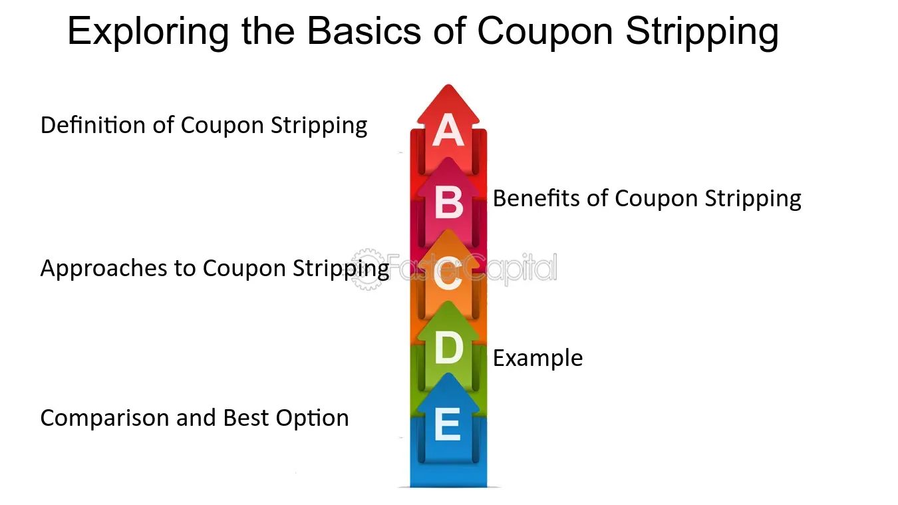

## Table of Contents

## What is coupon stripping?

Coupon stripping is a financial process where a bond's interest payments, called coupons, are separated from the bond itself. This means that instead of buying the whole bond, investors can buy just the coupons or the bond without the coupons. It's like breaking a big candy bar into smaller pieces and selling those pieces separately.

This is useful for investors who want to focus on getting regular income from the coupons or those who want to buy the bond at a lower price without the coupons. Coupon stripping helps make the bond market more flexible, allowing different types of investors to meet their specific investment needs.

## How does coupon stripping work?

Coupon stripping works by taking a bond and breaking it into smaller parts. Imagine you have a big chocolate bar. Normally, you can buy the whole bar, but with coupon stripping, it's like someone breaks the bar into smaller pieces. Each piece is sold separately. In the case of a bond, the pieces are the coupons, which are the interest payments, and the principal, which is the bond's value at the end. Investors can then choose to buy just the coupons if they want regular income, or they can buy the principal if they want to invest in the bond's final value without the interest payments.

This process is done by financial institutions, like banks or brokers, who buy the bonds and then separate the coupons from the principal. They then sell these parts as separate securities, called zero-coupon bonds. These zero-coupon bonds are attractive to different types of investors. For example, someone saving for a future goal might buy the principal because it will be worth more at the end, while someone looking for steady income might buy the coupons. Coupon stripping makes the bond market more flexible and allows investors to tailor their investments to their specific needs.

## What are the benefits of coupon stripping for investors?

Coupon stripping helps investors in different ways. It lets them pick what part of the bond they want to buy. Some people like getting regular money from the coupons, so they can buy just those. Others might want to save for something in the future and can buy the bond's principal without the coupons. This makes it easier for investors to match their investments with what they need or want.

Another benefit is that coupon stripping can make bonds cheaper. When the coupons are taken away, the price of the bond goes down. This can be good for investors who want to buy bonds but don't have a lot of money to spend. It also helps create more options in the bond market, so there's something for everyone. By breaking bonds into smaller pieces, more people can get involved and find the right investment for them.

## What are the risks associated with coupon stripping?

Coupon stripping can be a bit risky for investors. One big risk is that when you buy just the coupons or just the principal, you might not get the whole picture of the bond's value. If the bond's issuer runs into trouble and can't pay back the money, you might lose out on what you invested. This is especially risky if you bought the principal part, because you won't get any money until the bond matures, which could be a long time.

Another risk is that the value of the coupons and the principal can change a lot over time. Interest rates can go up or down, and this affects how much these parts of the bond are worth. If interest rates go up after you buy, the value of what you own might go down. This can be a problem if you need to sell your investment before it matures, because you might not get back as much money as you hoped.

## Can you explain the process of separating coupons from a bond?

When someone wants to separate coupons from a bond, they usually go to a big financial company, like a bank or a broker. This company buys the whole bond first. Then, they take the bond and break it into smaller parts. The parts are the coupons, which are the regular interest payments, and the principal, which is the bond's value at the end. It's like cutting a big cake into slices and selling each slice separately.

After the financial company separates the coupons from the principal, they sell these parts as different investments. People who want regular income can buy the coupons, because they get money at set times. Others who are saving for something far in the future might buy the principal, because it will be worth more at the end. This way, different investors can pick the part of the bond that fits their needs best.

## What types of bonds are typically used for coupon stripping?

Coupon stripping is usually done with government bonds. These are bonds issued by the government, like U.S. Treasury bonds. They are popular for coupon stripping because they are seen as very safe. People trust that the government will pay back the money, so these bonds are a good choice for breaking into smaller parts and selling.

Another type of bond used for coupon stripping is corporate bonds. These are issued by companies. They can be used for coupon stripping too, but they are a bit riskier than government bonds. Because companies can have more financial problems, there's a higher chance they might not be able to pay back the bond. So, investors need to be more careful when buying parts of corporate bonds.

## How does the pricing of stripped coupons differ from regular bonds?

The pricing of stripped coupons is different from regular bonds because they are sold separately. When you buy a regular bond, you get both the interest payments and the principal at the end. But with stripped coupons, you can buy just the interest payments or just the principal. This means the price of each part can change on its own. The coupons are usually cheaper because they give you smaller, regular payments instead of a big lump sum at the end.

The price of stripped coupons also depends a lot on interest rates. If interest rates go up after you buy a coupon, its value might go down. This is because new coupons will be issued with higher interest rates, making the older ones less attractive. On the other hand, if interest rates go down, the value of the coupons you own might go up. Regular bonds also change with interest rates, but because they include both the coupons and the principal, their pricing can be more stable than the individual parts.

## What role do financial institutions play in coupon stripping?

Financial institutions like banks or brokers are very important in coupon stripping. They buy whole bonds and then break them into smaller pieces. These pieces are the coupons, which are the regular interest payments, and the principal, which is what the bond is worth at the end. The financial institutions then sell these pieces as separate investments. This way, they can offer different options to investors who might want just the coupons for regular income or just the principal for saving up for the future.

By doing this, financial institutions help make the bond market more flexible. They allow investors to pick exactly what they need from the bond. This is good for the investors because it gives them more choices. It also helps the financial institutions because they can sell more parts of the bond to different people. This can make the bond market more active and help more people get involved in investing.

## How are stripped coupons taxed?

When you buy stripped coupons, you need to think about taxes. The money you get from the coupons is usually taxed as regular income. This means you have to pay taxes on it every year, even if you don't get the money until later. If you buy the principal part of the bond, you don't have to pay taxes on it until it matures and you get the money back.

Different countries might have different rules about how to tax stripped coupons. It's a good idea to talk to a tax advisor to understand how it works where you live. They can help you figure out how much you'll need to pay in taxes and when you need to pay it.

## What is the difference between a stripped bond and a zero-coupon bond?

A stripped bond and a zero-coupon bond are related but not exactly the same. A stripped bond is created when a regular bond is broken into smaller parts, like the coupons and the principal. These parts are then sold separately. So, a stripped bond can refer to either the coupons or the principal that has been separated from the original bond.

A zero-coupon bond, on the other hand, is a bond that doesn't pay any interest during its life. Instead, it is sold at a discount and pays out its full face value when it matures. The difference between the purchase price and the face value is the investor's return. While zero-coupon bonds are often the result of coupon stripping, not all stripped bonds are zero-coupon bonds. The coupons from a stripped bond can be sold as zero-coupon bonds, but the principal part of a stripped bond is not a zero-coupon bond because it represents the bond's face value at maturity.

## How does coupon stripping affect the yield curve?

Coupon stripping can change the yield curve by making more types of bonds available. The yield curve shows the interest rates of bonds over different times. When financial institutions strip bonds and sell the coupons and principal separately, they create new bonds that have different lengths of time until they pay out. This can make the yield curve more detailed because there are more points on it. For example, if a lot of people want to buy short-term coupons, the prices for those might go up, and the yields might go down, which could make the short end of the yield curve lower.

The effect on the yield curve also depends on how investors react to these new bond pieces. If more people want to buy the principal part of stripped bonds, which pays out at the end, it could make the long end of the yield curve go down too. On the other hand, if investors are more interested in the coupons that pay out regularly, it might affect the middle part of the yield curve more. Coupon stripping gives investors more choices, and how they choose can change the shape of the yield curve.

## What are some advanced strategies that investors use with stripped coupons?

Some investors use a strategy called laddering with stripped coupons. They buy coupons that mature at different times, like steps on a ladder. This way, they get money at regular intervals. It helps them manage their cash flow better because they don't get all their money at once. They can use the money from the coupons that mature earlier to buy new investments or pay for things they need.

Another strategy is called immunization. Investors use this to protect their investments from changes in interest rates. They match the time when their coupons mature with when they need the money. This helps make sure they get the money they need, even if interest rates go up or down. By using stripped coupons in this way, investors can make their investments more stable and less risky.

## What is Coupon Stripping in Bond Markets?

Coupon stripping is a financial technique used in bond markets, where the interest (coupon) and principal payments of a bond are separated into distinct securities. This transformation results in the creation of two different types of instruments: zero-coupon bonds and standalone coupon securities. Each of these newly formed instruments can be traded independently in the market.

The primary advantage of coupon stripping lies in its ability to cater to varying investor preferences and specific market conditions. Zero-coupon bonds, for example, are often appealing to investors seeking to invest funds today for a future lump sum, as they are typically sold at a deep discount and mature at face value. The lack of periodic interest payments means these bonds do not offer regular income streams, but they are subject to less reinvestment risk compared to traditional bonds with recurring coupons.

Coupon securities, on the other hand, meet the needs of investors looking for regular income streams, such as those provided by traditional bond interest payments. By stripping a bond, separate coupons can be held as independent instruments, offering a series of cash flows at specified intervals, akin to those from an annuity.

STRIPS (Separate Trading of Registered Interest and Principal of Securities) is the commonly used term for coupon stripping in U.S. Treasury markets. Introduced in 1985 by the U.S. Department of the Treasury, STRIPS allow investors to hold and trade the individual interest and principal components of eligible Treasury notes and bonds as separate securities. This enhances market efficiency and [liquidity](/wiki/liquidity-risk-premium) by expanding the available set of securities and allowing investors to better tailor their portfolio strategies.

The mathematics of coupon stripping involves computing the present value of the cash flows from the coupons and principal and then calculating their respective prices in the market. For example, if we consider a bond with a face value $F$, an annual coupon rate $c$, and maturity in $n$ years, the present value of the zero-coupon portion $Z$ is calculated by stripping the future value of the face amount and evaluating it at the appropriate discount rate $r$:

$$

Z = \frac{F}{(1 + r)^n} 
$$

Simultaneously, the present value of individual coupons, denoted as $C_i$, where $i$ is the coupon number, would be:

$$

C_i = \frac{c \cdot F}{(1 + r)^i} 
$$

Investors utilize these distinct securities based on their investment goals, with some focusing on the growth potential of zero-coupon bonds, while others might be interested in the steady income from coupon payments.

## References & Further Reading

[1]: ["Treasury STRIPS: An Introduction to One of the Most Useful Tools in Fixed Income Trading"](https://money.usnews.com/investing/articles/treasury-strips-t-strips-how-to-invest) by Investopedia

[2]: ["Fixed Income Securities: Tools for Today's Markets"](https://www.amazon.com/Fixed-Income-Securities-Markets-Finance/dp/1119835550) by Pietro Veronesi

[3]: Domowitz, I., & Madhavan, A. (2001). ["The Impact of Algorithmic Trading Systems on Market Liquidity"](https://www.scirp.org/reference/referencespapers?referenceid=2161756) The Journal of Managed Funds, 1(1), 21-44.

[4]: ["Algorithmic and High-Frequency Trading"](https://www.amazon.com/Algorithmic-High-Frequency-Trading-Mathematics-Finance/dp/1107091144) by Álvaro Cartea, Sebastian Jaimungal, and José Penalva

[5]: ["The Handbook of Fixed Income Securities, Ninth Edition"](https://www.amazon.com/Handbook-Fixed-Income-Securities-Ninth/dp/1260473899) by Frank J. Fabozzi and Steven V. Mann

[6]: ["Bond Markets, Analysis, and Strategies"](https://penguinrandomhousehighereducation.com/book/?isbn=9780262367424) by Frank J. Fabozzi