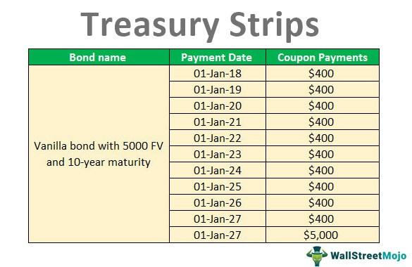

The financial markets offer a variety of instruments that cater to different investment strategies and goals. Among these instruments, bonds stand out due to their stable income generation and relatively lower risk compared to equities. Bonds are considered one of the fundamental components of investment portfolios because they provide predictable cash flow through interest payments, offering a measure of safety against the volatility typically associated with stocks. 

In recent years, the evolution of financial engineering has introduced innovative techniques like coupon stripping and algorithmic trading, which have significantly impacted the bond markets. Coupon stripping allows for the separation of a bond's interest payments and principal repayment into distinct securities, creating a variety of investment opportunities. This technique caters to different investor preferences and market conditions by creating zero-coupon bonds and standalone coupons, which can be traded independently.



Algorithmic trading, on the other hand, leverages sophisticated computer algorithms to automate trading decisions. This technology has transformed the speed and efficiency of trading in bond markets, enabling traders to execute large volumes of trades instantaneously based on pre-defined criteria. It helps in price discovery and liquidity provision, making markets more accessible and reducing transaction costs.

This article explores the intricacies of financial instruments in bond markets with a focus on coupon stripping and algorithmic trading. We aim to provide insights into their functions, benefits, risks, and influence on the modern bond market landscape. Understanding these complex strategies and technologies enables investors and financial professionals to optimize their investment outcomes while navigating the evolving bond market landscape.

## Table of Contents

## Understanding Bond Markets and Financial Instruments

Bond markets are pivotal in the global financial system, serving as a bridge between entities that require capital and those looking to invest funds. Issuers, such as governments, municipalities, and corporations, tap into bond markets to raise funds for various purposes, including infrastructure projects, expansion endeavors, or operational funding. On the other hand, investors, such as individual retail buyers, institutional investors, and pension funds, look to bond markets to achieve fixed-income goals within their broader investment strategies.

Financial instruments in bond markets differ mainly by issuer type, risk profile, maturity, yield, and taxation characteristics. The primary categories are Treasury bonds, corporate bonds, and municipal bonds:

1. **Treasury Bonds**: Issued by national governments, these bonds are often perceived as risk-free concerning default, given the government's reliable ability to fulfill its debt obligations. In the U.S., Treasury securities range from short-term Treasury bills (T-bills) to longer-term Treasury notes and bonds. These instruments are known for their liquidity and are essential for risk-averse investors.

2. **Corporate Bonds**: These are issued by corporations aiming to raise capital for various corporate activities such as expansion, research and development, or restructuring debt. Corporate bonds typically offer higher yields than government securities due to the increased risk associated with business ventures. Credit ratings assigned by agencies such as Moody's or Standard & Poor's can indicate the bond's credit risk, affecting yield demands.

3. **Municipal Bonds**: These are issued by states, cities, or other local government entities to fund public projects like schools, roads, and hospitals. Municipal bonds, often called "munis," can offer tax advantages, such as exempting interest income from federal taxes and, in some cases, state and local taxes. This tax-exempt status can make municipal bonds particularly attractive to investors in higher tax brackets.

Additionally, the variation in bond instruments is also influenced by factors such as maturity and yield. **Maturity** indicates the time frame over which the bondholder will receive interest payments and, ultimately, the return of principal. Bonds can be short-term (less than three years), medium-term (three to ten years), or long-term (more than ten years). **Yield** measures the return on bond investment, factoring in interest payments, purchase price, and holding duration. Yield and price have an inverse relationship, such that as bond prices rise, yields fall, and vice versa, influenced by [interest rate](/wiki/interest-rate-trading-strategies) changes and market conditions.

An understanding of these nuances is crucial for investors aiming to optimize their portfolios. For instance, incorporating a mix of these bonds can help balance risk and return, suit specific [liquidity](/wiki/liquidity-risk-premium) needs or time horizons, and align with an investor’s tax strategy. The diversified nature and relative stability of bond markets underscore their significance within a comprehensive investment framework.

## What is Coupon Stripping in Bond Markets?

Coupon stripping is a financial technique used in bond markets, where the interest (coupon) and principal payments of a bond are separated into distinct securities. This transformation results in the creation of two different types of instruments: zero-coupon bonds and standalone coupon securities. Each of these newly formed instruments can be traded independently in the market.

The primary advantage of coupon stripping lies in its ability to cater to varying investor preferences and specific market conditions. Zero-coupon bonds, for example, are often appealing to investors seeking to invest funds today for a future lump sum, as they are typically sold at a deep discount and mature at face value. The lack of periodic interest payments means these bonds do not offer regular income streams, but they are subject to less reinvestment risk compared to traditional bonds with recurring coupons.

Coupon securities, on the other hand, meet the needs of investors looking for regular income streams, such as those provided by traditional bond interest payments. By stripping a bond, separate coupons can be held as independent instruments, offering a series of cash flows at specified intervals, akin to those from an annuity.

STRIPS (Separate Trading of Registered Interest and Principal of Securities) is the commonly used term for coupon stripping in U.S. Treasury markets. Introduced in 1985 by the U.S. Department of the Treasury, STRIPS allow investors to hold and trade the individual interest and principal components of eligible Treasury notes and bonds as separate securities. This enhances market efficiency and liquidity by expanding the available set of securities and allowing investors to better tailor their portfolio strategies.

The mathematics of coupon stripping involves computing the present value of the cash flows from the coupons and principal and then calculating their respective prices in the market. For example, if we consider a bond with a face value $F$, an annual coupon rate $c$, and maturity in $n$ years, the present value of the zero-coupon portion $Z$ is calculated by stripping the future value of the face amount and evaluating it at the appropriate discount rate $r$:

$$

Z = \frac{F}{(1 + r)^n} 
$$

Simultaneously, the present value of individual coupons, denoted as $C_i$, where $i$ is the coupon number, would be:

$$

C_i = \frac{c \cdot F}{(1 + r)^i} 
$$

Investors utilize these distinct securities based on their investment goals, with some focusing on the growth potential of zero-coupon bonds, while others might be interested in the steady income from coupon payments.

## Benefits and Risks of Coupon Stripping

Coupon stripping can lead to enhanced liquidity in the bond market by transforming individual bonds into multiple new securities, each appealing to different investor preferences. This process is particularly attractive to investors seeking specific cash flow characteristics that align with their financial goals. By isolating the bond’s principal from its interest payments, coupon stripping creates two types of securities: the zero-coupon bond (representing the principal) and the individual coupon payments, each of which trade independently. This separation allows investors to choose between a lump-sum payment at maturity, represented by the zero-coupon bond, and periodic income streams from the individual coupon payments. 

This approach supports diverse investment strategies, particularly in response to changing interest rate environments. For instance, an investor anticipating a decline in interest rates might prefer a zero-coupon bond, which tends to increase in value as interest rates fall. Conversely, those expecting rising rates may favor periodic coupon payments. Such flexibility allows for more tailored portfolio management and strategic positioning based on rate forecasts.

Despite these advantages, coupon stripping involves certain risks. One significant risk is the increased price [volatility](/wiki/volatility-trading-strategies) of stripped securities compared to traditional bonds with regular coupon payments. The absence of intermediate cash flows in zero-coupon bonds makes their prices more sensitive to interest rate changes. This sensitivity can lead to pronounced fluctuations in bond valuations, presenting a challenge for risk-averse investors.

Tax treatment is another consideration. In some jurisdictions, the accrued interest on zero-coupon bonds must be reported as income each year, despite the lack of actual cash receipts until maturity. This "phantom income" can create additional tax burdens that might not align with an investor’s liquidity needs unless they are meticulously planned for.

In summary, while coupon stripping offers notable benefits in liquidity and strategic investment flexibility, it is critical for investors to understand the associated risks, particularly regarding price volatility and tax implications. Mastery of these factors is crucial for effectively incorporating stripped securities into an investment portfolio.

## Algorithmic Trading in Bond Markets

Algorithmic trading involves the use of advanced computer algorithms to automate the process of trading in financial markets. This approach aims to achieve optimal efficiency and precision by executing trades based on predefined criteria without human intervention. In bond markets, [algorithmic trading](/wiki/algorithmic-trading) plays a crucial role in enhancing several key aspects: price discovery, trade execution, and liquidity provision.

Price discovery refers to the process of determining the fair value of a bond based on current market conditions. Algorithms can rapidly analyze vast amounts of data, including news feeds, economic indicators, and historical price patterns, to ascertain an appropriate price for bonds. This leads to more accurate and timely pricing, benefiting both buyers and sellers by reflecting real-time market conditions.

Trade execution is another critical area where algorithmic trading is applied. By automating the decision-making process, algorithms can execute trades with greater speed and efficiency than human traders. High-frequency trading, a subset of algorithmic trading, is characterized by executing a large number of trades in a fraction of a second. This capability allows algorithms to respond instantaneously to market changes, capturing price movements more effectively than manual trading. The ability to execute trades quickly also helps in reducing transaction costs and minimizing slippage, the difference between the intended and actual execution price.

Furthermore, algorithmic trading significantly contributes to liquidity provision in bond markets. Liquidity refers to the ease with which an asset can be bought or sold in the market without affecting its price. Algorithms can quickly match buy and sell orders, facilitating a higher [volume](/wiki/volume-trading-strategy) of trades and ensuring that markets operate smoothly. This enhanced liquidity encourages greater participation from different types of investors, thereby deepening the bond market.

The revolution brought about by algorithmic trading in bond markets has made these markets more accessible and efficient. Transactions are executed faster, and the precision of algorithms minimizes human error, leading to more reliable market operations. This transformation is particularly important in the bond market, where the sheer volume and diversity of securities demand a sophisticated trading infrastructure.

Overall, algorithmic trading has reshaped the landscape of bond trading, leveraging technology to improve market dynamics and deliver enhanced outcomes for market participants. As technology continues to evolve, the influence of algorithmic trading is expected to grow, potentially introducing further efficiencies and innovations in the bond markets.

## Integrating Coupon Stripping and Algo Trading

The intersection of coupon stripping and algorithmic trading signifies an advanced approach to bond markets, leveraging technology and financial engineering to enhance investment strategies. Algorithms optimize the timing and execution of trades involving separated coupons and stripped bonds, aiming to maximize returns or minimize risks. This is achieved by implementing a set of rules or instructions that can automatically execute trades, often based on real-time market conditions and historical data analysis.

For instance, suppose an algorithm identifies a pricing inefficiency between a stripped coupon and its corresponding principal bond. By simultaneously buying the undervalued security and selling the overvalued one, the algorithm can exploit this [arbitrage](/wiki/arbitrage) opportunity for profit. Such strategies require sophisticated computational models capable of processing vast datasets swiftly. Python, a language favored for its extensive libraries in data analysis and finance, can be instrumental here. Using libraries like Pandas for data manipulation and NumPy for numerical operations, investors can design algorithms to analyze yield curves, interest rate fluctuations, and other relevant metrics that affect bond pricing.

```python
import pandas as pd
import numpy as np

# Example: Simple moving average strategy for stripped bonds
# DataFrame `bond_data` contains historical price data for stripped bonds
bond_data = pd.DataFrame({
    'date': pd.date_range(start='1/1/2020', periods=100),
    'price': np.random.randn(100).cumsum() + 100  # Simulated price data
})

# Calculate moving averages
bond_data['short_mavg'] = bond_data['price'].rolling(window=5).mean()
bond_data['long_mavg'] = bond_data['price'].rolling(window=20).mean()

# Signal generation: buy when short-term average is above long-term average
bond_data['signal'] = 0
bond_data['signal'][5:] = np.where(bond_data['short_mavg'][5:] > bond_data['long_mavg'][5:], 1, -1)

# Positions based on signals
bond_data['position'] = bond_data['signal'].shift()

print(bond_data[['date', 'price', 'short_mavg', 'long_mavg', 'signal', 'position']].tail())
```

Algorithms like the one above are key in identifying market inefficiencies, such as temporary mispricings, which traders can capitalize on. This capability contributes to more efficient trading decisions and enhances market liquidity, as it can stimulate additional trade volumes and encourage price convergence across different bond market segments.

Moreover, this integration also advances risk management strategies. The ability to process large datasets helps in evaluating the risk profiles associated with trading stripped coupons and other derivative products. By incorporating predictive analytics, algorithms can model potential market scenarios and devise strategies to mitigate adverse outcomes. 

In summary, the melding of coupon stripping and algorithmic trading represents a dynamic and efficient approach to navigating contemporary bond markets. This integration not only fosters enhanced liquidity but also supports more robust and informed risk management practices.

## Conclusion

The bond market continues to evolve with the introduction of innovative strategies like coupon stripping and advances in technology such as algorithmic trading. These strategies and technologies have provided market participants with new opportunities, allowing them to tailor their investment approaches to meet specific goals while simultaneously addressing potential risks. Coupon stripping, by creating more tradable components from single instruments, enhances market liquidity and attracts a broader range of investors with diverse risk appetites and time horizons. Meanwhile, algorithmic trading introduces heightened efficiency and precision, enabling faster response times to market fluctuations and improved trade execution.

For investors and financial professionals, understanding and integrating these complex strategies into their operations is crucial for optimizing investment outcomes. Coupon stripping and algorithmic trading both entail unique challenges, such as increased price volatility in stripped bonds and the technical complexities of deploying effective trading algorithms. Successfully navigating these challenges requires a profound understanding of how these instruments function and interact within the broader financial ecosystem.

As the bond market landscape continues to transform, staying informed about emerging trends and technological advancements becomes essential. Investors and financial analysts must adopt a proactive approach, continuously updating their knowledge and adapting their strategies to ensure they remain competitive in a rapidly changing environment. By embracing innovation while maintaining rigorous risk management, market participants can leverage these advancements to achieve superior investment results in the evolving bond market landscape.

## References & Further Reading

[1]: ["Treasury STRIPS: An Introduction to One of the Most Useful Tools in Fixed Income Trading"](https://money.usnews.com/investing/articles/treasury-strips-t-strips-how-to-invest) by Investopedia

[2]: ["Fixed Income Securities: Tools for Today's Markets"](https://www.amazon.com/Fixed-Income-Securities-Markets-Finance/dp/1119835550) by Pietro Veronesi

[3]: Domowitz, I., & Madhavan, A. (2001). ["The Impact of Algorithmic Trading Systems on Market Liquidity"](https://www.scirp.org/reference/referencespapers?referenceid=2161756) The Journal of Managed Funds, 1(1), 21-44.

[4]: ["Algorithmic and High-Frequency Trading"](https://www.amazon.com/Algorithmic-High-Frequency-Trading-Mathematics-Finance/dp/1107091144) by Álvaro Cartea, Sebastian Jaimungal, and José Penalva

[5]: ["The Handbook of Fixed Income Securities, Ninth Edition"](https://www.amazon.com/Handbook-Fixed-Income-Securities-Ninth/dp/1260473899) by Frank J. Fabozzi and Steven V. Mann

[6]: ["Bond Markets, Analysis, and Strategies"](https://penguinrandomhousehighereducation.com/book/?isbn=9780262367424) by Frank J. Fabozzi