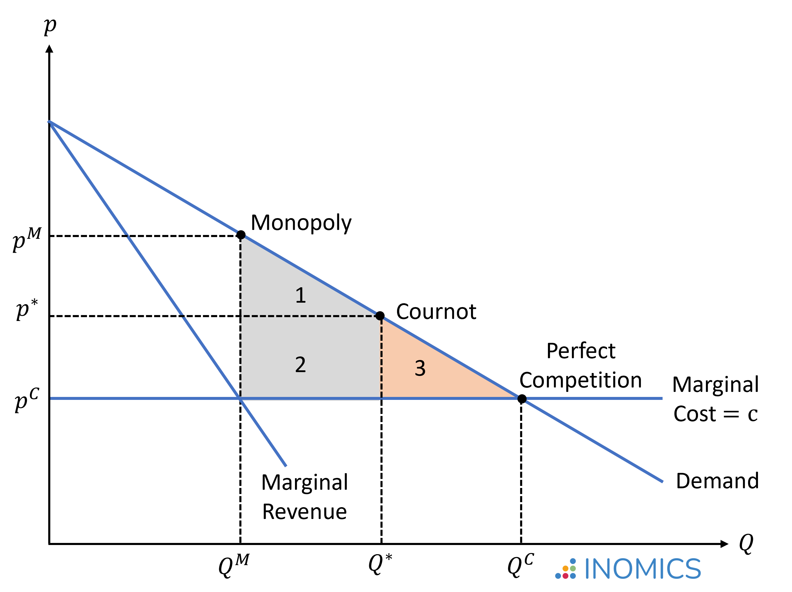

## Table of Contents

## What is the Cournot Competition Model?

The Cournot Competition Model is a way to understand how businesses in the same industry decide how much to produce when they are trying to make the most profit. It was created by a French economist named Antoine Augustin Cournot. In this model, each business picks how much to produce without knowing exactly what the other businesses will do. They make their choices based on what they think the others will do. The goal is to find a balance where no business can make more profit by changing how much they produce, as long as the other businesses keep their production the same.

In the Cournot model, if there are only two businesses, they might end up producing more than if there was just one business in the market. This is because each business tries to grab a bigger part of the market, leading to more total production. The model shows that the amount each business produces depends on how many businesses are in the market and how much they think the others will produce. If more businesses enter the market, each one might produce less, but the total production could still go up. This model helps economists predict how businesses will behave and how much they will produce in different situations.

## Who developed the Cournot Competition Model and when?

The Cournot Competition Model was developed by a French economist named Antoine Augustin Cournot. He came up with this model in the year 1838. Cournot was trying to understand how businesses decide how much to produce when they are competing with each other.

In simple terms, Cournot's model looks at a situation where businesses choose how much to produce without knowing exactly what their competitors will do. They make their decisions based on guesses about what the others might do. This model helps us understand how businesses in the same industry can reach a point where no one can make more profit by changing their production, as long as everyone else keeps producing the same amount.

## How does the Cournot model differ from perfect competition?

The Cournot model and perfect competition are two different ways to think about how businesses act in a market. In the Cournot model, there are a few big businesses that each try to guess what the others will do and then decide how much to produce. They want to make the most profit, so they think about what their competitors might do and then choose their own production level. This leads to a situation where no business can make more profit by changing how much they produce, as long as the others keep their production the same.

In perfect competition, there are many small businesses, and no single business can affect the market price by changing how much it produces. All businesses sell the same thing, and the price is set by the market, not by any one business. Because there are so many businesses, they all take the market price as given and just try to produce at the lowest cost possible. This leads to a situation where the price equals the cost of making one more item, and businesses can't make more profit by changing their production because they can't change the price.

The main difference between the two is how many businesses are in the market and how they affect the price. In the Cournot model, a few big businesses can affect the price by changing their production, and they try to outguess each other. In perfect competition, there are many small businesses that can't change the price, so they just focus on producing at the lowest cost.

## What are the basic assumptions of the Cournot model?

The Cournot model makes some basic assumptions to help understand how businesses decide how much to produce when they compete with each other. One key assumption is that there are only a few businesses in the market, and each business produces a similar product. These businesses are big enough that their decisions about how much to produce can affect the market price. Another important assumption is that each business makes its production decision at the same time as the others, but without knowing exactly what the others will do. They have to guess what their competitors might do and then choose their own production level based on those guesses.

Another assumption of the Cournot model is that businesses aim to maximize their profits. They do this by trying to figure out the best amount to produce, considering the total market demand and what they think their competitors will produce. The model assumes that once all businesses have made their production decisions, the market reaches a balance where no business can make more profit by changing its production, as long as the other businesses keep their production the same. This balance, called the Cournot equilibrium, helps economists predict how businesses will behave and how much they will produce in different situations.

## Can you explain the concept of a reaction function in the Cournot model?

In the Cournot model, a reaction function is a way for a business to decide how much to produce based on what it thinks its competitor will do. Imagine there are two businesses, A and B, making the same product. Business A looks at the market and thinks, "If business B makes this many items, then to make the most profit, I should make this many items." That's the reaction function for business A. It's like a rule that tells business A how to react to whatever business B does.

The reaction function helps find the Cournot equilibrium, which is when both businesses are happy with how much they are producing and neither wants to change. Business A uses its reaction function to pick its production level, and business B does the same. They keep adjusting until they reach a point where neither can make more profit by changing their production, as long as the other keeps doing the same thing. This back-and-forth process, guided by their reaction functions, leads to a balance in the market where both businesses are doing the best they can given what the other is doing.

## How is market equilibrium determined in the Cournot model?

In the Cournot model, market equilibrium is found when each business is happy with how much it is producing and doesn't want to change. Imagine there are two businesses, A and B, making the same thing. Business A looks at what business B is doing and decides how much to produce to make the most profit. At the same time, business B does the same thing, looking at what A is doing. They keep adjusting until they reach a point where neither can make more profit by changing their production, as long as the other keeps doing the same thing. This point is called the Cournot equilibrium.

To find this equilibrium, each business uses something called a reaction function. This is like a rule that tells a business how much to produce based on what it thinks the other business will do. Business A uses its reaction function to pick its production level, and business B does the same. They go back and forth, adjusting their production until they both end up at the Cournot equilibrium. At this point, the market is balanced, and no business can do better by changing how much it produces, as long as the other business sticks to its current production level.

## What is the Cournot-Nash equilibrium and how is it calculated?

The Cournot-Nash equilibrium is a special point in the Cournot model where no business can make more profit by changing how much it produces, as long as the other businesses keep their production the same. It's named after Antoine Augustin Cournot and John Nash, who worked on understanding how businesses and people make choices when they're competing. In the Cournot model, businesses guess what their competitors will do and then choose how much to produce to make the most profit. When they reach the Cournot-Nash equilibrium, they've all made their best guesses and found the right balance.

To calculate the Cournot-Nash equilibrium, you need to find the point where each business's reaction function meets. A reaction function is like a rule that tells a business how much to produce based on what it thinks the other business will do. Imagine there are two businesses, A and B. Business A looks at what B is doing and decides its production level to maximize profit. At the same time, business B does the same thing, looking at what A is doing. They keep adjusting their production until they reach a point where neither can do better by changing, as long as the other keeps doing the same thing. This point of balance is the Cournot-Nash equilibrium.

## How does the number of firms affect the outcomes in the Cournot model?

In the Cournot model, the number of firms in the market can change how much each firm produces and the total amount produced. When there are fewer firms, each one might produce more because they have a bigger share of the market. For example, if there are only two firms, they might produce a lot because they're trying to outdo each other. But as more firms enter the market, each one might produce less because they have to share the market with more competitors. Even though each firm produces less, the total production might still go up because there are more firms overall.

The Cournot-Nash equilibrium, which is the point where no firm can make more profit by changing its production, also changes with the number of firms. With fewer firms, the equilibrium might mean higher prices and profits for each firm because they have more control over the market. But as more firms join, the competition gets tougher, and the equilibrium might shift to lower prices and profits for each firm. This happens because more firms lead to more total production, which can push prices down. So, the number of firms in the Cournot model really affects how much each firm produces, the total production, and the profits each firm can make.

## What are the welfare implications of the Cournot model?

In the Cournot model, the number of firms in the market can affect how much everyone in the market benefits, which economists call "welfare." When there are fewer firms, they might produce less than what would be best for everyone. This is because each firm tries to make the most profit by producing less and keeping prices high. As a result, consumers might have to pay more for less, which isn't good for overall welfare. But, if more firms enter the market, they produce more to compete with each other, which can lower prices and increase the total amount of goods available. This can be better for consumers and overall welfare because they get more for less money.

However, even with more firms, the Cournot model might not reach the best possible outcome for welfare. This is because firms still try to maximize their own profits rather than thinking about what's best for everyone. In a perfect competition scenario, where there are many small firms, the market would produce the amount that's best for everyone. But in the Cournot model, firms produce less than this ideal amount because they're trying to keep prices high. So, while having more firms can improve welfare compared to having fewer firms, the Cournot model might still not be as good for everyone as a perfectly competitive market would be.

## How can the Cournot model be extended to include product differentiation?

The Cournot model can be extended to include product differentiation by allowing each firm to produce a slightly different product. This means that firms no longer just compete on how much they produce, but also on the unique features of their products. In this extended model, each firm still tries to guess what the other firms will do, but now they also think about how their product's uniqueness affects demand. For example, if Firm A makes a product that's a bit different from Firm B's, customers might be willing to pay more for Firm A's product because they like its special features. This changes how firms decide how much to produce, as they now have to consider not just the total market demand, but also how their product stands out from the others.

In this extended Cournot model with product differentiation, the reaction functions of the firms become more complex. Each firm's reaction function now depends not only on the production levels of other firms but also on how different their products are. If Firm A thinks that Firm B's product is very similar to its own, it might produce less to avoid direct competition. But if Firm A believes its product is unique enough, it might produce more to take advantage of its special features. The Cournot-Nash equilibrium in this model is reached when no firm can make more profit by changing its production level or its product's features, given what the other firms are doing. This equilibrium can lead to a market where firms produce a variety of products, each trying to capture a different part of the market demand.

## What are the limitations and criticisms of the Cournot model?

The Cournot model has some limitations and criticisms that people talk about. One big issue is that it assumes businesses make their production decisions at the same time but without knowing what the others will do. In real life, businesses often have some idea about what their competitors might do, or they might even make decisions one after the other. This can make the Cournot model less realistic because it doesn't fully capture how businesses actually behave. Another criticism is that the model assumes businesses only care about how much to produce, not about setting prices. But in many markets, businesses can and do change prices to compete, which the Cournot model doesn't consider.

Another limitation is that the Cournot model can be hard to apply to markets with many businesses. It works best when there are just a few big businesses, but in markets with lots of smaller businesses, it's not as useful. The model also assumes that all businesses produce the same thing, but in real markets, businesses often have different products with unique features. This makes the Cournot model less accurate for understanding markets with product differentiation. Finally, the model focuses on businesses reaching a balance where no one can make more profit by changing their production. But this balance might not be the best for everyone in the market, like consumers who might end up paying more for less.

## How does the Cournot model apply to real-world markets and industries?

The Cournot model helps us understand how businesses in real-world markets decide how much to produce when they compete with each other. Imagine two big companies that make the same product, like cars. Each company looks at the market and tries to guess what the other will do. Then, they decide how many cars to make to make the most profit. This model can be seen in industries like oil, where big companies like ExxonMobil and Shell might guess what the other will produce and then decide their own production levels. It's also useful in understanding markets like electricity, where a few big companies compete to supply power to consumers.

However, the Cournot model has some limits when we apply it to real life. For example, in many markets, businesses don't just decide how much to produce; they also change prices to compete. The model doesn't account for this. Also, businesses often have some idea about what their competitors might do, which the model doesn't consider. In markets like smartphones, where companies like Apple and Samsung make different products with unique features, the Cournot model can be less accurate because it assumes all products are the same. Despite these limitations, the Cournot model still gives us a good starting point to understand how businesses compete and make decisions in many real-world markets.

## What is Cournot Competition and how can it be understood?

Cournot competition is a fundamental economic model used to understand how firms behave in an oligopolistic market. Unlike other models, firms in Cournot competition decide on the quantity of output to produce, rather than setting prices directly. This approach assumes that firms are producing homogeneous products, which means that the products are seen as perfect substitutes by consumers. 

A key characteristic of the Cournot model is that firms make their decisions simultaneously and independently, with no collusion or agreements. This assumption reflects a scenario where firms do not have prior knowledge of their competitors’ production levels before setting their own output. This simultaneous decision-making aspect is crucial as it leads to a strategic interdependence among the firms.

In Cournot competition, the market price is not under the direct control of any single firm but rather is determined by the total output produced by all competing firms. The price $P$ in the market is typically a decreasing function of the total quantity $Q$ supplied, which can be represented as $P(Q) = a - bQ$, where $a$ and $b$ are constants. Each firm’s output decision affects the market price, and therefore, firms must account for the likely output choices of their competitors when deciding how much to produce. 

This mutual dependency results in what is known as a Nash Equilibrium, a condition where each firm selects its optimal output level, given the output levels of its competitors, and no firm can increase its profit by unilaterally changing its output. In mathematical terms, if there are $n$ firms in the market, and $Q_i$ denotes the quantity produced by firm $i$, then the Nash equilibrium occurs when:

$$
\text{Maximize } \Pi_i = P(Q) \cdot Q_i - C_i(Q_i)
$$

$$
\text{s.t. } Q = \sum_{j=1}^{n} Q_j
$$

where $\Pi_i$ represents the profit of firm $i$ and $C_i(Q_i)$ is the cost function of producing $Q_i$. Each firm optimizes its profit by calculating the derivative of its profit function with respect to its output and setting it to zero, considering the output of other firms as given. 

Thus, Cournot competition provides a structured way to analyze and predict how firms with market power behave when they have to make strategic decisions about output quantities in the presence of competitors.

## What are the advantages of the Cournot Model?

The Cournot model offers several key advantages that make it a foundational concept in economic theory, particularly in the study of oligopolies. One of its primary benefits is that it provides a stable Nash equilibrium. In this context, a Nash equilibrium is a situation where no firm can gain additional profit by unilaterally changing its output levels, assuming the other firms' outputs remain constant. This equilibrium concept allows economists and strategists to predict the output and pricing behaviours of firms within an oligopoly.

The Cournot model's ability to highlight strategic interactions between firms in a straightforward yet insightful manner is another significant advantage. Since firms decide on quantities rather than prices, each firm's output decision directly impacts the market price. This creates a strategic interdependence, where firms must consider their rivals’ production choices to optimize their outcomes. The simplicity of the model in capturing these strategic dynamics is one of its strengths, making it a critical tool for analyzing markets where few firms dominate.

Mathematically, the equilibrium can be represented by a set of simultaneous equations, where each firm's output is a best response to the outputs of the other firms. In a duopoly, for example, if firm 1 produces $q_1$ and firm 2 produces $q_2$, the Cournot equilibrium can be derived from the conditions:

$$
\frac{\partial \Pi_1}{\partial q_1} = 0 \quad \text{and} \quad \frac{\partial \Pi_2}{\partial q_2} = 0
$$

Here, $\Pi_1$ and $\Pi_2$ represent the profit functions of firm 1 and firm 2, respectively. Solving these equations provides the equilibrium outputs $q_1^*$ and $q_2^*$, highlighting the strategic considerations each firm must engage in.

The abstraction of the Cournot model also makes it flexible enough to be applied across various industries, offering valuable insights into competitive behaviour without the necessity of complex computations. As a theoretical construct, it serves as a benchmark against which more complex real-world scenarios can be compared and understood.

## What is the relationship between Cournot Competition and Algorithmic Trading?

Algorithmic trading has transformed the landscape of financial markets by leveraging computer algorithms to execute trades at speeds and volumes unattainable by human traders. By integrating technological efficiency with economic theory, [algorithmic trading](/wiki/algorithmic-trading) creates a new arena for competitive dynamics, drawing parallels to classical models of competition such as the Cournot model.

In the context of Cournot competition, firms determine their production outputs to maximize profits based on their competitors' actions. This paradigm can be adapted to algorithmic trading markets, where market participants, typically institutional traders or hedge funds, set their trade volumes instead of prices. Here, the focus is not just on setting optimal quantities but on doing so with remarkable speed and precision, thanks to algorithmic capabilities.

The interaction in algorithmic trading closely mirrors the strategic behavior observed in Cournot competition. Each trading algorithm is designed to maximize its performance based on the trading volumes set by competing algorithms. Just as in Cournot's framework, where each firm's output influences the market price, in algorithmic trading, the [volume](/wiki/volume-trading-strategy) of trades influences market [liquidity](/wiki/liquidity-risk-premium) and price dynamics.

Consider the scenario in which multiple algorithmic traders are operating in a financial market with a limited number of assets. Each trader seeks to optimize its strategy by predicting the actions of competitors. A simplified representation of this interaction can be described using the concept of Nash equilibrium from game theory. At Nash equilibrium, no trader can improve its profit by unilaterally changing its trading volume, similar to the firms in a Cournot model.

From a mathematical standpoint, if we denote the trading volume of firm $i$ by $q_i$ and assume the market price $P$ as a function of total trade volume $Q = \sum_{j} q_j$, then:

$$
P = f(Q)
$$

Each trading algorithm aims to choose $q_i$ to maximize its profit:

$$
\pi_i = q_i \cdot (P - C) - F
$$

where $C$ is the marginal cost of trading, and $F$ represents any fixed costs associated with trading operations. This objective function captures the essence of strategic decision-making where the actions of other market participants influence individual outcomes, akin to Cournot competition.

Thus, algorithmic trading embodies the principles of Cournot competition with additional complexity brought about by rapid technological changes and the real-time nature of trading. Understanding these dynamics through the lens of Cournot competition provides valuable insights into the strategies employed by modern financial market players, contributing to a deeper comprehension of market behavior.

## References & Further Reading

[1]: Cournot, A. (1838). *Researches into the Mathematical Principles of the Theory of Wealth*. (Translated by Nathaniel Bacon). Augustus M. Kelley Publishers.

[2]: Friedman, J. W. (1983). *Oligopoly Theory*. Cambridge University Press.

[3]: Tirole, J. (1988). *The Theory of Industrial Organization*. MIT Press.

[4]: Vives, X. (1999). *Oligopoly Pricing: Old Ideas and New Tools*. MIT Press.

[5]: Varian, H. R. (1992). *Microeconomic Analysis* (3rd Edition). W.W. Norton & Company.

[6]: Stoll, H. R. (2006). "Electronic Trading in Stock Markets." *The Journal of Economic Perspectives*, 20(1), 153-174.

[7]: Foucault, T., Pagano, M., & Röell, A. (2005). *Market Liquidity: Theory, Evidence, and Policy*. Oxford University Press.

[8]: Jarrow, R. A., & Protter, P. (2016). *Quantitative Finance and Risk Management: A Physicist's Approach*. Springer.

[9]: Easley, D., & O'Hara, M. (1992). "Time and the Process of Security Price Adjustment." *The Journal of Finance*, 47(2), 577-605.

[10]: Dixit, A. K., & Nalebuff, B. J. (1991). *Thinking Strategically: The Competitive Edge in Business, Politics, and Everyday Life*. W.W. Norton & Company.