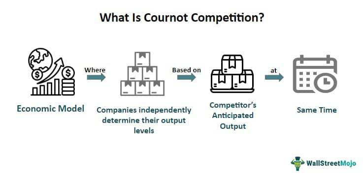

Cournot competition is a fundamental model in economic theory that captures the essence of strategic interaction among firms in an oligopolistic market structure. In an oligopoly, a limited number of firms hold significant market power, and their individual decisions regarding output levels can influence overall market dynamics. The Cournot model, devised by the French economist Augustin Cournot in 1838, stands as one of the pioneering contributions to the study of oligopoly behavior.

The Cournot model postulates a scenario where firms opt to compete by selecting production quantities rather than altering prices. This quantitative approach underscores how firms anticipate the output decisions of their competitors and adjust their own production accordingly to maximize profits. This strategic interplay is driven by the recognition that each firm’s output decision influences the prevailing market price, creating an environment where rival firms’ actions are interdependent.

Cournot’s insights are encapsulated in a model where firms assume homogeneous products and decide on their production levels simultaneously without collaboration. This setup leads to a Nash equilibrium, a state where no firm can unilaterally increase its profit by altering its output, given the production levels of its competitors. The equilibrium conditions are typically expressed mathematically through reaction functions, where each firm’s optimal output decision is a function of its rivals’ outputs.

To illustrate, consider a simple example in a duopoly with firms A and B. Let $q_A$ and $q_B$ represent the outputs of firms A and B, respectively, and let the market price $P$ be derived from the inverse demand function $P(Q) = a - bQ$, where $Q = q_A + q_B$ is the total market output, and $a$ and $b$ are constants. The profit $\pi_i$ for firm $i$ can be expressed as:

$$
\pi_i = P(Q) \cdot q_i - C_i(q_i)
$$

where $C_i(q_i)$ denotes the cost function of firm $i$. Each firm decides $q_i$ to maximize $\pi_i$, considering the output of the competing firm. The conditions for maximizing profit lead to each firm solving its reaction function, resulting in quantities $q_A^*$ and $q_B^*$ that compose the Cournot equilibrium.

Cournot’s model not only provided a foundational framework for analyzing oligopolistic competition but also paved the way for subsequent theories that explore different aspects of market structures, such as Bertrand competition where firms compete on prices. Its historical and academic significance persists, as it illustrates the intricacies of competitive strategies in markets where few firms exert substantial control.

## Table of Contents

## Understanding Cournot Competition

Cournot competition is a fundamental economic model used to understand how firms behave in an oligopolistic market. Unlike other models, firms in Cournot competition decide on the quantity of output to produce, rather than setting prices directly. This approach assumes that firms are producing homogeneous products, which means that the products are seen as perfect substitutes by consumers. 

A key characteristic of the Cournot model is that firms make their decisions simultaneously and independently, with no collusion or agreements. This assumption reflects a scenario where firms do not have prior knowledge of their competitors’ production levels before setting their own output. This simultaneous decision-making aspect is crucial as it leads to a strategic interdependence among the firms.

In Cournot competition, the market price is not under the direct control of any single firm but rather is determined by the total output produced by all competing firms. The price $P$ in the market is typically a decreasing function of the total quantity $Q$ supplied, which can be represented as $P(Q) = a - bQ$, where $a$ and $b$ are constants. Each firm’s output decision affects the market price, and therefore, firms must account for the likely output choices of their competitors when deciding how much to produce. 

This mutual dependency results in what is known as a Nash Equilibrium, a condition where each firm selects its optimal output level, given the output levels of its competitors, and no firm can increase its profit by unilaterally changing its output. In mathematical terms, if there are $n$ firms in the market, and $Q_i$ denotes the quantity produced by firm $i$, then the Nash equilibrium occurs when:

$$
\text{Maximize } \Pi_i = P(Q) \cdot Q_i - C_i(Q_i)
$$

$$
\text{s.t. } Q = \sum_{j=1}^{n} Q_j
$$

where $\Pi_i$ represents the profit of firm $i$ and $C_i(Q_i)$ is the cost function of producing $Q_i$. Each firm optimizes its profit by calculating the derivative of its profit function with respect to its output and setting it to zero, considering the output of other firms as given. 

Thus, Cournot competition provides a structured way to analyze and predict how firms with market power behave when they have to make strategic decisions about output quantities in the presence of competitors.

## Historical Context and Development

Augustin Cournot, a pioneering French economist, introduced the concept of Cournot competition in 1838, establishing a foundational framework for understanding oligopoly markets. His primary focus was the analysis of a duopoly—a market dominated by two firms—specifically involving spring water sources. This analysis emphasized how firms determine production quantities rather than prices to maximize profits, a significant departure from previous models that mainly concentrated on price competition.

Cournot's innovative approach stemmed from his observations of two firms exploiting identical natural resources, recognizing the interdependence in their output decisions. He argued that each firm's output decision directly influences the market price, leading to strategic interactions wherein each firm must consider the potential reaction of its competitor when choosing its production level. This insight was a significant leap forward in economic thought, moving away from the assumption of perfect competition where each firm is a price taker.

The model Cournot proposed was one of the first to incorporate the idea of a Nash equilibrium, where each firm's strategy is optimal, given the strategy of the other firm. In the Cournot equilibrium, neither firm has an incentive to unilaterally change its output, as doing so would not lead to higher profits. This concept laid the groundwork for later developments in game theory, providing a robust framework for analyzing strategic interactions among firms in oligopolistic markets.

Cournot's model fundamentally shifted the focus of economic theory from purely competitive markets to more realistic market structures where a small number of firms exert significant influence. His work has since inspired successive generations of economists, leading to the development of more advanced oligopoly models and the broad field of industrial organization. It represents a crucial step in understanding complex market dynamics and the strategic behavior of firms, making it indispensable in contemporary economic analysis.

## Advantages of the Cournot Model

The Cournot model offers several key advantages that make it a foundational concept in economic theory, particularly in the study of oligopolies. One of its primary benefits is that it provides a stable Nash equilibrium. In this context, a Nash equilibrium is a situation where no firm can gain additional profit by unilaterally changing its output levels, assuming the other firms' outputs remain constant. This equilibrium concept allows economists and strategists to predict the output and pricing behaviours of firms within an oligopoly.

The Cournot model's ability to highlight strategic interactions between firms in a straightforward yet insightful manner is another significant advantage. Since firms decide on quantities rather than prices, each firm's output decision directly impacts the market price. This creates a strategic interdependence, where firms must consider their rivals’ production choices to optimize their outcomes. The simplicity of the model in capturing these strategic dynamics is one of its strengths, making it a critical tool for analyzing markets where few firms dominate.

Mathematically, the equilibrium can be represented by a set of simultaneous equations, where each firm's output is a best response to the outputs of the other firms. In a duopoly, for example, if firm 1 produces $q_1$ and firm 2 produces $q_2$, the Cournot equilibrium can be derived from the conditions:

$$
\frac{\partial \Pi_1}{\partial q_1} = 0 \quad \text{and} \quad \frac{\partial \Pi_2}{\partial q_2} = 0
$$

Here, $\Pi_1$ and $\Pi_2$ represent the profit functions of firm 1 and firm 2, respectively. Solving these equations provides the equilibrium outputs $q_1^*$ and $q_2^*$, highlighting the strategic considerations each firm must engage in.

The abstraction of the Cournot model also makes it flexible enough to be applied across various industries, offering valuable insights into competitive behaviour without the necessity of complex computations. As a theoretical construct, it serves as a benchmark against which more complex real-world scenarios can be compared and understood.

## Limitations of Cournot Competition

The Cournot model, while foundational in the study of oligopoly, carries several limitations rooted in its simplifying assumptions. One significant assumption is product homogeneity, which implies that competing firms offer identical goods, and consumer choice is driven solely by quantity. In many real-world scenarios, firms differentiate their products to gain competitive edges, which can lead to a market environment better explained by models accommodating product differentiation.

Another fundamental assumption is simultaneous decision-making. The model posits that all firms choose output quantities at the same time, contemplating the choices of their competitors. This assumption does not always align well with how firms operate in practice. Often, firms observe competitors over time and adjust their strategies accordingly, a dynamic interaction absent in Cournot's simultaneous approach.

Moreover, the Cournot model emphasizes competition based on quantities rather than prices. While this framework is applicable to industries where capacity constraints or production levels are critical, such as natural resources or manufacturing sectors, it may not fully capture the competitive strategies in markets where price is the main competitive [factor](/wiki/factor-investing). The Bertrand model, for instance, suggests that firms set prices instead of quantities, which can lead to different market outcomes, particularly when goods are nearly identical. In such scenarios, firms might engage in price wars, driving prices down to marginal costs—a situation not typically predicted by Cournot's theory.

These limitations point to the necessity of considering alternative models or adaptations of the Cournot framework when evaluating market dynamics, especially in sectors where the assumptions of product homogeneity and simultaneous decision-making are not representative of actual competitive behavior.

## Cournot Competition and Algorithmic Trading

Algorithmic trading has transformed the landscape of financial markets by leveraging computer algorithms to execute trades at speeds and volumes unattainable by human traders. By integrating technological efficiency with economic theory, [algorithmic trading](/wiki/algorithmic-trading) creates a new arena for competitive dynamics, drawing parallels to classical models of competition such as the Cournot model.

In the context of Cournot competition, firms determine their production outputs to maximize profits based on their competitors' actions. This paradigm can be adapted to algorithmic trading markets, where market participants, typically institutional traders or hedge funds, set their trade volumes instead of prices. Here, the focus is not just on setting optimal quantities but on doing so with remarkable speed and precision, thanks to algorithmic capabilities.

The interaction in algorithmic trading closely mirrors the strategic behavior observed in Cournot competition. Each trading algorithm is designed to maximize its performance based on the trading volumes set by competing algorithms. Just as in Cournot's framework, where each firm's output influences the market price, in algorithmic trading, the [volume](/wiki/volume-trading-strategy) of trades influences market [liquidity](/wiki/liquidity-risk-premium) and price dynamics.

Consider the scenario in which multiple algorithmic traders are operating in a financial market with a limited number of assets. Each trader seeks to optimize its strategy by predicting the actions of competitors. A simplified representation of this interaction can be described using the concept of Nash equilibrium from game theory. At Nash equilibrium, no trader can improve its profit by unilaterally changing its trading volume, similar to the firms in a Cournot model.

From a mathematical standpoint, if we denote the trading volume of firm $i$ by $q_i$ and assume the market price $P$ as a function of total trade volume $Q = \sum_{j} q_j$, then:

$$
P = f(Q)
$$

Each trading algorithm aims to choose $q_i$ to maximize its profit:

$$
\pi_i = q_i \cdot (P - C) - F
$$

where $C$ is the marginal cost of trading, and $F$ represents any fixed costs associated with trading operations. This objective function captures the essence of strategic decision-making where the actions of other market participants influence individual outcomes, akin to Cournot competition.

Thus, algorithmic trading embodies the principles of Cournot competition with additional complexity brought about by rapid technological changes and the real-time nature of trading. Understanding these dynamics through the lens of Cournot competition provides valuable insights into the strategies employed by modern financial market players, contributing to a deeper comprehension of market behavior.

## Conclusion

The Cournot model has established itself as a fundamental framework in the study of oligopolistic markets, successfully elucidating how firms behave strategically. This economic model, developed in the 19th century, remains highly pertinent in today's diverse market environments, especially as industries witness rapid technological advancements.

The Cournot model's key contribution lies in its ability to predict equilibrium in markets where firms simultaneously decide on output levels, leading to a stable Nash equilibrium. This characteristic helps economists and businesses understand how firms can maintain stable strategies without succumbing to competitive pressures to alter their outputs unilaterally. The model also emphasizes the idea that firms' output decisions are interdependent, which is critical in assessing strategic firm behavior over time.

In modern contexts, the Cournot model finds new applications, such as in algorithmic trading. The principles of Cournot competition provide valuable insights into how firms set trading volumes in algorithmic markets, where decisions are executed at rapid speeds and require strategic foresight. The ability of algorithmic trading systems to quickly react and adjust trading volumes aligns with the Cournot perspective of strategic interaction through output decisions. Therefore, the Cournot model not only aids in understanding traditional industries but also adapts to contemporary platforms where speed and strategy intersect.

Overall, the lasting relevance of the Cournot model is underscored by its adaptability to modern contexts and its foundational role in explaining the dynamics of strategic decision-making within oligopolies. As markets continue to evolve and integrate more complex technological elements, the model offers invaluable tools for analyzing competitive dynamics and understanding the sustained interactions between firms.

## FAQs

### What distinguishes Cournot competition from other oligopoly models?  
Cournot competition, distinguished by its focus on firms competing in quantities, contrasts with other oligopoly models primarily through its foundational assumptions and market dynamics. In Cournot competition, firms simultaneously decide on the quantity of goods to produce, assuming that their rivals' outputs remain constant. This leads to a Nash equilibrium where each firm's output decision is optimal, given the output of its competitors.

Conversely, the Bertrand model is another well-known oligopoly model where firms compete on price rather than quantity. In the Bertrand framework, firms assume that rival prices remain unchanged, leading to a different competitive dynamic. While Cournot competition assumes homogeneous products, the Bertrand model demonstrates intense price competition, often resulting in prices dropping to marginal cost levels.

### How does algorithmic trading impact traditional economic models like Cournot's?  
Algorithmic trading has significantly transformed the landscape of traditional economic models, including Cournot's. In algorithmic trading, firms utilize computer algorithms to make rapid and strategic trading decisions, often by setting trading volumes. This can be likened to the Cournot model, where decisions regarding the quantity of output are crucial. However, the rapid decision-making capabilities of algorithms introduce complexities not captured by traditional models.

The high-frequency nature of algorithmic trading allows firms to adjust outputs, or in this context, trading volumes, at speeds unattainable in conventional markets. This dynamic challenges the assumption of simultaneous and static decision-making inherent in the Cournot model, leading to potential revisions in understanding equilibrium in such markets. Algorithmic trading also tends to intensify competitive dynamics as firms adapt to minute changes in market conditions much faster than traditional firms could.

### What are the real-world examples of industries where Cournot competition is applicable?  
Cournot competition is particularly applicable to industries characterized by a small number of firms offering homogeneous or nearly identical products. One notable example is the telecommunications industry, where companies operate under shared regulations and provide similar services. Here, firms strategically decide on the capacity of services provided rather than competing directly on prices.

Another industry where Cournot competition is relevant is the fertilizer market. In this sector, a limited number of firms control a significant share of production, and their output decisions significantly influence market prices. The oil and gas industry similarly reflects Cournot dynamics, where a few major players dominate the market and strategically manage output to balance supply and price.

These examples illustrate that while the Cournot model simplifies some aspects of market competition, it captures critical strategic interactions that occur in oligopolistic markets, highlighting its ongoing relevance despite its limitations.

## References & Further Reading

[1]: Cournot, A. (1838). *Researches into the Mathematical Principles of the Theory of Wealth*. (Translated by Nathaniel Bacon). Augustus M. Kelley Publishers.

[2]: Friedman, J. W. (1983). *Oligopoly Theory*. Cambridge University Press.

[3]: Tirole, J. (1988). *The Theory of Industrial Organization*. MIT Press.

[4]: Vives, X. (1999). *Oligopoly Pricing: Old Ideas and New Tools*. MIT Press.

[5]: Varian, H. R. (1992). *Microeconomic Analysis* (3rd Edition). W.W. Norton & Company.

[6]: Stoll, H. R. (2006). "Electronic Trading in Stock Markets." *The Journal of Economic Perspectives*, 20(1), 153-174.

[7]: Foucault, T., Pagano, M., & Röell, A. (2005). *Market Liquidity: Theory, Evidence, and Policy*. Oxford University Press.

[8]: Jarrow, R. A., & Protter, P. (2016). *Quantitative Finance and Risk Management: A Physicist's Approach*. Springer.

[9]: Easley, D., & O'Hara, M. (1992). "Time and the Process of Security Price Adjustment." *The Journal of Finance*, 47(2), 577-605.

[10]: Dixit, A. K., & Nalebuff, B. J. (1991). *Thinking Strategically: The Competitive Edge in Business, Politics, and Everyday Life*. W.W. Norton & Company.