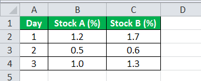

## Table of Contents

## What is covariance and why is it important in statistics?

Covariance is a measure that tells us how two variables change together. If one variable tends to increase when the other increases, they have a positive covariance. If one tends to decrease when the other increases, they have a negative covariance. Imagine you are looking at the relationship between the amount of ice cream sold and the temperature outside. If both go up together, they have a positive covariance.

Covariance is important in statistics because it helps us understand the relationship between different variables. By knowing if variables move together, we can make better predictions and decisions. For example, if we know that ice cream sales go up when the temperature rises, we can plan to have more ice cream available on hot days. This understanding can be used in many fields, like finance, where knowing how stock prices move together can help in making investment choices.

## How is covariance calculated between two variables?

To calculate the covariance between two variables, let's call them X and Y, you start by finding the mean (average) of X and the mean of Y. Then, for each pair of data points, you subtract the mean of X from each X value and the mean of Y from each Y value. After that, you multiply these differences together for each pair. Finally, you add up all these products and divide by the number of data points minus one. This gives you the covariance.

Covariance can be positive, negative, or zero. A positive covariance means that when X goes up, Y tends to go up too. A negative covariance means that when X goes up, Y tends to go down. If the covariance is zero, it means there is no linear relationship between X and Y. The formula for covariance might look complicated, but it's really just a way to see how two variables move together.

## What does a positive covariance indicate about the relationship between two variables?

A positive covariance between two variables means that as one variable goes up, the other variable tends to go up too. Imagine you are looking at the number of hours people study and their test scores. If people who study more hours tend to get higher test scores, the covariance between study hours and test scores would be positive.

This kind of relationship can be very useful. For example, if a business owner sees a positive covariance between the amount of advertising they do and their sales, they might decide to increase their advertising budget. Understanding that two things tend to increase together can help people make better decisions in many areas of life, like health, education, and business.

## What does a negative covariance indicate about the relationship between two variables?

A negative covariance between two variables means that as one variable goes up, the other variable tends to go down. Think about the relationship between the amount of sleep you get and how tired you feel. If you sleep less, you might feel more tired, so the covariance between sleep and tiredness would be negative.

This type of relationship can be important to know. For example, if a farmer sees a negative covariance between the amount of rain and their crop yield, they might need to plan for ways to protect their crops during rainy periods. Understanding that one thing goes up while another goes down can help people make better choices in many areas, like health, business, and everyday life.

## Can you explain the difference between covariance and correlation?

Covariance and correlation both help us understand how two variables change together, but they do it in different ways. Covariance tells us the direction of the relationship between two variables - if it's positive, the variables tend to go up or down together; if it's negative, one goes up when the other goes down. However, the size of the covariance number doesn't tell us much about how strong the relationship is because it depends on the scale of the variables. For example, if you're looking at the relationship between temperature and ice cream sales, the covariance might be a big number, but that doesn't mean the relationship is stronger than between other variables with smaller numbers.

Correlation, on the other hand, is a standardized version of covariance. It takes the covariance and divides it by the product of the standard deviations of the two variables. This makes the correlation a number between -1 and 1, where 1 means a perfect positive relationship, -1 means a perfect negative relationship, and 0 means no relationship. Because correlation is standardized, it's easier to compare the strength of relationships between different pairs of variables. For example, you can directly compare the correlation between temperature and ice cream sales to the correlation between hours of study and test scores, even if the scales of these variables are very different.

## How does the scale of variables affect the covariance?

The scale of variables can make the covariance number bigger or smaller, even if the relationship between the variables stays the same. Imagine you have two variables: the number of hours people study and their test scores. If you measure study time in minutes instead of hours, the numbers will be bigger, and this can make the covariance bigger too. But this doesn't mean the relationship between studying and test scores is stronger; it's just that the numbers are on a different scale.

Because covariance depends on the scale of the variables, it's hard to compare the covariance between different pairs of variables directly. For example, if you look at the covariance between temperature in Celsius and ice cream sales, and then at the covariance between temperature in Fahrenheit and ice cream sales, the numbers might be different just because of the different temperature scales. This is why we use correlation instead of covariance when we want to understand and compare how strong the relationships are between different pairs of variables.

## What are the limitations of using covariance as a measure of relationship?

One big problem with using covariance to measure the relationship between two things is that it depends on the size of the numbers you're looking at. If you change the scale of one of the variables, like measuring temperature in Fahrenheit instead of Celsius, the covariance number can change a lot. This makes it hard to compare the relationship between different pairs of things because the numbers can be bigger or smaller just because of how you measured them.

Another issue is that covariance doesn't tell you how strong the relationship is. It only tells you if the relationship is positive or negative. So, if you find a high covariance number, it doesn't mean the relationship is strong; it could just mean the numbers are big. This can be confusing because you might think a big number means a strong relationship, but that's not always true. That's why people often use correlation instead, which fixes these problems by standardizing the numbers.

## How can covariance be used in portfolio theory in finance?

In finance, covariance is really helpful when people are deciding which stocks to put in their investment portfolio. Imagine you're trying to pick different stocks to invest your money in. You want to know if the prices of these stocks go up and down together. If two stocks have a positive covariance, it means when one stock's price goes up, the other stock's price tends to go up too. But if you want to lower the risk in your portfolio, you might choose stocks that have a negative covariance, because when one stock's price goes down, the other might go up, which can help balance things out.

This idea of using covariance helps investors make their portfolios less risky. By choosing stocks that don't move in the same direction, investors can spread out their risk. For example, if you have one stock in your portfolio that's from the technology industry and another from the healthcare industry, and these industries don't move together, your portfolio might be safer. Covariance gives investors a way to see how different investments relate to each other, so they can make smarter choices about what to include in their portfolio.

## What is the role of covariance in multivariate analysis?

Covariance plays a big role in multivariate analysis, which is a way of looking at many variables at the same time. When you're studying several things together, covariance helps you understand how each pair of variables changes together. For example, if you're looking at people's height, weight, and age, covariance can tell you if taller people tend to be heavier, or if older people tend to be heavier. By knowing these relationships, you can see patterns and connections that you might miss if you just looked at one thing at a time.

In multivariate analysis, covariance is often used to create a covariance matrix, which is a table that shows the covariance between every pair of variables you're studying. This matrix is really useful because it gives you a complete picture of how all the variables relate to each other. Scientists and researchers use this information to make better models and predictions. For instance, in social sciences, understanding the covariance between different survey questions can help researchers see which questions are related and how they might influence each other.

## How does one interpret a covariance matrix?

A covariance matrix is like a big table that shows how different things change together. Each number in the table tells you about the relationship between two things. If the number is positive, it means when one thing goes up, the other thing tends to go up too. If the number is negative, it means when one thing goes up, the other thing tends to go down. And if the number is close to zero, it means there's not much of a relationship between the two things.

Looking at a covariance matrix can help you see patterns and connections between many things at once. For example, if you're studying different health measures like blood pressure, cholesterol, and weight, the covariance matrix can show you if people with higher blood pressure tend to have higher cholesterol or if weight is related to both. By understanding these relationships, you can make better guesses about how changes in one thing might affect others.

## Can you provide an example of calculating covariance in a real-world dataset?

Let's say we want to find out if there's a relationship between the amount of rain and the number of umbrellas sold in a city over a year. We have data for each month showing the rainfall in inches and the number of umbrellas sold. First, we need to find the average rainfall and the average number of umbrellas sold over the year. Let's say the average rainfall is 3 inches per month and the average number of umbrellas sold is 500 per month.

Now, we go through each month, subtract the average rainfall from the actual rainfall, and do the same for the number of umbrellas sold. For example, if in January it rained 4 inches and 600 umbrellas were sold, we subtract 3 from 4 to get 1 for rainfall, and subtract 500 from 600 to get 100 for umbrellas. We multiply these differences together to get 100 (1 times 100). We do this for every month, add up all the products, and then divide by the number of months minus one (11 for a year's data). If the final number is positive, it means that when it rains more, more umbrellas are sold. If it's negative, it means when it rains more, fewer umbrellas are sold. This number is the covariance, and it helps us see how rainfall and umbrella sales move together.

## How can advanced statistical software be used to compute and analyze covariance in large datasets?

Advanced statistical software like R, Python, and SPSS can make it much easier to work with big datasets when you want to find out how different things are related through covariance. These programs have special functions that can quickly calculate the covariance between lots of variables all at once. For example, in R, you can use the `cov()` function to make a covariance matrix from your data. In Python, you can use libraries like NumPy or Pandas to do the same thing. These tools save a lot of time and reduce the chance of making mistakes that can happen when you do the math by hand.

Once you have the covariance matrix, the software can help you look at it in different ways to understand the relationships better. You can make graphs and charts to see patterns more clearly, or use other statistical methods to see if the relationships are strong enough to matter. For instance, you might use principal component analysis to find the main ways that your variables change together. These advanced tools help you not just calculate covariance, but also dive deeper into what the numbers mean, making it easier to make good decisions based on your data.

## What is the role of covariance in data analysis and how can it be understood?

Covariance is a statistical measure that quantifies the degree to which two variables change together. It is mathematically defined as the expected value of the product of the deviations of two variables from their respective means. Formally, for two random variables $X$ and $Y$, the covariance is given by:

$$
\text{Cov}(X, Y) = E[(X - \mu_X)(Y - \mu_Y)]
$$

where $E$ denotes the expected value, and $\mu_X$ and $\mu_Y$ are the means of $X$ and $Y$ respectively. This formulation captures how changes in one variable are associated with changes in another, reflecting their directional relationship.

In the context of financial markets, covariance is used to measure the directional relationship between the returns on two assets. Specifically, it helps determine whether asset returns move in tandem (positive covariance), inversely (negative covariance), or have no systematic relationship (zero covariance). A positive covariance indicates that higher-than-average returns on one asset are associated with higher-than-average returns on the other. Conversely, a negative covariance suggests that higher-than-average returns on one asset are associated with lower-than-average returns on the other. A covariance near zero indicates no discernible pattern of movement between the assets' returns.

The significance of covariance in financial data analysis cannot be overstated. It is a fundamental component in calculating portfolio variance and is crucial for portfolio diversification strategies. By understanding the relationships between asset returns, traders and analysts can devise strategies that mitigate risk through diversification, thus optimizing the risk-return profile of a portfolio. Covariance serves as a foundational measure in Modern Portfolio Theory, where it helps investors construct portfolios to achieve desired levels of risk and return.

In summary, covariance provides valuable insights into the interdependencies between financial asset returns, informing traders' decisions and enabling sophisticated portfolio management strategies.

## What is the difference between Covariance and Correlation?

Covariance and correlation are fundamental statistical measures used to understand relationships between variables, particularly in the context of financial data analysis. While they both provide insights into the relationships between different asset returns, they serve different purposes and have distinct characteristics. Understanding the differences between these two concepts is essential for traders and analysts when selecting the appropriate tool for their analyses.

**Key Differences between Covariance and Correlation**

**Mathematical Definition**

Covariance quantifies the degree to which two variables change together. Mathematically, the covariance between two variables $X$ and $Y$ is calculated as:

$$
\text{Cov}(X, Y) = \frac{1}{n} \sum_{i=1}^{n} (X_i - \bar{X})(Y_i - \bar{Y})
$$

where $n$ is the number of data points, $X_i$ and $Y_i$ are the individual data points, and $\bar{X}$ and $\bar{Y}$ are the means of $X$ and $Y$, respectively.

Correlation, on the other hand, standardizes the covariance by the product of the standard deviations of the variables, thereby providing a dimensionless measure. The Pearson correlation coefficient $\rho$ is given by:

$$
\rho_{X,Y} = \frac{\text{Cov}(X, Y)}{\sigma_X \sigma_Y}
$$

where $\sigma_X$ and $\sigma_Y$ are the standard deviations of $X$ and $Y$.

**Interpretation and Scale**

Covariance can take any value between negative infinity and positive infinity, with a positive covariance indicating that the two variables tend to move in the same direction, and a negative covariance indicating a tendency to move in opposite directions. A covariance of zero implies no linear relationship.

Correlation, bounded between -1 and 1, indicates not just the direction but also the strength of the linear relationship. A correlation of 1 denotes a perfect positive linear relationship, -1 denotes a perfect negative relationship, and 0 indicates no linear correlation.

**Appropriate Contexts for Use**

Covariance is particularly useful when the interests focus on the directional relationship without the need for standardization. It is often used in portfolio theory where the interplay of asset returns is assessed to understand variance and risk.

Correlation is preferred when it is necessary to gauge both the strength and the direction of a linear relationship while needing to control for units of measurement. It provides clearer, standardized information about the linear relationship, making it appropriate for tasks like selecting assets with strong relationships for pairs trading.

**Limitations and Advantages in Trading Contexts**

Covariance is sensitive to the scale of the variables because it is not standardized. This can make interpretation challenging unless the variables are of similar magnitude. However, its sensitivity is advantageous in variance and risk analysis within portfolios, providing detailed information on asset interaction.

Correlation's main advantage lies in comparability across different data sets due to its standardized nature. This makes it particularly useful for identifying relationships irrespective of the variable's scale. However, correlation only measures linear relationships, and it can be misleading if nonlinear relationships exist.

In trading, neither covariance nor correlation should be used in isolation. They provide part of the picture and are often used complementarily with other statistical tools like regression analysis to formulate comprehensive trading strategies.

In conclusion, understanding the differences and appropriate applications of covariance and correlation enables traders and analysts to select the right tool for their specific needs, facilitating more informed and effective data-driven trading decisions.

## What are the Mathematical Applications in Algorithmic Trading?

Covariance plays a critical role in [algorithmic trading](/wiki/algorithmic-trading) strategies by aiding in the assessment of risk and return relationships between different assets. Its integration into modern portfolio theory (MPT) is a cornerstone for understanding the dynamics of diversified investments. MPT, developed by Harry Markowitz, uses covariance to optimize the asset mix in a portfolio to achieve the highest expected return for a given level of risk or, conversely, the lowest risk for a given level of expected return. Covariance is essential in constructing the efficient frontier, which represents an optimal balance between risk and return in a portfolio.

In risk management, covariance assists traders in understanding how the returns of two assets move relative to each other. If two assets have a high positive covariance, their returns tend to move in the same direction, exposing investors to compounded risks during downturns. Conversely, assets with a negative covariance can mitigate overall portfolio risk, as losses in one may be offset by gains in another. Thus, covariance can be instrumental in constructing hedge strategies, reducing the overall [volatility](/wiki/volatility-trading-strategies) of a trading portfolio.

A practical application of covariance in trading strategies is evident in [pair trading](/wiki/pair-trading). This strategy involves choosing two assets with historically correlated returns. A trader takes a long position in the underperforming asset and a short position in the outperforming asset, anticipating that the 'pair' will converge back to their historical correlation. Essentially, pair trading exploits the positive covariance between two assets with the expectation of mean reversion.

Portfolio diversification is another key area where covariance is applied. The goal of diversification is to spread risk across various assets to minimize the impact of a single asset's volatility on the portfolio. By investing in assets with low or negative covariance, traders can significantly reduce unsystematic risk. The overall portfolio risk is thus reduced without sacrificing potential returns.

The mathematical representation of covariance for two variables, $X$ and $Y$, is expressed as:

$$
\text{Cov}(X, Y) = \frac{\sum{(x_i - \bar{x})(y_i - \bar{y})}}{n-1}
$$

where $x_i$ and $y_i$ are individual sample points, $\bar{x}$ and $\bar{y}$ are the sample means, and $n$ is the number of data points. In algorithmic trading, calculating this covariance using large datasets can be efficiently managed through programming languages like Python.

Below is a Python code snippet demonstrating how to calculate covariance using the `numpy` library:

```python
import numpy as np

# Sample return data for two assets, X and Y
returns_X = [0.02, 0.03, 0.015, 0.04, 0.025]
returns_Y = [0.01, 0.03, 0.02, 0.035, 0.03]

# Calculate covariance matrix
cov_matrix = np.cov(returns_X, returns_Y)

# Extract covariance between X and Y
cov_XY = cov_matrix[0, 1]
print("Covariance between X and Y:", cov_XY)
```

This code calculates the covariance between two sets of asset returns, offering insights into how their returns are related. Such calculations, when extended to multiple assets and historical data, allow traders to craft strategies that reflect careful consideration of covariance, optimizing both the risk and reward profile of trading strategies.

## References & Further Reading

[1]: Markowitz, H. (1952). ["Portfolio Selection"](https://onlinelibrary.wiley.com/doi/abs/10.1111/j.1540-6261.1952.tb01525.x). The Journal of Finance, 7(1), 77-91.

[2]: Bodie, Z., Kane, A., & Marcus, A. J. (2014). ["Investments"](https://www.mheducation.com/highered/product/Investments-Bodie.html) (10th ed.). McGraw-Hill Education.

[3]: Chan, E. (2008). ["Quantitative Trading: How to Build Your Own Algorithmic Trading Business"](https://github.com/ftvision/quant_trading_echan_book). Wiley.

[4]: Meucci, A. (2005). ["Risk and Asset Allocation"](https://link.springer.com/book/10.1007/978-3-540-27904-4). Springer.

[5]: Lopez de Prado, M. (2018). ["Advances in Financial Machine Learning"](https://www.amazon.com/Advances-Financial-Machine-Learning-Marcos/dp/1119482089). Wiley.

[6]: Fabozzi, F. J., Gupta, F., & Markowitz, H. M. (2002). ["The Legacy of Modern Portfolio Theory"](https://www.semanticscholar.org/paper/The-Legacy-of-Modern-Portfolio-Theory-Fabozzi-Gupta/6619eebc6957d7c101112a041942c4df61783616). The Journal of Investing, 11(3), 7-22.

[7]: Capinski, M., & Zastawniak, T. (2011). ["Mathematics for Finance: An Introduction to Financial Engineering"](https://link.springer.com/book/10.1007/b97511). Springer.

[8]: Harris, R. (2003). ["Trading & Exchanges: Market Microstructure for Practitioners"](https://academic.oup.com/book/52292). Oxford University Press.