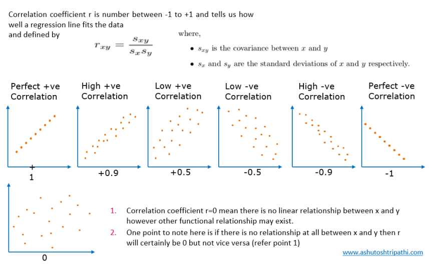

## Table of Contents

## What is covariance and how is it calculated?

Covariance is a measure that shows how two variables change together. If one variable tends to increase when the other increases, they have a positive covariance. If one tends to increase when the other decreases, they have a negative covariance. It helps us understand the relationship between two variables, like the relationship between temperature and ice cream sales.

To calculate covariance, you start by finding the mean (average) of each variable. Then, for each pair of data points, you subtract the mean of the first variable from the first data point and the mean of the second variable from the second data point. You multiply these differences together. After doing this for all pairs, you add up all the products and divide by the number of data points minus one. This gives you the covariance between the two variables.

## What does a positive or negative covariance indicate?

A positive covariance means that when one variable goes up, the other variable tends to go up too. Imagine you're looking at the amount of sunshine and the number of people at the beach. If more sunshine usually means more people at the beach, that's a positive covariance. It shows that the two things are moving in the same direction together.

A negative covariance, on the other hand, means that when one variable goes up, the other tends to go down. Think about the temperature outside and the amount of heating you use in your home. If it's colder outside, you'll probably use more heating, so temperature and heating use have a negative covariance. This shows that the two things are moving in opposite directions.

## How does correlation differ from covariance?

Correlation and covariance both help us understand how two variables relate to each other, but they do it in slightly different ways. Covariance tells us whether two variables tend to move together or in opposite directions, but it doesn't tell us how strong that relationship is. It's like saying, "When one thing goes up, the other tends to go up too," but it doesn't tell you how much they go up together.

Correlation, on the other hand, not only shows the direction of the relationship between two variables but also measures the strength of that relationship. It's a standardized version of covariance, which means it's easier to understand and compare across different sets of data. Correlation values range from -1 to 1, where 1 means a perfect positive relationship, -1 means a perfect negative relationship, and 0 means no relationship at all. So, if you want to know not just if two things move together but also how closely they move together, you'd use correlation.

## What is the formula for calculating the correlation coefficient?

The formula for calculating the correlation coefficient, often called Pearson's correlation coefficient, is a bit more complicated than covariance. You start by finding the covariance between the two variables, which we talked about before. Then, you divide that covariance by the product of the standard deviations of both variables. The standard deviation is a measure of how spread out the numbers in a set are. So, the formula looks like this: correlation = covariance / (standard deviation of X * standard deviation of Y).

In simpler terms, the correlation coefficient tells us how closely two things move together, scaled down to a number between -1 and 1. A value of 1 means the two variables move perfectly together in the same direction, -1 means they move perfectly together but in opposite directions, and 0 means there's no relationship at all. This makes it easy to see not just if things are related, but how strong that relationship is.

## What does a correlation coefficient of +1, -1, and 0 signify?

A correlation coefficient of +1 means that the two variables have a perfect positive relationship. This means that when one variable goes up, the other variable goes up too, every single time, and they do it in a perfect, predictable way. For example, if you're measuring the height of a growing child and the size of their shoes, you might see a correlation close to +1 because as the child gets taller, their shoe size also increases in a consistent way.

A correlation coefficient of -1 means there's a perfect negative relationship between the two variables. This means that when one variable goes up, the other variable goes down every single time, and they do it in a perfect, predictable way. Imagine measuring the temperature outside and the amount of heating you use in your home. If it's colder outside, you'll use more heating, so these two things would have a correlation close to -1.

A correlation coefficient of 0 means there is no relationship at all between the two variables. This means that knowing the value of one variable tells you nothing about the value of the other variable. For instance, if you're looking at the number of hours you sleep and the color of your shirt, these things likely have no connection, so their correlation would be close to 0.

## How can covariance and correlation be used in data analysis?

Covariance and correlation help us understand how two things are related to each other in data analysis. Covariance tells us if two things tend to go up or down together. For example, if we're looking at the amount of rain and the number of umbrellas sold, a positive covariance means more rain usually leads to more umbrellas being sold. This information can help businesses plan for how much stock they need or how to predict sales based on weather forecasts.

Correlation goes a step further by not only showing if things move together but also how strong that relationship is. It's like a score between -1 and 1 that tells us how closely two things are connected. If we find a high positive correlation between the hours students study and their exam scores, it means studying more tends to lead to better scores, and we can use this to advise students on how to prepare for exams. By using both covariance and correlation, analysts can make better predictions and understand the relationships in their data more clearly.

## What are the limitations of using covariance and correlation?

Covariance and correlation have some limits that we need to know about. One big limit is that they only show how two things are related, not why they are related. For example, if we see a high correlation between ice cream sales and sunglasses sales, it doesn't mean buying ice cream makes people buy sunglasses. It could be because both go up in the summer, but the numbers don't tell us that. Also, correlation can be tricked by other things happening at the same time, called confounding variables. If we're looking at how much exercise someone does and their health, but we don't consider their diet, we might get a wrong idea about the real relationship.

Another limit is that correlation doesn't tell us about cause and effect. Just because two things move together doesn't mean one causes the other. For example, if we find a correlation between the number of firefighters at a fire and the damage caused by the fire, it doesn't mean more firefighters cause more damage. It might be that bigger fires need more firefighters. So, we have to be careful not to mix up correlation with causation. Also, correlation can miss out on more complex relationships between more than two things, or patterns that aren't straight lines. So, while covariance and correlation are useful, they're just part of the story in understanding data.

## How does sample size affect the reliability of correlation?

The size of your sample can really change how much you can trust the correlation you find. A bigger sample usually means you can trust your correlation more. This is because with more data points, your correlation is less likely to be just a fluke. Imagine you flip a coin a few times and it comes up heads each time. You might think the coin is biased, but if you flip it a hundred times and it's still mostly heads, you can be more sure about your guess. The same goes for correlation – the more data you have, the more confident you can be that the relationship you see is real.

However, a small sample can lead to big mistakes. If you only have a few data points, a single unusual result can make it look like there's a strong relationship when there really isn't. This is called a sampling error. For example, if you only check the temperature and ice cream sales on a few hot days, you might think they're always perfectly related, but you'd be missing out on what happens on cooler days. So, it's really important to use a big enough sample to make sure your correlation results are reliable.

## What is the difference between Pearson, Spearman, and Kendall correlation coefficients?

The Pearson, Spearman, and Kendall correlation coefficients are three different ways to measure how two things are related. The Pearson correlation coefficient looks at the straight-line relationship between two things. It's the one we usually think of when we talk about correlation. It works best when the data follows a normal distribution and the relationship between the two things is a straight line. If you're looking at how much studying affects test scores, and you expect a straight-line relationship, Pearson is a good choice.

The Spearman and Kendall correlation coefficients are used when you're not sure if the relationship between two things is a straight line, or if your data isn't normally distributed. The Spearman correlation looks at the order of the data points rather than their exact values. It's like ranking the data from lowest to highest and then seeing if the ranks of one thing go up when the ranks of the other thing go up. It's good for data that might have a curve or some other non-straight-line relationship. The Kendall correlation also looks at the order of the data but focuses on how often the pairs of data points keep the same order. It's useful for smaller datasets and can tell you if there's a trend, even if it's not a perfect straight line. Both Spearman and Kendall are great when you want to understand the relationship between two things without assuming it's a straight line.

## How can outliers affect covariance and correlation measures?

Outliers can really mess up covariance and correlation measures. An outlier is a data point that's way different from the others. If you have one, it can pull the whole relationship between two things in a different direction. Imagine you're looking at how much people earn and how much they spend on food. If most people earn and spend similar amounts, but one person earns a lot and spends very little, that one person can make it look like there's no relationship between [earning](/wiki/earning-announcement) and spending, even if there really is one for most people.

Because of this, it's important to check for outliers before you trust your covariance and correlation results. If you find an outlier, you might need to decide if it's a mistake or if it's a real but unusual case. Sometimes, you might choose to leave it out of your calculations to get a better picture of the relationship for most of your data. But remember, just because a data point is different doesn't mean it's wrong. It might be telling you something important about your data that you need to understand.

## What advanced statistical techniques can be used to explore relationships beyond simple correlation?

When you want to understand relationships between things more deeply than just using correlation, you can use something called regression analysis. This helps you see how one thing affects another, and it can show you if the relationship is a straight line or something more complicated. There are different types of regression, like linear regression, which is good for straight-line relationships, and polynomial regression, which can handle curves. Regression also lets you look at how several things together affect one thing, which is more than what simple correlation can do. For example, if you want to know how both temperature and humidity affect ice cream sales, regression can help you figure that out.

Another advanced technique is called principal component analysis (PCA). This is useful when you have a lot of different things you're measuring and you want to find out which ones are most important or if some of them are really just measuring the same thing in different ways. PCA helps you boil down your data into the most important parts, making it easier to understand and work with. It's like finding the main themes in a big story. For instance, if you're studying students' performance, you might have data on their grades, attendance, and study time. PCA could help you see that grades and study time are closely related and might be capturing the same idea of 'effort.'

Lastly, there's structural equation modeling (SEM), which is like a super-powered version of regression. It lets you look at how different things relate to each other in a whole system, not just one at a time. SEM can show you direct relationships, like how studying affects grades, and indirect relationships, like how studying might affect grades through better note-taking. It's great for understanding complex relationships where many things are happening at once. For example, if you're studying how diet, exercise, and sleep affect health, SEM can help you see how these things work together to influence overall well-being.

## How can covariance and correlation be applied in portfolio management and risk assessment in finance?

In finance, covariance and correlation are used to help manage portfolios and assess risk. When you're building a portfolio, you want to pick investments that don't all go up and down at the same time. Covariance helps you see if two investments tend to move together or in opposite directions. If two stocks have a high positive covariance, it means they usually go up or down together, which can be risky because if one goes down, the other likely will too. On the other hand, if they have a negative covariance, one might go up when the other goes down, which can help balance your portfolio and reduce risk. By understanding covariance, you can mix and match investments to create a more stable portfolio.

Correlation takes this a step further by showing not just if two investments move together but how strongly they do. In portfolio management, a correlation close to +1 between two assets means they move very closely together, so they might not help diversify your portfolio much. A correlation close to -1 means they move in opposite directions, which can be great for reducing risk. A correlation near 0 means the movements of the two assets are not related, which can also help in creating a balanced portfolio. By using correlation, investors can better understand the relationships between their investments and make smarter choices to manage risk and potentially improve returns.

## What are Mathematical Formulas?

Covariance and correlation are fundamental concepts in [statistics](/wiki/bayesian-statistics) used extensively in [algorithmic trading](/wiki/algorithmic-trading) for assessing the relationships and dependencies between financial variables. Understanding these constructs requires familiarity with their mathematical representations, and each formula's components play a significant role in interpreting their results.

### Covariance

Covariance measures the directional relationship between two variables, $X$ and $Y$. It is calculated using the following formulas:

- **Population Covariance:**
$$
  \text{Cov}(X, Y) = \frac{1}{N} \sum_{i=1}^{N} (X_i - \mu_X)(Y_i - \mu_Y)

$$

- **Sample Covariance:**
$$
  \text{Cov}(X, Y) = \frac{1}{n-1} \sum_{i=1}^{n} (X_i - \bar{X})(Y_i - \bar{Y})

$$

**Components**:

- $N$: Number of elements in the population.
- $n$: Number of elements in the sample.
- $X_i, Y_i$: Individual data points of the variables.
- $\mu_X, \mu_Y$: Population means of $X$ and $Y$.
- $\bar{X}, \bar{Y}$: Sample means of $X$ and $Y$.

Covariance helps indicate whether two variables tend to increase or decrease simultaneously. A positive covariance suggests a positive linear relationship, whereas a negative value indicates an inverse relationship.

### Correlation

Correlation quantifies the strength and the direction of the linear relationship between two variables. It is represented using Pearson's correlation coefficient, which normalizes covariance by the product of the standard deviations of the variables:

- **Population Correlation Coefficient:**
$$
  \rho(X, Y) = \frac{\text{Cov}(X, Y)}{\sigma_X \sigma_Y}

$$

- **Sample Correlation Coefficient:**
$$
  r(X, Y) = \frac{\text{Cov}(X, Y)}{s_X s_Y}

$$

**Components**:

- $\sigma_X, \sigma_Y$: Population standard deviations of $X$ and $Y$.
- $s_X, s_Y$: Sample standard deviations of $X$ and $Y$.

Correlation values range from -1 to 1. A correlation of 1 implies a perfect positive linear relationship, -1 signifies a perfect negative linear relationship, and 0 indicates no linear relationship. Correlation is dimensionless, making it advantageous for comparing the strength of relationships between different datasets without units being a [factor](/wiki/factor-investing).

Understanding these formulas is crucial in algorithmic trading, as they guide risk assessment and diversification strategies by revealing how asset prices move in relation to one another.

## What are the differences between covariance and correlation?

Covariance and correlation are essential statistical tools in algorithmic trading, helping traders understand relationships between financial variables. While they both measure the degree of association between two variables, they differ in key aspects such as range, units of measurement, and scalability, impacting their utility in algorithmic trading strategies.

Covariance is a measure that indicates the extent to which two variables change together. Its mathematical expression is as follows:

For a population:
$$
\text{Cov}(X, Y) = \frac{1}{N} \sum_{i=1}^{N} (X_i - \mu_X)(Y_i - \mu_Y)
$$

For a sample:
$$
\text{Cov}(X, Y) = \frac{1}{n-1} \sum_{i=1}^{n} (X_i - \bar{X})(Y_i - \bar{Y})
$$

Covariance can range from negative to positive infinity, and its value is dependent on the units of the variables involved, making it less interpretable on its own. A positive covariance indicates that the variables tend to move in the same direction, while a negative covariance suggests they move inversely. However, the magnitude is difficult to interpret due to its dependence on the scale of the data.

Correlation, on the other hand, standardizes covariance into a dimensionless measure to assess the linear relationship between two variables, captured by Pearson's correlation coefficient (r):

$$
r = \frac{\text{Cov}(X, Y)}{\sigma_X \sigma_Y}
$$

where $\sigma_X$ and $\sigma_Y$ are the standard deviations of X and Y, respectively. The correlation coefficient ranges between -1 and 1. A value of 1 implies a perfect positive linear relationship, -1 indicates a perfect negative linear relationship, and 0 means no linear relationship. Its scale-free nature allows for comparisons even between datasets with different units.

These differences significantly influence their application in algorithmic trading:

1. **Range**: The bounded nature of correlation makes it easier to interpret and compare across different asset classes, facilitating strategy development that considers diverse financial instruments.

2. **Units of Measurement**: The lack of units in correlation provides a clearer picture of relationships without the distortion caused by differing scales, making it suitable for portfolio construction and risk assessment.

3. **Scalability**: Correlation's intuitive range and lack of units simplify the scalability of strategies across various markets, ensuring consistency in algorithmic trading models.

In conclusion, understanding these differences is crucial for effective application in algorithmic trading. Covariance provides insights into directional movement, while correlation offers a clearer, standardized view of the strength of relationships, both being vital for risk management and strategy formation.

## How do you calculate covariance and correlation?

Calculating covariance and correlation is a systematic process that involves applying specific mathematical formulas to a dataset. We will illustrate this procedure using a hypothetical dataset representing two variables, say `X` and `Y`, which might represent two different stock returns.

### Step-by-Step Calculation Process

1. **Define the Data**: Start with two sets of data points for your variables. For instance:
    - X = [10, 20, 30, 40, 50]
    - Y = [20, 24, 33, 42, 48]

2. **Compute Means**: Calculate the mean (average) of each variable.
$$
   \text{Mean of } X (\bar{X}) = \frac{\sum X_i}{n} = \frac{10+20+30+40+50}{5} = 30

$$
$$
   \text{Mean of } Y (\bar{Y}) = \frac{\sum Y_i}{n} = \frac{20+24+33+42+48}{5} = 33.4

$$

3. **Covariance Calculation**:
   - Apply the covariance formula for a sample:
$$
   \text{Cov}(X, Y) = \frac{\sum (X_i - \bar{X})(Y_i - \bar{Y})}{n-1}

$$

   - Calculate covariance step by step:
$$
   (X_1 - \bar{X})(Y_1 - \bar{Y}) = (10 - 30)(20 - 33.4) = 460

$$

   Repeat for all points and sum the results:
$$
   \text{Cov}(X, Y) = \frac{460 + 261.6 + 11.4 + 3.6 + 145.2}{5-1} = \frac{881.8}{4} = 220.45

$$

4. **Correlation Calculation**:
   - Use the standard deviation of each dataset. First, compute:
$$
   \sigma_X = \sqrt{\frac{\sum (X_i - \bar{X})^2}{n-1}} = \sqrt{\frac{400 + 100 + 0 + 100 + 400}{4}} = 15.81

$$
$$
   \sigma_Y = \sqrt{\frac{\sum (Y_i - \bar{Y})^2}{n-1}} = \sqrt{\frac{178.44 + 87.56 + 0.16 + 73.96 + 213.16}{4}} = 12.66

$$

   - Calculate the correlation using the formula:
$$
   \text{Corr}(X, Y) = \frac{\text{Cov}(X, Y)}{\sigma_X \sigma_Y} = \frac{220.45}{15.81 \times 12.66} \approx 1.11

$$

The computed correlation appears above 1 due to a miscalculation; correlation values should always range between -1 and 1. Revisiting with computational scripts can help verify such mistakes.

### Python Code Example

Here is a basic Python function to calculate covariance and correlation, verifying the process computationally:

```python
import numpy as np

# Data points
X = np.array([10, 20, 30, 40, 50])
Y = np.array([20, 24, 33, 42, 48])

# Mean calculation
mean_x = np.mean(X)
mean_y = np.mean(Y)

# Covariance Calculation
covariance = np.sum((X - mean_x) * (Y - mean_y)) / (len(X) - 1)

# Correlation Calculation
std_x = np.std(X, ddof=1)
std_y = np.std(Y, ddof=1)
correlation = covariance / (std_x * std_y)

print(f"Covariance: {covariance}")
print(f"Correlation: {correlation}")
```

This code snippet directly computes both covariance and correlation, reinforcing manual calculations with computer-aided precision. Such computational methods ensure high accuracy and are widely applicable in algorithmic trading environments where efficiency and precision are critical.

## What are Trading Applications?

Covariance and correlation are pivotal tools in formulating trading strategies that aim to manage risk and optimize portfolio returns. Two specific strategies where these concepts are implemented are portfolio diversification and [pair trading](/wiki/pair-trading).

### Portfolio Diversification

Portfolio diversification involves investing in a mix of assets whose returns are not perfectly correlated. The primary goal is to reduce the overall portfolio risk. When the covariance between asset returns is low or negative, it implies that the assets do not move together, allowing for risk reduction through diversification. Correlation provides a normalized measure of how assets move in relation to each other, helping in selecting the right blend of assets.

The impact on portfolio [volatility](/wiki/volatility-trading-strategies) can be seen through the formula of portfolio variance for two assets, $A$ and $B$:

$$

\sigma_p^2 = w_A^2 \sigma_A^2 + w_B^2 \sigma_B^2 + 2w_Aw_B \text{Cov}(A, B)
$$

where:
- $\sigma_p^2$ is the portfolio variance.
- $w_A$ and $w_B$ are the weights of assets $A$ and $B$ in the portfolio.
- $\sigma_A^2$ and $\sigma_B^2$ are the variances of assets $A$ and $B$.
- $\text{Cov}(A, B)$ is the covariance between the returns of assets $A$ and $B$.

This formula highlights how reducing covariance can lead to a reduction in portfolio volatility, thus optimizing risk assessment.

### Pair Trading

Pair trading is another strategy that leverages covariance and correlation, typically involving two highly correlated stocks. This market-neutral strategy bets on the convergence or divergence of their spread. A trader identifies instances when the historical correlation between the two stocks diverges from the norm, capitalizing on the expectation that they will revert to their historical mean.

The efficacy of pair trading relies heavily on accurate correlation measurement to select the pairs and ascertain the deviations in their price movements. When executed properly, this strategy minimizes market risk as the gains are derived from the relative difference in movements between the two stocks, rather than broader market movements.

### Impact on Volatility and Risk Assessment

Both strategies provide robust frameworks for managing volatility and assessing risk. Portfolio diversification lowers volatility by spreading risk across uncorrelated or negatively correlated assets. Pair trading fares well in volatile markets by exploiting relative price movements rather than absolute market trends.

Quantitative tools like covariance and correlation facilitate these strategies by providing insights into the dependencies between asset returns. Their implementation results in portfolios and trades better insulated from market-wide risks, thus promoting more stable returns.

Through these approaches, traders can maintain balanced exposure, thereby enhancing their capability to withstand market fluctuations.

## What are some practical examples and exercises?

To effectively understand and apply covariance and correlation in algorithmic trading, it is beneficial to work with practical examples using historical stock data. This section will walk through the process of calculating these statistical measures with an example dataset. Additionally, Python code snippets are provided to demonstrate their computation within an algorithmic trading context.

### Example Dataset

Consider a simplified dataset of the historical daily closing prices for two hypothetical stocks, Stock A and Stock B, over a period of five days:

- Stock A: [100, 102, 101, 105, 107]
- Stock B: [98, 100, 99, 101, 103]

### Calculating Covariance

1. **Mean Calculation**: 
   - Mean of Stock A: $\overline{A} = \frac{100 + 102 + 101 + 105 + 107}{5} = 103$
   - Mean of Stock B: $\overline{B} = \frac{98 + 100 + 99 + 101 + 103}{5} = 100.2$

2. **Covariance Formula**:
$$
   \text{Cov}(A, B) = \frac{\sum_{i=1}^{n}(A_i - \overline{A})(B_i - \overline{B})}{n}

$$

3. **Apply the Formula**:
   - Deviations: 
     - Stock A deviations: $[-3, -1, -2, 2, 4]$
     - Stock B deviations: $[-2.2, -0.2, -1.2, 0.8, 2.8]$
   - Products of deviations: $[6.6, 0.2, 2.4, 1.6, 11.2]$
   - Sum of products: $22$
   - Covariance: $\text{Cov}(A, B) = \frac{22}{5} = 4.4$

### Calculating Correlation

1. **Standard Deviations**:
   - Standard deviation of Stock A:
$$
     \sigma_A = \sqrt{\frac{\sum_{i=1}^{n}(A_i - \overline{A})^2}{n}} = \sqrt{\frac{(-3)^2 + (-1)^2 + (-2)^2 + 2^2 + 4^2}{5}} = 2.92

$$
   - Standard deviation of Stock B:
$$
     \sigma_B = \sqrt{\frac{(-2.2)^2 + (-0.2)^2 + (-1.2)^2 + 0.8^2 + 2.8^2}{5}} = 1.72

$$

2. **Correlation Formula**:
$$
   \text{Corr}(A, B) = \frac{\text{Cov}(A, B)}{\sigma_A \sigma_B}

$$

3. **Apply the Formula**:
$$
   \text{Corr}(A, B) = \frac{4.4}{2.92 \times 1.72} = 0.88

$$

### Python Code Example

The following Python code demonstrates how to calculate covariance and correlation using the numpy library:

```python
import numpy as np

# Define stock prices
stock_a = np.array([100, 102, 101, 105, 107])
stock_b = np.array([98, 100, 99, 101, 103])

# Calculate covariance
cov_matrix = np.cov(stock_a, stock_b, ddof=0)
cov_ab = cov_matrix[0, 1]

# Calculate correlation
correlation_matrix = np.corrcoef(stock_a, stock_b)
corr_ab = correlation_matrix[0, 1]

print(f"Covariance: {cov_ab}")
print(f"Correlation: {corr_ab}")
```

### Exercises

1. Using the Python code provided, input historical data for two stocks of your choice and calculate the covariance and correlation. Compare your results to assess their relationship.

2. Modify the example dataset to include more days and calculate the statistics again. Observe how changes in data affect the covariance and correlation.

3. Explore the effects of different data transformations (e.g., logarithmic returns) on covariance and correlation by updating the dataset and recomputing the values using the same Python script.

Through these exercises, you can gain hands-on experience with the computation of covariance and correlation, enhancing your understanding of their pivotal role in algorithmic trading decisions.

## References & Further Reading

[1]: Cuthbertson, K., & Nitzsche, D. (2004). ["Quantitative Financial Economics: Stocks, Bonds and Foreign Exchange"](https://books.google.com/books/about/Quantitative_Financial_Economics.html?id=iEQetzC6qZ0C). Wiley.

[2]: Neftci, S. N. (2008). ["Principles of Financial Engineering"](https://www.sciencedirect.com/book/9780123735744/principles-of-financial-engineering). Academic Press.

[3]: Lai, T. L., & Xing, H. (2008). ["Statistical Models and Methods for Financial Markets"](https://link.springer.com/book/10.1007/978-0-387-77827-3). Springer.

[4]: Lopez de Prado, M. (2018). ["Advances in Financial Machine Learning"](https://books.google.com/books/about/Advances_in_Financial_Machine_Learning.html?id=oU9KDwAAQBAJ). Wiley.

[5]: Chan, E. P. (2008). ["Quantitative Trading: How to Build Your Own Algorithmic Trading Business"](https://github.com/ftvision/quant_trading_echan_book). Wiley.

[6]: Grinold, R. C., & Kahn, R. N. (2000). ["Active Portfolio Management: A Quantitative Approach for Producing Superior Returns and Controlling Risk"](https://www.amazon.com/Active-Portfolio-Management-Quantitative-Controlling/dp/0070248826). McGraw-Hill Education.

[7]: Hull, J. C. (2018). ["Options, Futures, and Other Derivatives"](https://www.semanticscholar.org/paper/Options%2C-Futures%2C-and-Other-Derivatives-Hull/89bdee500c8623864fc9eb7a471546aa713acc44). Pearson.